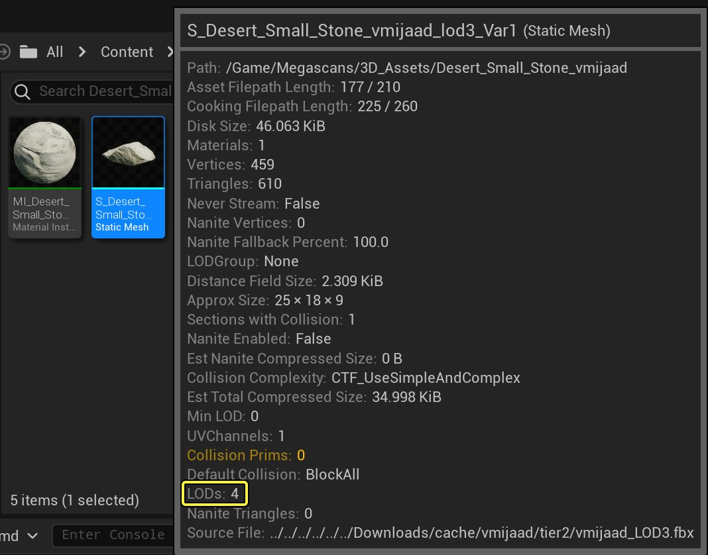
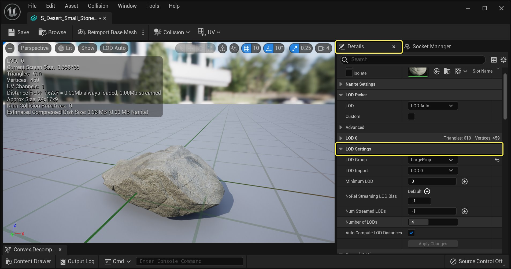
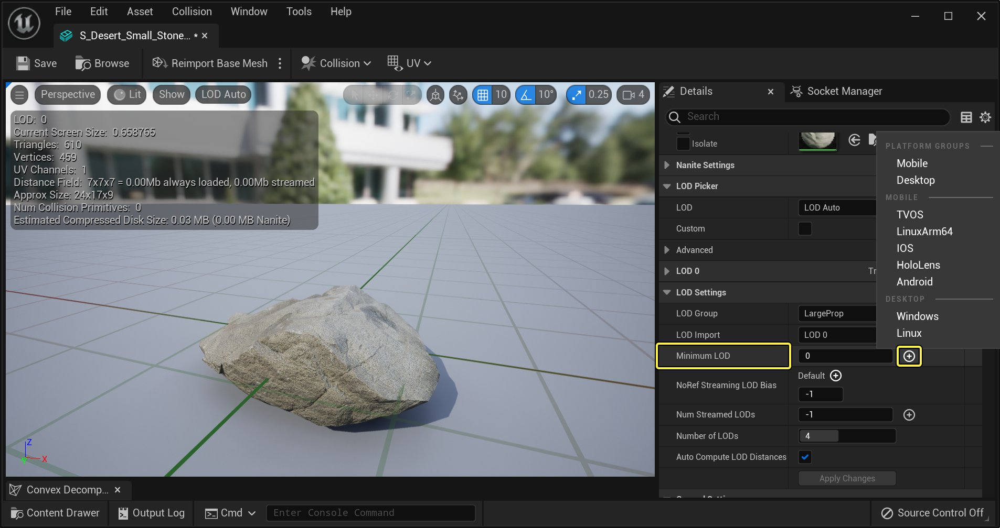
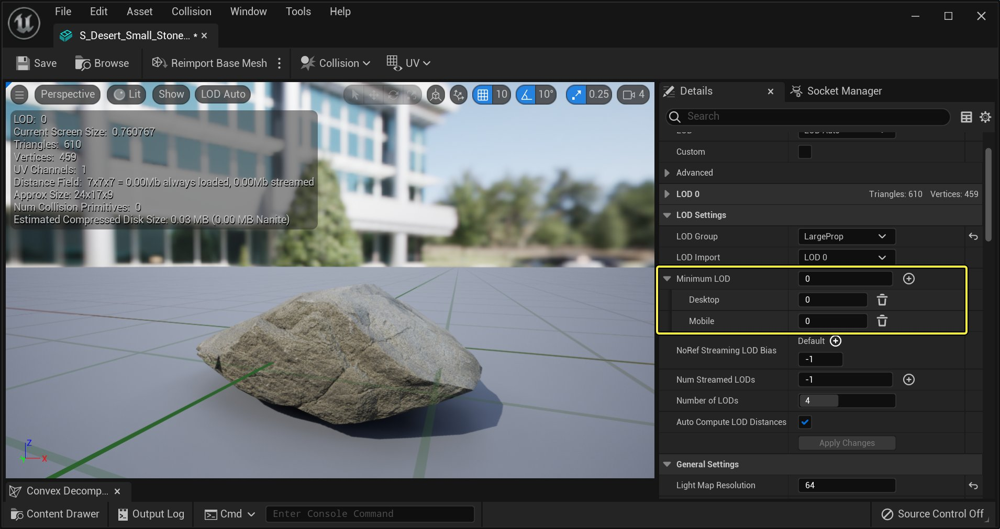
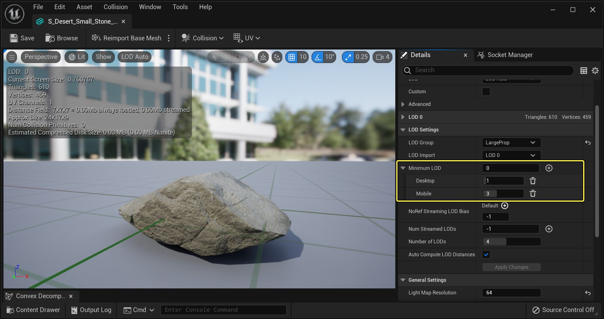
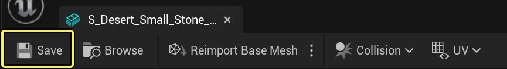
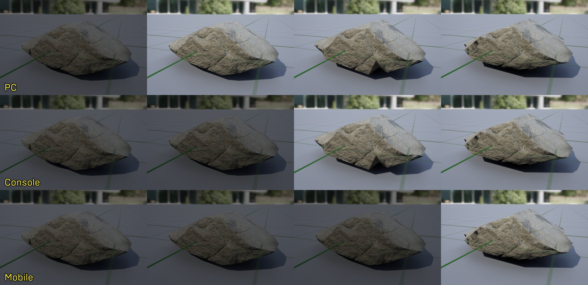

# 根据平台设置LOD

> 路径：虚幻引擎5.7文档 / 管理内容 / 静态网格体 / 根据平台设置LOD

> 原始页面：https://dev.epicgames.com/documentation/unreal-engine/setting-up-per-platform-lods

虽然让静态网格体拥有多个LOD可以降低远距离物体的渲染开销，但对于内存资源有限的平台，保存这类信息所需的额外内存会成为一个问题。以下指南将讲述如何限制平台可使用的LOD数量。

## 步骤

以下部分将说明如何在PC、主机和移动平台上运行UE5项目时指定使用的LOD。

1. 首先在 **内容浏览器** 中找到一个拥有数个LOD的 **静态网格体**，然后将其在 **静态网格体编辑器** 中打开。在此例中选中的静态网格体拥有4个LOD，您可以根据项目需求选择多与少。

   

   点击查看大图。
2. 在静态网格体编辑器中打开静态网格体后，前往 **细节面板** 并展开 **LOD设置** 类目。

   

   点击查看大图。
3. 点击 **最小LOD** 输入，然后点击其旁边的白色小三角形来公开逐平台LOD选项。

   

   点击查看大图。
4. 在显示的列表中点击平台名，选择需要覆盖的平台。在此例中我们将设置 **桌面（Desktop）**、**移动平台（Mobile）** 和 **主机（Console）** 的覆盖。

   

   点击查看大图。
5. 最小LOD设置的工作原理是限制应先使用的LOD等级。因为范例静态网格体拥有4个LOD，这意味着可以输入范围在0到4之间的数字。输入0将允许使用每个LOD，而输入4则只允许使用最后一个LOD。在此例中，将一个 **0** 值输入到"默认"中、将一个 **1** 值输入到"桌面"中、将一个 **2** 值输入到"主机"中，最后将一个 **3** 值输入到"移动平台"中。

   

   点击查看大图。
6. 操作完成后，务必按下 **保存** 按钮保存修改。

   

   点击查看大图。

## 最终结果

所有平台设置相应的LOD后，即可在UE5项目中使用静态网格体。请参见下图，深入理解工作原理：

点击查看大图。

- 在PC上查看此静态网格体时，其只会显示4个LOD中的3个，因为

  PC

  的

  最小LOD

  值被设为

  1

  。
- 在主机上查看此静态网格体时，其只会显示4个LOD中的2个，因为

  主机

  的

  最小LOD

  值被设为

  2

  。
- 在移动平台上查看此静态网格体时，其只会显示4个LOD中的1个，因为

  静态网格体

  的

  最小LOD

  值被设为

  3

  。
