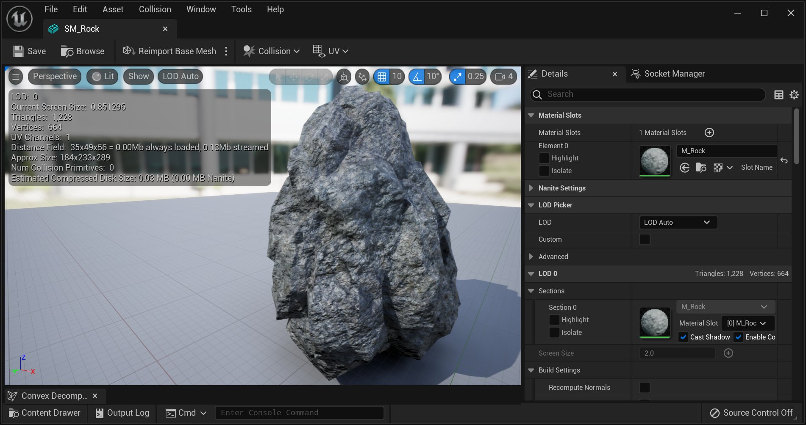
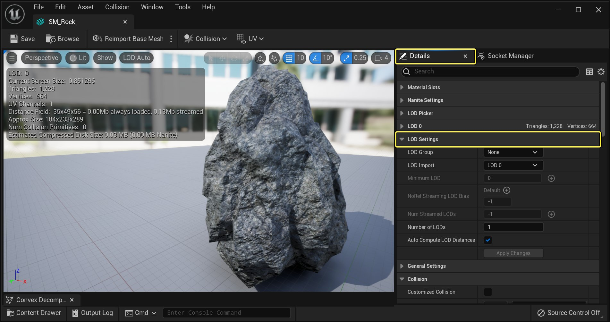
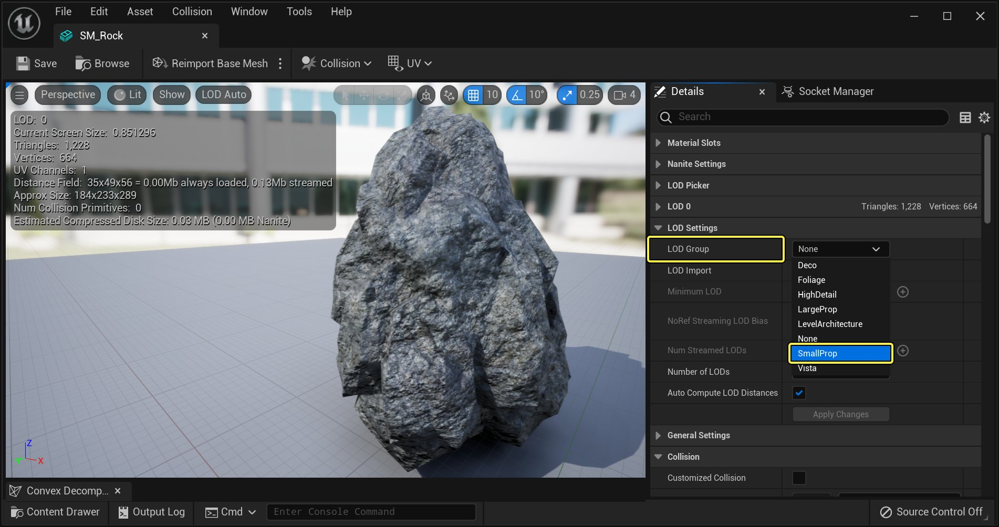
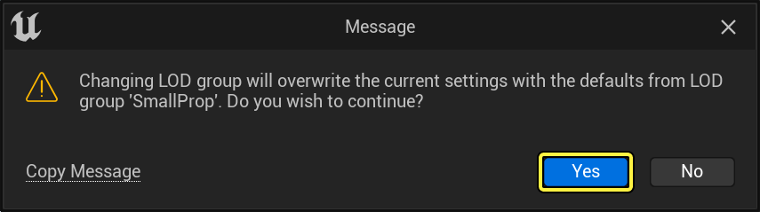
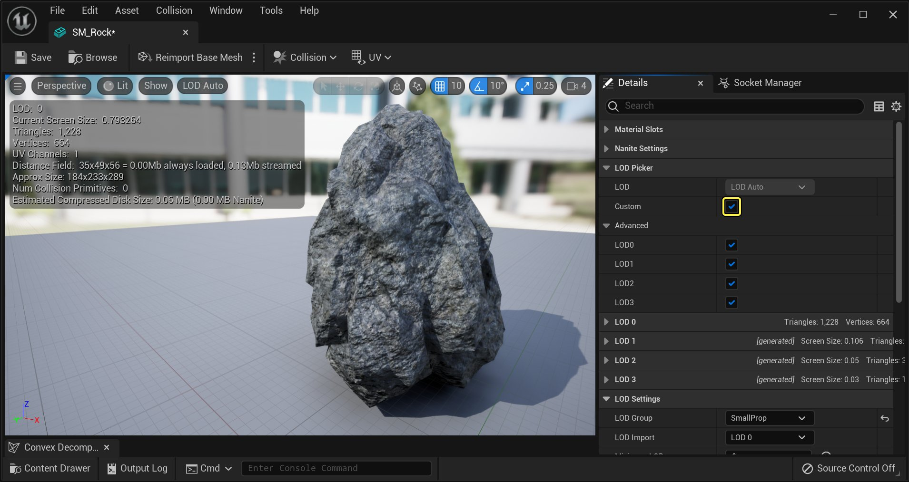
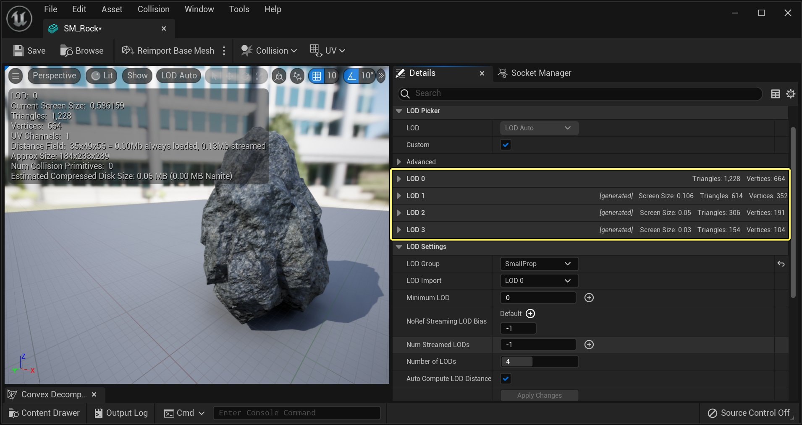

# 为静态网格体自动生成LOD

> 路径：虚幻引擎5.7文档 / 管理内容 / 静态网格体 / 为静态网格体自动生成LOD

> 原始页面：https://dev.epicgames.com/documentation/unreal-engine/static-mesh-automatic-lod-generation-in-unreal-engine

自动LOD生成系统允许你自动减少静态网格体的多边形计数，以使用虚幻引擎5(UE5)编辑器创建LOD。自动LOD生成使用所谓的二次网格体简化来帮助生成静态网格体的LOD。二次网格体简化的工作原理是计算折叠一条边（通过合并两个顶点）所产生的视觉差异量。然后它选择视觉冲击量最小的边并折叠它。当这种情况发生时，该工具将选择放置新合并顶点的最佳位置，删除所有同时随边折叠的三角形。它将继续折叠边，直到达到请求的三角形目标数量。在下面的指南中，我们将向你展示如何在UE5项目中设置和使用自动LOD生成系统。

## 设置

在下节中，我们将创建一个包含初学者内容包的新项目，然后打开一个要使用的静态网格体资源。

> [!NOTE]
> 在教程指南的这一部分中，我们将使用初学者内容包附带的 **SM_Rock** 静态网格体。尽管如此，你仍可以随心使用你选择的任何静态网格体。

1. 如果你尚未完成上述操作，那么请打开或创建一个新的UE4项目，确保它已经启用了 **含初学者内容包（With Starter Content）** 设置。

   

   点击查看大图。
2. 项目加载完成后，找到 **SM_Rock** 静态网格体，双击它以在 **静态网格体编辑器（Static Mesh Editor）** 中将其打开。

   

   点击查看大图。

## 创建LOD

有两种不同的方法可以生成LOD。第一种方法（Epic推荐的方法）是使用 **LOD组（LOD Group）** 预设，它根据预先配置的设置自动创建LOD。第二种方法是你自行设置LOD。下面，你将看到关于如何使用各个LOD创建方法的详细描述。

### 使用LOD组

使用LOD组是在UE5中使用自动LOD工具创建LOD的首选方法。在以下一节中，我们将介绍如何在UE5项目中设置和使用LOD组。

1. 首先，找到项目的 **BaseEngine.ini** 文件，并在文本编辑器中打开它。现在，查找"[StaticMeshLODSettings]"部分。如果你在BaseEngine.ini文件中没有看到此条目，请将以下代码复制并粘贴到BaseEngine.ini文件中。

   ```
            [StaticMeshLODSettings]         LevelArchitecture=(NumLODs=4,LightMapResolution=32,LODPercentTriangles=50,PixelError=12,SilhouetteImportance=4,Name=LOCTEXT("LevelArchitectureLOD","Level Architecture"))         SmallProp=(NumLODs=4,LODPercentTriangles=50,PixelError=10,Name=LOCTEXT("SmallPropLOD","Small Prop"))         LargeProp=(NumLODs=4,LODPercentTriangles=50,PixelError=10,Name=LOCTEXT("LargePropLOD","Large Prop"))         Deco=(NumLODs=4,LODPercentTriangles=50,PixelError=10,Name=LOCTEXT("DecoLOD","Deco"))         Vista=(NumLODs=1,Name=LOCTEXT("VistaLOD","Vista"))         Foliage=(NumLODs=1,Name=LOCTEXT("FoliageLOD","Foliage"))         HighDetail=(NumLODs=6,LODPercentTriangles=50,PixelError=6,Name=LOCTEXT("HighDetailLOD","High Detail"))		
   ```

   > [!NOTE]
   > 从本节中添加、删除或调整条目将添加、删除或调整LOD组在使用时的工作方式。
2. 现在，打开UE4编辑器，然后在 **内容浏览器（Content Browser）** 中双击你希望为其生成LOD的静态网格体。对于本例，我们将使用 **SM_Rock**，它随初学者内容包一起提供。
3. 现在在静态网格体编辑器中打开静态网格体，转到 **详细信息（Details）** 面板，并展开 **LOD设置（LOD Settings）** 部分。

   

   点击查看大图。
4. 在LOD设置（LOD Settings）部分，单击 **LOD组（LOD Group）** 按钮，并从显示的列表中选择 **小型道具（SmallProp）** 选项。

   

   点击查看大图。
5. 然后你会收到一条通知，即你所做的操作将用小型道具中的新设置覆盖当前设置。按下 **是（Yes）** 按钮以继续。

   

   点击查看大图。
6. 静态网格体编辑器现在应该已将四个新的LOD条目（LOD0、LOD1、LOD2和LOD3）添加到 **详细信息（Details）** 面板中。如果单击各个LOD条目，你将注意到这些设置对应于项目的BaseEngine.ini文件中的"StaticMeshLODSettings"中定义的设置。

   

   点击查看大图。

   

   点击查看大图。

   > [!NOTE]
   > 请确保 **自动计算LOD距离（Auto Compute LOD Distances）** 被选中，因为它将帮助确定LOD使用哪个屏幕大小。因为该算法知道每条边折叠会增加多少视觉差异，所以它可以使用这些信息来确定在什么距离上误差量是可以接受的。将此设置关闭意味着需要手动设置每个LOD的屏幕大小，这可能会导致误差。

现在，使用不同的LOD组（LOD Group）设置进行实验，看看它们将如何为你的对象创建LOD。在下节中，我们将介绍如何手动创建LOD。

### 手动创建LOD

在本节中，我们将介绍如何手动设置和创建项目资源的LOD。

> [!NOTE]
> 虽然下面的方法将为你创建LOD，但Epic建议你使用上一节中描述的LOD组方法。

1. 在静态网格体编辑器的 **详细信息（Details）** 面板中，展开 **LOD设置（LOD Settings）** 部分，并查找 **LOD数量（Number of LODs）** 选项。

   

   点击查看大图。

   > [!NOTE]
   > **LOD组（LOD Group）** 提供了一个预设列表，用于快速为项目选择正确的LOD设置。在BaseEngine.ini中的"[StaticMeshLODSettings]"下，你可以为每个项目更改这些设置。我们鼓励你主要通过使用LOD组而不是控制每个LOD的细节，为你的项目设置良好的类别。
2. 将 **LOD数量（Number of LODs）** 设置为 **四**，然后按 **应用更改（Apply Changes）** 按钮将四个（新的）LOD添加到网格体中。

   > 图片已省略：Create LODs

   点击查看大图。

   > [!NOTE]
   > 请确保 **自动计算LOD距离（Auto Compute LOD Distances）** 被选中，因为它将帮助确定LOD使用哪个屏幕大小。因为该算法知道每条边折叠会增加多少视觉差异，所以它可以使用这些信息来确定在什么距离上误差量是可以接受的。将此设置关闭意味着需要手动设置每个LOD的屏幕大小，这可能会导致误差。
3. 按下 **LOD1** 旁边的白色小三角形展开该部分，然后按下 **降低设置（Reduction Settings）** 旁边的白色小三角形。

   > 图片已省略：Reduction Settings

   点击查看大图。
4. 在 ***降低设置（Reduction Settings）** 下，找到 **三角形百分比（Percent Triangle）** 部分，并将其设置为 **75**，然后单击 **应用更改（Apply Changes）** 按钮。

   > 图片已省略：LOD1 Reduction

   点击查看大图。
5. 现在，展开 **LOD2** 和 **LOD3**，将LOD2的 **三角形百分比（Percent Triangle）** 设置为 **25**%，将LOD3的 **三角形百分比（Percent Triangle）** 设置为 **12**%。完成后，你将看到每个LOD在LOD名称旁边使用许多三角形（如下图所示）。

   > 图片已省略：LOD FINSHED

   点击查看大图。

   > 图片已省略：LOD FINSHED

   点击查看大图。
6. 现在，在静态网格体编辑器中，当你把摄像机移动到离目标更近和更远的地方时，你将能够看到LOD的变化。如果LOD中的视觉变化很难注意到，则有关LOD更改的信息将显示在屏幕的左侧。

   > 图片已省略：Viewing LODS

   点击查看大图。

既然你现在已为这个静态网格体设置了LOD，那么当你将这个静态网格体放置到一个关卡时，它会根据摄像机与其相隔的距离自动选择显示哪个LOD。

## 最终结果

在下面的文档中，我们了解了UE5提供的自动LOD生成工具的两种不同的使用方法。请记住，在使用自动LOD工具时，最好首先设置和定义满足项目需求的不同LOD组，然后使用LOD设置（LOD Settings）下的LOD组（LOD Group）下拉菜单选择这些不同的设置。
