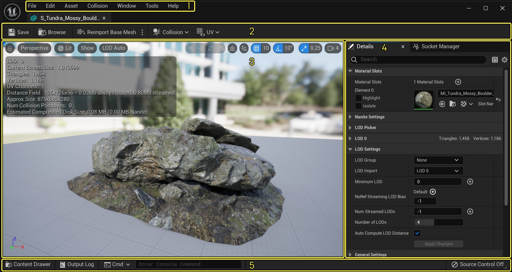
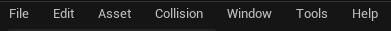
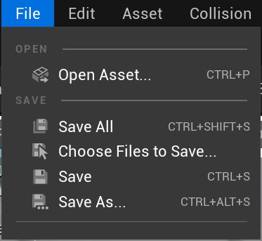
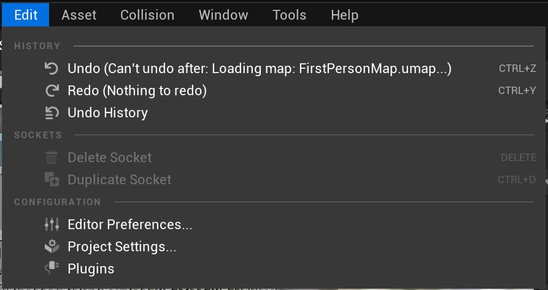
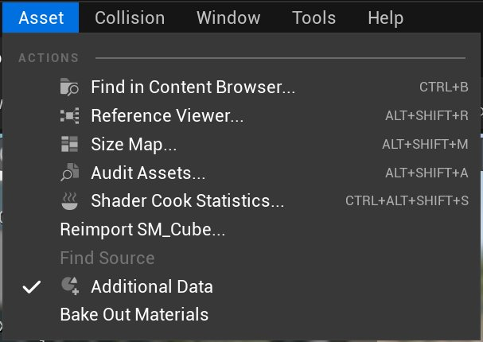
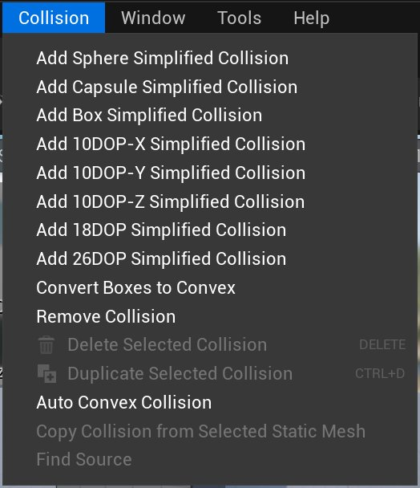
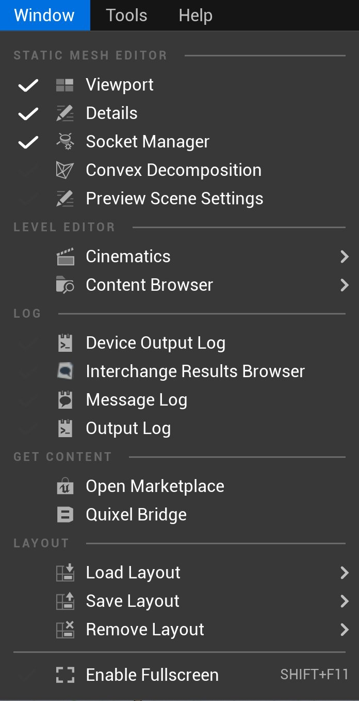
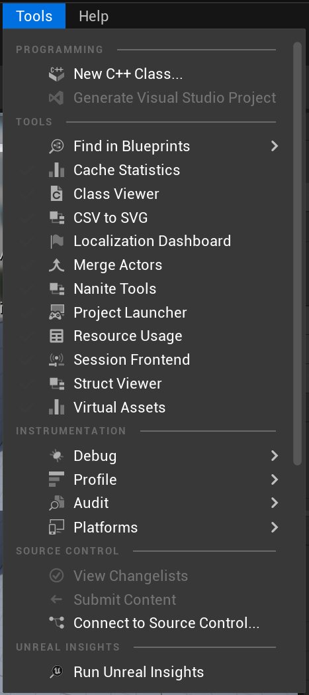

# 静态网格体编辑器UI

> 路径：虚幻引擎5.7文档 / 管理内容 / 静态网格体 / 静态网格体编辑器UI

> 原始页面：https://dev.epicgames.com/documentation/unreal-engine/static-mesh-editor-ui-in-unreal-engine

**静态网格体编辑器（Static Mesh Editor）** 包含以下四个区域：

点击查看大图。

1. 菜单栏
2. 工具栏
3. 视口面板
4. 细节面板
5. 底部工具栏

> [!TIP]
> - 点击选项卡右上角的小 **X** 可以关闭面板。也可以右击选项卡，然后在弹出的上下文菜单中点击 **隐藏选项卡（Hide Tab）** 隐藏面板。要想再次显示已经关闭的面板，在 **窗口（Window）** 菜单中点击该面板的名称即可。
> - 按 **F1** 将显示虚幻引擎5(UE5)静态网格体编辑器UI文档。

## 菜单栏

点击查看大图

### 文件

点击查看大图。

| 命令 | 说明 |
| --- | --- |
| **打开资产（Open Asset）** | 打开 **全局资产选择器（Global Asset Picker）** ，快速找到资产并打开相应的编辑器。 *(**CTRL + P**)* |
| **全部保存（Save All）** | 保存项目中所有未保存的关卡及资产。 *(**CTRL + SHIFT + S**)* |
| **选择要保存的文件（Choose Files to Save）** | 弹出一个对话框，可选择想为项目保存的关卡及资产。 |
| **保存（Save）** | 保存当前处理的资产。（**CTRL + S**） |
| **另存为（Save As）** | 用新的名称保存当前正在处理的资产。（**CTRL + ALT + S**） |

### 编辑

点击查看大图。

#### 历史

| 命令 | 说明 |
| --- | --- |
| **撤销（Undo）** | 撤销最近的操作。 *(**CTRL + Z**)* |
| **重做（Redo）** | 如果最后一次操作是撤销操作，则重做最近一次撤销的操作。 *(**CTRL + Y**)* |
| **撤销操作历史记录（Undo History）** | 在一个单独的窗口中弹出 **撤销操作历史记录（Undo History）** 面板。 |

#### 插槽

| 命令 | 描述 |
| --- | --- |
| **删除插槽（Delete Socket）** | 从网格体中删除选定插槽。 *(**DELETE**)* |
| **复制插槽（Duplicate Socket）** | 复制选定插槽。 *(**CTRL + D**)* |

#### 配置

| 命令 | 描述 |
| --- | --- |
| **编辑器偏好设置（Editor Preferences）** | 提供了一个选项列表，点击其中任意选项都会打开 **编辑器偏好设置（Editor Preferences）** 的对应部分，可在其中修改虚幻编辑器偏好设置。 |
| **项目设置（Project Settings）** | 提供了一个选项列表，点击其中任意选项都会打开 **项目设置（Project Settings）** 窗口的对应部分，可在其中修改虚幻引擎项目的各种设置。 |
| **插件（Plugins）** | 弹出一个 **插件（Plugins）** 窗口。 |

### 资产

点击查看大图。

| 命令 | 说明 |
| --- | --- |
| **在内容浏览器中查找（Find in Content Browser）** | 在内容浏览器中查找并选择当前资产。 *(**CTRL + B**)* |
| **引用查看器（Reference Viewer）** | 启动引用查看器，显示选定资产的引用。 *(**ALT + SHIFT + R**)* |
| **大小贴图（Size Map）** | 显示一个交互式贴图，其中显示该资产的大致大小及其引用的所有内容。 *(**ALT + SHIFT + M**)* |
| **审计资产（Audit Assets）** | 打开审计资产用户界面，并显示所选资产的信息。 *(**ALT + SHIFT + A**)* |
| **着色器烘焙统计数据（Shader Cook Statistics）** | 显示着色器烘焙统计数据。 *(**CTRL + ALT + SHIFT + S**)* |
| **重新导入*文件名（Reimport*filename）*** | 从磁盘上的资产原始位置处重新导入当前资源。 |
| **查找源（Find Source）** | 打开资源管理器，找到所选资源的位置。 |
| **其他数据（Additional Data）** | 切换是否绘制与该资产关联的其他用户数据。 |
| **烘焙材质（Bake Out Materials）** | 为给定LOD烘焙 **材质**。 |

### 碰撞

点击查看大图。

| 命令 | 说明 |
| --- | --- |
| **添加球体简化碰撞（Sphere Simplified Collision）** | 生成一个环绕静态网格体的新球体碰撞网格体。 |
| **添加胶囊体简化碰撞（Add Capsule Simplified Collision）** | 生成一个环绕静态网格体的新胶囊体碰撞网格体。 |
| **添加盒体简化碰撞（Add Box Simplified Collision）** | 生成一个环绕静态网格体的新盒体碰撞网格体。 |
| **10DOP-X简化碰撞（10DOP-X Simplified Collision）** | 生成一个环绕静态网格体的新轴对齐盒体碰撞网格体，其中有4个X轴对齐斜边（共10条边）。 |
| **10DOP-Y简化碰撞（10DOP-Y Simplified Collision）** | 生成一个环绕静态网格体的新轴对齐盒体碰撞网格体，其中有4个Y轴对齐斜边（共10条边）。 |
| **10DOP-Z简化碰撞（10DOP-Z Simplified Collision）** | 生成一个环绕静态网格体的新轴对齐盒体碰撞网格体，其中有4个Z轴对齐斜边（共10条边）。 |
| **18DOP简化碰撞（18DOP Simplified Collision）** | 生成一个环绕静态网格体的新轴对齐盒体碰撞网格体，全部为斜边（共18条边）。 |
| **26DOP简化碰撞（26DOP Simplified Collision）** | 生成一个环绕静态网格体的新轴对齐盒体碰撞网格体，全部为斜边和斜角（共26条边）。 |
| **将盒体转换为凸包（Convert Boxes to Convex）** | 将任何简化盒体碰撞网格体转换为凸包碰撞网格体。 |
| **移除碰撞（Remove Collision）** | 移除指定给静态网格体的任何简化碰撞。 |
| **删除选定碰撞（Delete Selected Collision）** | 从网格体中删除选定碰撞。（**DELETE**） |
| **复制选定碰撞（Duplicate Selected Collision）** | 复制选定碰撞。（**CTRL + D*） |
| **自动凸包碰撞（Auto Convex Collision）** | 根据静态网格体资产的形状，生成新的凸包碰撞网格体。 |
| **从选定静态网格体复制碰撞（Copy Collision from Selected Static Mesh）** | 复制在本地3D应用程序中创建并与静态网格体一起保存的的任何碰撞网格体。 |
| **查找源（Find Source）** | 找到当前资源的文件夹位置。 |

> [!NOTE]
> 有关虚幻引擎中静态网格体碰撞的更多信息，请参阅 [为静态网格体设置碰撞](../setting-up-collisions-with-static-meshes/index.md)页面。

### 窗口

点击查看大图。

#### 静态网格体编辑器

| 命令 | 说明 |
| --- | --- |
| **视口（Viewport）** | 切换 **视口（Viewport）** 面板的显示状态。 |
| **详细信息（Details）** | 切换 **详细信息（Details）** 面板的显示状态。 |
| **插槽管理器（Socket Manager）** | 显示 **插槽管理器（Socket Manager）** 面板，该面板在默认情况下不显示。 |
| **凸包分解（Convex Decomposition）** | 显示 **凸包分解（Convex Decomposition）** 面板，该面板在默认情况下不显示。 |
| **预览场景设置（Preview Scene Settings）** | 切换 **预览场景设置（Preview Scene Settings）** 面板的显示状态。 |

#### 关卡编辑器

| 命令 | 说明 |
| --- | --- |
| **过场动画（Cinematics）** | **序列录制器（Sequence Recorder）**：打开序列录制器选项卡。 |
| **内容浏览器（Content Browser）** | 在单独的窗口中打开 **内容浏览器** 工具。允许打开多个内容浏览器窗口。 |

#### 日志

| 命令 | 说明 |
| --- | --- |
| **设备输出日志（Device Output Log）** | 在一个单独的窗口中打开 **设备输出日志** 。 |
| **交换结果浏览器（Interchange Results Browser）** | 打开 **交换结果浏览器（Interchange Results Browser）**。 |
| **消息日志（Message Log）** | 在一个单独的窗口中打开 **消息日志** 。 |
| **输出日志（Output Log）** | 在一个单独的窗口中打开 **输出日志** 。 |

#### 获取内容

| 命令 | 说明 |
| --- | --- |
| **打开虚幻商城（Open Marketplace）** | 打开 **虚幻商城** 窗口购买资产。 |
| **Quixel Bridge** | 打开 **Quixel Bridge** 选项卡导入资产。 |

#### 布局

| 命令 | 说明 |
| --- | --- |
| **加载布局（Load Layout）** | **默认编辑器布局（Default Editor Layout）**：加载虚幻编辑器自动生成的默认布局。 \| **UE4经典布局（UE4 Classic Layout）**：加载虚幻引擎4的默认编辑器布局。 **导入布局（Import Layout）**：从不同目录导入一个自定义布局（或一组布局），并将其加载到虚幻编辑器UI的当前实例中。 |
| **保存布局（Save Layout）** | **将布局另存为（Save Layout As）**：将当前自定义布局保存到磁盘上，以便以后加载。 **导出布局（Export Layout）**：将当前自定义布局导出到不同的目录。 |
| **移除布局（Remove Layout）** | **移除所有用户布局（Remove All User Layouts）**：移除该用户创建的所有自定义布局。 |
| **启用全屏（Enable Fullscreen）** | 为该应用程序启用全屏模式，在整个显示器上展开应用程序。（**SHIFT + F11**） |

### 工具

点击查看大图。

#### 编程

| 命令 | 说明 |
| --- | --- |
| **新C++类（New C++ Class）** | 打开添加C++代码的窗口。只有在安装了 **Visual Studio** 的情况下才能编译代码。 |
| **生产Visual Studio项目（Generate Visual Studio Project）** | 在Visual Studio中生产你的C++代码。 |

#### 工具

| 命令 | 说明 |
| --- | --- |
| **在蓝图中查找（Find in Blueprints）** | 在一个单独的窗口中弹出 **在蓝图中查找（Find in Blueprints）** 工具。启用打开多个在蓝图中查找（Find in Blueprints）窗口。 |
| **缓存统计数据（Cache Statistics）** | 显示缓存统计数据。 |
| **类查看器（Class Viewer）** | 显示当前项目中所有现有的类。 |
| **CSV到SVG（CSV to SVG）** | 生成矢量线图表的工具表。 |
| **定位仪表板（Localization Dashboard）** | 在一个单独的窗口中弹出项目的 **定位仪表板（Localiztion Dashboard）** 。 |
| **合并Actor（Merge Actors）** | 在一个单独的窗口中打开 **合并Actor** 工具。 |
| **Nanite工具（Nanite Tools）** | 编写并优化 **Nanite** 资产的工具。 |
| **项目启动器（Project Launcher）** | **项目启动器** 提供用于打包、部署和启动项目的高级工作流。 |
| **资源用量（Resource Usage）** | 显示每个资产类型的数据使用情况的表格。 |
| **会话前端（Session Frontend）** | 在一个单独的窗口中打开 **会话前端** 。 |
| **结构体查看器（Struct Viewer）** | 在一个单独的窗口中打开 **结构体查看器（Struct Viewer）** ，其中显示项目中存在的所有结构体。 |
| **虚拟资产（Virtual Assets）** | **虚拟资产**的统计数据。 |

#### 工具（Instrumentation）

| 命令 | 说明 |
| --- | --- |
| **调试（Debug）** | 在一个单独的窗口中打开 **调试工具**。 **蓝图调试器（Blueprint Debugger）**：在单独的窗口中打开 **蓝图调试器** 。 **碰撞分析器（Collision Analyzer）**：在单独的窗口中打开 **碰撞分析器** 。 **调试工具（Debug Tools）**：在单独的窗口中打开 **调试工具**。 **模块（Modules）**：在单独的窗口中打开 **模块** 选项卡。 \| **Niagara调试器（Niagara Debugger）**：在单独的窗口中打开 **Niagara调试器**。 **像素检查器（Pixel Inspector）**：在单独的窗口中打开视口 **像素检查器** 工具。 **触笔输入调试（Stylus Input Debug）**：显示笔触输入的当前值。 **可视记录器（Visual Logger）**：在单独的窗口中打开 **可视记录器** 工具。 **控件反射器（Widget Reflector）**：在单独的窗口中打开 **控件反射器** 工具。 |
| **配置文件（Profile）** | **配置文件数据可视化器（Profile Data Visualizer）**：在单独的窗口中打开 *配置文件数据可视化器** 工具。 **追踪数据筛选器（Trace Data Filtering）**： 在单独的窗口中打开可视化记录工具，并允许设置 **追踪通道（Trace Channel）** 状态。 |
| **审计（Audit）** | **资产审计（Asset Audit）**：弹出 **资产审计（Asset Audit）** 窗口，可供查看资产的详细信息。 **材质分析器（Material Analyzer）**：在单独的窗口中打开 **材质分析器** 工具。 |
| **平台（Platform）** | **设备管理器（Device Manager）**：在单独的窗口中打开 **设备管理器** 。 **设备描述（Device Profiles）**：在单独的窗口中打开 **设备描述** 。 |

#### 源码控制

| 命令 | 说明 |
| --- | --- |
| **查看变更列表（View Changelists）** | 打开显示当前变更列表的对话框。 |
| **提交内容（Submit Content）** | 打开带内容和关卡检入选项的对话框。 |
| **连接到源码控制（Connect To Source Control）** | 弹出一个对话框，可选择一个能与虚幻编辑器集成的源码控制系统，或者同其进行交互。 |

#### Unreal Insights

| 命令 | 说明 |
| --- | --- |
| **运行Unreal Insights（Run Unreal Insights）** | 打开 **Unreal Insights会话浏览器**。 |

### 帮助

> 图片已省略：Help Menu

点击查看大图。

#### 静态网格体编辑器资源

| 命令 | 说明 |
| --- | --- |
| **静态网格体编辑器文档（StaticMesh Editor Documentation）** | 打开一个浏览器窗口，并导航到关于该工具的文档处。 *(**F1**)* |

#### 参考

| 命令 | 说明 |
| --- | --- |
| **文档主页（Documentation Home）** | 打开互联网浏览器，显示使用引擎的技术资源。 |
| **C++ API参考（C++ API Reference）** | 类、函数和其他构成C++ API的元素。 |
| **控制台变量（Console Variables）** | 控制变量和命令的参考文档。 |

#### 社区

| 命令 | 说明 |
| --- | --- |
| **在线学习（Online Learning）** | 使用易上手的视频课程和推荐学习路线免费学习虚幻引擎。 |
| **论坛（Forums）** | 导航至虚幻引擎论坛，查看公告并与其他开发人员一同探讨。 |
| **常见问题解答（Q&A）** | 导航至"论坛的常见问题解答"分段。 |

#### 支持

| 命令 | 说明 |
| --- | --- |
| **支持（Support）** | 导航至虚幻引擎支持网站的主页。 |
| **报告漏洞（Report a Bug）** | 导航至在线门户网站，报告虚幻编辑器中的漏洞。 |
| **问题追踪库（Issue Tracker）** | 导航至虚幻引擎问题追踪库页面 |

#### 应用程序

| 命令 | 说明 |
| --- | --- |
| **关于虚幻编辑器（About Unreal Editor）** | 显示应用程序的制作人员、版权信息、版本信息。 |
| **制作人员（Credits）** | 显示应用程序的制作人员。 |
| **访问UnrealEngine.com（Visit UnrealEngine.com）** | 导航至UnrealEngine.com，在其中进一步了解虚幻技术。 |

## 工具栏

> 图片已省略：Toolbar Menu

点击查看大图。

| 命令 | 说明 |
| --- | --- |
| **保存（Save）** | 保存当前资产。 |
| **浏览（Browse）** | 在最近使用的内容浏览器中浏览至相关资产并选择它（必要时召唤一个）。 |
| **重新导入基本网格体（Reimport Base Mesh）** | **重新导入基本网格体（Reimport Base Mesh）**：重新导入基本网格体。 **重新导入基本网格体+LOD（Reimport Base Mesh + LODs）**：重新导入基本网格体和所有自定义LOD。 |
| **碰撞（Collision）** | 快速显示与菜单栏一直的 **碰撞** 选项。 |
| **UV** | **无（None）**：切换静态网格体UV的显示。 **UV信道编号（UV Channel #）**：切换静态网格体资产的选定信道的静态网格体UV在预览面板中的显示。 **移除选定项（Remove Selected）**：从静态网格体中移除当前选定的UV。 |

## 视口面板

**视口（Viewport）** 面板显示静态网格体资产的渲染（或线框）视图。它使你能够检查如游戏中那样渲染的静态网格体。同时，视口还包含可以查看特定数据的工具和可视化器，如：

- 静态网格体资产的边界。
- 任何分配给静态网格体的碰撞网格体。
- 静态网格体的UV。

覆盖在 **视口（Viewport）** 面板上的是一组关于静态网格体资产的统计数据或信息。

> 图片已省略：Static Mesh Editor viewport preview panel

点击查看大图。

在这些信息中，你将发现以下内容：

- LOD

  ：显示静态网格体的LOD（细节级别）数量。
- 当前界面大小（Current Screen Size）

  ：界面上显示的网格体垂直高度在视口高度中的占比。
- 三角形（Triangles）

  ：显示静态网格体中的三角形数量。
- 顶点（Vertices）

  ：显示静态网格体中的顶点数量。
- UV信道（UV channels）

  ：UV信道数量。阴影映射需要唯一且非重叠的UV。
- 距离场（Distance Field）

  ：此网格体的距离场的分辨率和内存占用。
- 近似尺寸（Approx Size）

  ：以虚幻单位显示静态网格体的近似尺寸（长x宽x高），所有轴均以1为比例。
- 碰撞基元数量（Num Collision Primitives）

  ：碰撞基元的数量。

下方的表格介绍了视口的基础选项。如需关于使用此面板的更多详情，请参阅[视口编辑器视口](https://dev.epicgames.com/documentation/unreal-engine/using-editor-viewports-in-unreal-engine)文档。

### 视口选项

> 图片已省略：Viewport Menu

点击查看大图。

| 命令 | 说明 |
| --- | --- |
| **实时（Realtime）** | 切换视口是实时更新还是仅在点击/鼠标悬停时更新。在默认情况下，此按钮处于关闭状态，可能需要在网格体加载后点击视口，才能获得高分辨率显示的流送纹理。 *(**CTRL + R**)* |
| **显示状态（Show Status）** | 切换视口是否状态。如果未启用 **实时（Realtime）**， **显示状态（Show Stats）** 会自动启用它。（**SHIFT + L**） |
| **显示FPS（Show FPS）** | 切换视口显示每秒帧数。未启用 **显示状态（Show Status）**， **显示FPS（Show FPS）** 会自动启用它。(**CTRL + SHIFT + D**) |
| **视野（Field of View (H)）** | 控制水平视野，即左右两侧有多少帧可见。 |
| **远视图平面（Far View Plane）** | 选择远视图平面使用的距离。将此项设置为0说明远视图平面不受限制。 |
| **屏幕百分比（Screen Percentage）** | 设置你的 **预览（Preview）** 面板使用的屏幕百分比。 |
| **布局（Layouts）** | 提供一格到四格的视口安排选项。 |

### 视角类型

> 图片已省略：Perspective Menu

点击查看大图。

| 命令 | 说明 |
| --- | --- |
| **视角（Perspective）** | 视口使用的默认视角，提供资产的3D视图。 |
| **顶部（Top）** | 将视口切换成2D模式下的顶部视角。**（ALT+J）** |
| **底部（Bottom）** | 将视口切换成2D模式下的底部视角。**（ALT+SHIFT+J）** |
| **左侧（Left）** | 将视口切换成2D模式下的左侧视角。**（ALT+K）** |
| **右侧（Right）** | 将视口切换成2D模式下的右侧视角。**（ALT+SHIFT+K）** |
| **正面（Front）** | 将视口切换成2D模式下的正面视角。**（ALT+H）** |
| **背面（Back）** | 将视口切换成2D模式下的背面视角。**（ALT+SHIFT+H）** |

### 光照

> 图片已省略：Lit Menu

点击查看大图。

#### 视图模式

| 命令 | 说明 |
| --- | --- |
| **光照（Lit）** | 显示在应用所有材质和光照后的场景最终效果。（**ALT + 4**） |
| **无光照（Unlit）** | 从场景删除所有光照，仅显示基础颜色。（**ALT + 3**） |
| **线框（Wireframe）** | 在光照视图和线框视图之间切换预览面板的视图模式。（**ALT + 2**） |
| **细节光照（Detail Lighting）** | 使用原始材质的法线贴图在整个场景中激活中性材质。（**ALT + 5**） |
| **仅光照（Lighting Only）** | 显示仅受光照影响的中性材质。（**ALT + 6**） |
| **反射（Reflections）** | 使用扁平法线和粗糙度0（即镜面）覆盖所有材质。 |
| **玩家碰撞（Player Collision）** | 使用颜色编码视图渲染玩家或Pawn能够碰撞到的对象。静态网格体碰撞显示为绿色，体积为粉色，笔刷为浅紫色。 |
| **可视性碰撞（Visibility Collision）** | 该设置将使用颜色编码视图渲染场景中的哪些Actor会阻碍可见性痕迹。静态网格体碰撞显示为绿色，体积为粉色，笔刷为浅紫色。 |
| **优化视图模式（Optimization Viewmodes）** | 从以下选项中选择： **光源复杂度（Light Complexity）**：渲染视图以显示原始光源重叠的地方。 **光照贴图强度（Lightmap Density）**：渲染视图以显示场景中的光照贴图强度。蓝色表示密度最低，红色表示密度最高。 **静止光源重叠（Stationary Light Overlap）**：渲染视图以显示静止光源重叠的地方。 **着色器复杂度（Shader Complexity）**：渲染视图以显示场景中着色器的复杂度。浅绿色表示最简单，绿色越深表示复杂度越高，红色表示最复杂。 **着色器复杂度与四边形（Shader Complexity and Quads）**：渲染视图以同时显示着色器复杂度以及过度绘制的四边形。 **四边形过度绘制（Quad Overdraw）**：渲染视图以显示四边形过度绘制的复杂度。 **材质纹理比例（Material Texture Scales）**：显示用于纹理流送的材质纹理比例的精度。 **必需纹理分辨率（Required Texture Resolution）**：显示当前流送的纹理分辨率以及GPU需要的分辨率之间的比例。 |
| **细节级别着色（Level of Detail Coloration）** | 从以下选项中选择： **网格体LOD着色（Mesh LOD Coloration）**：使用LOD可视化颜色渲染场景。 **层级LOD着色（Hierarchical LOD Coloration）**：使用HLOD可视化颜色渲染场景。 |

#### 碰撞

| 命令 | 说明 |
| --- | --- |
| **玩家碰撞（Player Collision）** | 使用颜色编码视图渲染玩家或Pawn能够碰撞到的对象。静态网格体碰撞显示为绿色，体积为粉色，笔刷为浅紫色。 |
| **可视性碰撞（Visibility Collision）** | 该设置将使用颜色编码视图渲染场景中的哪些Actor会阻碍可见性痕迹。静态网格体碰撞显示为绿色，体积为粉色，笔刷为浅紫色。 |

#### 曝光

| 命令 | 说明 |
| --- | --- |
| **自动（Auto）** | 启用或禁用自动曝光。 |
| **EV100** | 允许在禁用自动曝光时设置曝光度值。 |

### 显示

> 图片已省略：Show Menu

点击查看大图。

| 命令 | 说明 |
| --- | --- |
| **插槽（Sockets）** | 显示已应用于此网格体的所有插槽。有关插槽的更多信息，请参阅[骨骼网格体插槽](../../../animating-characters-and-objects/skeletal-mesh-animation-system/animation-assets-and-features/skeletons/skeletal-mesh-sockets/index.md)。（**ALT + S**） |
| **顶点（Vertices）** | 切换预览面板中顶点的显示。（**ALT + V**） |
| **顶点颜色（Vert Colors）** | 切换顶点颜色的可视性。 |
| **法线（Normals）** | 切换预览面板中顶点法线的显示。（**ALT + N**） |
| **切线（Tangents）** | 切换预览面板中顶点切线的显示。 （**ALT + T**） |
| **副法线（Binormals）** | 切换顶点副法线（正交矢量到法线和切线）在预览面板中的显示。（**ALT + B**） |
| **显示枢轴点（Show Pivot）** | 切换网格体的枢轴点的可视性。（**ALT + P**） |
| **网格（Grid）** | 切换预览面板中网格的可视性。 |
| **边界（Bounds）** | 切换静态网格体边界的显示。 |
| **简单碰撞（Simple Collision）** | 切换静态网格体的简化碰撞网格体的显示（如果存在）。 |
| **复杂碰撞（Complex Collision）** | 切换此静态网格体的复杂碰撞的显示。 |
| **物理材质遮罩（Physical Material Masks）** | 切换是否显示和物理材质遮罩。 |

### LOD

> 图片已省略：LOD Menu

点击查看大图。

| 命令 | 说明 |
| --- | --- |
| **自动LOD（LOD Auto）** | 自动设置细节级别（LOD） |
| **LOD 0** | 强制将LOD设置为0。 |

## 细节面板

> 图片已省略：Details Panel

点击查看大图

**细节（Details）** 面板显示了与静态网格体Actor相关的特定属性，例如应用于表面的材质、LOD选项和网格体缩减选项。

要了解使用此面板的基础知识，请参阅[关卡编辑器细节面板](../../../building-virtual-worlds/level-editor/level-editor-details-panel/index.md)文档。

## 底部工具栏

> 图片已省略：Bottom Toolbar

点击查看大图

| 命令 | 说明 |
| --- | --- |
| **内容侧滑菜单（Content Drawer）** | 打开临时内容浏览器 **（Ctrl+Spacebar）**。 |
| **输出日志（Output Log）** | 调试工具，可以在应用程序运行时打印有用的信息。 |
| **CMD** | 执行以下命令选项： **CMD**：执行虚幻控制台命令。 **Python**：执行Python脚本，包括文件。 **Python (REPL)**：执行单个Python语句并显示其结果。 |
| **关闭源码控制（Source Control Off）** | 指示是否禁用或激活了源码控制。激活时将提供以下选项： **查看变更列表（View Changelist）**：打开对话框，显示当前变更列表。 **提交内容（Submit Content）**：打开对话框，显示内容和关卡的检入选项。 **检出修改的文件（Checkout Modified Files）**：打开对话框，检出修改过的所有资产。 **连接到源码控制（Connect to Source Control）**：打开对话框，对内容和关卡执行源码控制操作。 |

## 功能按钮

### 鼠标功能按钮

**视口面板**

- 鼠标左键 + 拖曳

  - 如果摄像机已锁定，则绕其Z轴旋转网格体，并朝向或远离原点移动。否则，将摄像机绕其Z轴旋转，并沿其局部X轴移动摄像机。
- 鼠标右键 + 拖曳

  - 如果摄像机已锁定，请旋转网格体。否则，请旋转摄像机。
- 鼠标左键 + 鼠标右键 + 拖曳

  - 如果摄像机未锁定，请沿其局部YZ平面移动摄像机。

### 键盘控制

- Ctrl + R

  - 在

  预览（Preview）

  面板中切换实时。
- 左侧 + 鼠标移动

  - 在

  预览

  面板中旋转预览光源。

**摄像机热键**

- Alt+H

  - 将摄像机定位到正面正视图。
- Alt+J

  - 将摄像机定位到顶部正视图。
- Alt+K

  - 将摄像机定位到侧面正视图。
- Alt+G

  - 将摄像机定位到透视图视图。
