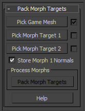
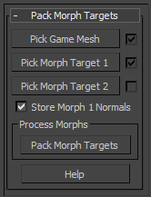
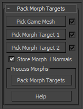
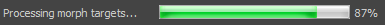

# 静态网格体变形目标

> 路径：虚幻引擎5.7文档 / 管理内容 / 静态网格体 / 静态网格体变形目标

> 原始页面：https://dev.epicgames.com/documentation/unreal-engine/static-mesh-morph-targets-in-unreal-engine

利用 **变形目标（Morph Targets）** 可以将网格体从基础形状变为 *目标* 形状。 通常它们将作为动画系统的一部分与SkeletalMesh一同使用； 然而使用 `StaticMeshMorpher.ms` maxscript和 **StaticMeshMorphTarget** [材质函数](../../../designing-visuals-rendering-and-graphics/unreal-engine-materials/material-functions/index.md)、 StaticMesh也能设置使用变形目标进行变形。

此方法使用多个UV通道、顶点颜色和WorldPositionOffset来执行变形。 每个变形目标的顶点偏移被保存为UV通道中的顶点颜色。 StaticMeshMorphTarget材质函数将对其进行提取， 使其在材质中可用。将其传至材质的WorldPositionOffset输入后， 网格体的顶点可变换到变形目标中顶点的位置。

## 脚本设置和安装

`StaticMeshMorpher.ms` 脚本在版本中的 `UE4/Engine/Extras/FX_tools/3DSMax2012_x64/` 路径下。

**运行** `StaticMeshMorpher.ms` **maxscript** 的方法：

1. 在3dsMax的 **MAXScript** 菜单中选择 **运行脚本（Run Script...）**。
2. 导航到版本中 `StaticMeshMorpher.ms` maxscript 所在的路径并将其打开。
3. 脚本的接口将显示，可供使用。

> [!TIP]
> 脚本也可以绑定到一个按键组合或添加到自定义菜单来使其更快速而简便地运行。

## 创建变形目标

变形目标要求将相同网格体多个实例的顶点执行变换。 举例而言：融化的冰球可能有三种形式：

| Game Model | Morph target 1 | Morph target 1 |
| --- | --- | --- |
| 游戏模型 | 变形目标1 | 变形目标2 |

变形目标将打包到UV通道2和3中（假定两个变形目标正在被打包），如有必要， 变形目标1的法线也能保存在网格体的顶点颜色中。

**打包变形目标的步骤：**

1. 按下Pick Game Mesh按钮，然后在场景中选择游戏模型网格体。

   
2. 按下Pick Morph Target 1键，然后在场景中选择第一个变形目标的网格体。

   
3. 为场景中的第二个变形目标（如有）重复上述步骤。

   
4. 如有必要，勾选 **保存变形1法线（Store Morph 1 Normals）** 勾选框。
5. 按下Pack Morph Targets开始将变形目标打包到UV通道中。

   
6. 网格体可从3dsMax导出，正常导入虚幻引擎。查看 **[FBX静态网格体管线](../../fbx-content-pipeline/fbx-static-mesh-pipeline/index.md)** 了解此进程的细节。

## 材质设置

*StaticMeshMorphTargets* 函数可访问应用到 *StaticMesh* 的 *Material* 中的变形目标和法线。 此函数拥有两个相应于两个变形目标的输出，以及法线的一个输出。 变形目标输出提供的值可插入 *Material* 节点中的 WorldPositionOffset 输入通道； 而法线输出可连接到 *Material* 节点的 *Normal* 输入通道。

为在基础网格体和变形目标之间进行 *变形*，将使用一个或多个 *LinearInterpolate* 表达式结合单个 *ScalarParameter* 来驱动Alpha输出。 这使得变形目标可在运行时由gameplay代码或 Matinee驱动。

设置范例（仅变形网络）显示于此：

上方网络中 *Time* 参数从0到1时的结果显示如下：
