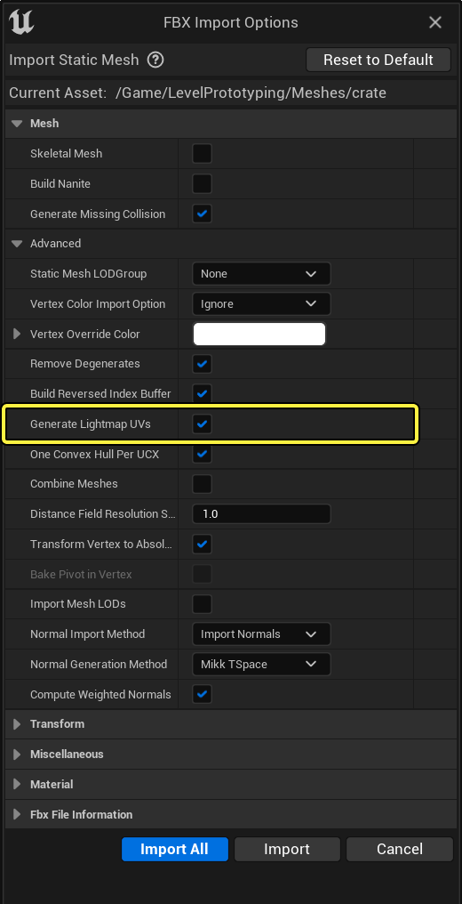
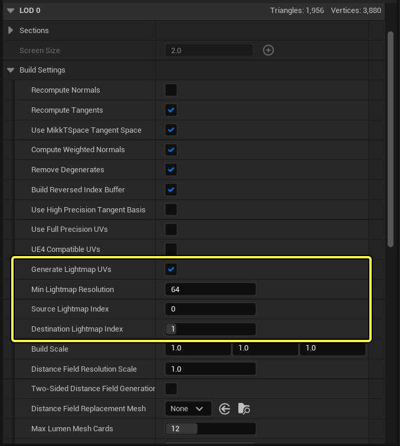
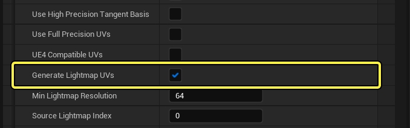
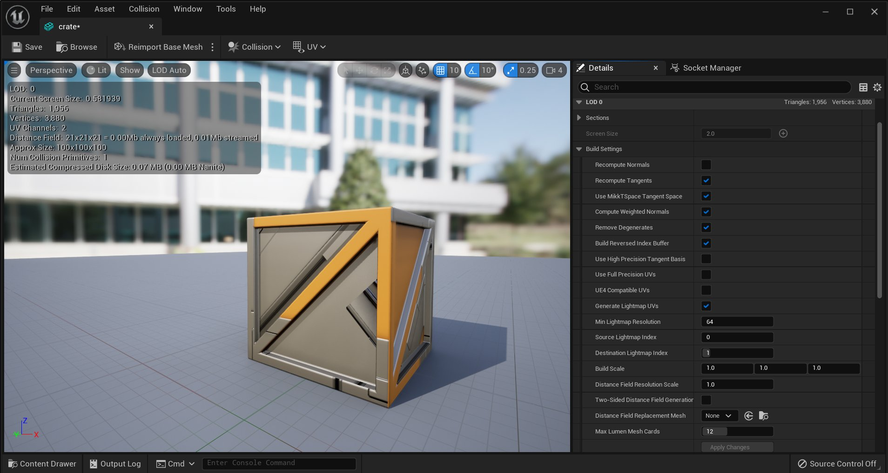
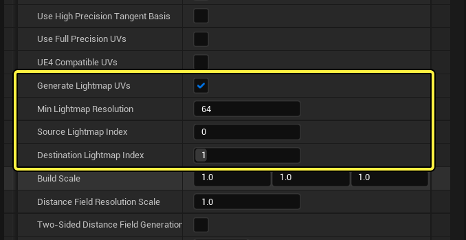
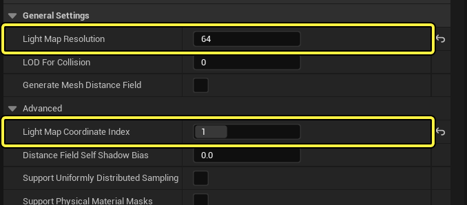
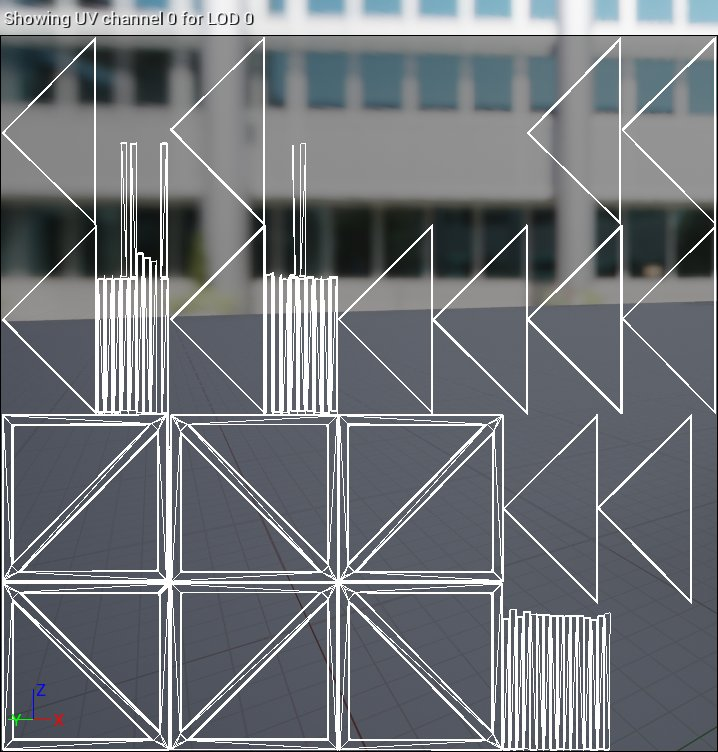
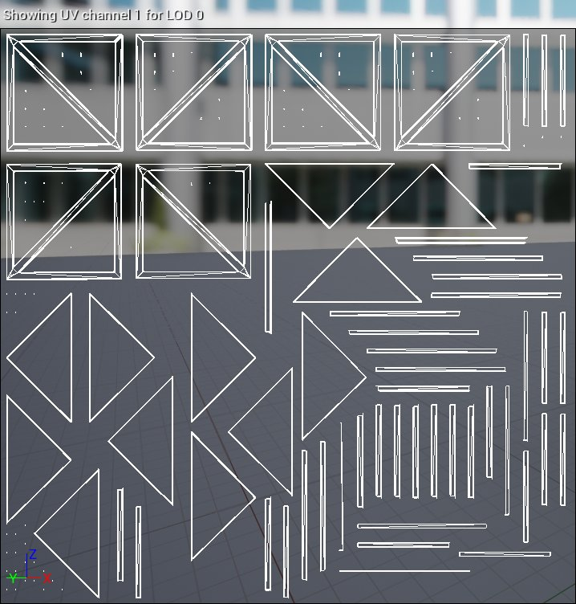

# 生成光照贴图UV

> 路径：虚幻引擎5.7文档 / 管理内容 / 静态网格体 / 理解虚幻引擎中的光照贴图 / 生成光照贴图UV

> 原始页面：https://dev.epicgames.com/documentation/unreal-engine/generating-lightmap-uvs-in-unreal-engine

[展开光照贴图的UV](../index.md)很耗时，缓解此问题的一个方法是使用虚幻引擎5（UE5）的自动生成工具在导入时根据你的现有纹理UV生成光照贴图UV，或通过 **静态网格体编辑器** 生成UV光照贴图。

## 警告和注意事项

默认情况下，自动生成的光照贴图UV将从静态网格体的第一个UV（UE5中的UV通道0）重新打包现有的UV图表。该UV通常用作纹理UV，因此UV图表的布局或设置可能不适用于光照贴图UV，即使使用UE5中的自动生成工具也是如此。

在创建自动生成的光照贴图UV时，请考虑以下几点。

- 生成的光照贴图UV需要一个现有的源UV来重新打包，而这个过程只取决于所使用的UV质量，这意味着如果UV图表没有被分解并正确地放置，则重新打包的结果不可能令人满意。
- 重新打包期间，UE5不会分割UV图表边缘来创建单独的UV群。它仅根据源UV索引重新打包现有的UV图表。
- UV图表在生成时就被标准化，并使用独立缩放或拉伸的图表最大限度地覆盖UV空间。

## 导入选项设置

在导入过程中，在启用 **生成光照贴图UV（Generate Lightmap UVs）** 时，默认情况下将为任何静态网格体生成一个光照贴图UV。该光照贴图UV将根据静态网格体的UV索引1生成（UE5中的UV通道0），并分配到 **光照贴图坐标索引（Lightmap Coordinate Index）** 1。

点击查看大图。

> [!NOTE]
> 你可以使用静态网格体编辑器检查生成的光照贴图UV。详情请参阅[为光照贴图展开UV](../index.md)。

## 光照贴图生成设置

静态网格体编辑器的 **构建设置（Build Settings）** 包含用于生成和重新包装光照贴图UV的设置。这些选项使你能够生成光照贴图UV，而不必在导入期间或导入后这样做（如果你想要完善生成的光照贴图UV）。

点击查看大图。

启用 **生成光照贴图UV（Generate Lightmap UVs）**，以使用下表中详述的UV生成选项控制生成和重新打包光照贴图UV的方法：

点击查看大图。

| 属性 | 说明 |
| --- | --- |
| **最小光照贴图分辨率（Min Lightmap Resolution）** | 规定包装UV时UV图表所需的最小填充量。该目标值确保包装的纹素精确到使用的最小光照贴图分辨率。当 **光照贴图分辨率（Lightmap Resolution）** 低于此值时，它将限制可能发生的光源和阴影渗透。 |
| **源光照贴图索引（Source Lightmap Index）** | 选择用于生成光照贴图UV的UV通道。 |
| **目标光照贴图索引（Destination Lightmap Index）** | 设置将存储生成的光照贴图UV的UV通道。 |

## 生成光照贴图UV

以下步骤将演示如何从静态网格体编辑器生成一个新的光照贴图UV。

1. 打开 **静态网格体编辑器（Static Mesh Editor）**，并在 **细节（Details）** 面板中导航到 **LOD0** 的 **构建设置（Build Settings）**。

   

   点击查看全图
2. 使用以下设置生成光照贴图UV：

   

   点击查看大图。

   - 启用

     生成光照贴图UV（Generate Lightmap UVs）

     。
   - 将

     最小光照贴图分辨率（Min Lightmap Resolution）

     设置为理想的2的幂，这应是该网格体使用过的最低光照贴图分辨率。这会确保减少可能影响UV图表的光源和阴影瑕疵。
   - 通常，

     源光照贴图索引（Source Lightmap Index）

     应保留为

     0

     ，或设置为一个用于生成该光照贴图UV的现有UV通道仅可选择可用的UV通道。
   - 目标光照贴图索引（Destination Lightmap Index）

     设置用于创建或存储光照贴图UV的UV通道。它可以是任何值（其中，值表示该静态网格体的当前UV通道的实际数量）加1。
3. 单击 **应用更改（Apply Changes）**。
4. 在 **细节（Details）** 面板中的 **一般设置（General Settings）** 下，进行以下设置：

   

   点击查看大图。

   - 输入一个

     光照贴图分辨率（Lightmap Resolution）

     ，默认情况下，该静态网格体对放置在关卡中的任何实例都应使用该分辨率。输入的分辨率应高于

     构建设置（Build Settings）

     中用于生成光照贴图UV的

     最小光照贴图分辨率（Min Lightmap Resolution）

     。
   - 将

     光照贴图坐标索引（Lightmap Coordinate Index）

     设置为当前用于你的光照贴图UV的UV通道。通常，这应该与

     构建设置（Build Settings）

     中用于生成光照贴图UV的

     目标光照贴图索引（Destination Lightmap Index）

     匹配。该UV通道规定在光照构建过程中生成光照贴图纹理时使用哪个UV通道。

在本例中，纹理UV被用来创建新的光照贴图UV。纹理UV作为光源用于重新打包光照贴图UV，纹理UV采用了尽量不浪费任何纹理空间的布局。通过这种方法，网格体的各个部分根据其重要性被放大（或缩小），以获得足够的纹理分辨率，而不浪费纹理中的空间。

UV通道 0 | 纹理UV布局

UV通道1 | 生成的光照贴图UV布局

生成光照贴图UV时，将其缩放到具有相同的密度（标准化），然后将其包装到UV空间中，并使各个UV图表之间有足够的填充，避免光源构建时产生光源和阴影瑕疵。这里，你可能会注意到生成的光照贴图UV中有一些浪费的空间，但这可以忽略不计，不需要在自定义工具中重新调整该UV来利用这些空间。

## 重新生成现有的光照贴图UV

可以使用静态网格体编辑器的 **构建设置（Build Settings）** 重新生成（或重新打包）现有光照贴图UV。为静态网格体重新生成光照贴图UV有以下好处：

- 它使你能够更改UV图表之间的填充，以使用更高或更低的

  最小光照贴图分辨率（Min Lightmap Resolution）

  ，而无需重新导入网格体。当你拥有大量单独的UV图表时，这是最理想的处理方法，可以获得一个更紧密的光照贴图UV包装。
- 它让你能够根据任何

  源光照贴图索引（Source Lightmap Index）

  重新打包任何现有的光照贴图UV，包括之前生成的光照贴图UV通道。

以下步骤演示如何从导入的静态网格体重新生成自定义UV：

1. 打开 **静态网格体编辑器（Static Mesh Editor）**，并在 **细节（Details）** 面板中导航到 **LOD0** 的 **构建设置（Build Settings）**，以设置以下选项：

   > 图片已省略：Repack Src Dest Values

   点击查看大图。

   - 可选

     将

     最小光照贴图分辨率（Min Lightmap Resolution）

     设置为一个较高或较低的新值。这会调整UV图表之间的填充量。
   - 将

     源光照贴图索引（Source Lightmap Index）

     设置为你要重新打包的UV通道
   - 将

     目标光照贴图索引（Destination Lightmap Index）

     设置为与源光照贴图索引（Source Lightmap Index）相同的UV通道。
2. 单击 **应用更改（Apply Changes）**。

以下是初始导入的自定义光照贴图UV与静态网格体的对比。你会注意到UV图表之间被不成比例地缩放，但完全可以接受作为光照贴图UV，因为它符合无重叠UV的标准。重新生成UV将对所有UV图表执行标准化，得到均匀分布的光源和阴影烘焙结果。此外，还将为各个UV图表之间提供适当的填充量，以确保减少阴影和光源泄露瑕疵。

> 图片已省略：导入的自定义光照贴图UV

> 图片已省略：重新打包后的光照贴图 | 最新光照贴图分辨率256

导入的自定义光照贴图UV

重新打包后的光照贴图 | 最新光照贴图分辨率256

> [!NOTE]
> 值得注意的是，自定义光照贴图UV更多地注重于覆盖玩家将在较近距离查看的部分。通过增加某些部分的覆盖率，可以降低光照贴图分辨率，从而获得与重新打包的光照贴图分辨率相同的结果。如果这是你应该在UE5之外为你的特定资源解决的问题，你可以自己进行判断。
