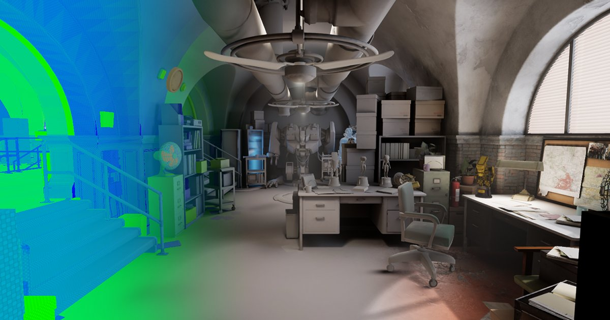
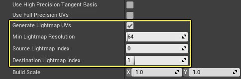
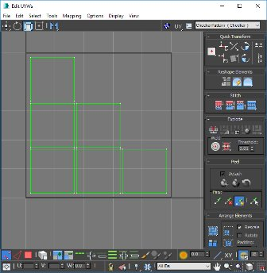
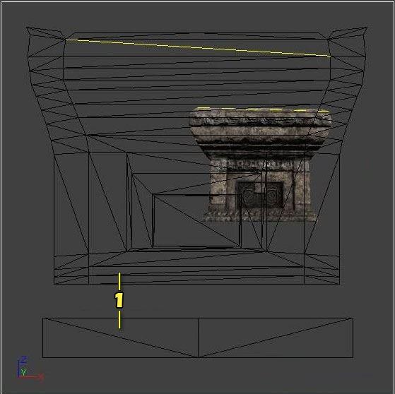
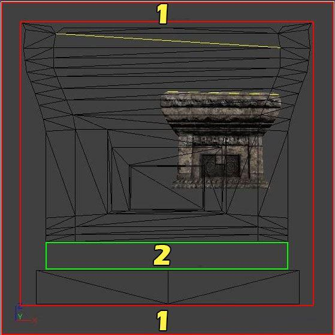
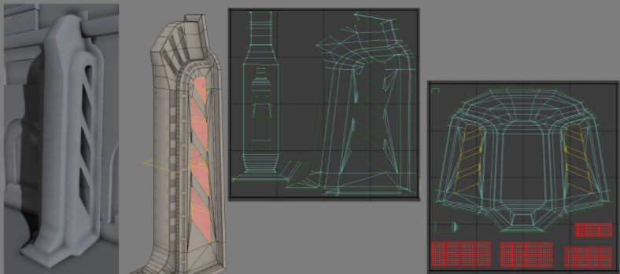
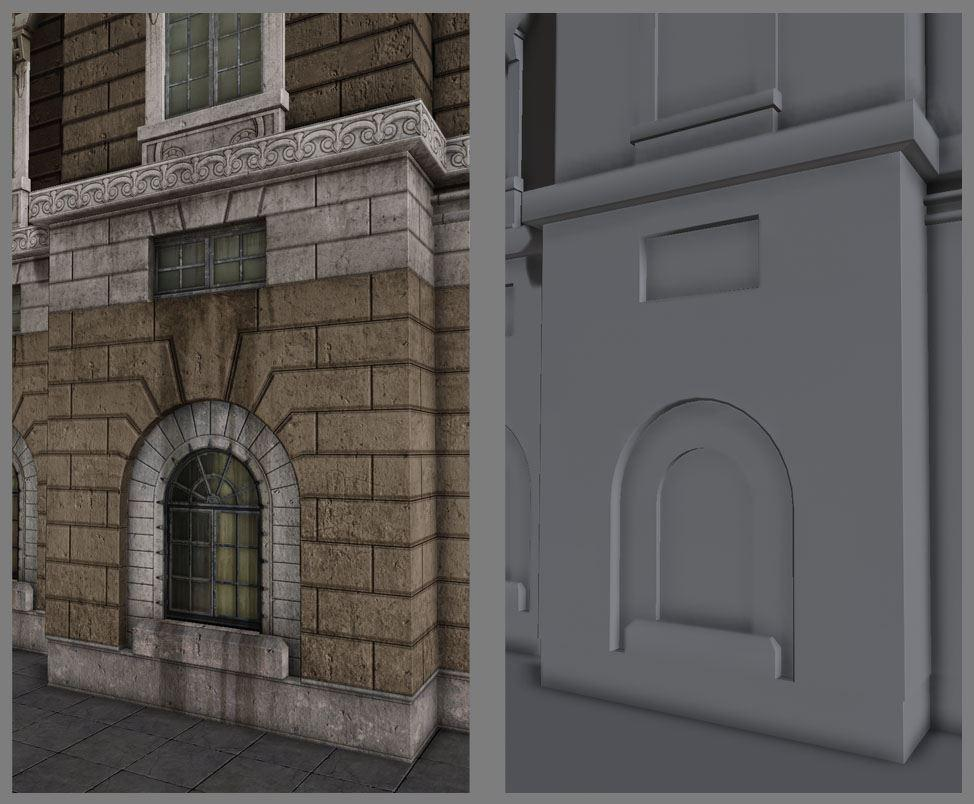
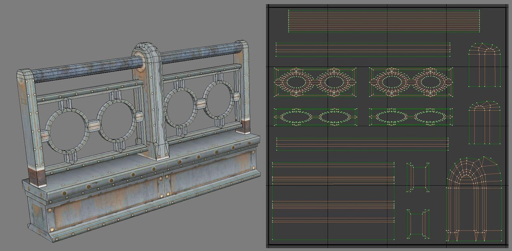

# 理解虚幻引擎中的光照贴图

> 路径：虚幻引擎5.7文档 / 管理内容 / 静态网格体 / 理解虚幻引擎中的光照贴图

> 原始页面：https://dev.epicgames.com/documentation/unreal-engine/understanding-lightmapping-in-unreal-engine



创建游戏资源时，经常需要设置纹理的UV分布。若项目计划使用烘焙光照（静态或静止），还需设置存储光照信息的UV通道。这种被称为 **光照贴图UV**与纹理UV类似，其由每个静态网格体特有的UV分布图表（或UV岛状区）组成，只是此类特殊UV用于存储烘焙光照和阴影信息。与纹理UV不同，光照贴图上需要有模型所有面的专属空间，且不可有重叠面，还要确保UV图表之间足够填充（或间距），以避免瑕疵。因此，光照贴图是环境艺术创作富有挑战性的领域之一。

> [!NOTE]
> 仅在使用烘焙（或预计算）光照来光照静态网格体时，才需要光照贴图。若游戏或项目只使用动态光照，则无需设置所有静态网格体的光照贴图。

## 创建光照贴图

创建光照贴图共两种：

- 使用虚幻引擎4的光照贴图自动生成工具
- 使用UV编辑工具创建自定义光照贴图

### 自动生成光照贴图UV

创建自定义光照贴图可能比较耗时，特别是项目需要成千上万的资源时，将会相当耗时。自动生成光照贴图是一种快速打包光照贴图UV的方法，无需手动设置和正确填充，从而节省大量时间。Epic工作流程中已集成该操作进程。

导入资源时，FBX导入选项（FBX Import Options）窗口中将自动生成光照贴图UV（禁用时除外）。

将基于纹理布局的UV（UV通道0）自动生成光照贴图。生成的光照贴图UV会重新打包岛状区，以便正确满足良好光照贴图的要求：无重叠或包裹岛状区；岛状区间有足够填充，以基于目标光照贴图分辨率限制瑕疵。

生成静态网格体的光照贴图UV后，可利用 **细节** 面板的 **生成选项（Build Settings）** 中静态网格体编辑器的光照贴图生成（Lightmap Generation）设置，对其进行调整。但光照贴图UV生成后，便无需修改此类设置。



可随时使用此类设置来生成光照贴图UV或重新打包现有UV。此工具使用重新打包算法，并基于 **源光照贴图索引**（或UV通道）生成光照贴图，然后将其存储在 **目标光照映射贴图索引** 指定的新目录中。此算法利用指定源光照贴图索引重新打包UV图表，但操作时不会对图表进行剪切或分割。创建光照贴图UV时请牢记此要点，并利用建模软件或UV编辑软件进行少许前期工作，只需导入UE4前分割UV图表，便能获得良好结果。

> [!NOTE]
> 欲了解更多信息，参见[生成光照贴图UV](generating-lightmap-uvs/index.md)。

### 自定义光照贴图UV

现在，只需少量工作便可获得良好结果，因此对于导入到UE4中的多数静态网格体而言，将可使用[自动生成光照贴图UV](generating-lightmap-uvs/index.md)。在无法充分使用自动生成UV时，则需要在建模软件或UV编辑工具中创建展开的自定义光照贴图。

比起其他资源，自定义光照贴图更需要注意细节，因此根据UV编辑工具的功能和要创建的资源类型的不同，自定义光照贴图将是理想选择。如下图中Autodesk 3ds Max的UV编辑工具，多数工具都有一系列功能，可以合理且轻松地对UV图表进行平整、重塑、连接和拆分。此类选项在UE4的光照贴图生成中不可用。



Autodesk 3ds Max的UV编辑工具。

本页后期内容将讲解展开UV获得指定结果的基础知识，此操作进程可与自动生成光照贴图结合。如要跳转到之后内容，参见本页的[连续UV和填充](#%E8%BF%9E%E7%BB%ADuv%E5%92%8C%E5%A1%AB%E5%85%85)章节。

## 纹理UV和光照贴图UV

设置纹理UV通常需使用不同方法来分布UV图表以获得最好的效果，而非使用处理光照贴图UV的方法。光照贴图必须平铺放置，同时不可有重叠区域，每个UV图表间还需有足够填充，确保不会漏光。设置纹理UV只受纹理映射之此类UV图表的方式影响，因此无需此类规定。纹理可平铺或分配到几何体的各部分，因此其可以接受重叠甚至包裹的岛状区。

以下方建筑立面为例，其共有四面，各面所映射的纹理相同。创建单个纹理，各面的UV图表均互相叠加，而非使用各面的UV空间。此操作可促使映射到所有面的单个纹理的空间得到有效地利用，而无需因纹素密度较小使用较高分辨率。

放置光照贴图时（右图），所有面都显示为自身的UV空间，因此可生成正确光照烘焙。某些部分已进行分割，与且其他图表间拥有足够填充，以确保减少瑕疵或漏光。

纹理UV布局

](LightmapUVLayout.png " Lightmap UV Layout")

光照贴图UV布局

## 连续UV和填充

使用几何体连续（或连接）分组是设置光照贴图UV的一种方法。要产生平滑的光照效果，建议将各面合理连接来代表几何体。

例如，下方UV图表将几何体的所有正面和侧面连接到单个UV图表中，而顶部被分隔为单独的岛状区。



静态网格体几何体的UV图表。

展开后需在UV图表间设置最小数量的填充，以防止光源和阴影泄漏瑕疵。由于DXT纹理压缩在4x4的纹素块上进行操作，因此通常需要至少4个纹素来避免所有泄漏瑕疵。

若正在设置填充的自定义光照贴图，使用以下公式来决定网格的正确纹素间距：

```
	1 / Target Lightmap Texture Resolution = Texel Grid Spacing 
```

上述范例的公式使用 **64** 的分辨率：

```
	1 / 62 = 0.0161290323 
```

> [!NOTE]
> UE4使用像素来进行填充，意味着尝试找到对齐网格来手动对齐UV图表和网格时，需要每面减去一个像素。使用自动生成光照贴图UV将使用适当填充进行打包。



1.多余UV填充 1.必要UV填充

[Lightmass](../../../building-virtual-worlds/lighting-the-environment/global-illumination/index.md)已在光照贴图边缘进行填充，防止在结合关卡的光照贴图纹理图谱时泄漏光源和阴影。因此光照贴图UV的边缘无需额外填充这会导致不必要填充和UV空间浪费。

要有效利用UV空间，需将部分UV强制堆叠，，并对其进行缩放以匹配UV空间。



（从左至右）虚幻引擎中的纯光照视图；有纹理的静态网格体；纹理UV布局，光照贴图UV布局。

对于光照结果，最为重要的是要得到干净、无中断的连续表面，其次才是处理1:1缩放的问题。比例为1:7的光照贴图拥有有两倍的覆盖范围，即使岛状区比例不一致，也可产生较好结果。过薄但保持1:1比例的区域无法得到良好结果，因此无法正确进行光照。从该范例中还可得到另一要点：负向内切口已被分割（红色高亮区域），以防止其共享连续UV图表的光照和阴影信息，而平滑的光照结果对连续UV图表非常重要。

## 光照贴图UV范例

以下范例示例将探讨简单、复杂和有机结构几何体的自定义光照贴图UV布局。从中可了解得到和保持平滑光照结果的方法。

#### 简单物体

此建筑立面代表简单的模块，该范例良好展示连续几何体展开时将反映出自身低多边形几何体。

纹理UV布局

光照贴图UV布局

使用连续面便于最大化UV空间中的覆盖范围，可以较低光照贴图分辨率更好地烘焙光源，获得近乎完美的光照贴图。请注意：分割UV图表未导致接缝和细小黑线。



点击查看大图。

#### 复杂物体

对于不遵循连续UV任何经典规则的物体（如拥有众多几何体或负空间但元素极少）而言，，需分割UV图表并添加更多填充来防止瑕疵。



静态网格体和光照贴图UV布局

> 图片已省略：undefined

光照烘焙结果

栏杆光照贴图显示了将栏杆固定在一起的垂直构件的变形（右侧中间图片）。此类构件的两侧和中间部分被强制接合在一起。尽管在UV中发生了变形，其仍有足够覆盖来生成良好结果。

栏杆上圆形构件的内部已被分割为正面和背面，形成各自的连续岛状区。玩家可见看到的那面拥有内和外两面，因此四分之三的区域都可拥有有平滑光照。栏杆的背面在光卡中较难可见，因此是其自身岛状区。而要获得良好结果，最重要的是专注于大部分玩家可见区域。

有时，复杂几何体可能并非光照贴图UV的理想工作资源。除中型资源外，其还有增加复杂性的诸多负空间。

> 图片已省略：undefined

静态网格体和光照贴图UV布局

> 图片已省略：undefined

光照烘焙结果

单独元素过多时，由于需要填充，可能会浪费大量UV空间。在这种情况下，只能使用较高光照贴图分辨率来确保维持质量。经过了解，此范例计划利用结合合理UV图表来使用较高光照贴图分辨率，而也能得知其仍然不够完美。其中会出现些许泄漏，但尚不足以破坏光照结果。

> [!TIP]
> 根据内存预算，可使用较高光照贴图分辨率来减少瑕疵，但建议尽量使用尽可能低的分辨率来获得良好性能和优化。此外请牢记：，具有有趣的漫反射和法线纹理的好材质可隐藏部分光照贴图问题。

#### 有机物体

对于有众多圆形形状的几何体或设计更有机的几何体而言，建议设为平面并根据需要松弛UV。

> 图片已省略：undefined

静态网格体光照贴图UV布局

> 图片已省略：undefined

烘焙光照效果

对于有机形状，需了解拆分几何体的合理方法，如在自然操作的位置分割UV图表。进行此操作时的最大问题是分割任何边缘都会破坏光照结果的平滑性。因此在该喷泉范例中，将喷泉顶部拆分为上下两部分，将中间作为其自身，而将底座视为其自身的岛状区，可良好减少光照烘焙中的可见接缝。在有深凹或裂缝的位置分割光照贴图UV。

> [!TIP]
> 中心柱的UV图表与其网格体不同，其被拉直，以便更有效地利用UV空间。对于光照贴图UV而言，此UV图表非常理想，可生成良好且平滑的光照结果。

## 光照贴图分辨率的重要性

有效的光照贴图将尽可能有效地填充UV空间的大部分区域，以使用最低分辨率来获得良好光照结果。在UV图表间保持足够填充的同时，使用UV空间最大化覆盖范围，可缓和多数光照贴图造成的问题。

编译桌面平台时项目，可用内存预算通常较高，因此可使用较高分辨率。然而对于主机和移动平台，则需严格控制内存预算。通常会牺牲部分光照贴图分辨率，以维持预算。

> [!TIP]
> 根据几何体及其复杂性，可将网格体拆分成较小构件，以便所有构件都可拥有覆盖范围良好的专属光照贴图，并在进行此操作时使用较低光照贴图分辨率。

## 检查光照贴图和设置

## 静态网格体编辑器

利用静态网格编辑器可进行检查附加到静态网格体上的UV，[生成光照贴图UV](generating-lightmap-uvs/index.md)，设置此网格的光照贴图纹理分辨率等操作。

#### 启用UV覆层

使用工具栏中的 **UV** 下拉菜单选择要显示的UV通道。

> 图片已省略：SMEditor_EnablingUVView.png

选中后UV通道将在静态网格编辑器视口中显示覆层。

> 图片已省略：SMEditor_UVOverlay.png

当前显示的UV通道表明在覆层之上。

> 图片已省略：SMEditor_UVOverlayText.png

#### 设置光照贴图坐标索引

**光照贴图坐标索引** 指定[光照贴图](../../../building-virtual-worlds/lighting-the-environment/global-illumination/index.md)在光照构建期间生成光照贴图纹理时，此静态网格体应使用的UV通道。

在静态网格编辑器的 **常规（General）** **设置（Settings）** 部分找到 **光照贴图坐标索引（Lightmap Coordinate Index）** 。

> 图片已省略：SMEditor_LightmapCoordinateIndex.png

> [!WARNING]
> 导入当前具有光照贴图通道（UV通道1）的静态网格体或在导入期间生成光照贴图时，UE4会尝试将UV通道分配到适当位置。若在导入无光照贴图UV的静态网格体后生成光照贴图UV，则需为光照贴图坐标索引手动分配正确的UV通道。

#### 设置光照贴图分辨率

利用 **光照贴图分辨率** 可在光照构建期间设置[光照贴图](../../../building-virtual-worlds/lighting-the-environment/global-illumination/index.md)生成的烘焙光照和阴影纹理的默认纹理分辨率。此分辨率将用于此静态网格体放置在关卡中的所有实例。

在静态网格编辑器的 **常规设置** 部分下找到 **光照贴图分辨率（Lightmap Resolution）** 设置。

> 图片已省略：SMEditor_LightmapResolution.png

通过启用 **覆盖光照贴图分辨率（Overridden Light Map Res）** 并插入分辨率大小，还可覆盖任何关卡中静态网格体的光照贴图分辨率。此设置会覆盖此静态网格体特定实例。

> 图片已省略：StaticMeshDetails_OverrideLM.png

> [!WARNING]
> 将 **光照贴图分辨率** 或 **覆盖光照贴图分辨率** 设为低于[生成的光照贴图UV](generating-lightmap-uvs/index.md)所用 **最小光照贴图分辨率** 的值，构建光照后引发接缝和潜在漏光。此静态网格体最低分辨率不应低于 **最小光照贴图分辨率**，以确保UV图表之间保持足够的填充。

### 关卡视口

利用 **关卡视口（Level viewport）** 可使用不同视图模式来检查光照构建和相对于其他静态网格体的光照贴图分辨率密度。此类视图模式可帮助检查最终结果，以及排除光照贴图和光照构建问题。

#### 使用光照贴图密度视图模式

利用 **光照贴图密度** 视图模式可基于"理想"（或最大）密度设置，使用与关卡中其他静态网格体Actor相关的方格网格，来显示指定光照贴图分辨率的密度。最重要的是在使用烘焙光照时，在整个场景中保持均匀密度以获得一致光照。

> 图片已省略：ViewMode_LightmapDensity.png

Epic的Infiltrator中一个场景，展示了光照贴图密度视图模式。

通过使用关卡视口选择 **视图模式（View Modes）> 优化视图模式（Optimization Viewmodes）> 光照贴图密度（Lightmap Density）** 即可启用此视图。

> 图片已省略：ViewMode_EnableLightmapDensity.png

启用后颜色网格将基于场景中所有静态网格体当前的光照贴图分辨率，对其进行覆盖。

下列密度颜色表明关卡的理想光照贴图分辨率与关卡中的静态网格体所设光照图分辨率之间的关系。

|  |  |  |
| --- | --- | --- |
| 低于理想纹素密度 | 理想纹素密度 | 最大或大于理想纹素密度 |

> [!NOTE]
> 注意：在 **光照贴图密度** 视图模式下，移动性设为 **可移动** 的静态网格体无需光照贴图UV或进行优化，因此会显示为棕色。

初始时的默认密度是平均值。根据游戏纹理预算，可能需将颜色范围调整得更严格或更宽松，以便项目使用此视图模式。使用 **构建（Build）> 光照信息（Lighting Info）** 下主工具栏中的 **光照贴图密度渲染选项（Lightmap Density Rendering Options）** 进行设置。

> 图片已省略：EditorBuildOptions_LightmapDensity-1.png

| 属性 | 说明 |
| --- | --- |
| **理想密度** | 设置场景物体的理想纹素密度。理想纹素密度显示为绿色。 |
| **最大密度** | 设置最大密度，此时场景的纹素密度会过于密集。此纹素密度显示为红色。 |
| **色阶缩放（Color Scale）** | 使用纹素密度视图模式时缩放场景颜色。 |
| **灰阶缩放（Grayscale Scale）** | 根据 **理想** 和 **最大** 密度值缩放场景灰阶因子的亮度。 |
| **渲染灰阶（Render Grayscale）** | 启用光照贴图密度视图模式的灰阶功能。 |

#### 纯光照视图模式

在无材质纹理信息的情况下，利用 **纯光照** 视图模式来检查场景中的光照十分有用。查看光照构建效果时此模式也极其有用。

> 图片已省略：ViewMode_LightingOnly.png

> [!TIP]
> 使用此视图模式和[错误着色](#%E9%94%99%E8%AF%AF%E7%9D%80%E8%89%B2)可将场景中因重叠或打包UV而导致的光照贴图错误可视化。

### 场景设置

**场景设置** 面板包含目前加载关卡的专属设置，其内含光照贴图的其他专属设置，如选择是否压缩来节约内存、设置存储光照贴图的打包纹理图谱的最大尺寸，及获取为此关卡生成的打包光照贴图纹理。

#### 压缩光照贴图

默认情况下，UE4已将压缩生成的光照贴图纹理进行压缩优化。未勾选 **压缩光照贴图（Compress Lightmaps）** 时，打包光照贴图纹理图谱将不使用压缩。此操作会极大增加（四倍）内存的使用率，但可减少压缩算法导致的瑕疵。

> [!TIP]
> 针对不使用法线贴图的表面，压缩瑕疵对于打包到纹理图谱中的较小光照贴图是可见的。利用良好的纹理和法线贴图，可提高烘焙光照结果。对于要提高光照贴图分辨率的问题光照贴图UV，需重新处理UV图表，以在UV空间中额外覆盖范围，以便改进此类压缩瑕疵。

##### 直接光照区域

高对比度直接光照区域中的压缩瑕疵较易发现。禁用压缩后光照贴图结果将更加平滑且无斑点，但此操作开销更高。

> 图片已省略：Compress Lightmaps:Enabled | Lightmap Resolution:64

> 图片已省略：Compress Lightmaps:Disabled | Lightmap Resolution:64

Compress Lightmaps:Enabled | Lightmap Resolution:64

Compress Lightmaps:Disabled | Lightmap Resolution:64

##### 间接光照区域

间接光照区域中的压缩瑕疵不太明显。压缩被禁用时结果会更平滑，而应用纹理和法线贴图时后会变得不太明显。

> 图片已省略：Compress Lightmaps:Enabled | Lightmap Resolution:64

> 图片已省略：Compress Lightmaps:Disabled | Lightmap Resolution:64

Compress Lightmaps:Enabled | Lightmap Resolution:64

Compress Lightmaps:Disabled | Lightmap Resolution:64

##### 提高光照贴图分辨率的直接光照区域

墙壁底部（地板立柱之间的中央）的装饰网格体光照贴图分辨率已被提高，以展示类似效果，可通过直接提高光照贴图分辨率达到该效果，而无需禁用压缩。将最初光照贴图分辨率提高一倍，可消除多数瑕疵，并且这样微小的变动几乎不会占用纹理内存。

> 图片已省略：Compress Lightmaps:Enabled | Lightmap Resolution:64

> 图片已省略：Compress Lightmaps:Enabled | Lightmap Resolution:128

Compress Lightmaps:Enabled | Lightmap Resolution:64

Compress Lightmaps:Enabled | Lightmap Resolution:128

#### 打包光源和阴影贴图纹理大小

为单个Actor生成关卡的光照贴图时，其将被打包并存储到多个纹理图谱中。逐Actor加载单独光照贴图纹理十分抵低效，而持续进行加载和卸载将增加GPU的工作负担。

> 图片已省略：WorldSettings_PackedLightmap.png

关卡中使用的静态网格体Actor数量及其光照贴图分辨率将决定要使用的纹理图谱数量。较大光照贴图分辨率会增加其在图谱中使用的空间量。将 **打包光源和阴影贴图纹理大小** 设为2的幂值（512、1024、2048或4096），即可调整纹理图谱的大小。

> 图片已省略：WorldSettings_PackedLMResolution.png

## 故障排除和优化

### 错误着色

通过在发生错误的光照贴图中覆盖颜色，**错误着色** 可在 **贴图检测** 下的 **消息日志** 中显示光照构建后发生的错误。

> 图片已省略：EnableErrorColoring.png

启用 **使用错误着色** 后，须将 **光照质量** 设为 **中等（Medium）** 或 **预览（Preview）** 以可视化结果。

> 图片已省略：ErrorColoring_LightingQualitySettings.png

> [!TIP]
> 使用 **纯光照** 视图模式更易找到此类问题。

#### 重叠光照贴图UV

重叠光照贴图UV（Overlapping Lightmap UV）警告表明在光照贴图的UV空间中，UV图表正与几何体的其他部分发生重叠。所有UV用于光照贴图时，须在UV中拥有自身空间。错误着色会覆盖此类UV图表的橙色。请注意：纹理UV无需遵守该规则。

> 图片已省略：ErrorColoring_OverlappingUVs.png

点击查看大图。

> 图片已省略：Overlapping UVs | Light and Shadow Artifacts

> 图片已省略：Overlapping UVs | Error Color Overlay

Overlapping UVs | Light and Shadow Artifacts

Overlapping UVs | Error Color Overlay

#### 包裹UV

**包裹UV（Wrapping UV）** 警告表明UV图表位于0-1 UV空间之外。错误着色覆盖此类UV图表的绿色。

> 图片已省略：ErrorColoring_WrappingUVs.png

点击查看大图。

> 图片已省略：Wrapping UVs | Light and Shadow Artifacts

> 图片已省略：Wrapping UVs | Error Color Overlay

Wrapping UVs | Light and Shadow Artifacts

Wrapping UVs | Error Color Overlay

### 统计数据窗口

**统计数据（Statistics）** 窗口包含当前加载关卡中光照、纹理和基元的众多有用数据。此处诸多数据都需要光照构建方能有效。

要打开统计数据窗口，使用文件菜单选择 **编辑> 统计数据（Edit > Statistics）**。

> 图片已省略：StatisticsWindow.png

点击查看大图。

使用左上角的下拉菜单选择要显示的数据类型。

> 图片已省略：StatisticsWindowOptions.png

### 光照构建信息

**光照构建信息** 显示当前加载关卡中的Actor排序列表，以及其计算每个Actor光照的方法。利用此列表可追踪计算光照所需时间较长的问题网格体。例如，高光照贴图分辨率或场景中与Actor交互的光源数量较多会增加光照计算时间。

> 图片已省略：StatisticsWindow_1.png

点击查看大图。

#### 静态网格体光照信息

**静态网格体光照信息** 显示了当前加载关卡中的Actor排序列表及其光照贴图信息。利用此列表可快速识别Actor的光照贴图分辨率及其要使用的纹理内存。

> 图片已省略：StatisticsWindow_2.png

点击查看大图。
