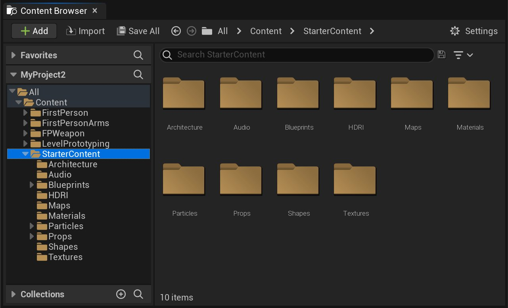
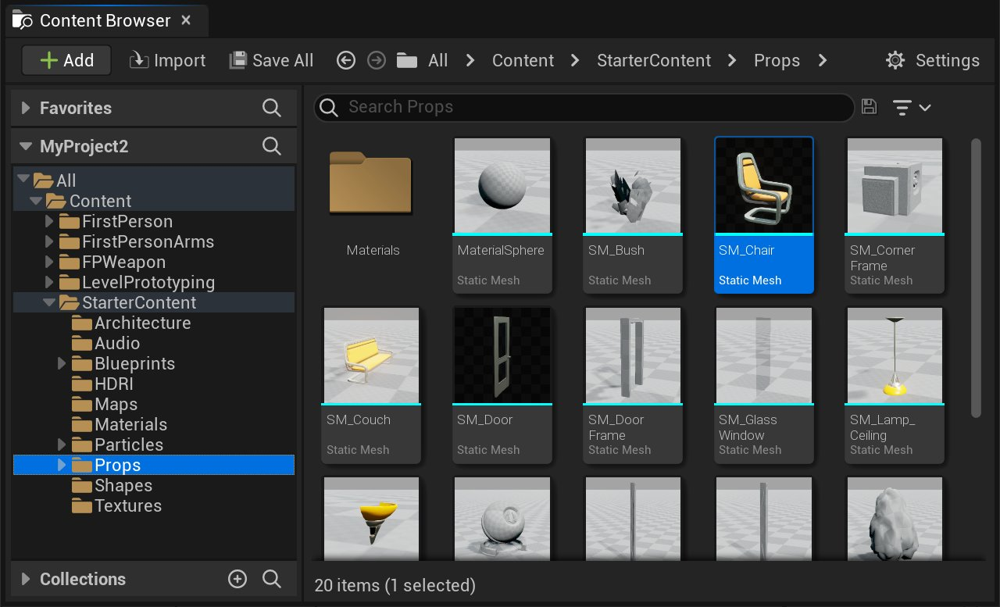
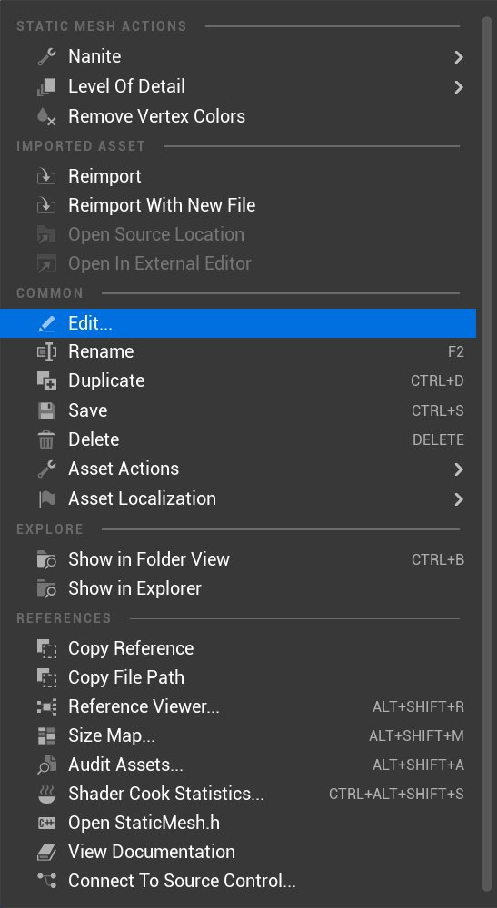
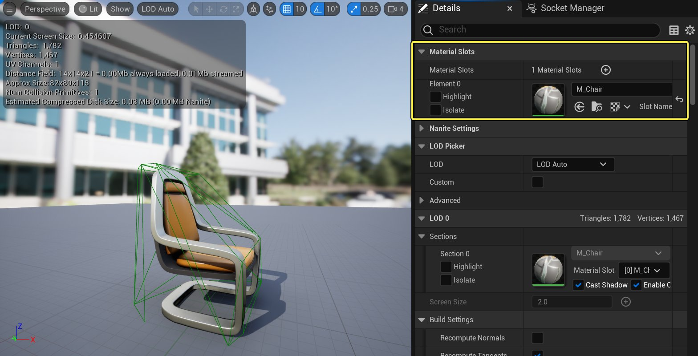
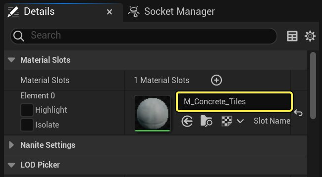
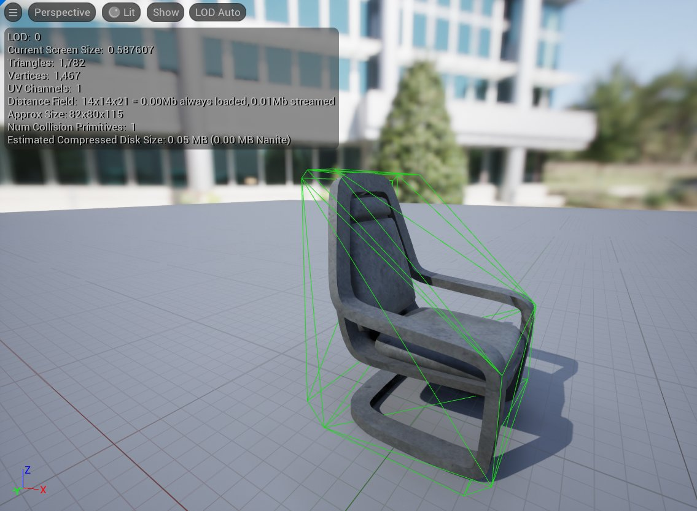
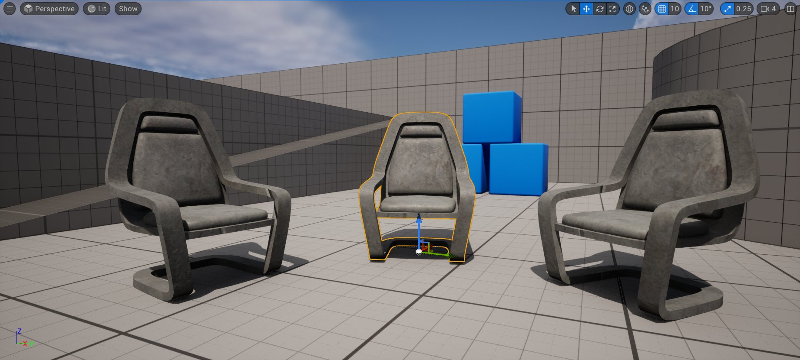

# 设置静态网格体的材质

> 路径：虚幻引擎5.7文档 / 管理内容 / 静态网格体 / 设置静态网格体的材质

> 原始页面：https://dev.epicgames.com/documentation/unreal-engine/using-materials-with-static-meshes-in-unreal-engine

无论将哪种类型的静态网格体放置到关卡中，只要玩家可以看见该对象，你都需要让该对象具有某种类型的材质。在此操作指南中，我们将介绍为静态网格体应用材质的几种不同方法。

## 设置

首先，我们需要设置要使用的项目和关卡。如果已有当前正在进行的项目，也可以使用该项目并按照所述步骤进行操作。如果当前没有正在进行中的项目，你可以首先启动UE4并创建新项目。在本示例中，我们使用了蓝图第一人称模板，但是对于本教程而言，你可以使用任意模板。但是需要重点指出的是，如果创建新项目，请确保包含 **初学者内容包**。如果未包含初学者内容包，你将缺少稍后需要在本指南中用到的资源，进而导致你可能无法遵循本指南中的步骤进行操作。确保你已包含 **初学者内容包** 之后，选择项目路径并指定项目名称，然后单击 **创建项目（Create Project）** 按钮。

项目加载好之后，前往 **内容浏览器**。如果已启用 **初学者内容包**，你应该可以在 **内容浏览器** 中找到名称为 **Starter Content** 的文件夹。它类似于下图所示：

点击查看大图。

## 通过"细节（Details）"面板应用材质

切换静态网格体副本材质最简单的方法是突出显示网格体的该特定实例并在 **细节（Details）** 面板中更改材质。在下面的部分中，我们将详细介绍操作步骤。

在 **Starter Content** 文件夹中，应有一个名称为 **Props** 的文件夹。打开该文件夹，然后在该文件夹中找到名称为 **SM_Chair** 的静态网格体。

点击查看大图。

使用 **鼠标左键** 单击 **SM_Chair**，使 **鼠标左键** 保持按下状态并将光标移动到视口中，然后释放鼠标左键。如果操作方法正确，在进行完此操作之后，该静态网格体的一个副本将被添加到关卡中。如果尚未单击其他地方，该静态网格体仍将处于突出显示状态，如果该静态网格体未处于选中状态，你可以在视口中单击它或在 **世界大纲视图** 中搜索 **SM_Chair** 并选中它。选中该静态网格体之后，**细节（Details）** 面板中的项将被填充。在 **细节（Details）** 面板中，有一个名称为 **材质（Materials）** 的部分。在该部分中，应具有所使用的材质的缩略图，它旁边具有显示该材质的名称的下拉菜单。通过选中下拉菜单并选择其他材质，你可以更改应用给网格体的该实例的材质，而且这将在视口中反映出来，如下所示：

| Normal Chair With Details | Brick Chair With Details |
| --- | --- |
| 一般椅子及其"细节（Details）"面板 | 砖块椅子及其"细节（Details）"面板 |

现在你已经掌握了更改关卡中某个静态网格体的实例材质的方法，下面我们介绍更改静态网格体本身的默认材质的方法。这可以在静态网格体编辑器中进行。在 **内容浏览器** 中，返回至 **Props** 文件夹中的 **SM_Chair**。选中它之后，可通过两种方法轻松访问静态网格体编辑器。第一种方法是在 **内容浏览器** 中 **双击** 该网格体，通过相同的方式你可以访问大多数资源对应的编辑器。你还可以 **右键单击** 该网格体，该操作会打开一个情境菜单。从该菜单中，选择 **编辑（Edit）**。

点击查看大图。

在 **内容浏览器** 中 **双击** 该资源，或从 **右键单击** 该资源之后显示的情境菜单中选择 **编辑（Edit）**，之后静态网格体编辑器将打开，你会看到与下图中所示类似的界面。

点击查看大图。

在默认情况下，位于编辑器右侧的是 **细节（Details）** 面板，在 **细节（Details）** 面板的顶部（如上图中突出显示的部分所示），你可看到静态网格体所使用的材质的缩略图，它旁边具有显示该材质的名称的下拉菜单。通过单击下拉菜单并选择其他材质，你可以更改应用给该静态网格体的材质，如下图中所示。

点击查看大图。

点击查看大图。

单击静态网格体编辑器顶部工具栏中的 **保存（Save）** 之后，应用的新材质将成为该静态网格体的默认材质，而且拖到关卡中的该网格体的任意实例都将被应用该材质，除非你如之前所述更改该网格体的该实例的默认材质，或者在静态网格体编辑器中更改该静态网格体的默认材质。

点击查看大图。
