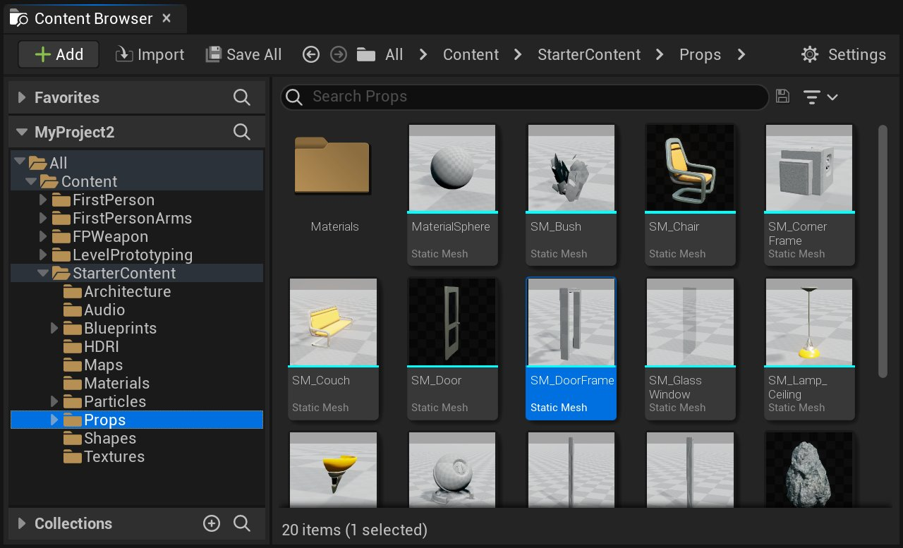
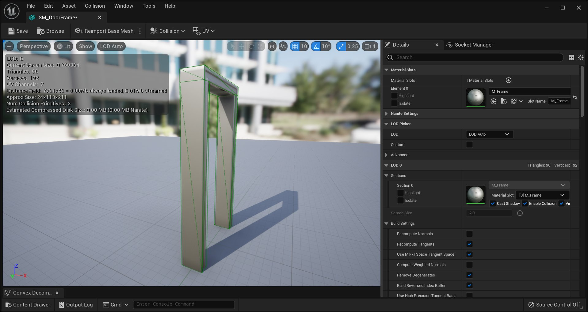
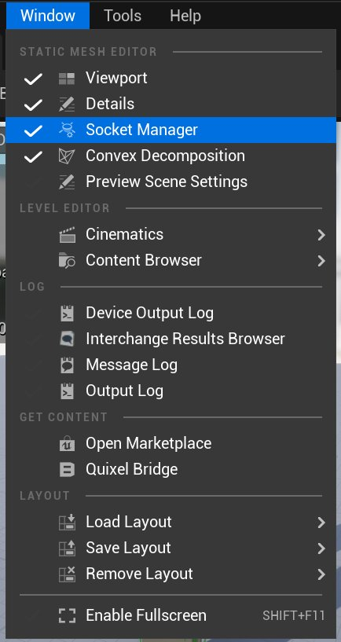
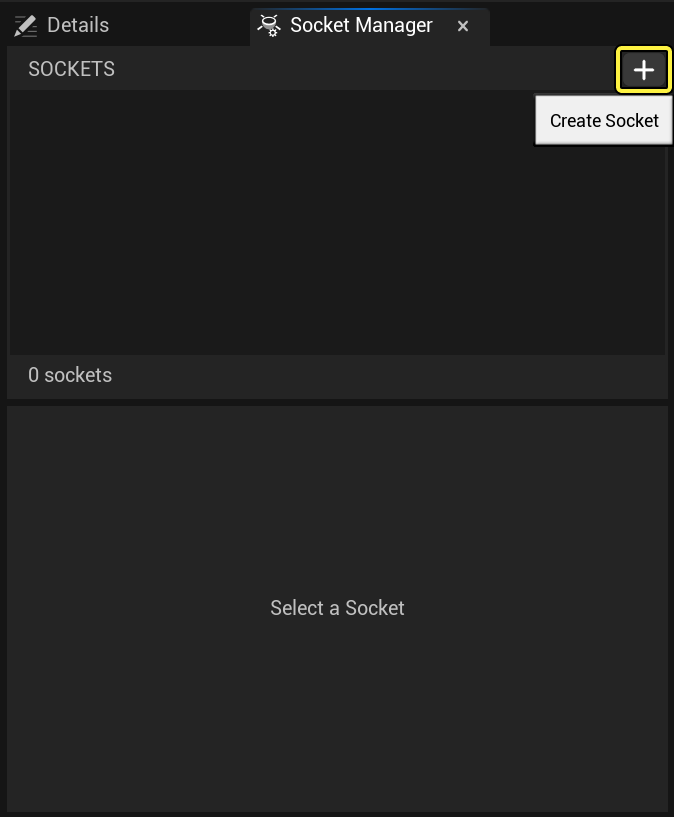
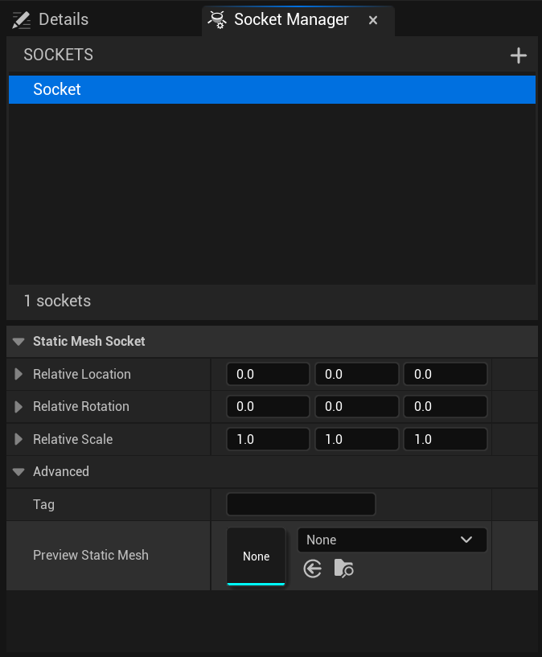
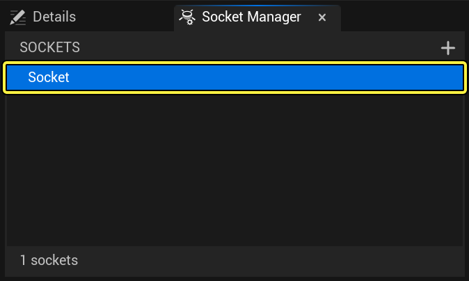
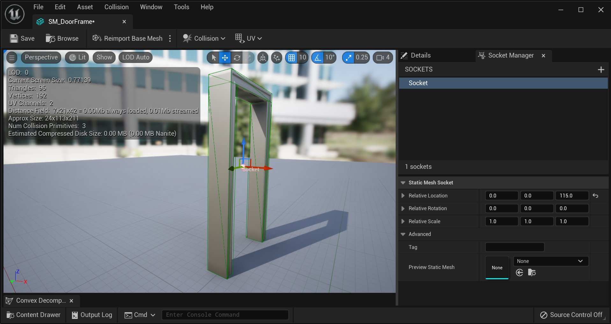

# 为静态网格物体设置插槽并使用

> 路径：虚幻引擎5.7文档 / 管理内容 / 静态网格体 / 为静态网格物体设置插槽并使用

> 原始页面：https://dev.epicgames.com/documentation/unreal-engine/using-sockets-with-static-meshes-in-unreal-engine

在 UE5 中制作场景时，有时您可能需要将某些东西附加到静态网格物体。您可以在 **World Outliner** 中向静态网格物体生成一个对象，但您还必须将其置于与网格物体相关的准确位置，这样做单调乏味。不过，就像您可以通过使用 Socket 将对象附加到骨骼网格物体一样，您也可以使用 Socket 将对象附加到静态网格物体。其操作非常简单，就像您在静态网格物体编辑器中创建 Socket、将其置于与网格物体相关的位置，然后将光、粒子效果甚至其他静态网格物体附加到网格物体那样。本操作指南将向您展示如何为静态网格物体创建 Socket，以及如何在场景中使用它。

## 设置

您可能已经拥有要处理的场景和静态网格物体。如果您已经有了上述条件，可以忽略此步骤。如果还没有，请从启动程序启动 UE5，然后创建一个新项目。务必选择一个保存路径并为您的项目命名。另外，选择一个要使用的模板。我们选择了蓝图的第一人称模板，但是您可以使用任意模板。

另外还要确保启用了 **Starter Content**。如果未启用该选项，您将无法使用本教学指南的后续步骤中要用到的资源，那就很难跟着继续操作下去了。

## 创建第一个 Socket

打开项目后，在 **Content Browser(内容浏览器)** 中找到 **Starter Content** 文件夹。然后浏览至 **Props** 文件夹，找到其中名为 **SM_DoorFrame** 的静态网格物体。

点击查看大图。

点击查看大图。

找到 **SM_DoorFrame** 后，在静态网格物体编辑器中打开资源，方法是 **double-clicking(双击)** 该资源或 **right-clicking(右键单击)** 该资源并从出现的弹出窗口中选择 **Edit**。完成后，您将可以看到类似以下画面。

点击查看大图。

现在，我们已经在静态网格物体编辑器中打开了网格物体，我们将创建一个 Socket，这样我们便可将火焰粒子置于门口中间，以创建某种死亡之拱。开始前，我们需要创建 Socket。要执行此操作，请单击编辑器顶部的 **Window** 下拉菜单，然后选择 **Socket Manager**。此时将出现 Socket Manager 窗口。您将可以看到类似以下右侧显示的画面：

点击查看大图。

点击查看大图。

打开 **Socket Manager** 窗口后，单击以绿色高亮显示的 **Create Socket** 按钮。单击此按钮后，将创建一个新 Socket 并要求您为其命名。在此示例中，我们将 Socket 命名为 **Fire**。单击 **Create Socket** 按钮后，您的 **Socket Manager** 窗口看上去应该类似于以下画面：

点击查看大图。

如果您在视口中查看此网格物体，您应该会看到一个 3D 小组件和一个转换小组件。如果没有，请单击工具栏中的 **Sockets** 按钮使 Socket 可见。

点击查看大图。

看到 Socket 后，它并非位于所需的位置。默认情况下，创建新的 Socket 时，它将位于静态网格物体所在的原始位置，这里即位于网格物体的底部正中间。我们需要 Socket 位于门口中间，这样玩家在穿过门时必须穿过火。您可以使用视口中的转换小组件手动移动该 Socket，您也可以更改其相对位置、旋转和从 **Socket Manager** 面板内缩放。为了达到预期效果，请将相对位置的 **Z** 值从 0 到 115 之间更改。之后，您将可以看到类似以下画面。

点击查看大图。

## 将对象附加到静态网格物体

现在我们在静态网格物体上已经有了要附加的 Socket，接下来我们将在场景中将对象附加到静态网格物体。单击静态网格物体编辑器内工具栏中的 **Save** 按钮，然后返回场景编辑器。找到 **Content Browser** 中的 **SM_DoorFrame**，然后将其副本拖入场景中。完成后，转到 **Starter Content** 文件夹中的 **Particles** 文件夹，然后找到名为 **P_Fire** 的资源。

> 图片已省略：Fire Particle

点击查看大图。

找到 **P_Fire** 后，也将其副本拖入场景中。这将充当玩家要穿过的火，即我们要附加到 **SM_DoorFrame** 的对象。拖入 **P_Fire** 的一个实例后，**right-click(右键单击)** 视口中的粒子。您将看到一个类似于以下画面的菜单：

> 图片已省略：Context Menu For Fire

点击查看大图。

在弹出菜单中，选择 **Attach To**，在出现的搜索框内，开始键入 **Door Frame**。此时应会出现 **SM_DoorFrame**。

> 图片已省略：Fire Attach To Frame

点击查看大图。

选择 **SM_DoorFrame** 后，系统将询问您要将对象附加到的位置。列表包括 **None** 和您为静态网格物体创建的每个 Socket。选择 **Fire**，**P_Fire** 粒子效果将会神奇地附加到静态网格物体上 Socket 所在的位置。该粒子效果现已附加到静态网格物体。

> 图片已省略：Choose Socket

点击查看大图。

> 图片已省略：Fire In Frame Complete

点击查看大图。

注意，即使您通过 Socket 将粒子效果附加到了静态网格物体，您仍可以从静态网格物体中单独移动、旋转、缩放粒子效果，但对静态网格物体做出的任何转换也会影响其附加的任何对象。

## 分离

分离对象和附加对象一样简单，您可以随时执行此操作。**right-click(右键单击)** 您要从中分离的对象，从出现的弹出菜单中选择 **Detach**。该对象已不再附加到另一对象。

> 图片已省略：Detach

点击查看大图。

## 创建有实心门的门口

您已经使用 Socket 创建末日之拱，接下来我们将使用 Socket 创建一些实用的东西。在 **Starter Content** 中的 **Props** 文件夹中，找到 **SM_DoorFrame**，再将其一个副本拖入场景中。然后，找到 **SM_Door**，也将其副本拖入场景中。现在，我们可以使用已有的 Socket 将门附加到门框，但是有一个问题。在将一个对象附加到另一个对象时，对象会在其原始位置附加到 Socket。静态网格物体 **SM_Door** 在其底角存在源，因此将门附加到 **Fire** Socket 会使门浮到空中，并且穿过门口的角落。要修复此问题，我们要创建另一个 Socket。

### 创建新的 Socket

在 **Content Browser** 中找到 **SM_DoorFrame**，然后 **double-clicking(双击)** 资源，在静态网格物体编辑器中将其打开。如果 **Socket Manager** 面板仍处于打开状态，则单击 **Add Socket** 按钮。如果没有，您可以从编辑器顶部的 **Window** 下拉菜单中选择 **Socket Manager** 重新打开 **Socket Manager** 面板。完成后，直接单击 **Add Socket** 按钮。

创建 Socket 后，将提示您为其命名。在此示例中，我们将 Socket 命名为 **Door**，以便我们稍后知晓这是我们要将门网格物体要附加到的 Socket。再次创建 Socket 后，则会在网格物体的源位置创建，这里指的是门框中间的底部位置。门网格物体的源位置是底角，这是我们要将 **Door** Socket 要移到的位置。您可以使用 3D 小组件手动移动 Socket，或者您可以更改其相对位置、旋转或从 **Socket Manager** 面板内缩放来移动。对于此示例，将 Socket 相对位置的 **Y** 值更改为 45 可实现预期效果。将 Socket 移到底角后，您的门框网格物体看起来应类似于以下显示的画面。

> 图片已省略：Door Socket

点击查看大图。

如果您未看到 Socket，请确保高亮显示Socket按钮，以便显示Socket。

> 图片已省略：Sockets Button

点击查看大图。

### 将门附加到框

我们已经有了将门附加到框的 Socket，请直接保存门框网格物体，然后返回场景编辑器。选择位于场景内的门的实例，**right-click(右键单击)** 调出弹出菜单。从弹出菜单中，选择 **Attach** 并搜索 **SM_DoorFrame**。找到您要将门附加到的门框的实例，然后 **left-clicking(左键单击)** 它将其选中。当询问您要附加到哪个 Socket 时，请选择 **Door**。完成后，您将可以看到类似以下画面。

> 图片已省略：Door Socket Complete

点击查看大图。

默认情况下，**SM_Door** 不设置碰撞。如果您现在玩该场景，那么玩家会穿过实心门，这不是非常有用。继续在静态网格物体编辑器内为门设置简易盒体碰撞，以使玩家无法在门关闭时穿过门。如果您不知道怎么做，您可以 [在此](../setting-up-collisions-with-static-meshes/index.md) 阅读说明 。

由于门是实心门，玩家无法穿过，因此您可以使用蓝图设置门的脚本行为，使其可以打开和关闭。这不在本教学指南系列的范围内，但是现在您必须通过要使用的门来阻止玩家，并将其附加到门框上，您可以 [在此](../../../blueprints-visual-scripting/specialized-blueprint-visual-scripting-node-groups/timelines/opening-doors/index.md) 了解如何获取开门和关门的脚本行为。
