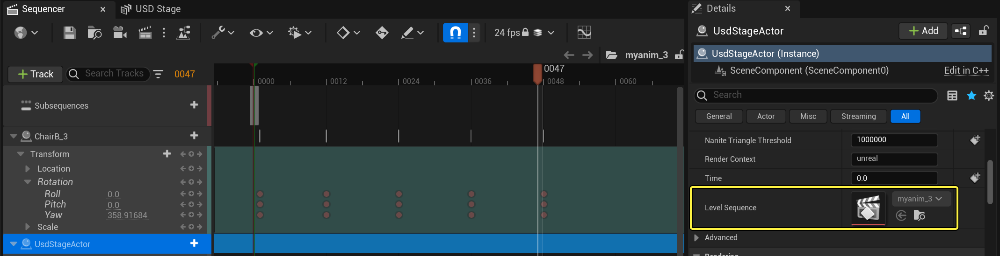
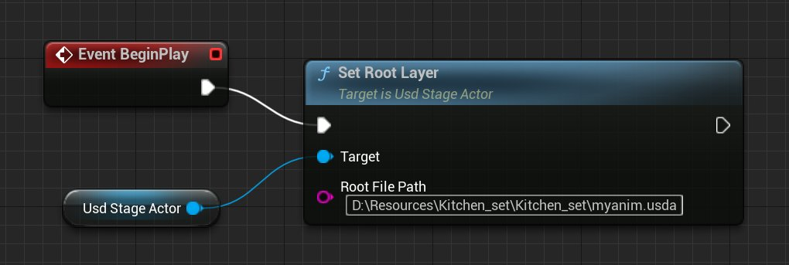
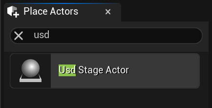
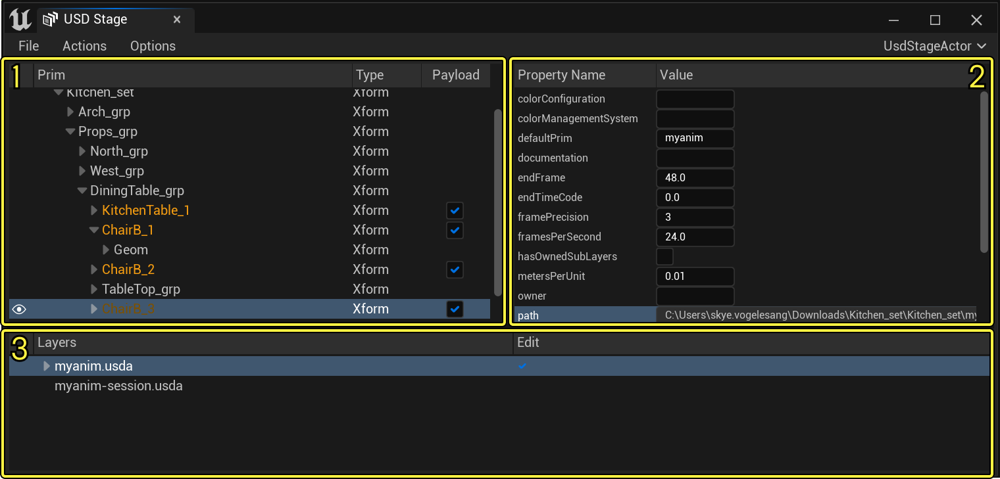
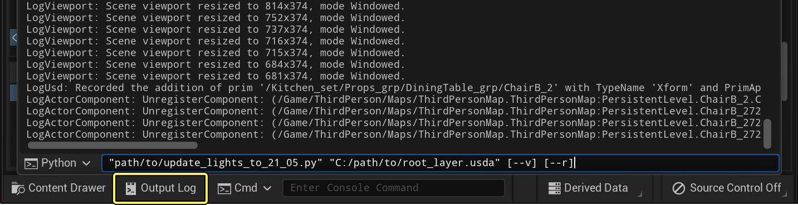

# 虚幻引擎中的通用场景描述

> 路径：虚幻引擎5.7文档 / 管理内容 / 通用场景描述（USD） / 虚幻引擎中的通用场景描述

> 原始页面：https://dev.epicgames.com/documentation/unreal-engine/universal-scene-description-in-unreal-engine

电影、游戏和其他3D图形产品通常会生成、存储和传输大量数据。这些数据可能来自美术管线中的各种软件（例如虚幻引擎、Maya、Houdini或Blender），每款软件都有自己专有的场景描述方式。

**通用场景描述（USD）** 交换格式是由皮克斯（Pixar）开发的一种开源格式，用于稳健且可扩展地交换及增强任意3D场景，而这些场景可能包含众多的基本资产。USD不仅提供多类工具集，可用于读取、写入、编辑和快速预览3D几何图形和着色，还提供元素资产（例如模型)或动画的交换。

与其他交换包不同，USD还支持将任意数量的资产汇编和整理到虚拟布景、场景和镜头中。然后，你可以在单个场景图中使用单个一致的API将这些内容在应用程序间传输，并以非破坏性的方式编辑它们（作为覆盖）。

## 为什么选择使用USD？

USD提供了一种通用的语言供用户在多个3D应用程序之间迁移大量数据。这为你的美术管线决策提供了灵活性，并使用迭代和非破坏性的方法促进了3D美术师（动画师、光照或遮光美术师、建模师、特效美术师等）之间的多人协作。

## 虚幻引擎中的USD支持

虚幻引擎通过 **USD舞台（USD Stage）** 面板和双向 **Python** 工作流提供USD支持。


USD舞台（USD Stage）窗口。点击查看大图。

USD舞台工作流不是将USD数据转换为静态网格体和材质等原生虚幻引擎资产，而是以原生方式处理你的USD数据。这样可以加快将USD数据并入虚幻引擎的速度，让你对USD内容的最初构建方式有更清晰的了解，并在你更改磁盘上的源USD文件时，处理实时更新。

USD舞台提供以下功能：

- 将3D数据呈现为"图元"：静态网格体、骨骼网格体、HISM、材质、光源、摄像机、变体、动画和混合形状。
- 非破坏性属性编辑。
- USD场景图和层级可视化。
- 使用负载加载和卸载内容。
- 支持USD预览表面的纹理。
- 支持材质PreviewSurface和DisplayColor。
- 支持Alembic或自定义路径解算器等USD插件。
- 运行时支持USD功能。有关更多信息，请参阅

  USD运行时支持

  。
- 加载

  .usd

  、

  .usda

  、

  .usdc

  和

  .usdz

  格式。

有关通用场景描述的更多通用信息，请参阅皮克斯的[USD介绍](https://graphics.pixar.com/usd/docs/index.html)。

有关使用Python工作流的更多信息，请参阅[Python脚本](#python%E8%84%9A%E6%9C%AC)。

## 支持的操作

### 导入到虚幻引擎中

你可以使用以下方法将USD舞台上显示的内容（ **静态网格体** 、 **骨骼网格体** 、 **光源** 、 **植被** 和 **地形** ）导入到虚幻引擎中：

- 使用

  文件（File）> 导入到关卡中（Import Into Level）

  。该流程将导入资产（静态网格体、骨骼网格体、材质和纹理等等）和Actor。
- 使用内容浏览器（Content Browser）中的

  添加/导入（Add/Import）

  按钮。该流程仅导入资产。
- 将文件拖放到内容浏览器（Content Browser）中。该流程仅导入资产。
- 使用

  USD舞台编辑器（USD Stage Editor）中的

  操作（Action）> 导入（Import）

  选项。该流程将导入资产和Actor。导入过程完成后，USD舞台上的资产将替换为

  内容浏览器** 中的新Actor。

### 创作和编辑动画

使用在 **USDStageActor** 的 **属性（Properties）** 面板中找到的关联关卡序列，可以访问存储在USD文件中的动画。



选择USD关卡舞台（USD Level Stage），并双击属性（Properties）面板中的序列（Sequence），从而打开关卡序列（Level Sequence）。 点击查看大图。

USD xform动画显示为关卡序列中的 **变换（Transform）** 轨道。其他形式的动画，如浮点、布尔和骨骼，通过 **时间（Time）** 轨道显示。如上图所示，在动画播放期间，USD动画数据在每个时间码中用密钥对/数值对表示。

借助由 **USD舞台** 生成的 **关卡序列** ，你可以通过 **变换（Transform）** 轨道绑定USD舞台生成的Actor，并添加其他动画。

### USD运行时支持

通过调用关卡内USD舞台Actor上的Set Root Layer Blueprint节点，虚幻引擎支持在运行时加载USD文件。



Set Root Layer节点。点击查看大图。

该节点将创建所需的资产，并将Actor和组件生成到关卡中，与在编辑器中处理该过程的方式相同。用于控制各种USD舞台Actor属性的其他蓝图函数包括：

| 蓝图函数 | 说明 |
| --- | --- |
| **Get Generated Assets** | 获取为给定图元路径中的图元生成的资产，并将其放入数组中。将USD舞台Actor和图元路径用作输入。 |
| **Get Generated Components** | 获取为给定图元路径中的图元生成的组件。将USD舞台Actor和图元路径用作输入。 |
| **Get Source Prim Path** | 获取USD舞台上给定对象的图元路径。将USD舞台Actor和对象引用用作输入。 |
| **Get Time** | 获取目标USD舞台Actor（中的当前时间戳。将USD舞台Actor作为目标。 |
| **Set Initial Load Set** | 设置要加载的初始负载。将USD舞台Actor用作输入，并提供以下选项。 **加载全部（Load All）** ：初始加载全部负载。 **不加载（Load None）** ：初始不加载负载。 |
| **Set Purpose to Load** | 设置要加载的初始目的。将USD舞台Actor和整型用作输入。 0 = 默认值 1 = 代理 2 = 渲染 3 = 导线 |
| **Set Render Context** | 设置USD舞台的渲染上下文。将USD舞台Actor作为目标，并将对渲染上下文的引用作为输入。 |
| **Set Time** | 设置USD舞台的当前时间戳。将USD舞台Actor和浮点值用作输入。 |

有关目的属性和其他USD术语的更多信息，请参阅皮克斯的[USD术语](https://graphics.pixar.com/usd/docs/USD-Glossary.html#USDGlossary-Purpose)。

借助此过程，你可以创建能够在运行时加载和显示USD文件内容的应用程序。

要在运行时启用USD导入器，请将以下行添加到位于 `UE_(version)\Engine\Source` 文件夹中的 `Project.Target.cs` 文件中，其中Project是你的项目名称：

```
 GlobalDefinitions.Add("FORCE_ANSI_ALLOCATOR=1"); 
```

例如：

```
	public class YourProjectTarget : TargetRules	{	public YourProjectTarget( TargetInfo Target) : base(Target)	{	 Type = TargetType.Game;	 DefaultBuildSettings = BuildSettingsVersion.V2;	 ExtraModuleNames.AddRange( new string[] { "YourProject" } ); 	 GlobalDefinitions.Add("FORCE_ANSI_ALLOCATOR=1");	}	} 
```

### Nvidia MDL支持

虚幻引擎使用Nvidia MDL USD模式支持MDL表面材质。有关Nvidia MDL的更多信息，请参阅Nvidia的[USD 着色器属性](https://developer.nvidia.com/usd/mdlschema)。

### 多用户编辑支持

许多USD舞台操作都支持多用户编辑，包括：

- 添加和删除图元。
- 重命名图元。
- 编辑图元属性。
- 切换可视性。
- 打开、关闭或更改当前舞台。

要为你的USD项目启用多用户支持，请启用 **USD 多用户同步（USD Multi-User synchronization）** 插件。如需进一步了解如何使用插件，请参阅[使用插件](../../../understanding-the-basics/foundational-knowledge-in/working-with-plugins/index.md)

USD多用户编辑将为每个客户端同步USD舞台的 **根层（Root Layer）** 属性，确保所有用户拥有相同的USD文件。实现方式是让每个客户端在本地打开相同的USD舞台，在他们自己的系统上生成资产和组件，然后仅同步对这些资产所做的操作。

在多用户编辑会话期间，务必要让所有用户使用相同的文件路径访问USD文件。为了确保每个客户端都可以访问相同的文件，我们建议将目标USD文件存储在项目文件夹中，并使用源控制进行管理。

有关虚幻引擎中多用户编辑的更多信息，请参阅[虚幻引擎多用户编辑](../../../production-pipeline/multi-user-editing/index.md)。

> [!WARNING]
> 无法在多用户会话期间撤消图元删除。

## 启用USD导入插件

在虚幻编辑器中使用USD文件前，你需要从 **插件（Plugins）** 菜单处启用 **USD导入器（USD Importer）** 插件。如需进一步了解如何使用插件，请参阅[使用插件](../../../understanding-the-basics/foundational-knowledge-in/working-with-plugins/index.md)

重启编辑器后，你会在关卡编辑器的 **窗口（Window）>虚拟制片（Virtual Production）** 菜单下看到新列出的 **USD舞台（USD Stage）** 选项。

**放置Actor（Place Actors）** 面板会列出一个可供你添加至关卡的新 **USD舞台Actor（USD Stage Actor）** 。



放置Actor面板中可用的新USD Actor。

## 在虚幻引擎中使用USD

在虚幻引擎中使用USD内容将从USD舞台编辑器和USD舞台Actor开始。



USD舞台面板。

| **数字** | **说明** |
| --- | --- |
| **1** | 层级 |
| **2** | 属性 |
| **3** | 层 |

## USD舞台工作流

USD舞台Actor将充当已加载USD文件内容的容器，并为关卡中的该数据提供锚点。从USD文件载入以及你在视口中看到的3D场景对象与大多数其他虚幻引擎功能完全兼容，你可以像处理其他Actor一样处理它们。你可以添加引用其他USD文件中的内容的其他图元，包括动画骨骼网格体。

使用USD舞台编辑器中的 **文件（File）> 保存（Save）** 菜单保存对USD舞台所做的更改，这会将这些更改写回你的USD文件。

有关使用USD舞台的更多信息，请参阅[USD舞台编辑器快速入门](../usd-stage-editor-quick-start/index.md)。

> [!NOTE]
> 打开USD文件时，虚幻引擎不会自动为USD舞台上加载的资产创建光照贴图。当构建静态光照时，这可能会导致场景全黑。

## Python脚本

使用USD编写Python脚本提供了一种灵活的方式来执行各种操作，例如难以通过用户界面处理或耗时的批处理操作和场景编辑。使用从 **输出日志（Output Log）** 面板启动的灵活Python脚本，可以快速自动化隐藏或编辑大量图元的属性等操作。

使用Python前，你必须启用 **Python编辑器脚本（Python Editor Script）** 插件。如需进一步了解关于插件的信息，请参阅[使用插件](../../../understanding-the-basics/foundational-knowledge-in/working-with-plugins/index.md)。

然后，你可以使用关卡编辑器底部的输出日志（Output Log）窗口执行Python脚本。你也可以通过 **窗口（Window）>输出日志（Output Log）** 将其作为独立的面板打开。



点击查看大图。

有关在虚幻引擎中使用Python脚本的更多信息，请参阅。

### 使用Python脚本的用例

当虚幻引擎附带的USD SDK版本升级到21.05时，更新重命名了USDLux光源模式中的几个属性。为了解决这个问题，虚幻引擎包含了一个Python脚本，该脚本将USDLux图元属性重命名为21.05命名规范。

```
	from pxr import Usd, Sdf, UsdLux	import argparse 	def rename_spec(layer, edit, prim_path, attribute, prefix_before, prefix_after):		path_before = prim_path.AppendProperty(prefix_before + attribute)		path_after = prim_path.AppendProperty(prefix_after + attribute) 		# 我们必须每次都检查，因为添加无法应用的命名空间编辑只会取消整个批处理		if layer.GetAttributeAtPath(path_before):			print(f"Trying to rename '{path_before}' to '{path_after}'")			edit.Add(path_before, path_after) 	def rename_specs(layer, edit, prim_path, reverse=False):		prefix_before = 'inputs:' if reverse else ''		prefix_after = '' if reverse else 'inputs:' 		# 光源		rename_spec(layer, edit, prim_path, 'intensity', prefix_before, prefix_after)		rename_spec(layer, edit, prim_path, 'exposure', prefix_before, prefix_after)		rename_spec(layer, edit, prim_path, 'diffuse', prefix_before, prefix_after)		rename_spec(layer, edit, prim_path, 'specular', prefix_before, prefix_after)		rename_spec(layer, edit, prim_path, 'normalize', prefix_before, prefix_after)		rename_spec(layer, edit, prim_path, 'color', prefix_before, prefix_after)		rename_spec(layer, edit, prim_path, 'enableColorTemperature', prefix_before, prefix_after)		rename_spec(layer, edit, prim_path, 'colorTemperature', prefix_before, prefix_after) 		# ShapingAPI		rename_spec(layer, edit, prim_path, 'shaping:focus', prefix_before, prefix_after)		rename_spec(layer, edit, prim_path, 'shaping:focusTint', prefix_before, prefix_after)		rename_spec(layer, edit, prim_path, 'shaping:cone:angle', prefix_before, prefix_after)		rename_spec(layer, edit, prim_path, 'shaping:cone:softness', prefix_before, prefix_after)		rename_spec(layer, edit, prim_path, 'shaping:ies:file', prefix_before, prefix_after)		rename_spec(layer, edit, prim_path, 'shaping:ies:angleScale', prefix_before, prefix_after)		rename_spec(layer, edit, prim_path, 'shaping:ies:normalize', prefix_before, prefix_after) 		# ShadowAPI		rename_spec(layer, edit, prim_path, 'shadow:enable', prefix_before, prefix_after)		rename_spec(layer, edit, prim_path, 'shadow:color', prefix_before, prefix_after)		rename_spec(layer, edit, prim_path, 'shadow:distance', prefix_before, prefix_after)		rename_spec(layer, edit, prim_path, 'shadow:falloff', prefix_before, prefix_after)		rename_spec(layer, edit, prim_path, 'shadow:falloffGamma', prefix_before, prefix_after) 		# DistantLight		rename_spec(layer, edit, prim_path, 'angle', prefix_before, prefix_after) 		# DiskLight、SphereLight、CylinderLight		# 注意：treatAsPoint不应该有 'inputs:' 前缀，所以我们忽略它		rename_spec(layer, edit, prim_path, 'radius', prefix_before, prefix_after) 		# RectLight		rename_spec(layer, edit, prim_path, 'width', prefix_before, prefix_after)		rename_spec(layer, edit, prim_path, 'height', prefix_before, prefix_after) 		# CylinderLight		rename_spec(layer, edit, prim_path, 'length', prefix_before, prefix_after) 		# RectLight、DomeLight		rename_spec(layer, edit, prim_path, 'texture:file', prefix_before, prefix_after) 		# DomeLight		rename_spec(layer, edit, prim_path, 'texture:format', prefix_before, prefix_after) 	def collect_light_prims(prim_path, prim, traverse_variants, light_prim_paths, visited_paths):		if not prim:			return 		if prim_path in visited_paths:			return		visited_paths.add(prim_path) 		# 手动遍历，因为我们可能会在变体之间切换，这会使stage.Traverse()迭代器失效		for child in prim.GetChildren(): 			# e.g. /Root/Prim/Child			child_path = prim_path.AppendChild(child.GetName()) 			if UsdLux.Light(child):				light_prim_paths.add(child_path) 			traversed_grandchildren = False			if traverse_variants:				varsets = child.GetVariantSets()				for varset_name in varsets.GetNames():					varset = varsets.GetVariantSet(varset_name)					original_selection = varset.GetVariantSelection() if varset.HasAuthoredVariantSelection() else None 					# 仅在会话层切换选择					with Usd.EditContext(prim.GetStage(), prim.GetStage().GetSessionLayer()):						for variant_name in varset.GetVariantNames():							varset.SetVariantSelection(variant_name) 							# e.g. /Root/Prim/Child{VarName=Var}							varchild_path = child_path.AppendVariantSelection(varset_name, variant_name) 							collect_light_prims(varchild_path, child, traverse_variants, light_prim_paths, visited_paths)							traversed_grandchildren = True 							if original_selection:								varset.SetVariantSelection(original_selection)							else:								varset.ClearVariantSelection() 			if not traversed_grandchildren:				collect_light_prims(child_path, child, traverse_variants, light_prim_paths, visited_paths) 	def update_lights_on_stage(stage_root, traverse_variants=False, reverse=False):	""" 使用根层 `stage_root` 遍历舞台，将光源图元的属性更新为USD 21.05或从USD 21.05更新。 		此处的方法涉及遍历组合舞台并收集属于UsdLux光源的图元路径		（根据输入参数确定是否翻转变体），然后遍历所有舞台的		层，并将光源图元属性的所有规格重命名为21.05（通过添加 'inputs:' 前缀）		或21.05之前的模式（通过删除 'inputs:' 前缀）。 		我们首先遍历组合舞台，确保我们只修改UsdLux光源图元属性，		例如，避免修改球体的"半径"属性。		"""		stage = Usd.Stage.Open(stage_root, Usd.Stage.LoadAll)		layers_to_traverse = stage.GetUsedLayers(True) 		# 收集组合舞台上的UsdLux图元		light_prim_paths = set()		visited_paths = set()		collect_light_prims(Sdf.Path("/"), stage.GetPseudoRoot(), traverse_variants, light_prim_paths, visited_paths) 		print("Collected light prims:")		for l in light_prim_paths:			print(f"\t{l}") 		# 遍历所有层，并重命名光源图元的所有相关属性		visited_paths = set()		for layer in layers_to_traverse:			# 在单个命名空间编辑中批处理此层的所有重命名操作			edit = Sdf.BatchNamespaceEdit() 			def visit_path(path):				attr_spec = layer.GetAttributeAtPath(path)				if attr_spec:					prim_path = attr_spec.owner.path 					# 只访问每个图元一次，因为我们将一次性处理所有UsdLux属性					if prim_path in visited_paths:						return					visited_paths.add(prim_path) 					if prim_path in light_prim_paths:						rename_specs(layer, edit, prim_path, reverse) 			layer.Traverse("/", visit_path) 			if len(edit.edits) == 0:				print(f"Nothing to rename on layer '{layer.identifier}'")			else:				if layer.CanApply(edit):					layer.Apply(edit)					print(f"Applied change to layer '{layer.identifier}'")				else:					print(f"Failed to apply change to layer '{layer.identifier}'") 		# 保存所有层		for layer in layers_to_traverse:			if not layer.anonymous:				layer.Save() 	if __name__ == "__main__":	parser = argparse.ArgumentParser(description='Update light prims to USD 21.05')		parser.add_argument('root_layer_path', type=str,						help='Full path to the root layer of the stage to update e.g. "C:/MyFolder/MyLevel.usda"')		parser.add_argument('--v', '--traverse_variants', dest='traverse_variants', action='store_true',						help='Whether to also flip through every variant in every variant set encountered when looking for light prims')		parser.add_argument('--r', '--reverse', dest='reverse', action='store_true',						help='Optional argument to do the reverse change instead: Rename 21.05 UsdLux light attributes so that they follow the schema from before 21.05')		args = parser.parse_args() 		update_lights_on_stage(args.root_layer_path, args.traverse_variants, args.reverse) 
```

该脚本可以在位于 `Engine/Plugins/Importers/USDImporter/Content/Python/usd_unreal/update_lights_to_21_05.py` 中的USDImporter源文件中找到。

按照以下步骤从 **输出日志（Output Log）** 执行脚本：

1. 选择 **窗口（Window）>输出日志（Output Log）** ，从而打开 **输出日志（Output Log）** 。
2. 点击命令行字段左侧的 **Cmd** 下拉菜单，并选择Python。
3. 在命令行字段中输入以下内容： `"C:\Program Files\Epic Games\UE_4.27\Engine\Plugins\Importers\USDImporter\Content\Python\usd_unreal\update_lights_to_21_05.py" "C:/path/to/root_layer.usda"`

   其中 `"C:/path/to/root_layer.usda"` 是USD文件的路径。

   > [!TIP]
   > 上面的示例包含虚幻引擎的默认安装路径。如果你没有在默认位置安装你的虚幻引擎版本，请务必更新路径。
4. 按 **Enter** 执行命令。
