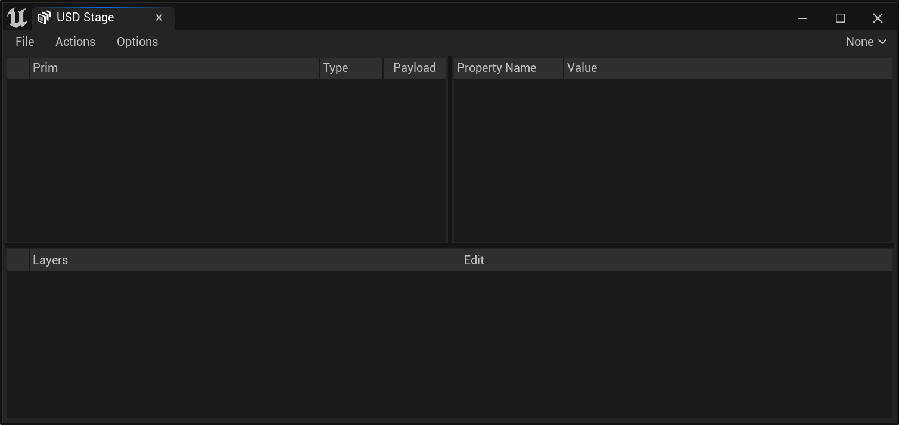
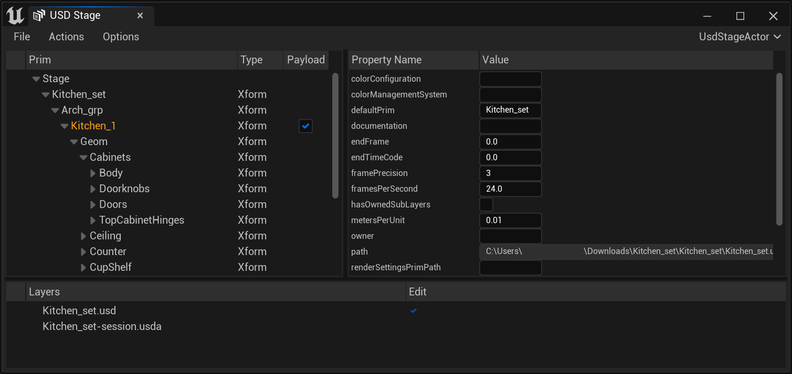
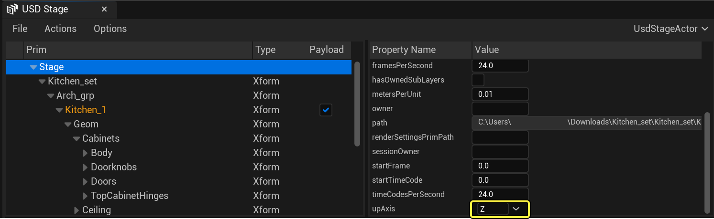
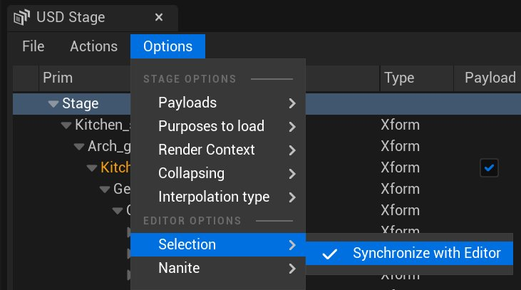
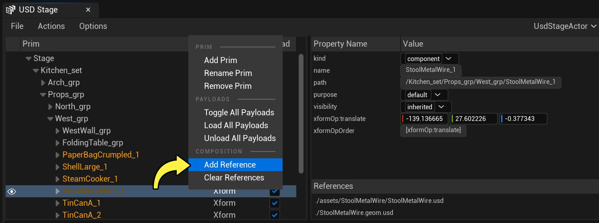
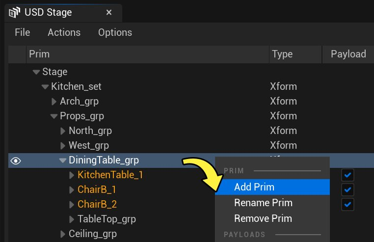
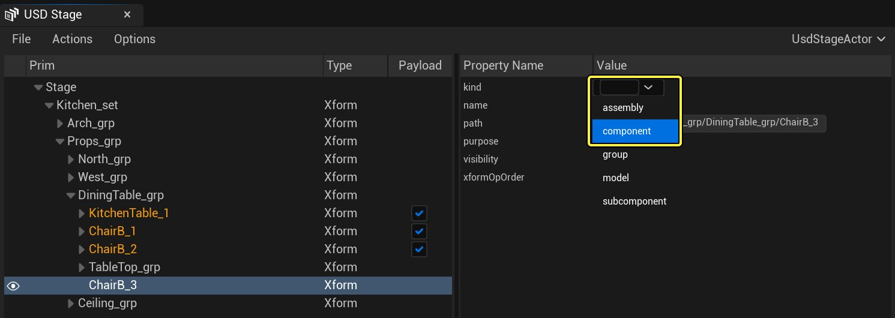
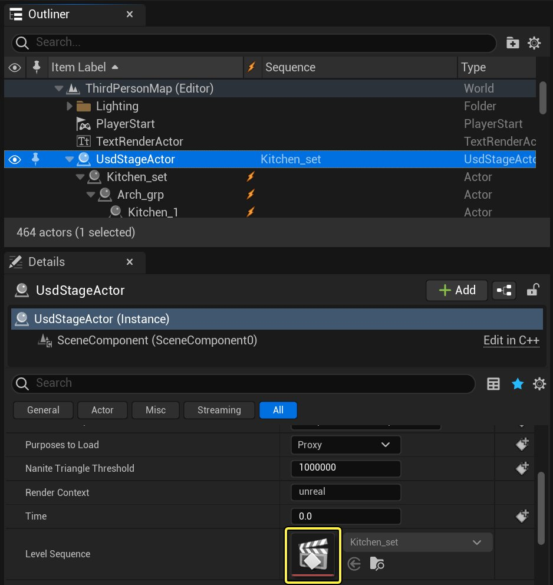

# USD舞台编辑器快速入门

> 路径：虚幻引擎5.7文档 / 管理内容 / 通用场景描述（USD） / USD舞台编辑器快速入门

> 原始页面：https://dev.epicgames.com/documentation/unreal-engine/usd-stage-editor-quick-start-in-unreal-engine

虚幻引擎将通过USD舞台Actor和USD舞台工作流程提供对USD的支持。在本快速入门指南中，你将：

- 创建USD舞台Actor。
- 使用USD舞台窗口编辑属性。
- 为USD舞台Actor添加新图元。
- 将数据写回USD文件。
- 使用Sequencer访问USD动画。
- 将资产导入虚幻引擎项目。

在开始之前，你需要在项目中启用 **USD导入器（USD Importer）** 插件。如需更多信息，请参阅[使用插件](../../../understanding-the-basics/foundational-knowledge-in/working-with-plugins/index.md)。

### 先决条件和准备工作主题

为了理解和使用本页中提到的内容，请确保你熟悉以下主题：

- 虚幻引擎中的通用场景描述

> [!TIP]
> 本教程使用皮克斯的厨房套装USD文件。皮克斯维护了小型的USD示例文件库，用于学习和演示。点击[此处](https://graphics.pixar.com/usd/release/dl_downloads.html)下载厨房套装和其他示例。

## 1. 创建USD舞台Actor

打开USD舞台（USD Stage）面板，开始处理USD内容。

点击查看大图。

1. 在关卡编辑器中，从顶部菜单中选择 **窗口（Window）>虚拟制片（Virtual Production）>USD舞台（USD Stage）** 。
2. 在 **USD舞台编辑器（USD Stage Editor）** 面板的菜单中，选择 **文件（File）>打开（Open）** ，并找到USD文件。

层级分段将填充来自你的USD文件中的场景层级。

USD舞台窗口的层级分段填充了厨房套装的内容。 点击查看大图。

> [!TIP]
> 你在虚幻引擎中打开的每个USD文件都需要自己的 **USD舞台** Actor，用作USD数据的锚点。上述过程会自动将USD舞台Actor添加到你的关卡。
>
> 你也可以使用 **放置Actor（Place Actors）** 面板添加USD舞台Actor，并使用 **细节（Details）** 面板中的 **根层（Root Layer）** 选项为其选择关联的USD文件。

## 2. 使用USD舞台窗口编辑属性

你可以使用USD舞台编辑器（USD Stage Editor）窗口的属性（Properties）分段，编辑你的USD舞台Actor和图元的属性。

### 更改USD舞台Actor的UpAxis

1. 选择USD舞台（USD Stage）窗口中层级顶部的 **舞台（Stage）** 。在属性（Properties）分段中，找到 **upAxis** 属性并点击下拉菜单。选择新轴来代表你的USD数据。

   

   选择最适合你的USD数据的轴。 点击查看大图。

### 更改图元的变体

1. 在USD舞台编辑（USD Stage Editor）中，选择 **选项（Options）>选择（Selection）** ，并启用 **与编辑器同步（Synchronize with Editor）** 。这会同步你在虚幻引擎关卡和USD舞台编辑器窗口之间的选择。

   

   启用与编辑器同步（Synchronize with Editor），在USD舞台和虚幻引擎视口之间同步你的选择。 点击查看大图。
2. 在层级分段，点击 **Kitchen_Set** 旁边的下拉箭头，展开分组。展开 **Props_grp** ，显示场景中的道具。
3. 展开 **West_grp** ，显示各个图元。橙色亮显的道具表示它们是 **复合弧** ，你可以右键点击所有的图元，从而为其添加引用（或清除引用）。其他右键点击操作包括添加或删除图元的功能，以及切换、加载或卸载有效负载的功能。

   

   点击查看大图。
4. 展开 **DiningTable_grp** ，选择 **ChairB_1** 。你可以在属性（Properties）分段中编辑以下项目：

   | 属性 | 说明 |
   | --- | --- |
   | **名称（name）** | 显示所选资产的名称。 |
   | **路径（path）** | 显示所选资产的路径。 |
   | **种类（kind）** | 定义所选资产的类型。 **程序集** ：模型集合。 **组件** ：包含子组件的模型类型。 **组** ：程序集中的模型集合。 **模型** ：种类的基础类型。资产不应将其种类设置为模型，因为它是用于区分组件和组的抽象共性。请参阅皮克斯USD文档中的[模型层级](https://graphics.pixar.com/usd/release/glossary.html#usdglossary-model)，了解更多信息。 **子组件** ：组件内的图元。不是一种模型。 |
   | **目的（purpose）** | 设置要加载的初始目的。将USD舞台Actor和整型用作输入。 选项包括： 默认值 代理 渲染 指南 |
   | **可视性（visibility）** | 设置要加载的初始目的。将USD舞台Actor和整型用作输入。 选项包括： **已继承** ：从其父节点继承可视性 **不可见** ：不渲染图元及其子树中包含的所有图元。 |
   | **xformOp:rotateZ** | 定义所选资产的Z旋转。 |
   | **xformOp:translate** | 定义资产的X、Y和Z位置。 |
   | **xformOpOrder** | 显示变换操作应用于资产的顺序。 |
   | **modelingVariant** | 定义在场景中显示的当前变体。仅当资产具有一个或多个变体时才可见。 |
   | **参考（References）** | 显示附加到此图元的所有参考。 |
5. 此场景中的椅子有两个变体， **ChairA** 和 **ChairB** 。选择 **ChairB_1** ，找到属性的 **变体（Variants）** 分段。将 **modelingVariant** 更改为 **ChairA** 。此操作会将场景中使用的椅子网格体与新变体交换。

## 3. 向USD舞台Actor添加新图元

使用右键点击菜单在层级中添加或删除图元。添加后，可以在属性（Properties）分段中编辑属性。

### 在厨房套装中添加一把新椅子

1. 右键点击层级中的 **DiningTable_grp** 条目，然后从菜单中选择 **添加图元（Add Prim）** 。将此新图元命名为 **ChairB_3** 。

   

   将新图元添加USD舞台。 点击查看大图。
2. 选择层级中的新图元。在 **细节（Details）** 分段，将其 **种类（kind）** 更改为 **组件（component）** 。

   

   更改新图元的属性。 点击查看大图。
3. 引用椅子USD文件，将其带入舞台。右键点击层级中的 **ChairB_3** ，然后选择 **添加引用（Add Reference）** 。找到厨房套装文件的位置。打开 **assets > Chair** 文件夹并选择 **Chair.usd** 。点击 **打开（Open）** 。
4. 你的新图元现在将引用椅子USD数据并显示 **ChairS** 变体。它应该位于关卡的原点。在层级中选择 **ChairB_3** ，并将modelingVariant更改为 **ChairB** 。
5. 点击视口中的新椅子，并使用变换工具将椅子放置在桌子附近。

## 4. 将数据写回你的USD文件

使用USD舞台Actor所做的更改可以写回你的USD文件。从USD舞台面板中选择 **文件（File）>保存（Save）** 。

## 5. 使用Sequencer访问USD动画

### 访问USD动画

存储在USD文件中的动画可以从USD舞台Actor生成的专用关卡序列中访问。

1. 在 **大纲视图（Outliner）** 中选择 **USDStageActor** 。在 **细节（Details）** 面板的 **USD** 分段，找到 **关卡序列（Level Sequence）** 。双击资产，在 **Sequencer** 中打开它。

   

   在细节（Details）面板中双击关卡序列（Level Sequence）。 点击查看大图。

有关Sequencer用法的更多信息，请参阅[过场动画和Sequencer](../../../animating-characters-and-objects/cinematics-and-movie-making/index.md)。

### 对椅子进行动画处理

要将动画添加到你在第三步中创建的新图元 **ChairB_3** ，你需要创建新的USD文件，并将其作为图层添加到USD舞台Actor（USD Stage Actor）。

1. 在USD舞台（USD Stage）窗口的 **图层（Layers）** 分段，右键点击 **kitchen_set.usd** 图层并选择 **新增（Add New）** 。将此新文件另存为 **myanim.usda** 。

   > 图片已省略：Add a new Layer to your USD data for the animation

   为动画的USD数据添加新图层。 点击查看大图。
2. USD图层使用[LIVRPS结构](https://graphics.pixar.com/usd/release/glossary.html#usdglossary-livrpsstrengthordering)来确定图层如何影响场景的最终构图。若要使动画影响厨房套装，包含该动画的图层在图层结构中必须高于包含图元的场景。在关卡编辑器的顶部菜单中，选择 **窗口（Window）>放置Actor（Place Actors）** ，以打开面板。在 **放置Actor（Place Actors）** 面板中搜索 **USD Stage Actor** ，并将新副本拖到关卡中。

   > 图片已省略：New USD Actors in the Place Actors panel

   放置Actor面板中的新USD Actor。 点击查看大图。
3. 在 **大纲视图（Outliner）** 中选择 **UsdStageActor** 。在USD舞台面板中，选择 **文件（File）>打开（Open）** ，然后浏览至你的 **myanim.usda** 文件。
4. 右键点击 **myanim.usda** 图层并选择 **添加现有图层（Add Existing）** 选项，将厨房套装添加回图层堆栈中。在文件（File）窗口中，找到你的 **kitchen_set.usd** 文件并点击 **打开（Open）** 。
5. 在添加动画之前，USD舞台需要知道动画将持续多长时间。点击层级中的 **舞台（Stage）** 图元。在属性（Properties）分段，将 **endTimeCode** 和 **endFrame** 值更改为 **48** 。

   > 图片已省略：Change the endTimeCode and endFrame properties

   更改endTimeCode和endFrame属性。 点击查看大图。
6. 在 **大纲视图（Outliner）** 中选择新的USD舞台Actor。在 **细节（Details）** 面板中，向下滚动至USD分段，找到 **关卡序列（Level Sequence）** 。双击资产，在 **Sequencer** 中打开它。
7. 在Sequencer面板中，点击 **+ 轨道（+ Track）** 按钮，并从 **Actor到Sequencer（Actor to Sequencer）** 子菜单中选择你想要制作动画的Actor。

   > 图片已省略：Add a new Track group

   为选定的Actor添加新的轨道组。 点击查看大图。
8. 点击新轨道上的 **添加（+）（Add (+)）** 按钮并创建新的 **变换（Transform）** 轨道。

   > 图片已省略：Add a new Transform track

   添加新的变换轨道。 点击查看大图。
9. 对椅子进行原地旋转的动画处理。有关在Sequencer中使用轨道的更多信息，请参阅[轨道](../../../animating-characters-and-objects/cinematics-and-movie-making/unreal-engine-sequencer-movie-tool-overview/sequencer-track-list/index.md)。
10. 在USD舞台（USD Stage）窗口中使用 **文件（File）> 保存（Save）** 将数据写回USD。

## 6. 将资产导入虚幻引擎项目。

显示在USD存储Actor（USD Stage Actor）上的Actor，可以通过以下任一导入选项导入到虚幻编辑器的内容浏览器中。

- 使用

  文件（File）> 导入到关卡中（Import Into Level）

  。该流程将导入资产（静态网格体、骨骼网格体、材质和纹理等等）和Actor。
- 使用

  内容浏览器（Content Browser）

  中的

  添加/导入（Add/Import）

  按钮。该流程仅导入资产。
- 将文件拖放到

  内容浏览器（Content Browser）

  中。该流程仅导入资产。
- 使用USD舞台编辑器（USD Stage Editor）窗口中的

  操作（Action）> 导入（Import）

  选项。此过程将导入USD舞台Actor上的所有内容，并适用于资产和Actor。导入过程完成后，USD舞台上的资产将替换为

  内容浏览器

  中的新Actor。

### 将厨房套装导入虚幻引擎

1. 在USD舞台（USD Stage）窗口中打开厨房套装（Kitchen Set）后，打开 **操作（Actions）** 菜单并选择 **导入（Import）** 。
2. 选择存储导入资产的位置。在本例中，导入厨房套装将在所选位置创建名为 **Kitchen_set** 的文件夹。材质和静态网格体将保存在单独的子文件夹中。
