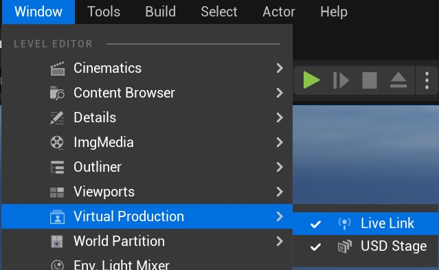
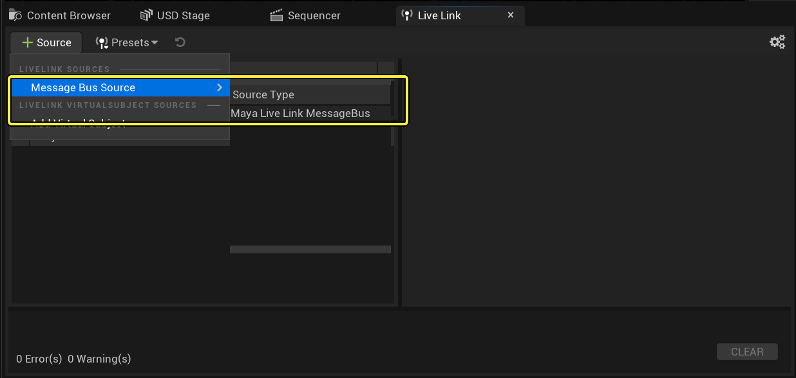
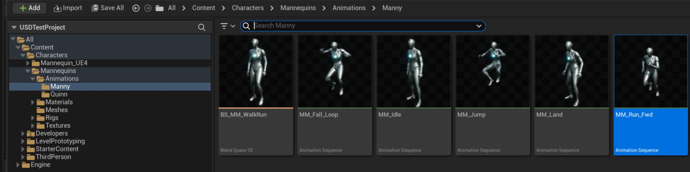
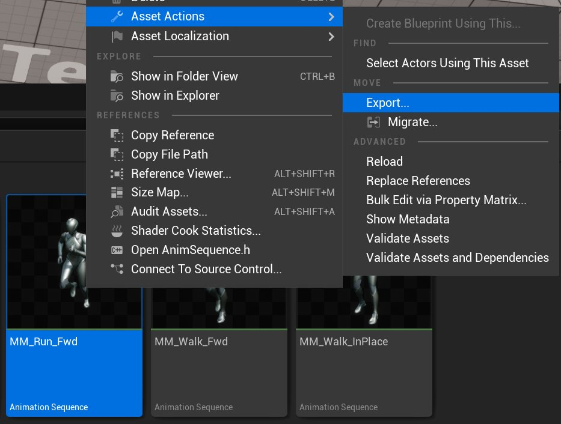
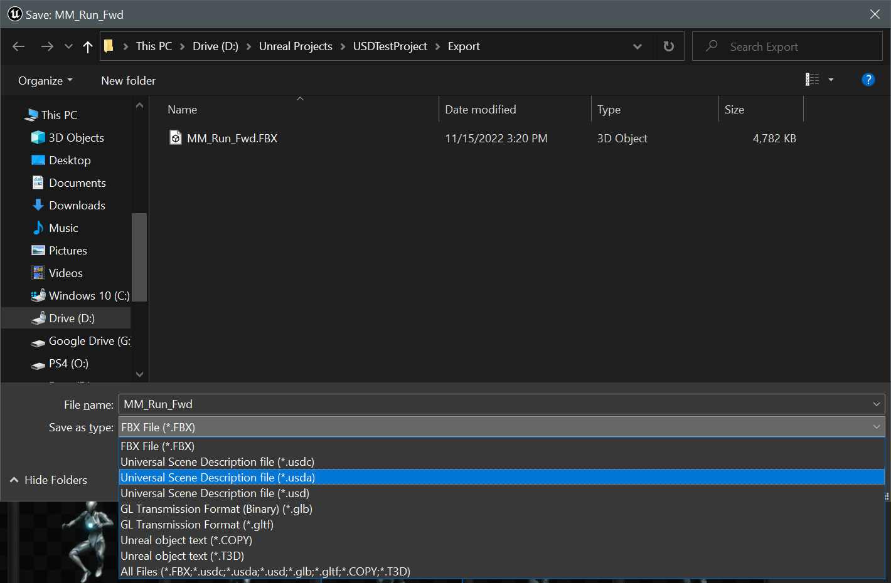
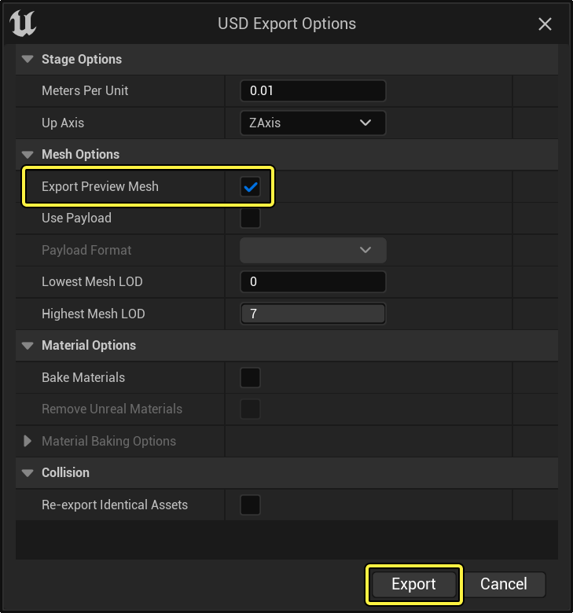
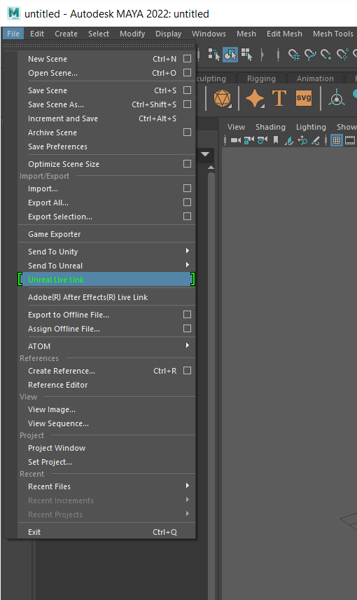
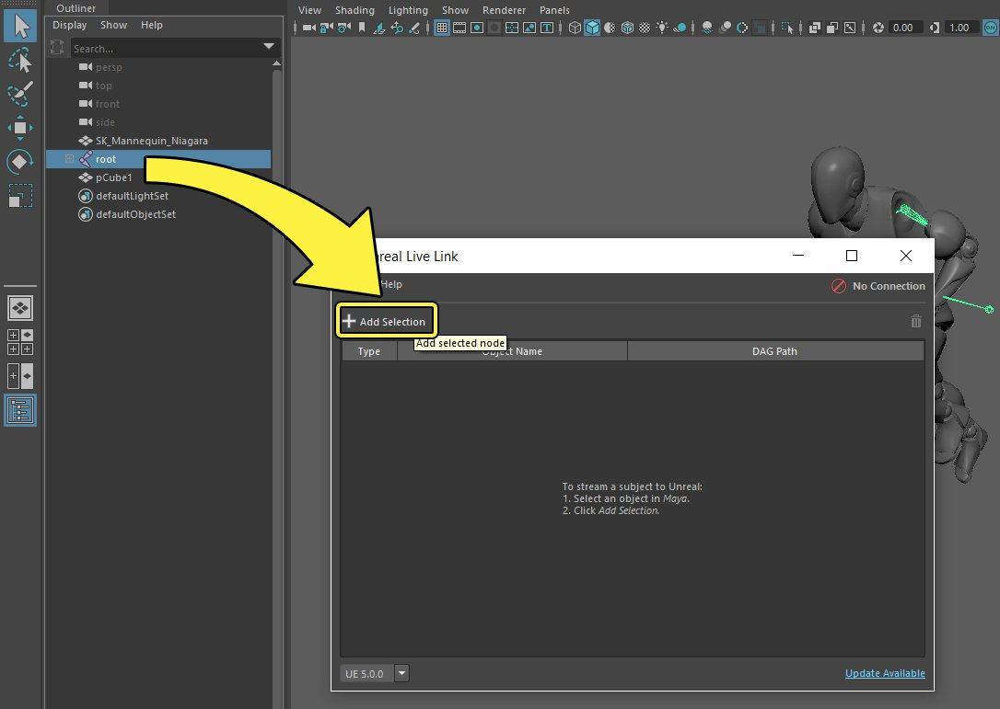

# 将Live Link用于USD

> 路径：虚幻引擎5.7文档 / 管理内容 / 通用场景描述（USD） / 将Live Link用于USD

> 原始页面：https://dev.epicgames.com/documentation/unreal-engine/using-livelink-with-the-usd-importer-in-unreal-engine

[Live Link](../../../animating-characters-and-objects/skeletal-mesh-animation-system/live-link/index.md)插件可在 **虚幻编辑器（Unreal Editor）** 和外部 *数字内容创建* （DCC）工具（例如Maya或Houdini）之间同步动画资产，以便资产在引擎中出现时快速预览。**虚幻引擎（Unreal Engine）** 可以使用 **通用场景描述（USD）** 文件作为Live Link连接的一部分，并在项目过程中进行维护，使此工作流程更加便捷。本教程将详细说明如何使用USD文件在虚幻引擎中设置Live Link连接，并概述在使用Live Link时USD格式的优势。

## 概述

当你使用 **USD舞台（USD Stage）** 设置Live Link连接时，它会随描述该连接的属性将自定义Live Link模式添加到USD图元。只要此信息保持在USD文件中，并且你的DCC和虚幻引擎都有Live Link连接，资产的连接就可以重新建立。如果任一应用程序重启，或文件关闭并在DCC中重新打开，Live Link连接将需要重新建立。

## 学习本指南

本指南中的示例使用Autodesk Maya和[Unreal Live Link V2](https://apps.autodesk.com/MAYA/zh/Detail/Index?id=3726213941804942083&appLang=en&os=Win64)插件，但集成了Live Link的所有DCC工具集都应该能够建立与虚幻引擎的连接。查看你的DCC的Live Link集成的说明，了解与此处演示的工作流程有何不同。

> [!NOTE]
> 如果你要使用Unreal Live Link V2插件，安装程序还会为虚幻引擎设置 **Maya Live Link** 插件。如果你要使用Maya，请使用此项，而不是标准Live Link插件。

## 1. 必要设置

要学习本指南，你需要满足以下先决条件：

- 同时为虚幻引擎和你的DCC启用Live Link插件。

  - 如果你要使用Autodesk Maya，请改用Maya Live Link插件。
- 在虚幻引擎中启用 **USD导入器（USD Importer）** 插件。

要在虚幻引擎中设置插件，请点击 **编辑（Edit）** > **插件（Plugins）** 打开 **插件（Plugins）** 菜单，然后找到插件并将其启用。请参阅你的DCC的Live Link集成的说明，或其关于使用插件的指南，了解如何将其激活。

本指南还使用了通过 **第三人称模板（Third-Person Template）** 创建的新项目。这包括虚幻引擎人体模型及其动画。这些在 **内容浏览器（Content Browser）** 中的 `Content/Mannequins` 文件夹中可用。本指南在举例时会用到这些资产，但是你在遵照指示时不一定要使用这些资产，你可以采用任意骨骼网格体进行操作。

## 2. 建立Live Link连接

1. 打开你的DCC和虚幻编辑器。
2. 设置你的DCC的Live Link集成。

   - 对于Maya，下载并安装Unreal Live Link插件。你可以在

     此处

     下载安装程序，安装之后，你可以点击

     文件（File）

     >

     Unreal Live Link

     将其打开。
3. 在虚幻编辑器中，点击 **窗口（Window）** > **虚拟制片（Virtual Production）** > **Live Link** ，打开 **Live Link** 窗口。

   
4. 点击 **Live Link** 窗口中的 **+ 源（Source）** 按钮。高亮显示 **消息总线源（Message Bus Source）** 并选择你的DCC的 **Live Link连接（Live Link connection）** 。

   

   点击查看大图。

   你的DCC和虚幻引擎将使用Live Link连接和同步。但是，由于没有同步资产，你还不会看到更改。

## 3. 导出USD文件并用于同步资产

现在你已打开Live Link连接，请导出USD文件并用于同步资产。

1. 在内容浏览器中找到 `MM_Run_Fwd` 动画。你可以在 Content/Characters/Mannequins/Animations/Manny` 中找到它。

   

   点击查看大图。
2. 右键点击 `MM_Run_Fwd` 。点击 **资产操作（Asset Actions）** > **导出（Export）** 。

   
3. 使用 `.usda` 文件格式导出资产。

   

   点击查看大图。

   > [!NOTE]
   > 你需要将文件导出为 `.usda` 文件才能使用USD舞台，你还需要将其导出为 `.fbx` 文件以用于导入Maya中。
4. 在 **USD导出选项（USD Export Options）** 对话框中，确保选中了 **导出预览网格体（Export Preview Mesh）** ，然后点击 **导出（Export）** 。

   
5. 打开你的DCC并导入 `.usda` 文件。

   1. 在Maya中，点击

      文件（File）> 导入（Import）

      ，然后选择

      USD导入（USD Import）

      ，并选择

      .usda

      文件。将其沿X轴旋转-90度，使其面朝上。
6. 选择 **根骨骼** ，然后将选择内容添加到Live Link。

   1. 在Maya中，点击 **文件（File）** > **Unreal Live Link** 打开 **Unreal Live Link** 窗口。

      
   2. 在层级中选择你的网格体的 **根骨骼** ，然后点击Live Link窗口中的 **添加选择内容（Add Selection）** ，将其添加到你的Live Link主题列表中。

      
   3. 点击选择内容的 **类型（Type）** 下拉菜单，然后选择 **完整层级（Full Hierarchy）** 。

      > 图片已省略：选择

   > [!NOTE]
   > 在后续步骤中，当你在虚幻编辑器中选择你的主题名称时，你将需要你的对象名称。
7. 点击 **窗口（Window）** > **虚拟制片（Virtual Production）** > **USD舞台（USD Stage）** ，打开 **USD舞台（USD Stage）** 窗口。

   > 图片已省略：打开USD舞台
8. 在 **USD舞台（USD Stage）** 中，点击 **文件（File）** > **打开（Open）** ，然后选择 `MM_Run_Fwd.usda` 文件。

   > 图片已省略：在USD舞台中打开你的动画
9. 在 **USD舞台（USD Stage）** 中，右键点击你的模型的 **SkelRoot** ，然后点击 **设置Live Link（Set Up Live Link）** 。

   > 图片已省略：为你的动画设置Live Link

   **Live Link集成（Live Link integrations）** 面板将显示，并将 **DefaultLiveLinkAnimBP** 显示为你的动画蓝图。

   > 图片已省略：带有默认设置的Live Link集成面板
10. 点击 **Live Link主题名称（Live Link Subject Name）** 下拉菜单，并选择对应于你在DCC中选择的对象名称的值。这些值需要匹配，Live Link连接才能正常运行。

## 结果

如果你在DCC中推移你的资产的动画，动画将在虚幻引擎中同步。

## 配置

USD舞台中提供了以下选项，用于配置你的Live Link设置。

### 启用和禁用Live Link连接

你可以在USD舞台中使用 **启用Live Link连接（Enable Live Link Connection）** 设置启用和禁用USD舞台中的Live Link连接。

> 图片已省略：启用或禁用Live Link连接

这样你可以在查看使用Live Link提供的动画与查看USD舞台上存在的原始动画之间快速切换。

### 自定义动画蓝图

默认情况下，当你使用USD舞台设置Live Link时，骨骼网格体会使用DefaultLiveLinkAnimBP资产。此动画蓝图使用 **Live Link Pose** 节点监听你的DCC提供的姿势。

> 图片已省略：动画图表编辑器中的Live Link Pose节点

你可以通过更改集成面板中的 **动画蓝图资产（Anim Blueprint Asset）** 字段，改用自定义动画蓝图。在你的自定义动画蓝图中，使用Live Link Pose节点提供与Live Link的兼容性。

### 选择Live Link主题

**Live Link主题名称（Live Link Subject Name）** 将选择要与此特定图元同步的特定Live Link主题。这必须与添加到你的DCC的Live Link管理器的某个对象的 **对象名称（Object Name）** 值匹配。
