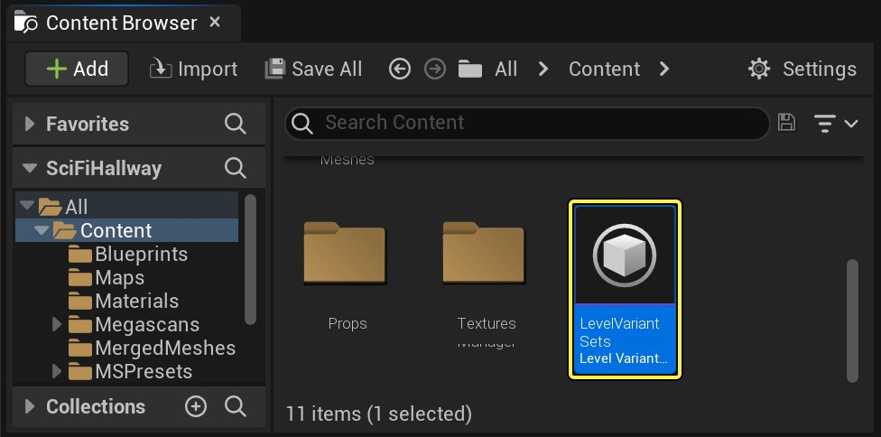
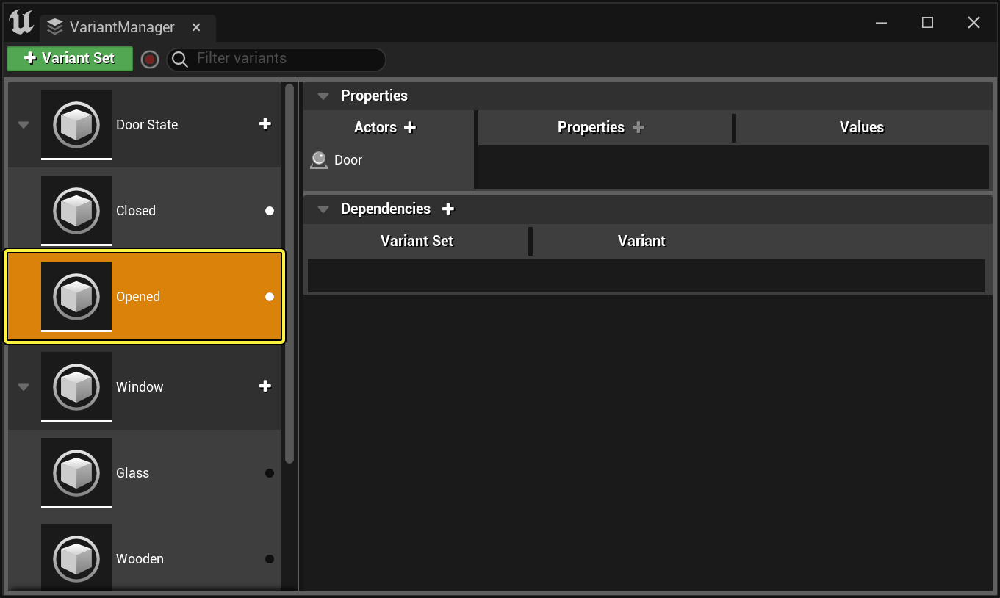
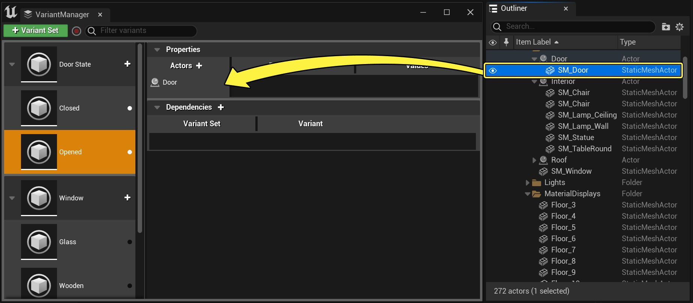
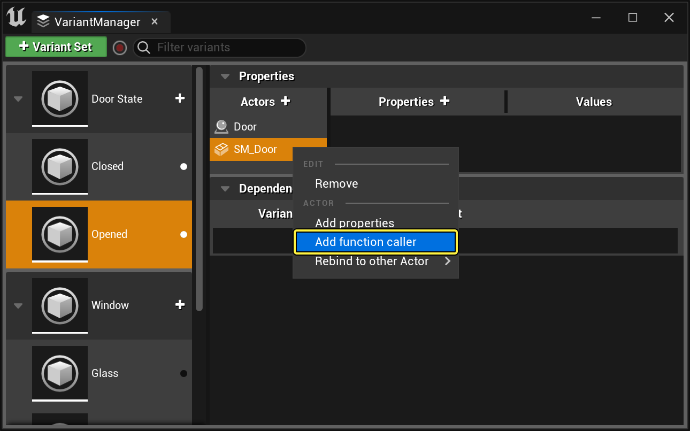
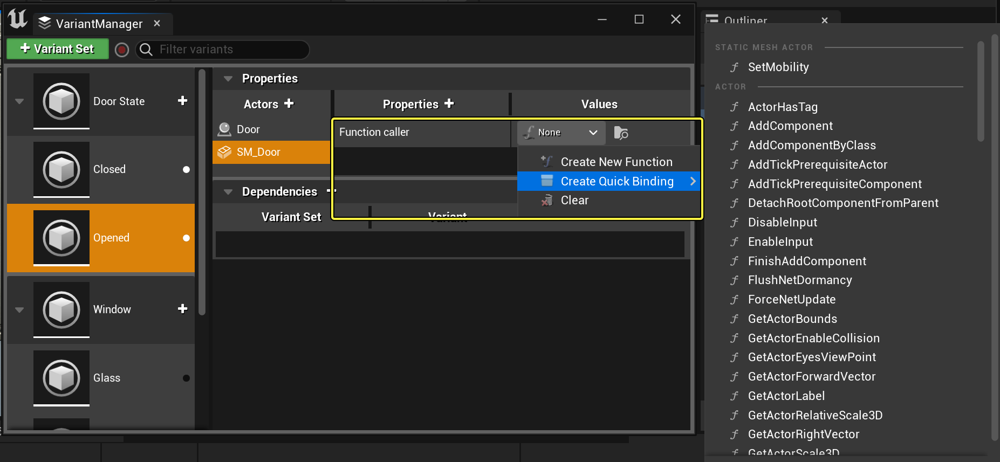
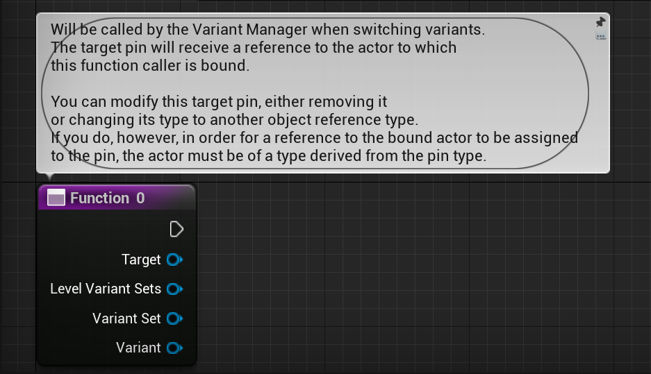
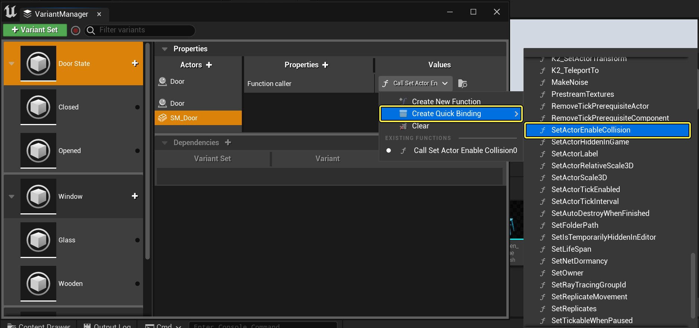
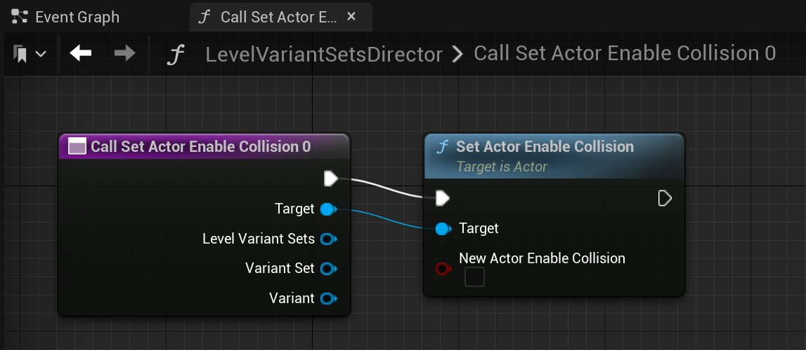

# 变体激活时调用函数

> 路径：虚幻引擎5.7文档 / 管理内容 / 使用场景变体 / 变体激活时调用函数

> 原始页面：https://dev.epicgames.com/documentation/unreal-engine/calling-functions-on-variant-activation

将Actor绑定到变体时，变体管理器会提示你设置在激活当前变体时要更改的Actor属性。你还可指定需要变体管理器在该Actor上调用的一个或多个函数，作为修改绑定Actor属性值的补充或替代。

你可以让变体管理器调用任何函数，只要该函数在绑定的Actor上已被公开。你还可以自行创建全新蓝图函数，将绑定Actor作为输入参数。此两种方法在下文中都会介绍。

## 步骤

要在激活变体时调用蓝图函数，请执行以下操作：

1. 在 **内容浏览器** 中双击 **关卡变体集（Level Variant Sets）** 资产，将其在变体管理器UI中打开。

   

   点击查看大图。
2. 选择要在变体管理器UI左列中设置的变体。

   

   点击查看大图。
3. 若尚未将需要调用函数的Actor绑定到变体，将其从 **世界大纲视图（World Outliner）** 面板拖动至变体管理器的 **Actor** 列中。

   

   点击查看大图。

   变体管理器提示选择要采集的属性时，可保留所有属性全不选。点击 **选择（Select）** 继续。
4. 右键点击变量上绑定Actor列表中的Actor，从快捷菜单中选择 **添加函数调用方（Add function caller）**。

   

   点击查看大图。
5. 找到 **属性（Properties）** 列底部的 **函数调用方（Function caller）** 项目，使用 **值（Values）** 列中的下拉列表选择要调用的函数。

   

   点击查看大图。

   选择 **新建函数（Create New Function）** 创建全新蓝图函数。若Actor已设置了要调用的函数，则从 **创建快速绑定（Create Quick Binding）** 列表选择现有函数。
6. 变体管理器将打开一个特殊蓝图类以供编辑，其名为 **LevelVariantSetDirector**。此蓝图由关卡变体集资产所拥有。其职责是在响应被激活变体时存储需要运行的所有逻辑。

   变体管理器在 **LevelVariantSetDirector** 蓝图中自动新建函数。激活变体时，变体管理器将自动调用此函数。如需进一步自定义激活变体时触发的蓝图逻辑，可在此图表中进行。

   若选择在上一步中新建函数，将获得拥有默认名称的新空白函数。可使用需执行的任意蓝图逻辑来填写此函数。

   

   点击查看大图。

   变体管理器会把一些信息传递给你的新函数，对你编辑蓝图图表可能会有所帮助：

   | 参数 | 说明 |
   | --- | --- |
   | **目标（Target）** | 对上一步中 **函数调用方（Function Caller）** 设置的绑定Actor的引用。 |
   | **关卡变体集（Level Variant Sets）** | 对 **LevelVariantSetDirector** 蓝图所控制的关卡变体集的引用。你可以用它来获取你为同一资产配置的所有其他变体和变体集。 |
   | **变体集（Variant Set）** | 对包含当前变体（即刚被激活的变体）的变体集的引用。 |
   | **变体（Variant）** | 对刚被激活的变体的引用：即你使用函数调用方设置的包含绑定Actor的变体。 |

   若选择创建Actor公开的现有函数的快速绑定，变体管理器自动向该函数添加调用，并将该调用关联到在 **LevelVariantSetDirector** 蓝图中新建的函数。若该Actor上调用的函数需要任何其他输入值，如下图的 **新Actor启用碰撞（New Actor Enable Collision）** 选项，可在此图表中对其进行设置。

   

   点击查看大图。

   

   点击查看大图。

   > [!NOTE]
   > 默认情况下，只有变体在运行时被激活之时，变体管理器才会调用函数。如果需要在编辑器中开启变体情况下同时运行函数，则在 **LevelVariantSetDirector** 蓝图中选择函数节点，并在 **细节（Details）** 面板中启用 **在编辑器中调用（Call in Editor）** 设置。
   >
   > > 图片已省略：Call in Editor setting
   >
   > 点击查看大图。
7. 在 **LevelVariantSetDirector** 蓝图中设置新函数或快速绑定后，**编译（Compile）** 并 **保存（Save）** 蓝图。然后即可关闭蓝图编辑器和变体管理器窗口。

## 最终结果

激活通过运行时函数调用方设置的变体时，变体管理器将自动调用 **LevelVariantSetDirector** 蓝图中定义的函数。

若已对 **LevelVariantSetDirector** 蓝图中的函数启用 **在编辑器中调用（Call in Editor）** 选项，当在虚幻编辑器中激活该变体时，变体管理器还将自动调用该函数。

> [!TIP]
> 如需在激活变体时对绑定Actor调用多个函数，可向该Actor添加多个函数调用方。
