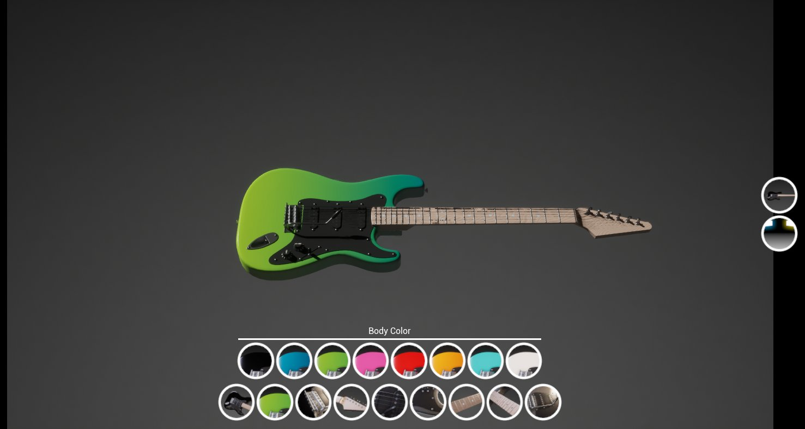
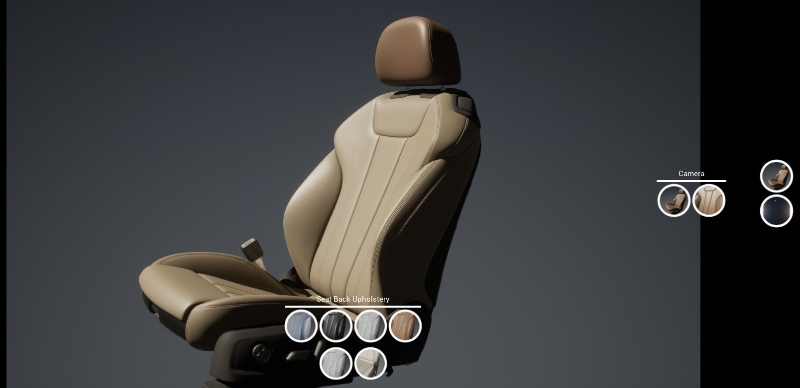
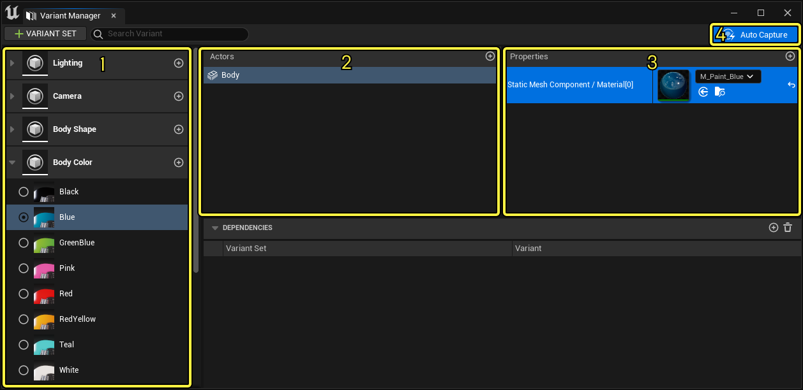
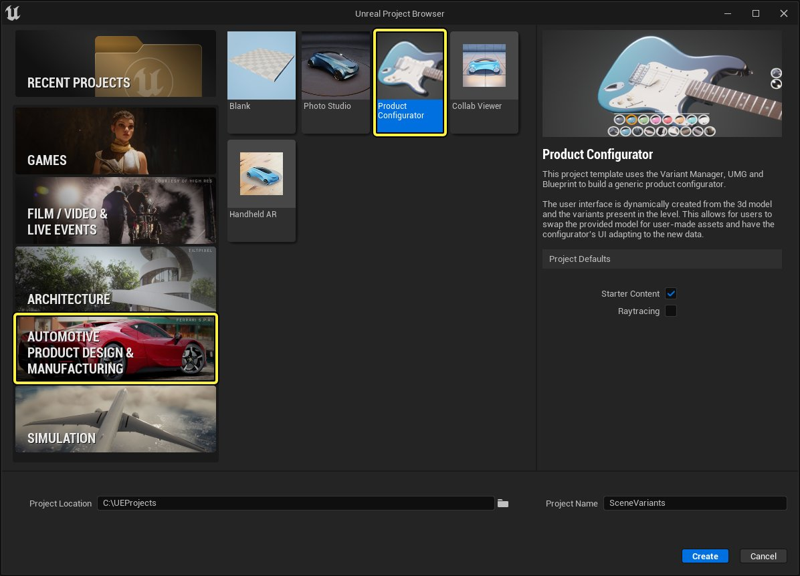
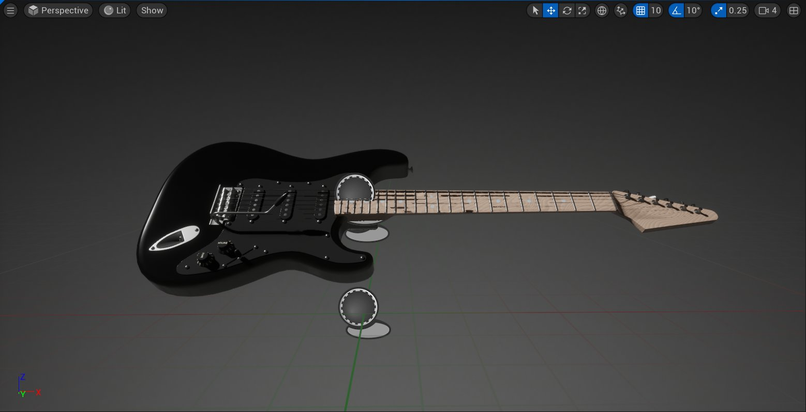
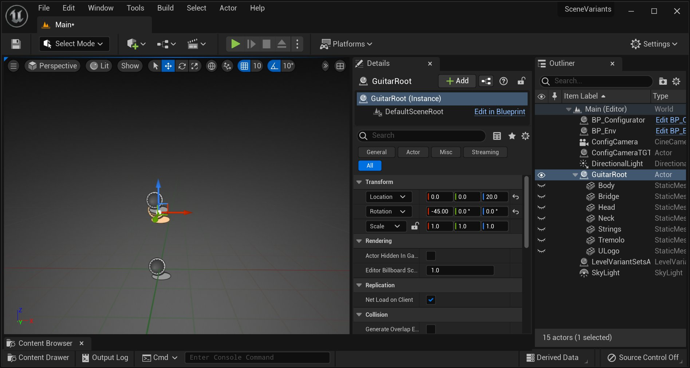
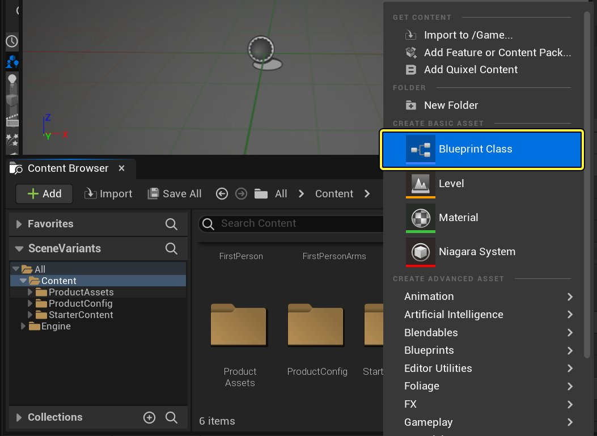
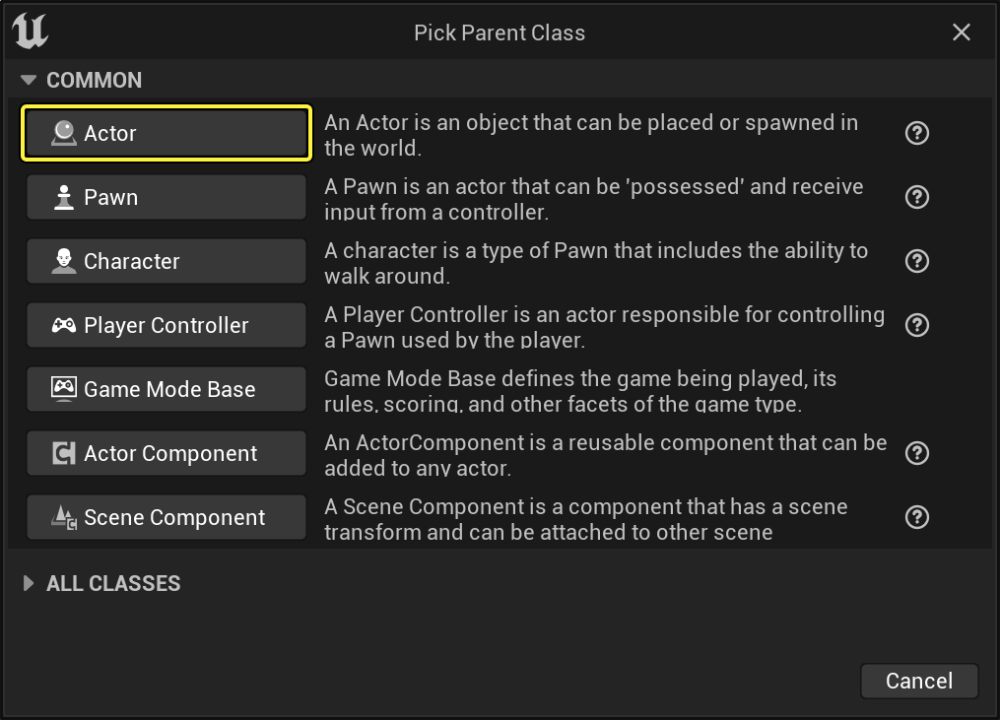

# 产品配置器

> 路径：虚幻引擎5.7文档 / 管理内容 / 使用场景变体 / 产品配置器

> 原始页面：https://dev.epicgames.com/documentation/unreal-engine/product-configurator-template-in-unreal-engine

**虚幻引擎5（UE5）** 中的 **产品配置器（Product Configurator）** 模板能为3D可视化美术师提供一个现成的起点，可用于创建拥有自定义功能的产品配置器和用户界面。该模板用到了关卡变体集（Level Variant Set）、自定义UMG界面元素、以及一个拥有下列功能的专用配置蓝图：

- 具备Actor切换的几何体变体。
- 材质和可视性选项。
- 摄像机位置与设置变体。
- 光照和环境变体。
- 过程生成界面，为用户提供选项。
- 无需使用蓝图代码即可添加新变体的功能。

## 概述

你可以使用 **变体管理器（Variant Manager）** 在 **关卡变体集（LevelVariantSet）** Actor中定义 **Actor变体** 和 **变体集（Variant Sets）** 。然后信息将传递到 **BP_Configurator** 蓝图；蓝图使用该信息动态创建用户界面，并显示所有变体选项，以及用户定义的缩略图：

点击查看大图。

### 控制模板

| **控件** | **说明** |
| --- | --- |
| **Alt + LMB** | 围绕产品旋转摄像机。 |
| **Alt + RMB** | 放大/缩小 |
| **G** | 隐藏/显示界面 |
| **退出键（Escape）** | 退出配置器 |

## 模板功能

该模板使用变体管理器，这是一个专门的UI面板，用于整理关卡中Actor的不同属性配置，并将其存储在LevelVariantSet Actor中。

点击查看大图。

| **数量** | **说明** |
| --- | --- |
| **1** | 变体 |
| **2** | Actor |
| **3** | 属性 |
| **4** | 启用自动采集属性 |

变体（Variants）列包含整理为变体集的所有Actor配置（称为变体）。每个变体代表配置器中的一个选项，并且可以包含一个或多个带有各种属性更改的Actor。这些由用户设置的缩略图图像表示。运行时所有变体都将通过BP_Configurator转换为界面中的按钮。

> [!NOTE]
> 有关使用变体管理器的更多信息，请参阅[变体管理器](https://dev.epicgames.com/documentation/unreal-engine/variant-manager-template-overview)文档。

### 使用BP_Configurator

BP_Configurator蓝图从指定的关卡变体集中接收数据，并为配置器动态创建用户界面：

1. BP_Configurator从指定的关卡变体集中接收数据。
2. 每个变体集都会转换为主UI工具栏上的图标。
3. 每个变体成为变体集子菜单中的选项。
4. 变体通过变体管理器中设置的缩略图直观展示。
5. 变体集由当前活动变体的图标表示。

## 如何导入你的数据

自定义产品配置器模板从导入你的3D作品和纹理开始。虚幻引擎5支持使用[Datasmith](../../datasmith/datasmith-plugins-overview/index.md)以及[FBX内容通道](../../fbx-content-pipeline/index.md)，从你喜欢的3D应用程序（例如Maya、3ds Max和Blender）中导入。

将3D和2D资产导入内容浏览器后，你将需要从关卡中删除吉他示例，并使用变体管理器构建变体和变体集。最后一步是将关卡变体集连接到BP_Configurator，以便在运行时创建自定义用户界面。

### 将你的作品添加到主关卡

将你的资产导入到UE5并在内容浏览器中进行设置时，将需要删除吉他示例，并将新作品添加到该关卡中：

点击查看大图。

点击查看大图。

产品配置器使用一个或多个根Actor为你的静态网格体提供标准布局：

点击查看大图。

要删除示例模型，请删除GuitarRoot对象及其所有子对象。

接下来，将一个新的空Actor放入关卡中，以用作新的根对象。将其位置居于关卡原点（X=0，Y=0，Z=0）：

点击查看大图。

点击查看大图。

> 图片已省略：Empty Scene Object

点击查看大图。

这样会将你的产品置于现有摄像机设置的前面。

现在，将产品的各个部分作为根对象的子级放置在关卡中：

> 图片已省略：Car Seat Blueprint

点击查看大图。

### 在变体管理器中创建变体

在关卡中设置了作品之后，你可以开始使用LevelVariantSet Actor和变体管理器创建变体和变体集。

> [!WARNING]
> 为了使BP_Configurator创建的动态UI能够正常运行，第一个和第二个变体集 **必须** 是环境（Environment）和摄像机。

在内容浏览器中点击右键，导航到"杂项"（Miscellaneous）子菜单，并选择"关卡变体集"（Level Variant Sets）选项，创建"关卡变体集Actor"（LevelVariantSet Actor）：

> 图片已省略：Level Variant Set

点击查看大图。

> 图片已省略：Level Variant Set

点击查看大图。

> 图片已省略：Drag the Level Variant Set to the Viewport

点击查看大图。

给它指定唯一名称，然后双击打开变体管理器。

从创建自定义变体集开始。点击 **+变体集** 按钮，命名新变体集：

> 图片已省略：Variant Set

点击查看大图。

创建变体集后，点击其名称旁边的 **+** 按钮，创建变体。这代表当用户选择此预设时你要更改的Actor和属性：

> 图片已省略：Adding Variant

点击查看大图。

点击新变体，高亮显示它，然后点击Actors列中的 "+" 按钮。这将打开一个新窗口并列出你场景中的所有Actor。选择当用户选择此变体时你要更改的Actor。对将成为此预设一部分的每个Actor重复该过程：

> 图片已省略：Adding Actors

点击查看大图。

接下来，高亮显示你要使用的Actor，然后点击属性（Properties）列中的 **+** 按钮。这将创建一个新窗口，其中列出了Actor的所有属性，这些属性可以作为变体的一部分进行更改。勾选每个属性的复选框（它们会在变体选中后更改）：

> 图片已省略：Adding Properties

点击查看大图。

该列表包括默认属性和任何用户定义属性。在上述示例中，已选择环境地图（Env Map）属性。更改此属性将允许你在运行时更改产品配置器中的环境。

最后一步是设置属性值。有两种操作方法：第一种是使用值（Values）列手动设置值：

> 图片已省略：Setting Property

点击查看大图。

你还可以使用关卡中设置的值设置属性，方法是右键点击属性，然后从上下文菜单选择 **记录当前值（Record current value）** ，记录你的变体的当前值。

或者，按下 **自动捕捉（Auto Capture）** 按钮，启用自动采集属性。激活后，此选项会告知变体管理器在关卡中侦听对Actor所做的更改，并将其记录在选定的变体中。若修改的Actor还未绑定到所选变体，它会自动绑定。

变体集中的每个变体都需要缩略图。这些缩略图在用户界面中用作按钮图标，并且可以是导入到引擎或从UE4视口捕获的纹理图像。右键点击变体，打开菜单：

> 图片已省略：Thumbnail Viewport

点击查看大图。

对所有变体和变体集重复此过程。

## 连接到BP_Configurator

要完成自定义模板的过程，需要将关卡变体集连接到BP_Configurator。首先从关卡中删除现有的LevelVariantSet Actor，并将其替换为你自己的Actor。Actor必须在关卡中才能对BP_Configurator可见：

> 图片已省略：Setting Up Config

点击查看大图。

在细节（Details）面板中，在菜单的默认分段找到LVSActor选项，然后使用下拉菜单将设置更改为关卡变体集。

最后，测试你的配置器：

> 图片已省略：Car Seat Blueprint on the Viewport

点击查看大图。

> 图片已省略：Press Play button

点击查看大图。

> 图片已省略：Final

点击查看大图。
