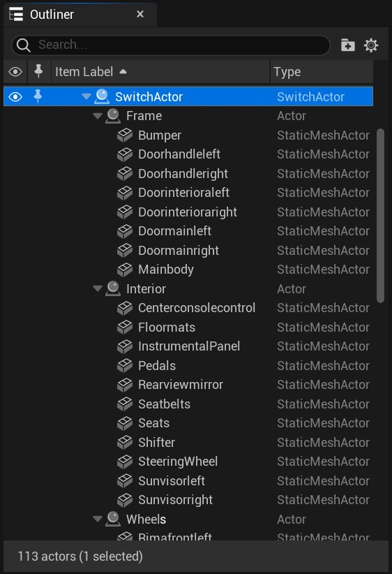
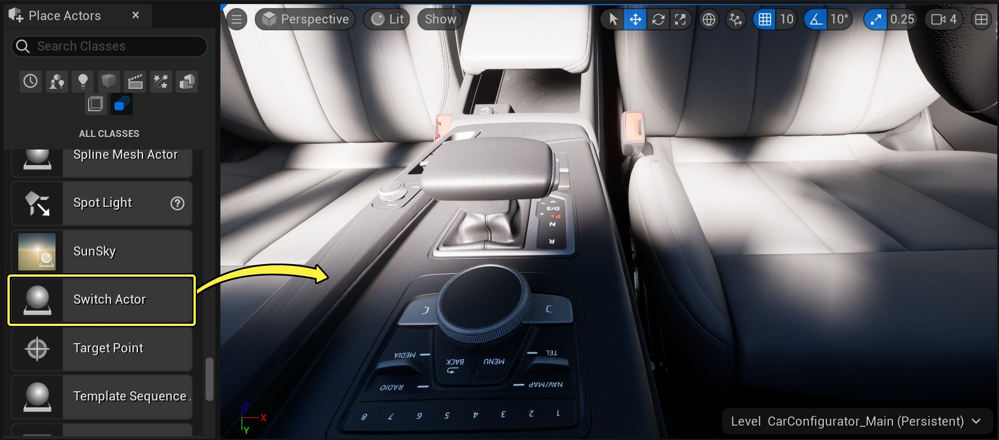
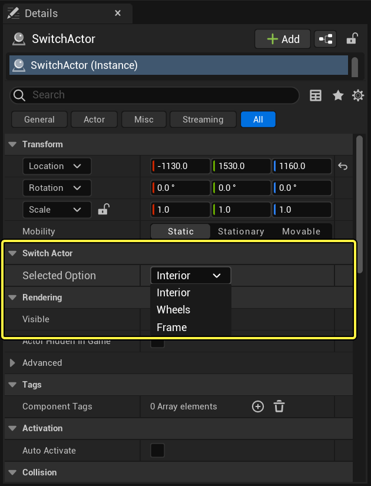
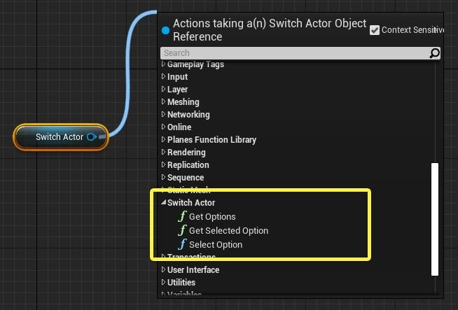
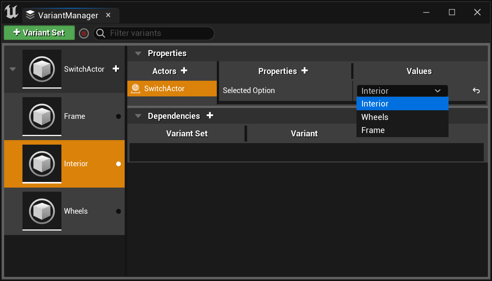

# 使用Switch Actor

> 路径：虚幻引擎5.7文档 / 管理内容 / 使用场景变体 / 使用Switch Actor

> 原始页面：https://dev.epicgames.com/documentation/unreal-engine/using-the-switch-actor-within-scene-variants

切换Actor提供一种切换Actor可见性或关卡中Actor整个层级的便捷方法。

固定仅显示切换Actor的一个子项。选择需要显示的子Actor时，切换Actor会自动隐藏所有其他子Actor及其所有后代。然后将显示选定的一个子Actor及其所有后代。

拥有互斥的关卡Actor或Actor层级，且在给定时间仅显示其中一个Actor或层级时，此方法最便捷。例如，车辆配置器可能提供多种不同饰件，每种饰件由拥有不同几何体的不同静态网格体Actor集代表，如下所示：

Click image for full size.

要将车辆的可视模型在各饰件选项间切换，需显示和隐藏多个Actor。可使用蓝图、变量管理器、甚至在虚幻编辑器中手动完成此操作。但同时更改数十甚至数百不同Actor的可见性将十分较麻烦。若将切换Actor作为所有不同饰件选项的父项，通过在该父项上设置单个选项，可轻松在不同饰件间切换。

> [!NOTE]
> 切换Actor包含在 **编辑器（Editor）> 变体管理器内容（Variant Manager Content）** 插件中。通常默认启用此插件。若 **模式（Modes）** 面板中未显示该切换Actor，则需要启用项目的此插件。

## 将切换Actor添加到关卡

**切换Actor（Switch Actor）** 位于 **放置Acotr（Place Actors）** 面板的 **所有类（All Classes）** 选项卡中 。将它从 **放置Acotr（Place Actors）** 面板拖入关卡视口中。

Click image for full size.

## 选择要显示的子Actor

以下章节将介绍选择显示切换Actor子项的不同犯法。

### 虚幻编辑器中

在 **世界大纲视图（World Outliner）** 中选择切换Actor。在 **细节（Details）** 面板中，找到 **切换Actor > 选定选项（Selected Option）** 设置。此下拉列表将列出以切换Actor为父项的所有子Actor命名。

Click image for full size.

选择要显示的选项。

### 蓝图中

切换Actor提供可用于处理其选定子项的蓝图API。若从蓝图图表中切换Actor的引用直接拖动，此类节点将在 **切换Actor** 类别下列出：

Click image for full size.

| 节点 | 命名 | 说明 |
| --- | --- | --- |
| 获取选项 | **获取选项（Get Options）** | 返回当前以该切换Actor为父项的所有子Actor的引用阵列。 |
| 获取选定选项 | **获取选定选项（Selected Option）** | 返回当前显示的子Actor的索引。 |
| 选择选项 | **选择选项（Select Option）** | 变更切换Actor以使用指定索引选择子项。 |

> [!NOTE]
> **Get Options** 返回阵列的顺序与 **世界大纲视图（World Outliner）** 或该切换Actor **细节（Details）** 面板中显示的子Actor顺序不固定相同。此外，**获取选定选项（Selected Option）** 返回的索引数和调用 **选择选项（Select Option）** 时指定的索引数均可识别此数组中的元素。

### 变体管理器中

将切换Actor绑定至变体管理器中的变体时，会采集其 **选定选项（Selected Option）** 属性。**值** 列将显示下拉列表，列出以该切换Actor为父项的所有子Actor的命名。

点击查看大图。

选择开启此变体时要显示的选项。
