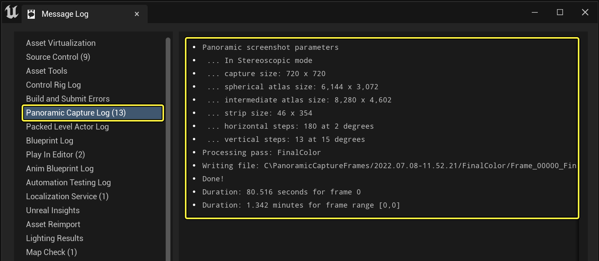
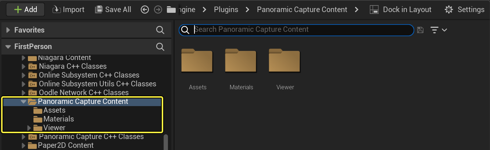
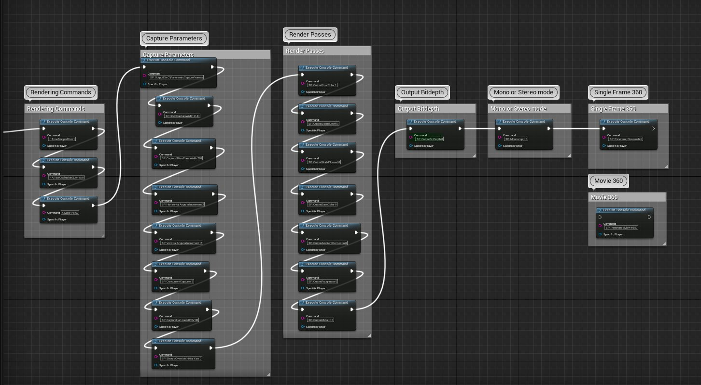
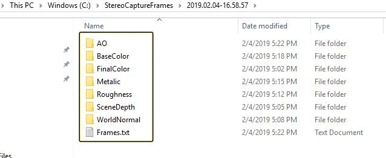

# 全景采集参考

> 路径：虚幻引擎5.7文档 / 使用媒体 / 媒体捕获 / 全景采集工具 / 全景采集参考

> 原始页面：https://dev.epicgames.com/documentation/unreal-engine/panoramic-capture-reference-for-unreal-engine

> [!WARNING]
> Epic Games不再支持或维护全景采集插件。它只在你希望自行创建解决方案时作为参考存在。该插件可能无法正常工作。

## 消息日志

新版本中，所有日志信息均显示在 **消息日志（Message Log）** 下的 **全景采集日志（Panoramic Capture Log）** 中。 如发生错误，**消息日志（Message Log）** 将自动打开。

## 插件内容

- 资源

  ：包含一个蓝图，其设置所有参数进行6K精度的采集。
- 材质

  ：包含后期效果，用于采集不同的渲染通道。
- 查看器

  ：包含查看立体静帧和视频的蓝图。

> [!NOTE]
> **内容侧滑菜单** 不会默认显示插件内容。选择 **设置（Settings）** ，然后启用 **显示引擎内容（Show Engine Content）** 和 **显示插件内容（Show Plugin Content）** 即可显示插件内容。

## BP_Capture

在 **全景采集内容（PanoramicCapture Content） > 资源（Assets）** 下方可以找到 **BP_Capture**。这个蓝图将设置所有必要参数进行6K精度的采集。如果在默认配置中使用该蓝图，其将输出一帧立体图像。

输出路径默认为 **C:\PanoramicCaptureFrames**，但可以配置。以下是输出所有通道时输出路径的实例。

以下部分将详细说明全景采集插件拥有的选项和控制，以及这些选项对输出图像进行的操作。选项已基于其作用进行分组。输入命令的方法是按下反引号或波浪符（**`**）键打开UE4控制台并输入 **SP.**，并在后面添加需要输入的命令。

> [!NOTE]
> 如需了解以下设置的详情，可查看 **StereoPanoramaManager.cpp** 文件。

## 渲染通道

- 环境光遮蔽
- 底色
- 金属感
- 粗糙度
- 场景深度（固定为32位）
- 场景法线

## 切片控制

切片控制（Slice Control）选项用于控制为每个图像采集的水平和垂直切片数量。

| 属性 | 默认值 | 描述 |
| --- | --- | --- |
| **SP.HorizontalAngularIncrement** | 1.0f | 每个水平阶梯的度数。必须是 380 的因子。 |
| **SP.VerticalAngularIncrement** | 90.0f | 每个垂直阶梯的度数。必须是 180 的因子。 |
| **SP.CaptureHorizontalFOV** | 90.0f | 场景采集组件的水平视场。必须大于 SP.HorizontalAngularIncrement。 |
| **SP.EyeSeparation** | 6.4f | 立体摄像机的分隔。 |

## 图谱控制

图谱控制实际控制从切片收集的镜头图谱，用于重构 360 度图像。

| 属性 | 默认值 | 描述 |
| --- | --- | --- |
| **SP.StepCaptureWidth** | 4096 | 最终的球形图谱宽度。 |
| **SP.ForceAlpha** | false | 将透明度值强行设为完全不透明。 |

## 采样控制

采样控制（Sampling Control）选项影响图像的过滤方式。

| 属性 | 默认值 | 描述 |
| --- | --- | --- |
| **SP.CaptureSlicePixelWidth** | 2048 | 采集切片像素大小。 |
| **SP.EnableBilerp** | true | 0 - 无过滤、1- 双线性过滤切片样本。 |
| **SP.SuperSamplingMethod** | 1 | 0 - 无超级采样、1 - 旋转网格超级采样。 |

## 调试控制

调试控制（Debug Control）选项可查看并调整图像的采集方式，便于追踪最终输出图像中可能出现的问题。

| 属性 | 默认值 | 描述 |
| --- | --- | --- |
| **SP.ConcurrentCaptures** | 30 | 同时进行采集的场景采集数量。提高或降低 **SP.ConcurrentCaptures** 的值会对采集时间造成极大影响。如果该值设置过低，就无法采集到并行处理的理想场景采集数量。如果该值设置过高，GPU将无法负荷。 |
| **SP.GenerateDebugImages** | 0 | 0 - 无调试图像。1 - 生成时保存每个条带。2 - 保存每个完整切片。 |
| **SP.OutputDir** | 这默认为项目保存的文件夹 | 保存图像的路径。 |
| **SP.ShouldOverrideInitialYaw** | true | 覆盖初始的摄像机摇摆。如不希望使用 PlayerController 取景方向，则设为 true。 |
| **SP.ForcedInitialYaw** | 90.0f | 摄像机初始取景方向的摇摆值。将 ShouldOverrideInitialYaw 设为 true 来使用此值。 |
| **SP.FadeStereoToZeroAtSides** | true | 以 90 度将左右眼之间的立体效果淡出至零。 |

> [!NOTE]
> 请注意：升高或降低 **SP.ConcurrentCaptures** 的值会对采集时间产生较大影响。将此值设置过低则无法使用平行处理的最佳数字。设置过高则会使 GPU 负载过重。

## 输出

用户可以通过这些值来控制位深度和不同的渲染通道。

| 属性 | 默认值 | 可选值 | 描述 |
| --- | --- | --- | --- |
| **SP.OutputBitDepth** | 8 | 32 | 设置输出深度。全景采集支持8位（.png）和32位（.exr）格式。 |
| **SP.OutputFinalColor** | 0 | 1 | 启用最终颜色渲染通道。 |
| **SP.OutputBaseColor** | 0 | 1 | 启用底色渲染通道。 |
| **SP.OutputSceneDepth** | 0 | 1 | 启用场景深度渲染通道。场景深度始终为32位。 |
| **SP.OutputWorldNormal** | 0 | 1 | 启用场景法线渲染通道。 |
| **SP.OutputAmbientOcclusion** | 0 | 1 | 移动环境光遮蔽渲染通道。 |
| **SP.OutputMetallic** | 0 | 1 | 启用金属感渲染通道。 |

## 单视场

可以使用此值来指定输出为单视场或立体。默认为立体输出。

| 属性 | 默认值 | 可选值 | 描述 |
| --- | --- | --- | --- |
| **SP.Monoscopic** | 0 | 1 | 此值可将输出设置为单视场。默认为立体输出。 |
