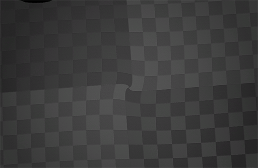
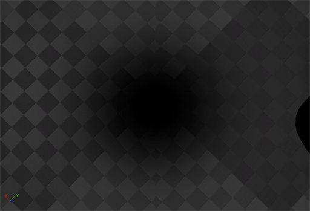
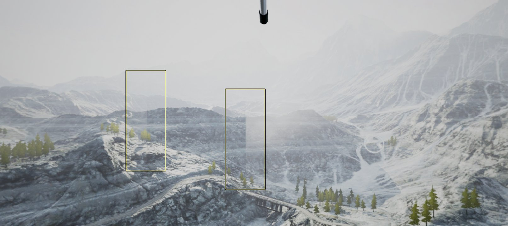

# 全景采集提示和技巧

> 路径：虚幻引擎5.7文档 / 使用媒体 / 媒体捕获 / 全景采集工具 / 全景采集提示和技巧

> 原始页面：https://dev.epicgames.com/documentation/unreal-engine/panoramic-capture-tips-and-tricks-for-unreal-engine

> [!WARNING]
> Epic Games不再支持或维护全景采集插件。它只在你希望自行创建解决方案时作为参考存在。该插件可能无法正常工作。

在以下部分中，我们将了解使用全景采集插件时最常见的错误和问题，以及解决和回避方法。

## 采集速度缓慢

立体图像的默认采集分辨率为6K，这需要消耗大量的资源。为了减少图像采集对资源的影响，可以降低为 **SP.StepCaptureWidth** 指定的值，以减少图像采集的大小。这只需在 **BP_Capture** 蓝图中将 **SP.StepCaptureWidth** 的值从6144（6k）改为1024（1K）即可。

## 图像失真

因为立体图像创建的方式，图像的顶部和底部会出现一些失真/挤压。可在下图中看到这种失真/挤压的范例。

点击查看全图。

虽然无法消除失真，但可执行一些操作使其降至最低。以下的数个技巧可处理这个失真/挤压问题。

- 可如下图所示添加一个小的梯度，使图像底部和/或顶部淡出为黑色，隐藏失真/挤压问题。

  

  点击查看全图。
- 要小心过于靠近摄像机的对象，它会导致发散，使用户难以聚焦于 3D 图像。虽然在一些情况下图像发散无法避免，但可以通过摄像机的放置来减轻此效果。以下视频说明了如何在图像中拥有不同程度的发散。

  因为滑翔机顶部十分靠近进行采集的摄像机，用户上抬摄像机时将难以使图像上部处于焦距之中。然而下垂摄像机时则不会存在焦距的问题，因为地面离摄像机足够远，不存在发散的问题。

## 无法使用的部分效果

在屏幕空间中创建的效果，或正对摄像机的效果无法和全景采集工具共用。这意味着应该禁用以下类型的效果，使图像中不会出现错误。

- 光束
- 基于屏幕的失真效果
- 正对摄像机的网格体或粒子
- 晕光

> [!NOTE]
> 请注意：未列于此处的其他效果也可能无法采集。如出现相似的穿帮，将尝试禁用效果并重新采集图像，确认穿帮是否消失。

下图说明尝试采集拥有基于屏幕效果的内容或正对摄像机的内容时会出现的情况。查看图像中标出的区域，您会发现远处的云中出现了硬线条。采集工具进行场景采集的方式是在水平和垂直轴上对图像进行一系列的聚焦，这是出现此线的原因。正对摄像机的效果并不知晓摄像机已经移动，也不会随之更新朝向，因此图像中才会出现穿帮。

点击查看全图。
