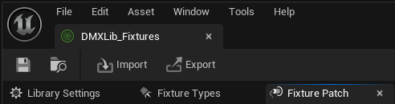
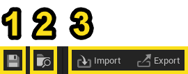
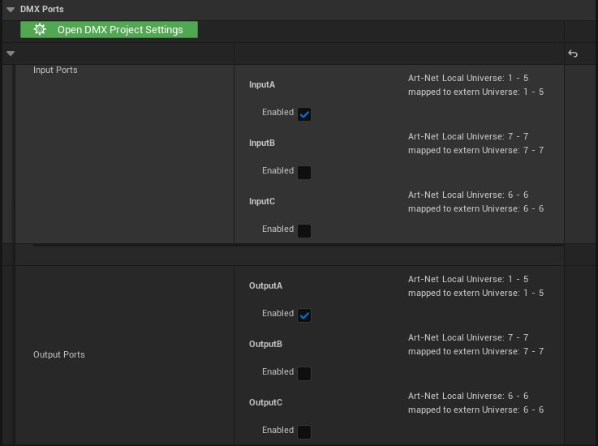
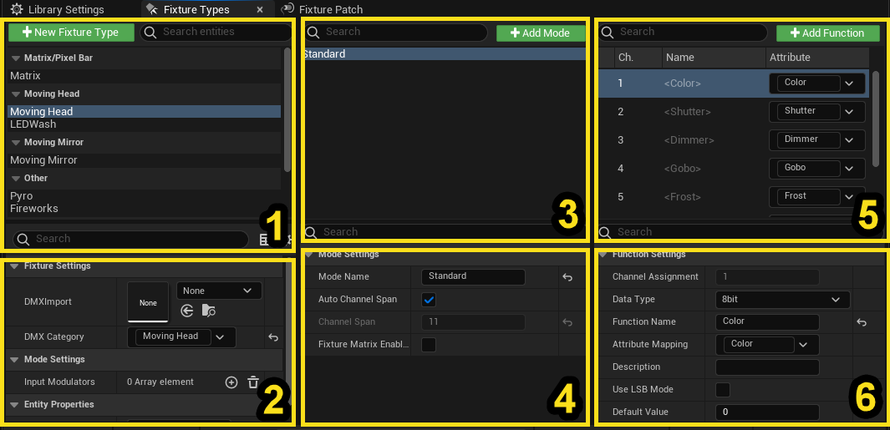
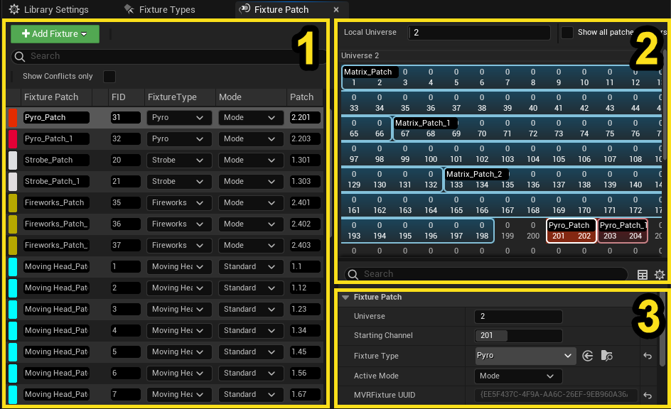
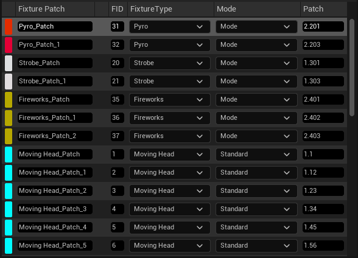
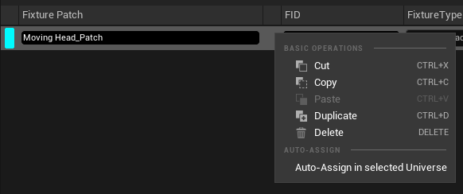
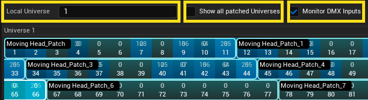

# DMX库参考文档

> 路径：虚幻引擎5.7文档 / 使用媒体 / 与媒体组件通信 / DMX / 创建DMX库和配接 / DMX库参考文档

> 原始页面：https://dev.epicgames.com/documentation/unreal-engine/dmx-library-reference-in-unreal-engine

> [!NOTE]
> 要使用DMX库资产，必须先[启用DMX插件](https://dev.epicgames.com/documentation/404)。

DMX库资产是DMX插件的主要数据结构，包含以下信息：

- 控制器
- 灯具类型
- 灯具配接

浏览资产创建菜单时，可在 **DMX** > **DMX库（DMX Library）** 下找到DMX库资产。

从内容侧滑菜单打开DMX库时，弹出的窗口会带有一个导航栏和三个选项卡，具体为："库设置（Library Settings）"选项卡、"灯具类型（Fixture Types）"选项卡和"灯具配接（Fixture Patch）"选项卡。

## 导航栏

**导航栏** 上有用于保存、浏览资产以及导入和导出MVR文件的功能按钮。

| 编号 | 名称 | 说明 |
| --- | --- | --- |
| 1 | **保存** | 保存对DMX库所做的更改。 |
| 2 | **浏览** | 打开 **内容浏览器（Content Browser）** 并选择DMX库资产。 |
| 3 | **导入（Import）** 和 **导出（Export）** | 这些按钮具有以下功能： **导入（Import）** ：从MVR文件导入DMX库。 **导出（Export）** ：将DMX库导出为MVR文件。 |

## 库设置

你可以在库的设置中启用或禁用输入和输出端口。要更新其他DMX端口的设置，请选择 **打开DMX项目设置（Open DMX Project Settings）** 。

## 灯具类型

在灯具类型（Fixture Types）选项卡中，你可以创建并更新灯具类型，包括灯具的模式和函数。

| 编号 | 名称 | 说明 |
| --- | --- | --- |
| 1 | **灯具类型** 列表 | 用于创建和整理灯具类型的列表。 |
| 2 | **灯具设置** | 灯具的设置项以及以GDTF形式导入的灯具数据。 |
| 3 | **模式** 列表 | 用于创建和整理模式的列表。 |
| 4 | **模式设置* | 所选模式的属性和设置项。 |
| 5 | **函数** 列表 | 属性和函数的列表。 |
| 6 | **函数设置** | 所选函数的协议设置，如位深度和信道分配等。 |

## 灯具配接

灯具配接（Fixture Patch）选项卡分为以下几个区域：

| 编号 | 名称 | 说明 |
| --- | --- | --- |
| 1 | **灯具列表** | 所有灯具配接的列表。 |
| 2 | **配接器工具** | 每个域中配接位置的可视化表示。 |
| 3 | **灯具配接** 面板 | 所选灯具配接的细节。 |

### 灯具列表

灯具列表分为如下竖列：

- 灯具配接（Fixture Patch）

  ：配接的名称。
- FID

  ：灯具的ID。每个灯具都应使用独有的FID。
- 灯具类型（Fixture Type）

  ：配接所基于的灯具类型。
- 模式（Mode）

  ：配接所用灯具类型的模式。
- 配接（Patch）

  : 配接的域和首个信道。（例如，2.1 * 表示域2、信道1。）

灯具列表（Fixture List）上下文菜单的选项如下。

| 列 1 | 列 2 |
| --- | --- |
| 操作 | 说明 |
| **剪切（Cut）** | 剪切所选配接。 |
| **复制（Copy）** | 复制所选配接。 |
| **粘贴（Paste）** | 从选定的域开始，将剪切或复制的配接粘贴到首个空闲信道。 |
| **再制（Duplicate）** | 从选定的域开始，在首个空闲信道中创建所选配接的副本。 |
| **在选定域自动分配（Auto-assign in selected universe）** | 从选定的域开始，将所选的配接分配到首个空闲信道。 |

### 配接窗口

配接窗口（Patch Window）包含的选项如下。

- 本地域（Local Universe）

  ：目前选中的域。
- 显示域中的所有配接（Show all patches in Universes）

  ：启用此选项后，配接器将显示库中的所有配接，而不是只显示选定的配接。
- 监视DMX输入（Monitor DMX inputs）

  : 启用此选项后，配接器将监视输入的DMX。

配接窗口（Patch Window）上下文菜单的选项如下。

> 图片已省略：配接窗口的上下文菜单。

| 列 1 | 列 2 |
| --- | --- |
| 操作 | 说明 |
| **在选定域自动分配（Auto-assign in selected universe）** | 从选定的域开始，将配接分配到首个空闲信道。 |
| **自动分配至[域信道]（Auto-assign at [Universe.Channel]）** | 从右键选定的域开始，将配接分配至首个空闲信道。 |
| **分配至[域信道]（Assign at [Universe.Channel]）** | 将配接分配到右键选定的信道，不论该信道范围是否已被占用。 |
| **对齐（Align）** （限多选） | 逐个对齐所有选中的配接。 |
| **堆叠（Stack）** （限多选） | 将所有选中的配接堆叠在一起。 |
| **分布至域（Spread over Universes）** （限多选） | 将所有配接放入其各自的域。 |
