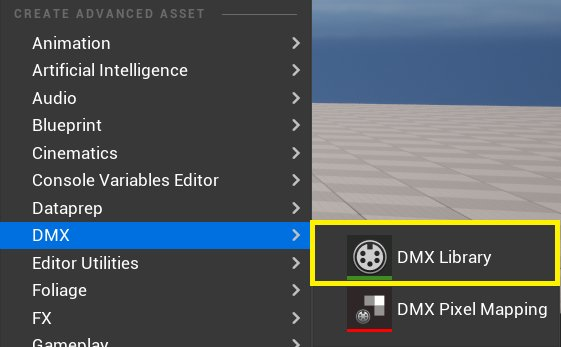
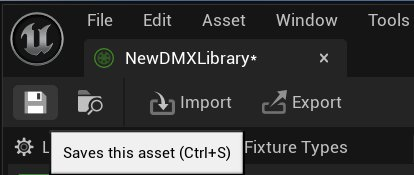
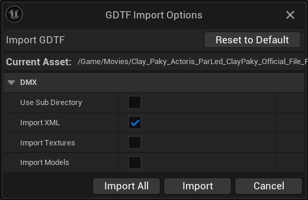
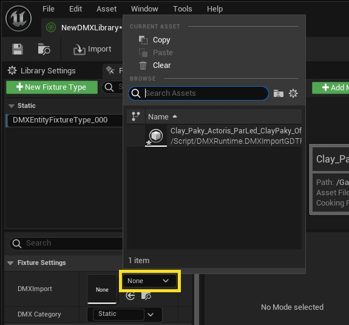
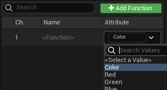
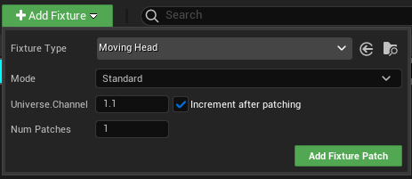
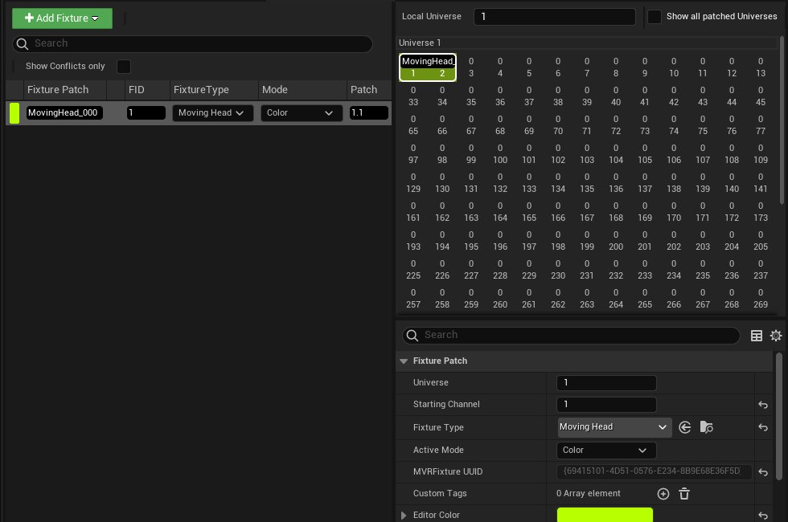
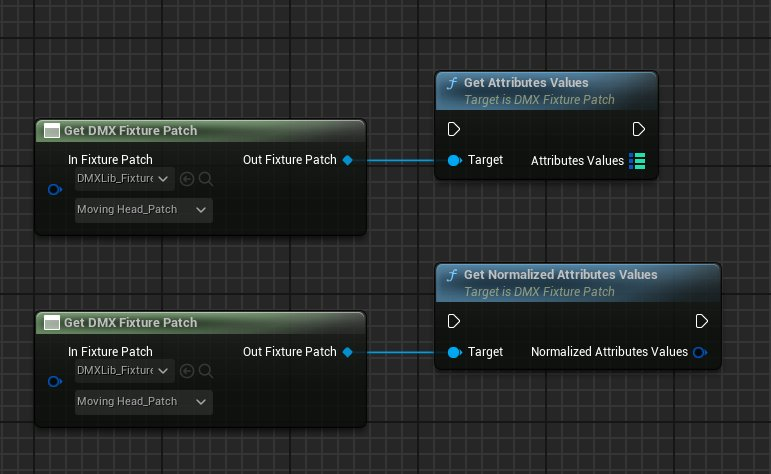

# 创建DMX库和配接

> 路径：虚幻引擎5.7文档 / 使用媒体 / 与媒体组件通信 / DMX / 创建DMX库和配接

> 原始页面：https://dev.epicgames.com/documentation/unreal-engine/create-a-dmx-library-and-add-fixture-patches-in-unreal-engine

DMX库资产是主要的DMX插件数据结构体，其中包含有关以下项目的信息：

- 控制器
- 灯具类型
- 灯具配接

本指南展示了如何创建DMC（数字复接）库并添加灯具配接，让你在虚幻引擎中发送和接收DMX数据。DMX库包含灯具数据库、各类设置及配接配置。

## 创建DMX库

要创建DMX库，请按照以下步骤操作：

1. 在 **内容侧滑菜单（Content Drawer）** 中，点击 **+添加（+Add）** > **DMX** > **DMX库（DMX Library）** 。

   
2. 输入

   DMX库（DMX Library）

   的名称。
3. 双击

   DMX库（DMX Library）

   将其打开。

更改DMX库时，点击保存图标保存你的更改：

## 灯具类型

**DMX灯具（DMX fixtures）** 是可以通过DMX协议（例如Art-Net或sACN）控制的实体设备。灯是最常见的DMX灯具类型，但许多舞台特效机器（例如激光器和烟雾机）也属于灯具。

每个灯具都有一组在硬件级别上预定义的属性或通道。这些属性被划分到名为模式的组。DMX灯具常常有几十个 **模式** ，为每种可用模式启用越来越多的功能。模式越复杂，所需要的内存占用量就越大。这直接影响灯具在映射的 **域（Universe）** 内占据的空间。

要将灯具类型添加到虚幻引擎，你可以[使用GDTF导入灯具类型](#%E4%BD%BF%E7%94%A8gdtf%E5%AF%BC%E5%85%A5%E7%81%AF%E5%85%B7%E7%B1%BB%E5%9E%8B)或[手动创建灯具类型](#%E6%89%8B%E5%8A%A8%E5%88%9B%E5%BB%BA%E7%81%AF%E5%85%B7%E7%B1%BB%E5%9E%8B)。

### 使用GDTF导入灯具类型

多数时候，制造商按照虚幻引擎也支持的GDTF规范为其灯具创建正确制作的签名文件。（例如，你也会在这里找到Epic Games发光板签名文件。）

灯具制造商在[https://gdtf-share.com/](https://gdtf-share.com/)上共享其GDTF文件。你必须创建账号才能下载你想导入的GDTF文件。

下载GDTF文件后，你可以在虚幻引擎中导入并使用它：

1. 将GDTF文件拖入

   内容侧滑菜单（Content Drawer）

   以导入它。
2. 在 **GDTF导入选项（GDTF Import Options）** 窗口中，点击 **导入（Import）** 。

   > [!NOTE]
   > **导入纹理（Import Textures）** 和 **导入模型（Import Models）** 的选项在此引擎版本中未实现。

1. 在

   内容侧滑菜单（Content Drawer）

   中，双击打开

   DMX库（DMX Library）

   。
2. 点击

   灯具类型（Fixture Types）

   选项卡。
3. 点击

   + 新灯具类型（+ New Fixture Type）

   。

   1. 要重命名灯具类型，请右键点击灯具类型并点击

      重命名（Rename）

      。
4. 在

   灯具设置（Fixture Settings）

   的

   DMXImport

   下拉菜单中选择GDTF资产。

### 手动创建灯具类型

对于调试用途，或当GDTF签名文件或MVR文件不可用时（例如，对于非常旧或非常新的灯具，或者如果你想驱动引擎内的属性），你可以采用制造商规范并在DMX库中自行创建灯具类型定义。

要手动创建灯具，请按照以下步骤操作：

1. 在

   内容侧滑菜单（Content Drawer）

   中，双击打开

   DMX库（DMX Library）

   。
2. 点击

   灯具类型（Fixture Types）

   选项卡。
3. 点击

   + 新灯具类型（+ New Fixture Type）

   。
4. 创建新灯具类型后，点击

   + 添加模式（+ Add Mode）

   。

添加模式后，你可以向模式添加函数。函数是给定DMX灯具的具体功能。函数可以映射到单个或多个通道，由选定位深度（8、16或24位）表示。

要向模式添加函数，请按照以下步骤操作：

1. 点击

   + 添加函数（Add Function）

   。
2. 在

   属性（Attribute）

   下拉菜单中，点击此函数将控制的预定义属性。

在 **函数设置（Function Settings）** 下，你可以使用 **数据类型（Data Type）** 下拉菜单更新位深度。

## 添加灯具配接

DMX灯具需要配接，才可以使用DMX协议接收数据并执行命令。

要添加灯具配接，请按照以下步骤操作：

1. 在

   内容侧滑菜单（Content Drawer）

   中，双击打开

   DMX库（DMX Library）

   。
2. 点击

   灯具配接（Fixture Patch）

   选项卡。
3. 点击

   + 添加灯具（+ Add Fixture）

   。
4. 更改以下设置：

   - 灯具类型：所配接的灯具类型。
   - 模式：所配接的灯具类型的模式。
   - 域.通道：要配接到的开始域和通道，例如“2.1”表示域2、通道1。
   - 配接后递增：添加配接后自动递增“域.通道”字段。
   - 配接数量：所创建的配接数量。
5. 点击

   添加灯具配接（Add Fixture Patch）

   。

添加配接后，它在左侧的灯具列表和右侧的配接器中显示。你可以更改灯具类型、模式和配接。

## 使用灯具配接接收和发送DMX

你可以设置灯具配接以在任何[蓝图](../../../../blueprints-visual-scripting/index.md)中发送和接收DMX值。

要从灯具配接接收DMX，你可以[使用DMX组件中的配接](#%E4%BD%BF%E7%94%A8dmx%E7%BB%84%E4%BB%B6%E6%8E%A5%E6%94%B6dmx)或[直接使用配接](#%E4%BD%BF%E7%94%A8%E9%85%8D%E6%8E%A5%E6%8E%A5%E6%94%B6dmx)。在大部分用例中，使用DMX组件比直接使用配接的性能更高，因为 **On Fixture Patch Received** 事件仅在DMX值更改时触发。

你还可以[使用配接发送DMX](#%E4%BD%BF%E7%94%A8%E9%85%8D%E6%8E%A5%E5%8F%91%E9%80%81dmx)。

### 使用配接收DMX

你可以使用 **Get Attribute Values** 和 **Get Normalized Attribute Values** 节点检索上次接收的DMX值。属性对应配接所属灯具类型的属性名称。

要使用配接收DMX，请按照以下步骤操作：

1. 创建任何类的蓝图

   或从

   内容侧滑菜单（Content Drawer）

   打开蓝图。
2. 在蓝图编辑器中，右键点击

   事件图表（Event Graph）

   打开快捷菜单。
3. 在搜索栏中输入"Get DMX Fixture Patch"并点击

   Get DMX Fixture Patch

   创建节点。
4. 从

   输出灯具配接（Out Fixture Patch）

   引脚拖出连线，并在搜索栏中输入"Get Attributes Values"或"Get Normalized Attributes Values"，然后点击它创建节点。
5. 编译（Compile）

   （Ctrl + Alt）并

   保存（Save）

   （Ctrl + S）脚本。

### 使用DMX组件接收DMX

要使用DMX组件接收DMX，请按照以下步骤操作：

1. 创建任何类的蓝图

   或从

   内容侧滑菜单（Content Drawer）

   打开蓝图。
2. 在

   组件（Components）

   面板中，点击

   添加 +（Add +）

   >

   DMX

   。

   1. 如果

      组件（Components）

      面板未启用，点击导航菜单中的

      窗口（Window）

      >

      组件（Components）

      。
3. 在

   组件（Components）

   面板中点击

   DMX

   。
4. 右键点击

   事件图表（Event Graph）

   ，在搜索栏中输入"Add On Fixture Patch Received"，并点击

   On Fixture Patch Received

   创建事件节点。
5. 在事件节点中，从

   每个属性的值（Value Per Attribute）

   引脚拖出连线并创建

   Break DMXNormalizedAttributeValueMap

   节点。
6. 编译（Compile）

   （Ctrl + Alt）并

   保存（Save）

   （Ctrl + S）脚本。

> 图片已省略：On Fixture Patch Received事件节点和Break DMXNormalizedAttributeValueMap节点截图。

### 使用配接发送DMX

要使用配接发送DMX，请执行以下操作：

1. 创建任何类的蓝图

   或从

   内容侧滑菜单（Content Drawer）

   打开蓝图。
2. 在蓝图编辑器中，右键点击

   事件图表（Event Graph）

   打开快捷菜单。
3. 在搜索栏中输入"Get DMX Fixture Patch"并点击

   Get DMX Fixture Patch

   创建节点。
4. 在

   Get DMX Fixture Patch

   节点中，从

   输出灯具配接（Out Fixture Patch）

   引脚拖出连线并创建

   Send DMX

   节点。
5. 在

   Send DMX

   节点中，从

   属性映射（Attribute Map）

   拖出连线，然后点击

   提升到变量（Promote to Variable）

   。
6. 编译（Compile）

   （Ctrl + Alt）脚本。
7. 在

   细节（Details）

   面板的

   默认值（Default Value）

   下，点击

   属性映射（Attribute Map）

   类别中的

   +

   ，向映射添加元素。
8. 在新元素中，设置

   DMX属性名称（DMXAttribute Name）

   和

   值（Value）

   以匹配你要配接的灯具上的属性。例如，如果你要为带有单个8位颜色属性的灯具创建配接，你需要将

   DMX属性名称（DMXAttribute Name）

   设置为"颜色（Color）"并将

   值（Value）

   设置为0到255之间的数字。
9. 为灯具的所有属性重复步骤7和8。
10. 编译（Compile）

    （Ctrl + Alt）并

    保存（Save）

    （Ctrl + S）脚本。

> 图片已省略：Get DMX Fixture Patch节点、Send DMX节点和Attribute Map节点截图。
