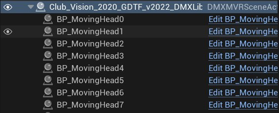
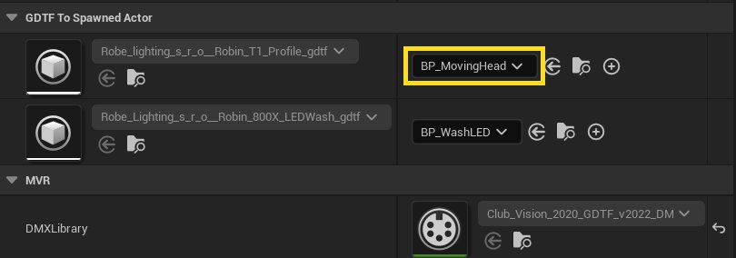
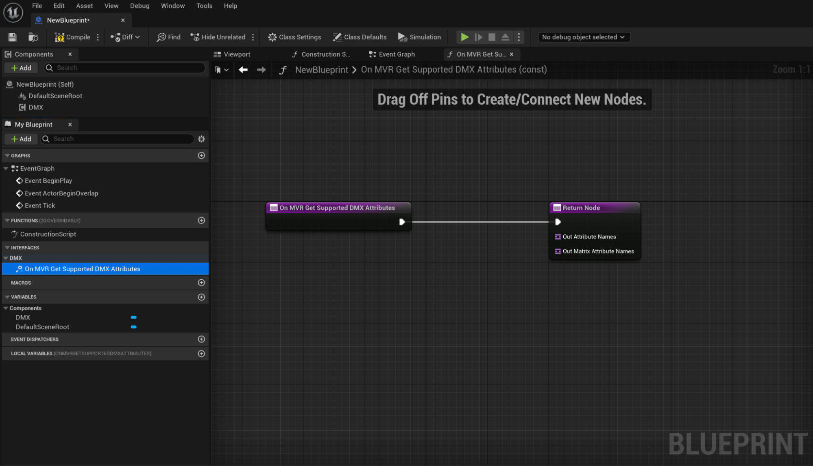
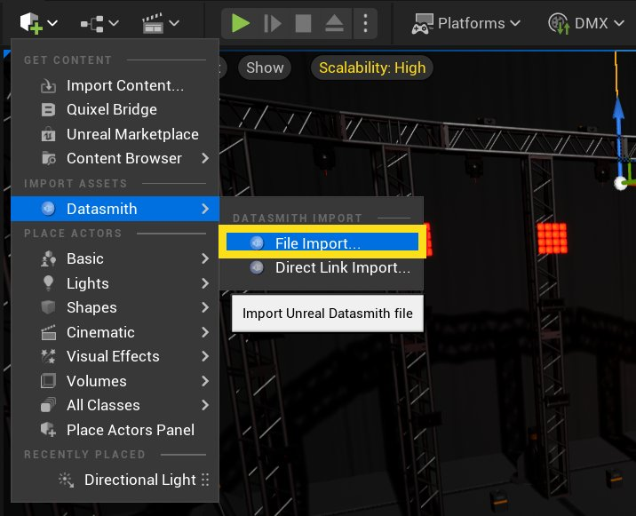
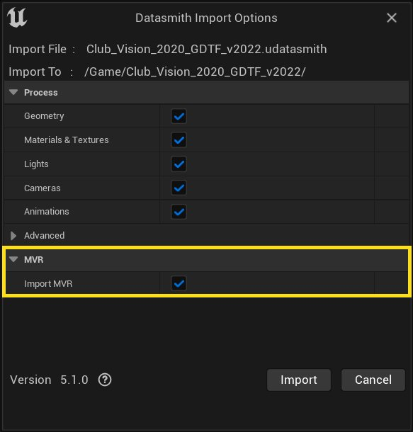
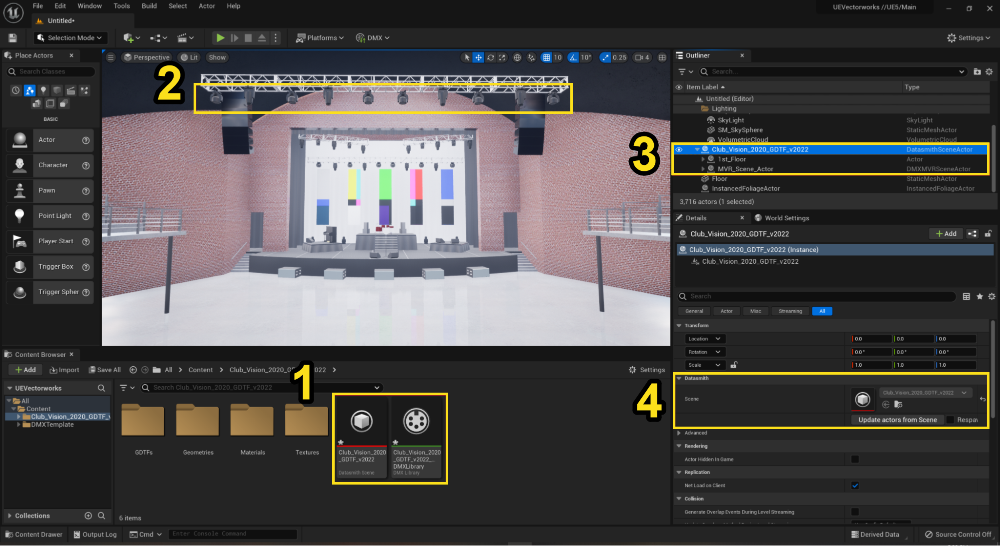
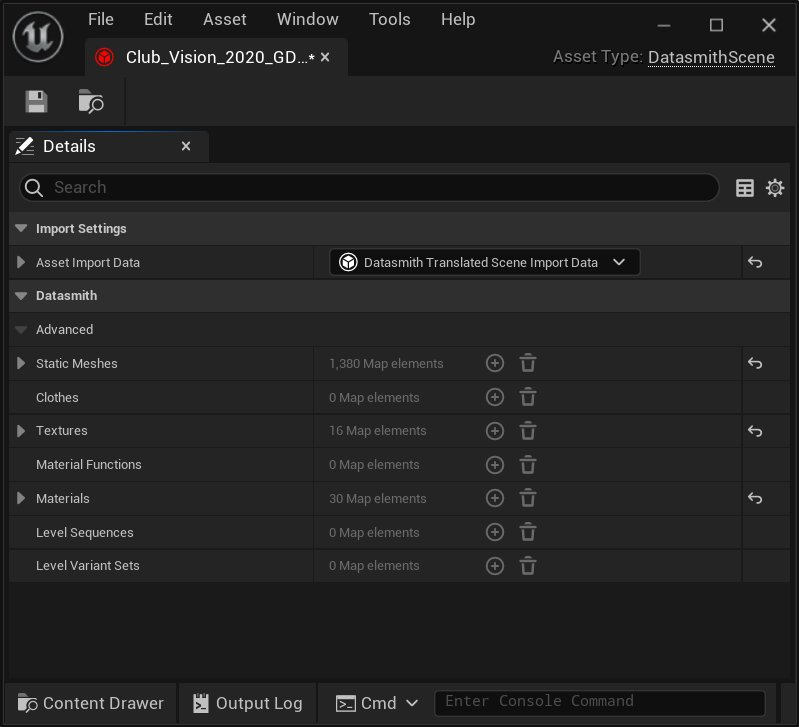
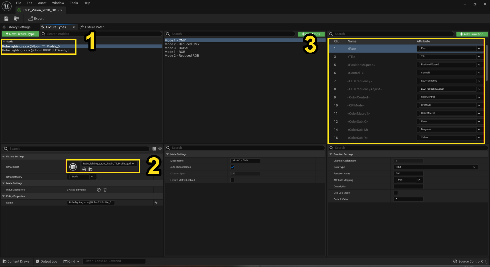

# DMX MVR Import and Export

> 路径：虚幻引擎5.7文档 / 使用媒体 / 与媒体组件通信 / DMX / DMX MVR Import and Export

> 原始页面：https://dev.epicgames.com/documentation/unreal-engine/dmx-mvr-import-and-export-in-unreal-engine

“在娱乐行业中，MVR 文件格式允许程序共享场景的数据和几何体。场景是一组参数化对象，例如灯具、桁架、视频屏幕以及娱乐行业使用的其他对象。”（引自 MVR 标准）

可以将 MVR 文件导入 Unreal Engine，以便与 DMX 配合使用。手动导入 MVR 文件只会包含与 DMX 相关的灯具和 patching 信息。若还要导入静态和场景几何体，请使用 [Datasmith](https://dev.epicgames.com/documentation/404) 和 [Datasmith MVR 插件](#importanmvrfileusingthedatasmithmvrplugin).

## 手动导入 MVR 文件

要将 MVR 文件手动导入 Unreal Engine，请按以下步骤操作：

1. 将设备中的 MVR 文件拖入

   Content Browser

   。这会使用 MVR 文件中的数据创建 DMX Library 资产。
2. 将 DMX Library 资产拖入关卡，以填充

   DMX MVR Scene Actor

   。这会在正确位置生成支持 DMX 的蓝图 Actor，并应用其变换。

> [!NOTE]
> 可以将同一个 DMX Library 多次添加到关卡，但不建议这样做。添加多个实例可能导致 Actor 的 MVR Fixture ID 含义不明确，从而在 MVR 导出时产生限制。

### DMX MVR Scene Actor

DMX MVR Scene Actor 包含支持 DMX 的蓝图列表，这些蓝图会自动选择，以匹配 MVR 文件中描述的灯具属性。

### GDTF 到生成 Actor

此 **Details（详情）** 面板部分会显示 MVR 文件中描述的灯具列表。每个灯具都有一个 GDTF 签名文件，以及一个匹配的支持 DMX 的蓝图。

使用右侧下拉菜单为该灯具匹配不同蓝图。这会替换该灯具 GDTF 条目的所有蓝图节点。

只能选择实现了以下接口的蓝图： **MVR Fixture Actor Interface**.

### DMX MVR Fixture Actor Interface

可以在蓝图或 C++ 的任意 Actor 类中实现 MVR Fixture Actor Interface。

**On MVR Get Supported DMX Attributes** 会返回该蓝图 Actor 支持的属性。导入 MVR 文件时，每个灯具都会自动匹配具有最多匹配属性的 Actor 蓝图。

> [!NOTE]
> 实现 DMX MVR Fixture Actor Interface 的 Actor 必须恰好附加一个 DMX 组件。当 Actor 在 MVR 场景中生成时，该组件会自动 patch。如果实现该接口的 Actor 没有 DMX 组件，或使用了多个 DMX 组件，引擎会记录错误。

## 使用 Datasmith MVR 插件导入 MVR 文件

### 从 Vectorworks Datasmith 导出 MVR 和 Datasmith 文件

1. 在 Datasmith 中点击

   File

   >

   Export

   >

   Unreal Datasmith (3D Only)

   以导出 Vectorworks 场景。
2. 点击

   File

   >

   Export

   >

   MVR

   以导出来自灯具、GDTF 和 patching 信息的 DMX 相关数据。

> [!NOTE]
> 将 MVR 文件放在同一目录中，并使用与 `.udatasmith` 文件相同的文件名，该文件来自步骤 1。

### 将 MVR 和 Datasmith 文件导入 Unreal Engine

1. 在 Unreal Engine 中，前往主工具栏并点击 Create > Datasmith > File Import…

   
2. 在对话框中启用 **Import MVR** 以导入 DMX 相关灯具和 patching 信息。如果只需要 Datasmith 文件中的 3D 几何体，可以取消勾选此选项。

> [!NOTE]
> 将 MVR 文件放在与 `*.datasmith` 文件相同的目录位置。

### Unreal 导入场景

以下示例展示通过此流程完整导入后，在 Unreal Engine 中的 Vectorworks 示例项目。

请注意编辑器中的以下元素：

1. Content Browser

   - Datasmith Scene
   - DMX Library
2. 预览窗口

   - 实例化 3D 场景，即带纹理和材质的几何体
   - 实例化的支持 DMX 的灯具 BP
3. Datasmith Scene Actor

   - Actor Scene Geometry Actor
   - DMX MVR Scene Actor
4. Datasmith 设置

#### Datasmith Scene

该资产包含通过 Datasmith 从 Vectorworks 导入的所有网格体、纹理和材质引用。

#### DMX Library

DMX Library 资产包含以下信息：

1. 灯具类型
2. GDTF 签名
3. 属性定义

它还包含使用 MVR 标准从 Vectorworks 导入的 DMX patching 数据。

> 图片已省略：A screenshot of the DMX patching data

#### Datasmith Scene Actor

关卡中实例化的 Datasmith Scene Actor 包含两个 Actor：

- Actor Scene Geometry actor: this contains all of the instantiated 3D geometry, materials and texture references. !A screenshot of the Actor Scene Geometry actor](actor-scene-geometry.png)
- DMX MVR Scene Actor：包含所有支持 DMX 的灯具蓝图。导入 MVR 文件时会自动选择这些蓝图。可以在 **GDTF 到生成 Actor** 部分中选择分配不同蓝图。

使用 **Details（详情）** 面板访问 **Update actors from Scene** and **Respawn** 选项，目标为 **DatasmithSceneActor**。关于重新生成和更新 Actor 的更多信息，请参阅 [重新导入 Datasmith 内容](../../../../working-with-content/datasmith/datasmith-reimport-workflow/index.md).

> 图片已省略：A screenshot of the DatasmithSceneActor options

> [!NOTE]
> MVR 和 Datasmith 场景 Actor 在所有权和控制权上互斥。来自 Datasmith 的实时同步无法与 MVR 场景 Actor 配合使用。

## MVR 导出器

> 图片已省略：A promotional graphic of two stylized file icons, an MVR file and a GDTF file.

可以在 Unreal Engine 中使用 MVR Exporter，将 DMX Library 共享给灯光控台和第三方软件。

导出的 MVR 文件包含来自 DMX Library 的以下信息：

- Patching 信息
- 灯具定义
- 灯具 GDTF 签名

### 限制

只能通过 MVR 格式导出具有关联且未编辑 GDTF 签名文件的 DMX Library。如果 DMX Library 包含没有 GDTF 签名文件的手动创建灯具类型，或包含导入 GDTF 后又被编辑过的 Fixture Type，则无法将该 DMX Library 导出为 MVR 文件。

### MVR 导出流程

要将 DMX Library 导出为 MVR 文件，请从 **Content Browser** 打开 DMX Library，并点击 **Export**.

> 图片已省略：A screenshot of the Export button

Unreal Engine 依赖 Datasmith 导入场景元素。如果 DMX Library 是从 MVR 文件创建的，那么在将 DMX Library 导出为 MVR 文件时，它会保留场景元素。
