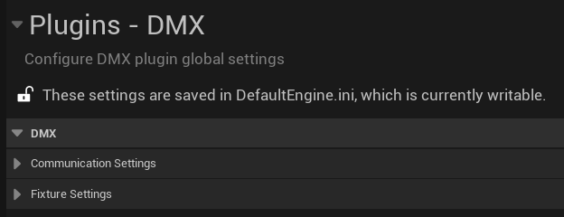
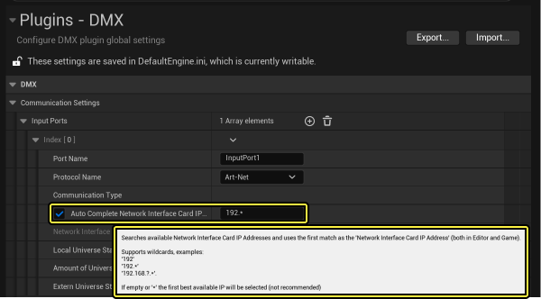
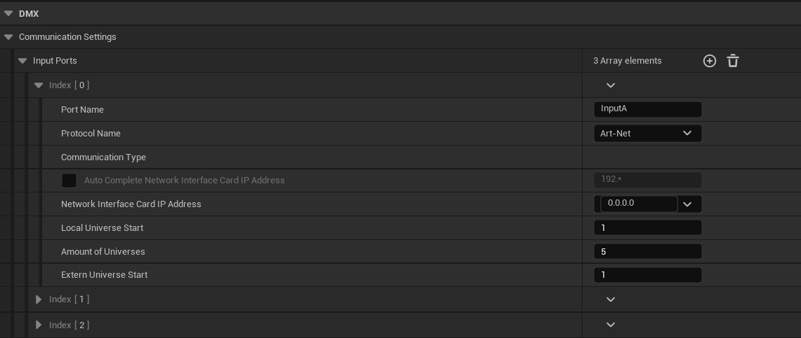
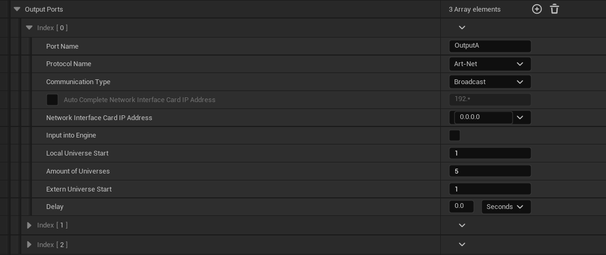
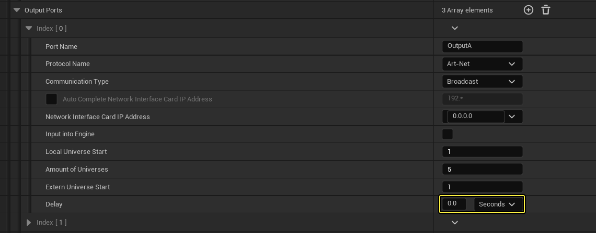
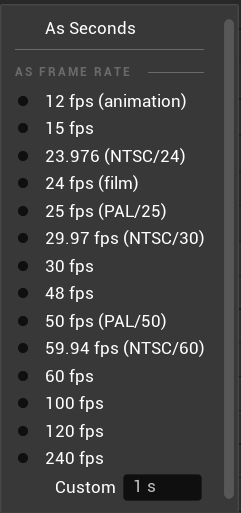
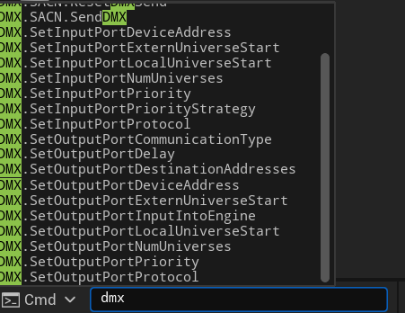
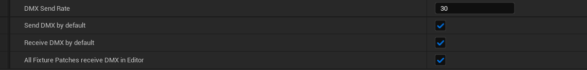

# DMX快速入门

> 路径：虚幻引擎5.7文档 / 使用媒体 / 与媒体组件通信 / DMX / DMX快速入门

> 原始页面：https://dev.epicgames.com/documentation/unreal-engine/dmx-quick-start-in-unreal-engine

本快速入门指南将介绍如何使用基本DMX功能，帮助你开始学会使用虚幻引擎创建自己的可视安装或现场活动。

## 启用DMX插件

要充分利用整个DMX功能集，你需要找到 **编辑（Edit）> 插件（Plugins）** 并在项目中启用以下插件。

### 基本插件

下面是你在项目中使用DMX所需启用的主要DMX插件。

- **DMX引擎（DMX Engine）：** 启用核心DMX引擎功能。
- **DMX协议（DMX Protocol）：** 启用DMX通信协议。

### 额外插件

以下是提供额外特性和功能的可选插件。

- **DMX灯具（DMX Fixtures）** 提供启用DMX的灯具蓝图的示例内容，可用于生成MVR。
- **DMX控制控制台（DMX Control Console）：** 启用DMX控制控制台，以将DMX发送到特定补丁或原始DMX地址。
- **DMX像素映射（DMX PixelMapping）：** 将纹理、材质、渲染目标或UMG控件中的像素信息转换为DMX信号。
- **Datasmith MVR：** 提供对Datasmith导入器的MVR支持。
- **DMX显示群集（DMX Display Cluster）：** 在你的nDisplay群集中启用DMX数据的恰当同步和发光板控制。
- **DMX** **远程控制协议（Remote Control Protocol）：** 启用对远程控制插件的DMX支持。

## 项目设置

查看 **编辑（Edit）> 项目设置（Project Settings）** 下的DMX分段时，你会看到我们已将其分类为两个分段。

- [通信设置](#%E9%80%9A%E4%BF%A1%E8%AE%BE%E7%BD%AE)
- [灯具设置](#%E7%81%AF%E5%85%B7%E8%AE%BE%E7%BD%AE)

### 通信设置

我们将DMX协议、适配器和域配置设置整合到了称为 **端口（Ports）** 的概念下，这适用于DMX输入和输出数据。你可以创建不限数量的端口，这意味着你可以使用端口在多个协议和适配器之间轻松、恰当地分开各个域。

#### 共享设置

大部分端口设置同样适用于输入和输出端口。这些在下表中定义。

| **设置** | **说明** |
| --- | --- |
| 端口名称 | 定义自定义名称，以便可轻松识别。 |
| 协议名称 | 选择Art-Net或sACN。 |
| 自动填写网络接口卡IP地址 | 自动选择相应的IP地址。[参阅下文，了解详情。](#%E8%87%AA%E5%8A%A8ip) |
| 网络接口卡IP地址 | 指定你使用的特定网络适配器的IP。 |
| 本地域开始 | 虚幻引擎应该在其中开始监听或编写的第一个域的ID编号。 对于两种支持的协议，我们都从域1开始。如果你想发送到域0，只能对Art-Net这样做，为此，你可以将外部域开始设置为0。 |
| 域的数量 | 要设置的域的数量。 |
| 外部域开始 | 你可以在外部应用于域的偏移值。例如，此处值为100意味着域1在外部输出中的编号为域100。 |

##### 基于字符串搜索自动选择IP地址

你可以启用 **自动填写网络接口卡IP地址（Auto Complete Network Interface Card IP Address）** 复选框，从而自动选择IP地址。

系统将基于IP地址字段中的输入来选择最适合的IP地址。此功能支持通配符。

示例：

'192'

'192.*'

'192.168.?.*'

#### 输入端口

你可以在"输入端口（Input Ports）"分段中定义本地输入的配置。默认情况下，这是包含3个元素的数组，但你可以根据需要添加或删除元素。

#### 输出端口

你可以在"输出端口（Output Ports）"分段中定义输出配置。类似于"输入端口（Input Ports）"分段，默认情况下，这是包含3个元素的数组，你可以根据需要添加或删除元素。但是，"输出端口（Output Ports）"分段还包含独特的设置。

以下属性为"输出端口（Output Ports）"设置所特有。

| **设置** | **说明** |
| --- | --- |
| 通信类型 | 提供广播和单播输出之间的选择。 |
| 输入到引擎中 | 启用此复选框还会在内部将输出发送到虚幻引擎。这不会显示为活动监视器中的输入。 |
| 延迟 | 将时间延迟添加到输出。[参阅下文，了解详情。](#%E8%BE%93%E5%87%BA%E5%BB%B6%E8%BF%9F) |

##### 输出延迟

你可以使用输出延迟功能将固定时间延迟添加到你的输出。默认时间缩放以秒为单位，但你可以改为根据各种fps选项设置延迟。

#### 控制台命令

你可以使用控制台命令更改端口设置。

例如，以下命令可将OutputA的延迟设置为5秒： `DMX.SetOutputPortDelay OutputA 5`

你可以按这种方式设置所有端口属性：

查看控制台中的DMX名称空间，获取关于使用这些命令的帮助：

例如，如果你输入 `DMX.SetInputPortDeviceAddress` ，系统会提示问号，暗示 `DMX.SetInputPortDeviceAddress ?` 是正确的语法。

你可以进一步指定此项。输入 `DMX.SetInputPortDeviceAddress MyInputPort` 会记录端口的当前设置。

#### 通用端口设置

除了特定输入和输出端口设置之外，还有适用于所有端口的通用设置。

| **设置** | **说明** |
| --- | --- |
| DMX发送速率 | 发送DMX数据的速率，以赫兹（Hz）为单位。 |
| 默认发送DMX | 确定DMX数据是否发送到网络。 |
| 默认接收DMX | 确定DMX数据是否从网络接收。 |
| 所有灯具补丁接收编辑器中的DMX | 启用后，所有灯具补丁接收编辑器中的DMX数据，覆盖其本地设置。 |

### 灯具设置

DMX灯具设置分类为两个分段。

- 灯具类别
- 灯具属性

两个分段都是包含设定元素的数组，你可以酌情添加或删除

> 图片已省略：DMX灯具设置

#### 灯具类别

为方便起见，DMX灯具类别可以在DMX库中引用，这有助于更好地整理各种灯具。

> 图片已省略：DMX灯具类别

#### 灯具属性

我们在用户定义的查找表中整理了DMX灯具属性，这样就可以使用该表将[GDTF](https://dev.epicgames.com/documentation/404)规范中的现有灯具术语匹配到内部函数。

> 图片已省略：DMX灯具属性

## 下拉菜单

DMX下拉菜单整合了DMX UI面板和功能，以便快速轻松访问。

> 图片已省略：DMX UI和功能下拉菜单

### 信道监视器

DMX信道监视器是一种调试工具，用于直观地显示特定域的DMX输入和输出。

## 活动监视器

DMX活动监视器是一种调试工具，用于同时直观地显示所有域中的DMX输入和输出。它显示所有传入和传出数据。

### 控制控制台

DMX控制控制台是一种编辑器工具，利用易于使用的调节器为一系列给定的DMX库和补丁设置、测试、发送DMX数据。

### 补丁工具

DMX补丁工具是小型工具控件，可便捷地对关卡中的一系列Actor批量打补丁。

### 接收DMX

设置何时从网络接收DMX。

### 发送DMX

设置何时将DMX发送到网络。

## DMX资产

### DMX库

此资产整合了与DMX和MVR相关的所有数据，例如手动创建或GDTF导入的灯具、属性或信道设置和打补丁信息。

> 图片已省略：菜单中的DMX库选项。

### DMX像素映射

此资产整合了与像素映射相关的所有数据，例如输入绑定、引用的DMX库和补丁、2D定位网格、颜色管理和各种其他设置。
