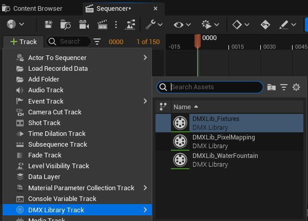
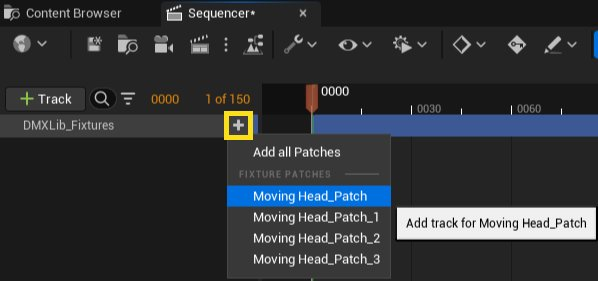
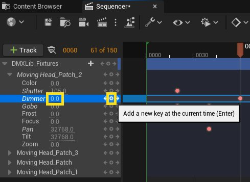
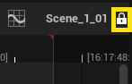
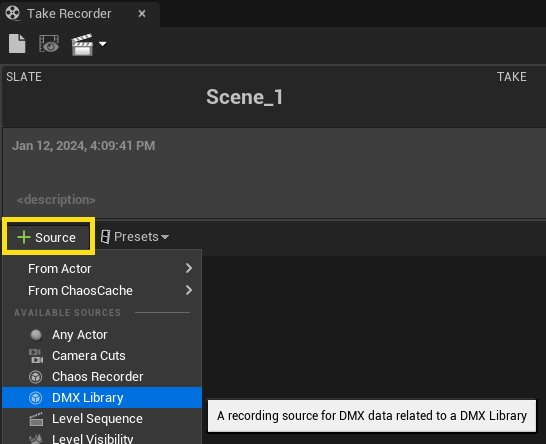
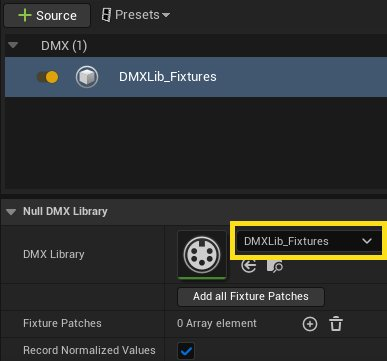
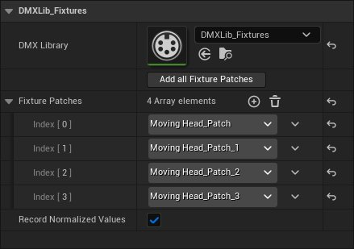

# DMX轨道

> 路径：虚幻引擎5.7文档 / 使用媒体 / 与媒体组件通信 / DMX / DMX轨道

> 原始页面：https://dev.epicgames.com/documentation/unreal-engine/dmx-sequencer-integration-in-unreal-engine

Sequencer是虚幻引擎的一项功能，可以提供简便的动画和时间触发功能。Sequencer通过自定义 **DMX轨道**支持数字复接（DMX）的录制、播放和编辑，帮助你更好地设计和预览虚拟或实际表演以及现场活动中的光照体验。

你可以将自定义的DMX轨道添加到关卡序列，无需通过蓝图或编程就能编排和控制DMX。

## 将DMX Sequencer轨道添加到关卡序列

自定义的DMX Sequencer轨道连接到一个[**DMX库**](../create-a-dmx-library-and-add-fixture-patches/index.md)。你可以将来自DMX库的任意[**灯具配接**](../dmx-overview/index.md)添加到轨道，并公开配接属性，以便将其发送到DMX。你可以为每个属性添加关键帧到轨道，以驱动和控制DMX输出。然后，你就可以重播、编辑和共享包含DMX轨道的[**关卡序列**](../../../../animating-characters-and-objects/cinematics-and-movie-making/unreal-engine-sequencer-movie-tool-overview/index.md) that contains the DMX track.

### 步骤

要将灯具配接添加到关卡序列，请执行以下步骤。

1. 按下 **+轨道（+ Track）** 按钮，然后从列表选择 **DMX库轨道（DMX Library Track）**。选择你要添加到序列中的DMX库。

   

   点击查看大图。
2. 在新的DMX库轨道上，点击 **添加 (+)** 按钮并选择一个灯具配接，为所需的配接创建新轨道。你也可以在下拉菜单中点击 **添加所有配接（Add All Patches）**，为库中的每个灯具配接创建新轨道。

   

   点击查看大图。
3. 通过按 **+** 按钮或修改属性名称旁边的值扩展灯具配接轨道，并添加新的关键帧。值范围由在DMX库中为每个属性选择的DMX信号格式定义。

   

   点击查看大图。

Sequencer会在你按下播放和拖动播放头时发送DMX数据。

默认情况下，录制的序列会被锁定，无法编辑。要解锁序列并进行编辑，请在序列编辑器中点击序列名称旁边的锁状图标。

点击查看大图。

## 使用镜头试拍录制器录制DMX

DMX插件 **镜头试拍录制器（Take Recorder）** 工具可以侦听传入的DMX流，并将数据录制为关卡序列中的新关键帧。然后你就可以播放、编辑和共享此关卡序列。你可以侦听DMX库中分配的指定灯具配接的传入DMX，并录制对关卡序列中关键帧的更改。

### 步骤

要将DMX录制到关卡序列，请执行以下步骤。

1. 点击 **窗口（Window）** > **过场动画（Cinematics）** > **镜头试拍录制器（Take Recorder）** 打开镜头试拍录制器.
2. 点击 **源（Source）(+)** 按钮，然后从列表选择 **DMX库（DMX Library）**。

   

   点击查看大图。
3. 将DMX库参数设置为包含待录制配接的库。

   

   点击查看大图。
4. 点击 **灯具配接（Fixture Patch）** 参数，然后从列表中选择一个配接，将其添加到配接录制列表，或者点击 **添加所有灯具配接（Add all Fixture Patches）**，将库中的所有配接添加到配接录制列表中。

   

   点击查看大图。
5. 点击 **录制（Record）** 按钮。与配接录制列表匹配的所有传入DMX将作为新的关键帧保存到新的关卡序列中。
6. 完成录制后，在 **内容浏览器** 中找到创建的序列，查看并播放录制的DMX。新序列应保存至 `Cinematics/Takes/[RecordDate]/`。

在使用镜头试拍录制器完成录制后，录制的序列会被锁定，无法编辑。要解锁序列并进行编辑，请在序列编辑器中点击序列名称旁边的锁状图标。

点击查看大图。
