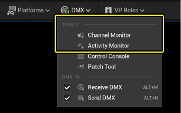
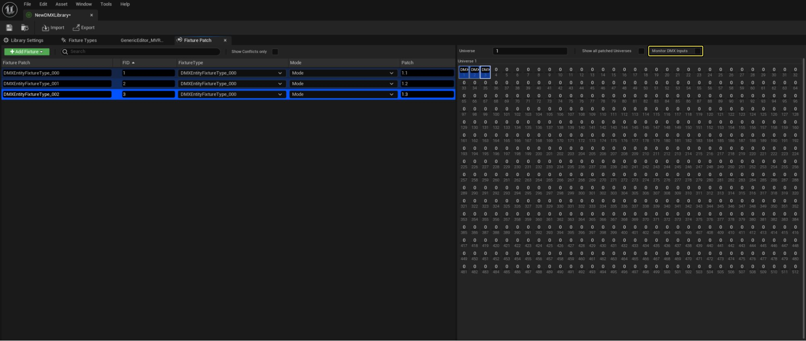
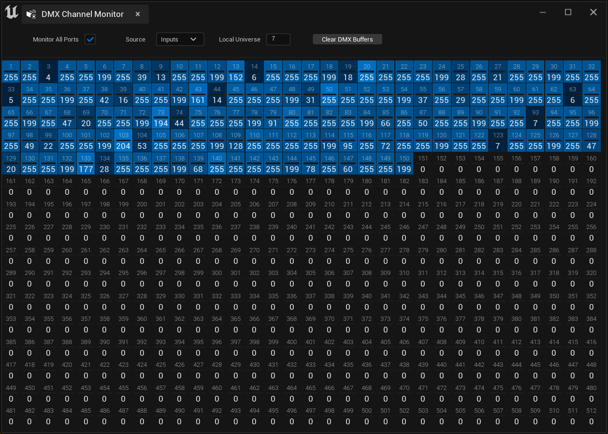
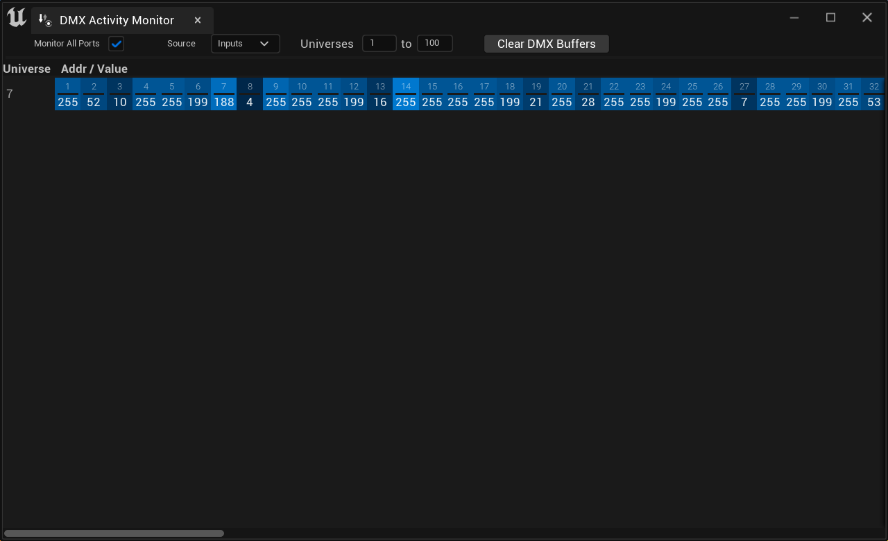

# ＤＭＸ活动和通道监控器

> 路径：虚幻引擎5.7文档 / 使用媒体 / 与媒体组件通信 / DMX / DMX工具 / ＤＭＸ活动和通道监控器

> 原始页面：https://dev.epicgames.com/documentation/unreal-engine/dmx-activity-and-channel-monitors-in-unreal-engine

# 介绍

**DMX监控器（DMX Monitor）** 是用于可视化DMX输入和输出的工具。

# 访问DMX监控器

DMX监控器在DMX工具栏菜单中可用。

在DMX库的灯具配接编辑器中也有一个通道监控器。它只监控DMX输入。

# 通道监控器

当虚幻引擎收到指定的universe数据时，监控器器会显示信息。

选择控件为你提供了一种挑选要监控的universe的方法。

| **属性** | **说明** |
| --- | --- |
| **监控所有端口（Monitor All Ports）** | 选择时，所有的输入或输出端口都被监控。 |
| **源（Source）** | 选择一个要监控的源，你可以选择 **监控所有端口** 来监控所有 **输入** 或 **输出** 端口，或者你可以选择一个特定的输入或输出端口。 |
| **本地universe（Local Universe）** | 指定监测的本地universe。 |
| **清除DMX缓冲区（Clear DMX Buffers）** | 清除所有DMX缓冲区。这将清空缓冲区，它将不发送零或默认值。 |

# 活动监控器

**DMX活动监控器** 是一种调试工具，用于可视化多个universe中的DMX输入和输出。活动监控器显示它所监控的所有universe中接收到的任何非零DMX值。

| **属性** | **说明** |
| --- | --- |
| **监控所有端口（Monitor All Ports）** | 选择时，所有的输入或输出端口都被监控。 |
| **源（Source）** | 选择一个要监控的源，你可以选择 **监控所有端口** 来监控所有 **输入** 或 **输出** 端口，或者你可以选择一个特定的输入或输出端口。 |
| **Universes** | 选择监测的Universe范围 |
| **清除DMX缓冲区（Clear DMX Buffers）** | 清除所有DMX缓冲区。这将清空缓冲区，它将不发送零或默认值。 |
