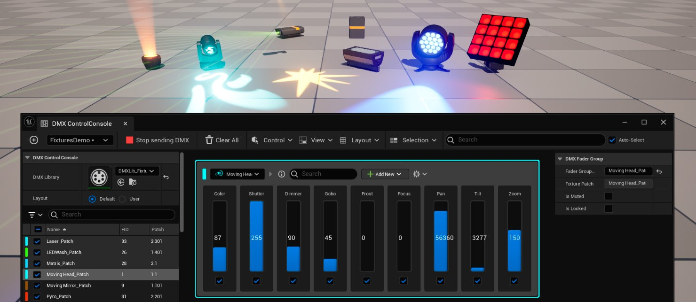
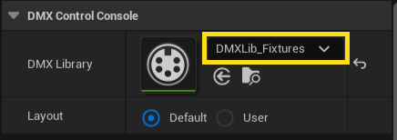
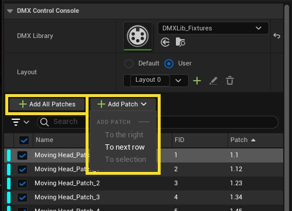
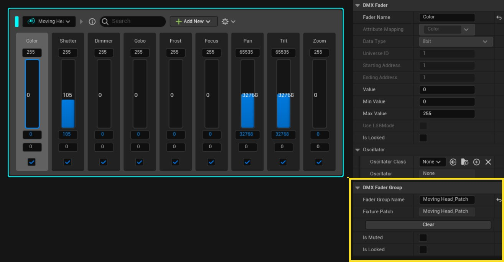
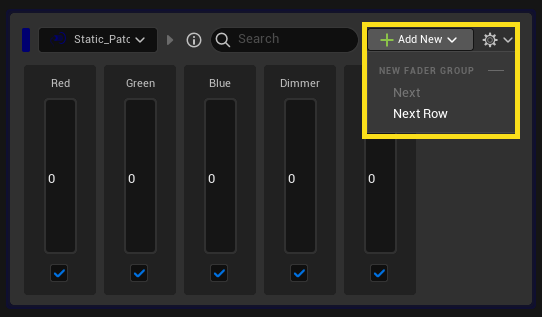
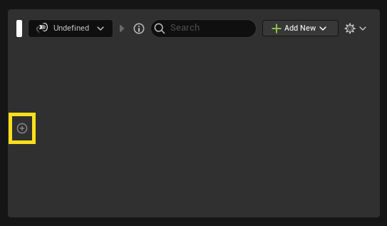
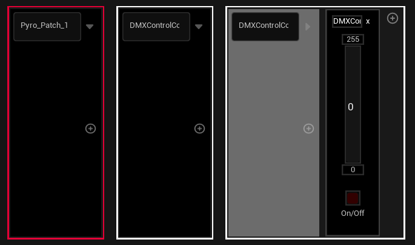
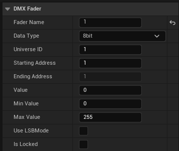

# DMX控制控制台

> 路径：虚幻引擎5.7文档 / 使用媒体 / 与媒体组件通信 / DMX / DMX工具 / DMX控制控制台

> 原始页面：https://dev.epicgames.com/documentation/unreal-engine/dmx-control-console

**控制控制台（Control Console）** 旨在简化DMX调试，让你能够快速控制一组虚拟的或实体的灯具。它将根据你的库和配接选择自动生成和填充滑块。你可以立即使用这些滑块生成和发送DMX数据。

## 工作流程

### 库和配接选择

浏览至包含配接和灯具数据库的 **DMX库** 资产。

### 添加灯具配接

然后你可以决定从DMX库添加所有灯具配接，或手动逐个选择灯具配接。

- 点击 **+添加（+ Add）** 将选定的灯具配接添加到现有行。
- 点击 **+行（+ Row）** 将选定的灯具配接添加到新行。

当你将灯具配接添加到控制台时，将在 **调节器组** 内为该配接的各个功能创建一个 **调节器** 。你可以检查调节器组的详细信息，必要时可以在右侧的 **细节视图（Details View）** 中编辑。

### 添加原始调节器

**原始调节器** 是一个与灯具配接没有任何关系的DMX调节器。要创建原始调节器，请按如下方式处理：

1. 点击

   添加(+)（Add (+)）

   按钮，新建一个调节器组。

1. 点击调节器组内部的

   添加(+)（Add (+)）

   按钮，创建一个原始调节器。

然后在 **细节（Details）** 面板中编辑调节器属性，以说明其精度（8位、16位或24位）和其他必要参数，例如域ID（Universe ID）、起始地址（Start Address）和最小值（Min Value）/最大值（Max Value）接受范围。

### 全局搜索

全局搜索可用于在公开的控制滑块中快速筛选。此搜索接受各种输入，例如调节器组名、属性名称（"红（Red）、绿（Green）、蓝（Blue）、黯淡（Dimmer）"）、灯具ID（fixture ID）（"1、2、4-5"）、域（"域1、2、4-5"）或地址（"1.512"）。

> 图片已省略：DMX控制控制台全局搜索

### 振荡器

振荡器提供了一种使所选滑块动画化的方法。我们提供了一些默认振荡器（如正弦波或方波），你也可像使用蓝图那样自己创建振荡器。

> 图片已省略：用于将滑块动画化的振荡器
