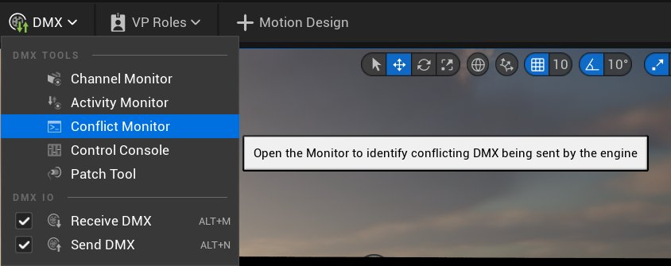
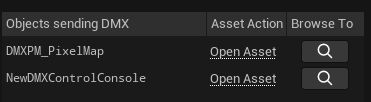
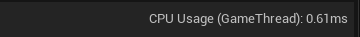
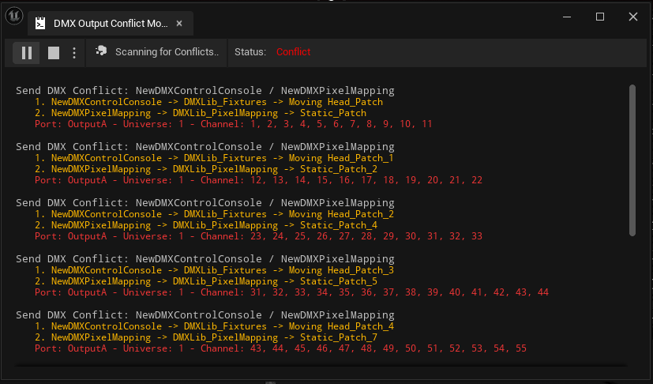
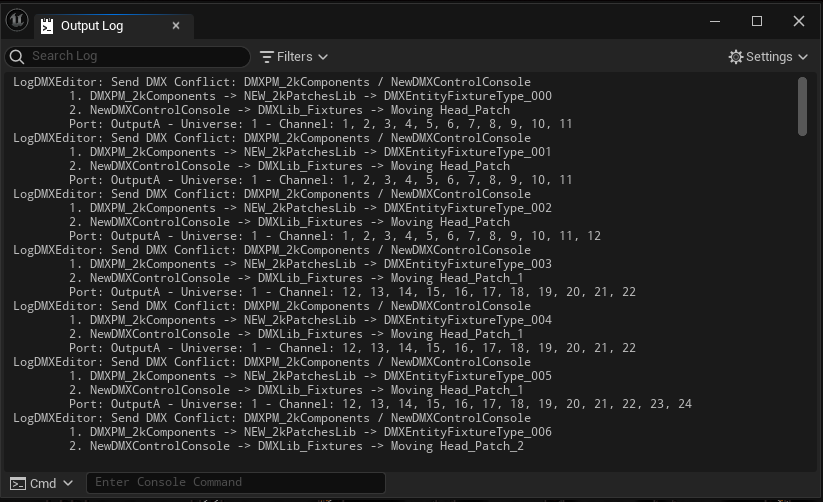

# DMX冲突监控器

> 路径：虚幻引擎5.7文档 / 使用媒体 / 与媒体组件通信 / DMX / DMX工具 / DMX冲突监控器

> 原始页面：https://dev.epicgames.com/documentation/unreal-engine/dmx-data-conflict-monitoring-in-unreal-engine

在将引擎中的DMX数据发送到外部设备时，DMX冲突监控器可检查所有启用的域和配接范围上的潜在DMX数据冲突。虚幻引擎中的不同DMX工具（例如控制台、像素映射器和蓝图）将DMX数据写入相同地址时，它们之间可能会发生冲突。

要打开冲突监控器，点击 **主工具栏** 中的 **DMX** > **冲突监控器（Conflict Monitor）** 。

冲突监控器将作为可停靠的窗口打开。点击 **省略号（...）** 可配置其选项。

- 播放/停止（Play/stop）

  ：启动和停止监控过程。
- 选项（Options）

  - 自动暂停（Auto Pause）

    ：检测到冲突时暂停。
  - 打印到日志（Print to Log）

    ：将冲突打印到UE输出日志。仅在启用自动暂停时可用。
- 监控器（Monitor）

  - 打开时运行（Run when opened）

    ：打开时监控自动启动。
  - 深度（Depth）

    ：控制在日志条目中包含多少详情。

在冲突监控器运行时， **发生DMX的对象（Objects Sending DMX）** 分段会更新，显示当前正在发送DMX的资产。你可以根据显示打开对应资产，或在 **内容浏览器** 中找到它。

冲突监控可能会占用大量CPU资产。你可以在冲突监控器的右上角查看当前CPU使用情况。

如果冲突监控器检测到冲突，则监控器会记录关于冲突的信息，包括冲突的DMX工具和受影响的端口。

如果选择了 **打印到日志（Print To Log）** 选项，则冲突监控器还会将相同信息发送到UE输出日志。

