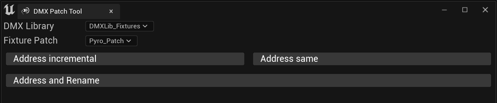
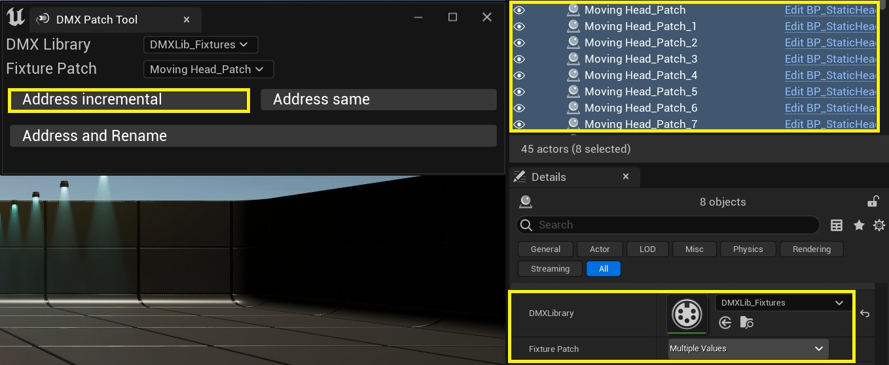
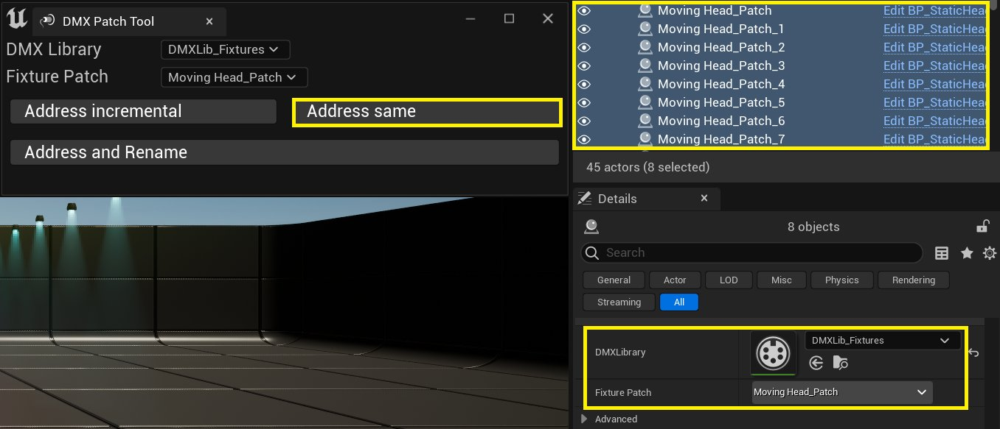

# DMX配接工具

> 路径：虚幻引擎5.7文档 / 使用媒体 / 与媒体组件通信 / DMX / DMX工具 / DMX配接工具

> 原始页面：https://dev.epicgames.com/documentation/unreal-engine/dmx-patch-tool-in-unreal-engine

通过 **DMX配接工具** ，你可以在 **世界大纲视图（World Outliner）** 中快速设置给定Actor的DMX库和配接。

DMX库是保存以下相关信息的主要数据结构：

- 控制器
- 灯具类型
- 灯具配接

DMX配接可跟踪DMX地址，并分配支持DMX的灯具的配接。

DMX配接工具提供3种功能：

- 地址递增
- 地址相同
- 地址和重命名

## 地址递增

- 将所选DMX库应用到所有选定Actor。
- 从提供的灯具配接开始递增应用配接。

## 地址相同

- 将所选DMX库应用到所有选定Actor。
- 将相同的配接应用到所有选定Actor。

## 地址和重命名

- 将所选DMX库应用到所有选定Actor。
- 将相同的配接应用到所有选定Actor。
- 同时重命名所选Actor，以便它们与所提供的配接名称匹配。

有关DMX配接和库的更多信息，请参阅[DMX概述](../../dmx-overview/index.md)。
