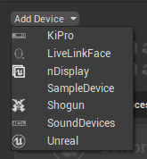
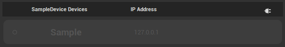
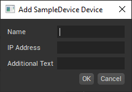
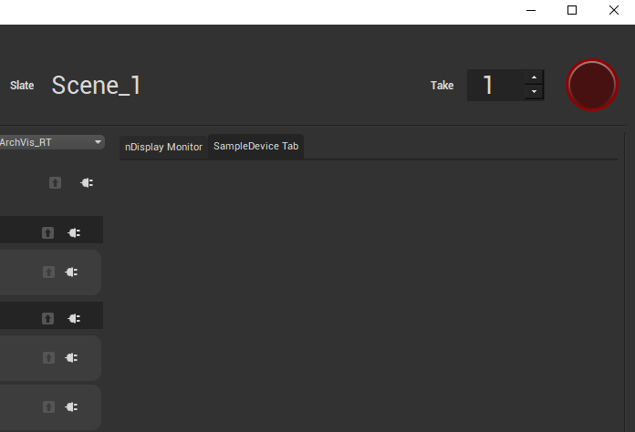

# 如何创建自定义Switchboard设备插件

> 路径：虚幻引擎5.7文档 / 使用媒体 / 与媒体组件通信 / Switchboard概述 / 如何创建自定义Switchboard设备插件

> 原始页面：https://dev.epicgames.com/documentation/unreal-engine/how-to-create-a-custom-switchboard-device-plugin-for-unreal-engine

有时，根据项目需要以及你用的设备，你可能需要在[Switchboard](../index.md)中添加或扩展设备功能。本文将介绍如何使用Python创建你自己的设备插件。借助一些C++技巧，你还可以拓展监听器，使其接受更多类型的消息，但本文不包含这方面的内容。

以下说明逐步介绍如何为Switchboard创建新的设备插件 **SampleDevice**，该插件可用作起点。

1. 要使设备插件在加载后可以在Switchboard中发现，必须在

   \Engine\Plugins\VirtualProduction\Switchboard\Source\Switchboard\switchboard\devices\

   中按照命名惯例

   <plugin_name>\plugin_<plugin_name>.py

   创建一个文件夹和Python文件。

   - 对于

     SampleDevice

     插件，请创建以下文件：

     \Engine\Plugins\VirtualProduction\Switchboard\Source\Switchboard\switchboard\devices\sampledevice\plugin_sampledevice.py

     .
2. 在

   plugin_sampledevice.py

   文件中，扩展

   \Engine\Plugins\VirtualProduction\Switchboard\Source\Switchboard\switchboard\devices\device_base.py

   中定义的

   Device

   类。

   - 从

     device_base.py

     中导入

     Device

     。
   - 创建新类

     DeviceSampleDevice

     ，此类继承自

     Device

     。
   - 从 `switchboard/switchboard_logging.py` 导入 `LOGGER` 以报告错误。

     ```
     					          从switchboard.devices.device_base导入Device          从switchboard.switchboard_logging导入LOGGER			          class DeviceSampleDevice(Device):`              def __init__(self, name, ip_address, **kwargs):              super().__init__(name, ip_address, **kwargs)					 
     ```

   确认文件可以被Switchboard发现。启动Switchboard并展开 **添加设备（Add Device）** 下拉菜单。**SampleDevice** 出现在列表中。

   
3. 将SampleDevice添加到你的Switchboard不会在视图中创建控件。要创建SampleDevice控件，请扩展

   plugin_sampledevice.py

   中的

   DeviceWidget

   ：

   - 从

     device_widget_base.py

     导入

     DeviceWidget

     。
   - 创建新类 `DeviceWidgetSampleDevice`，此类继承自 `DeviceWidget`。

     ```
     					          从switchboard.devices.device_base导入Device          从switchboard.devices.device_widget_base导入DeviceWidget          从switchboard.switchboard_logging导入LOGGER			          class DeviceSampleDevice(Device):              def __init__(self, name, ip_address, **kwargs):                  super().__init__(name, ip_address, **kwargs)			          class DeviceWidgetSampleDevice(DeviceWidget):              def __init__(self, name, device_hash, ip_address, icons, parent=None):                  super().__init__(name, device_hash, ip_address, icons, parent=parent)					
     ```

   确认控件显示在Switchboard中。启动Switchboard并添加一个SampleDevice。一个最小化的SampleDevice控件将显示在视图中。

   
4. 在添加新的SampleDevice时创建自定义对话框，方法是创建继承自

   AddDeviceDialog

   的新类，并将其分配到

   DeviceSampleDevice

   类中的静态变量

   add_device_dialog

   。

   - 从

     device_widget_base.py

     导入

     AddDeviceDialog

     。
   - 从PySide2导入Qt模块
   - 创建继承自

     AddDeviceDialog

     的新类

     AddSampleDeviceDialog

     ，并在调用基础类的构造函数时，将device_type参数设置成"SampleDevice"。
   - 在新类的构造函数中，将QLineEdit文本框添加到对话框。
   - 使用新类覆盖 `DeviceSampleDevice` 中的 `add_device_dialog` 静态变量。

     ```
     					          从switchboard.devices.device_base导入Device          从switchboard.devices.device_widget_base导入AddDeviceDialog、DeviceWidget          从switchboard.switchboard_logging导入LOGGER			          从PySide2导入QtWidgets、QtGui、QtCore			          class AddSampleDeviceDialog(AddDeviceDialog):              def __init__(self, existing_devices, parent=None):                  super().__init__(device_type="SampleDevice", existing_devices=existing_devices, parent=parent)			                  # 创建QTWidgets以添加到表单                  self.additional_text_field = QtWidgets.QLineEdit(self)			                  # 将新选项附加到父类中定义的QTWidgets.QFormLayout对象                  self.form_layout.addRow("Additional Text", self.additional_text_field)			          class DeviceSampleDevice(Device):              # 重载与设备插件关联的添加设备对话框对象              add_device_dialog = AddSampleDeviceDialog			              def __init__(self, name, ip_address, **kwargs):                  super().__init__(name, ip_address, **kwargs)			          class DeviceWidgetSampleDevice(DeviceWidget):              def __init__(self, name, device_hash, ip_address, icons, parent=None):                  super().__init__(name, device_hash, ip_address, icons, parent=parent)			
     ```

   确认新的设备对话框显示在Switchboard中。启动Switchboard并添加一个SampleDevice。额外的文本字段将显示在对话框中。

   
5. Switchboard的右侧还可能有设备的控件，该控件包含其他选项卡式的扩展对话框，可以共享更多信息。要创建此选项卡，需要覆盖

   Device

   基础类中的类方法

   plug_into_ui

   。

   - 创建新类

     SampleDeviceTabView

     ，此类继承自

     QtWidgets.QWidget

     。
   - 在

     DeviceSampleDevice

     中创建类成员

     tab_view

     以容纳控件的实例。
   - 覆盖 `DeviceSampleDevice` 中的类方法 `plug_into_ui`，并使用新类 `SampleDeviceTabView` 初始化 `tab_view` 。

     ```
     					          从switchboard.devices.device_base导入Device          从switchboard.devices.device_widget_base导入AddDeviceDialog、DeviceWidget          从switchboard.switchboard_logging导入LOGGER			          从PySide2导入QtWidgets、QtGui、QtCore			          class AddSampleDeviceDialog(AddDeviceDialog):              def __init__(self, existing_devices, parent=None):                  super().__init__(device_type="SampleDevice", existing_devices=existing_devices, parent=parent)			                  # 创建QTWidgets以添加到表单                  self.additional_text_field = QtWidgets.QLineEdit(self)			                  # 将新选项附加到父类中定义的QTWidgets.QFormLayout self.form_layout对象                  self.form_layout.addRow("Additional Text", self.additional_text_field)			          class DeviceSampleDevice(Device):              add_device_dialog = AddSampleDeviceDialog # 覆盖插件的默认对话框              tab_view = None			              def __init__(self, name, ip_address, **kwargs):                  super().__init__(name, ip_address, **kwargs)			              @classmethod              def plug_into_ui(cls, menubar, tabs):                  ''' Implementation of base class function that allows plugin to inject UI elements.                  '''			                  if not cls.tab_view:                      cls.tab_view = SampleDeviceTabView(parent=tabs)			                  tabs.addTab(cls.tab_view, 'SampleDevice Tab')			          class DeviceWidgetSampleDevice(DeviceWidget):              def __init__(self, name, device_hash, ip_address, icons, parent=None):                  super().__init__(name, device_hash, ip_address, icons, parent=parent)			          class SampleDeviceTabView(QtWidgets.QWidget):              def __init__(self, parent):                  QtWidgets.QWidget.__init__(self, parent)								
     ```

   

上述步骤展示了如何为Switchboard创建新设备插件。如需高级示例，请参见Switchboard的nDisplay设备插件。
