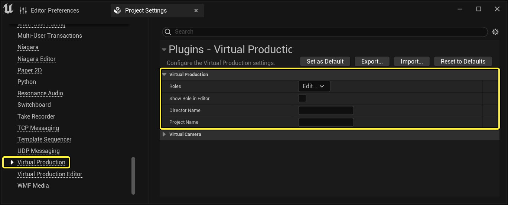
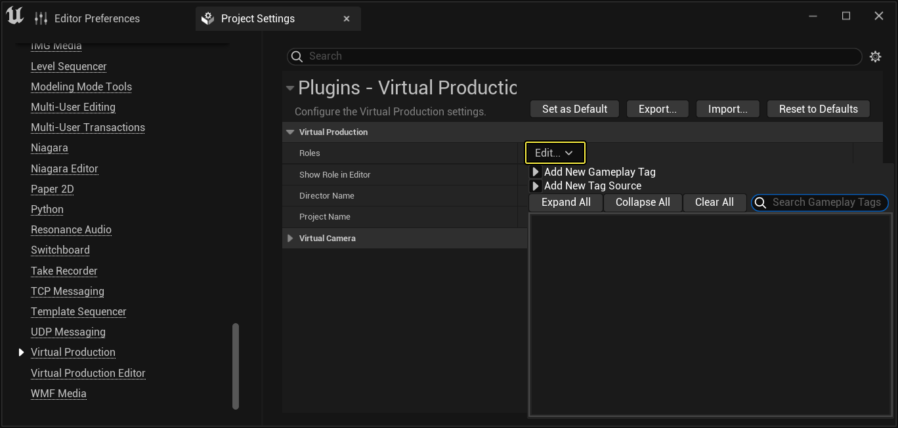
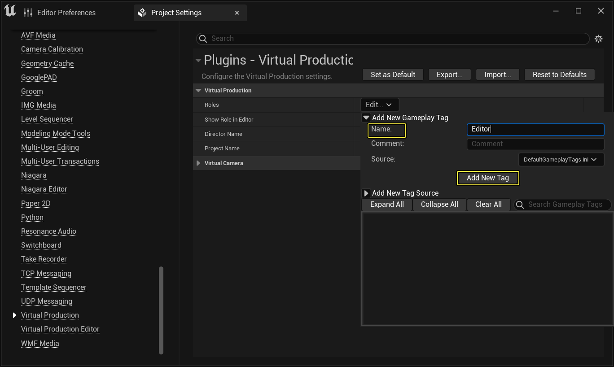
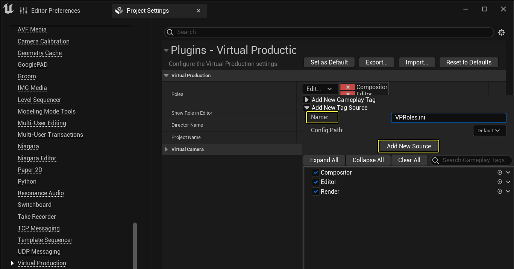
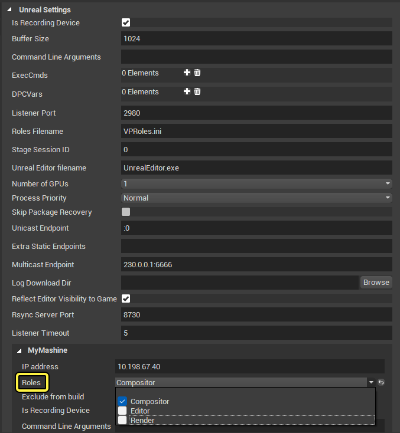
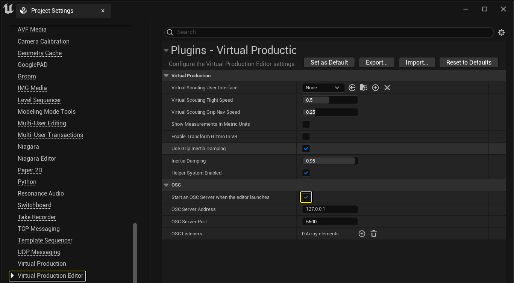
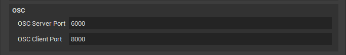
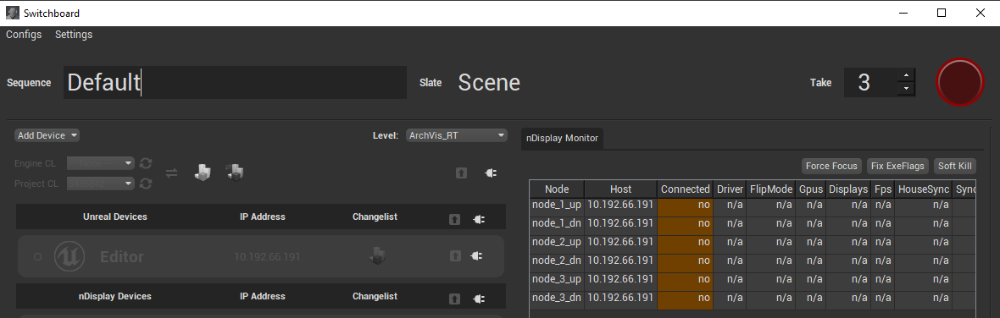

# Switchboard概述

> 路径：虚幻引擎5.7文档 / 使用媒体 / 与媒体组件通信 / Switchboard概述

> 原始页面：https://dev.epicgames.com/documentation/unreal-engine/switchboard-in-unreal-engine

**Switchboard** 是Python应用程序，用于控制多个远程设备，依赖伙伴应用程序SwitchboardListener来与这些远程设备通信。**SwitchboardListener** 是虚幻引擎的C++应用程序，在每个设备上运行TCP套接字服务器来与Switchboard共享JSON消息。

Switchboard的功能包括：

- 在

  多用户会话

  中，在设备上远程启动虚幻引擎。
- 在多个设备上启动

  nDisplay

  。
- 使用嵌入的

  镜头试拍录制器

  功能按钮进行录制。
- 将所有设备同步到特定的变更列表，并根据源编译你的项目和虚幻引擎。
- 连接到以下设备并进行控制：

  KiPro

  、

  Live Link Face

  、

  Shogun

  和

  SoundDevices

  。
- 添加你自己的设备插件，并扩展Switchboard和SwitchboardListener的自定义功能按钮。

此页面介绍了Switchboard中的部分可用功能。若是刚开始使用Switchboard，请按照[Switchboard快速入门](switchboard-quick-start/index.md)中的步骤进行操作。如需所有可用设置的具体细节，请参见[Switchboard设置参考](switchboard-settings-reference/index.md)。

## 虚拟制片角色

你可以在 **虚拟制片（Virtual Production）** 插件中创建设备角色，并将其分配到Switchboard中的虚幻设备。根据设备的角色，你可以在虚幻引擎中运行自定义逻辑并使用它们过滤[舞台监控](https://docs.unrealengine.com/en-US/working-with-media/communicating-with-media-components/StageMonitor/index.html)中的事件。角色可以存储在项目的 **Config\Tags** 文件夹下的 **.ini** 文件中。

以下步骤展示如何添加角色：

1. 在

   编辑器（Editor）

   的主菜单中，选择

   编辑（Edit） > 项目设置（Project Settings）

   以打开

   项目设置（Project Settings）

   窗口。
2. 在 **项目设置（Project Settings）** 中，在 **插件（Plugins）** 部分中打开 **虚拟制片（Virtual Production）** 插件的设置。

   

   点击查看大图。
3. 选择 **角色（Roles）** 参数旁边的 **编辑...（Edit…）** 以打开 **Gameplay标签（Gameplay Tag）** 下拉窗口。

   

   点击查看大图。
4. 展开 **添加新Gameplay标签（Add New Gameplay Tag）** 并输入角色的名称。选择 **添加新标签（Add New Tag）** 将角色添加到 **.ini** 文件。

   

   点击查看大图。

> [!NOTE]
> 角色默认存储在文件 **DefaultGameplayTags.ini** 中你可以在 **项目设置（Project Settings）** 中创建新的 **.ini** 文件，并在创建新角色时将其用作 **源（Source）** 文件。通过展开 **新标签源（New Tag Source）** 创建新文件，输入文件名称，然后按 **添加新源（Add New Source）** 按钮。
>
> 
>
> 点击查看大图。

默认情况下，Switchboard将在文件 **VPRoles.ini** 中查找角色。在[Switchboard设置](switchboard-settings-reference/index.md)中，你可以设置文件名并为每个设备分配一个或多个角色。在虚幻引擎启动时，角色将传递到虚幻引擎。如果角色不受支持，例如如果 **.ini** 文件在设备上过期，将在Switchboard中记录一个错误。

> [!NOTE]
> 要查看Switchboard中存在的角色，必须连接到已连接到设备的SwitchboardListener。如果角色可用，可以在Switchboard的设备设置中查看它们。
>
> 
>
> 点击查看大图。

## 使用Switchboard录制镜头试拍

你可以使用Switchboard中内置的TakeRecorder功能，在连接的虚幻设备中录制镜头试拍。Switchboard使用[OSC](https://docs.unrealengine.com/en-US/working-with-audio/OSC/index.html)与虚幻实例通信，以进行录制。Switchboard插件包含默认的 **OSC监听器**，可以为你创建此连接。

> [!TIP]
> 确保正确设置以下设置：
>
> - 在
>
>   虚拟制片编辑器（Virtual Production Editor）
>
>   插件中，启用
>
>   在编辑器启动时启动OSC服务器（Start an OSC Server when the editor launches）
>
>   。
> - 虚拟制片编辑器（Virtual Production Editor）
>
>   插件中的
>
>   OSC服务器端口（OSC Server Port）
>
>   与
>
>   Switchboard设置
>
>   中的
>
>   OSC客户端端口（OSC Client Port）
>
>   匹配。
> - 通过Switchboard连接
>
>   OSC服务器地址（OSC Server Address）
>
>   。
>
> 
>
> 点击查看大图。
>
> 

在Switchboard中，如果设备的OSC连接成功，状态图标将变成绿色。

比较Switchboard状态图标。

> [!TIP]
> 如果OSC连接未成功，状态图标将在启动虚幻之后变成橙色。
>
> > 图片已省略：未成功连接

- 在Switchboard上面，你可以设置

  序列（Sequence）

  名称、

  Slate

  名称和

  镜头试拍（Take）

  编号。
- 名称将立即反映在连接了OSC的虚幻设备的

  TakeRecorder

  中。
- 按右侧的红色按钮可以启动和停止录制。
- 如果设备正在录制，其背景在Switchboard将设置为红色。
- 每次录制后，**镜头试拍（Take）** 编号都会增大。

  > 图片已省略：Switchboard设备录制

> [!TIP]
> 检查调试日志，验证设备的状态更改按照预期进行。
>
> > 图片已省略：Switchboard调试日志

## 使用Switchboard启动nDisplay

你可以将Switchboard设置为与你的所有nDisplay设备通信。当你选择在Switchboard中添加nDisplay设备时，将会添加[nDisplay配置文件](https://docs.unrealengine.com/en-US/working-with-media/integrating-media/nDisplay/Configuration/index.html)的位置。Switchboard解析配置文件并将文件中指定的群集节点转换为Switchboard设备。如需详细了解如何在Switchboard中进一步配置nDisplay设备，请参见[Switchboard设置](switchboard-settings-reference/index.md)。

> 图片已省略：nDisplay设备列表

除了添加nDisplay设备，与nDisplay群集状态有关的信息还会显示在nDisplay监视器（nDisplay Monitor）面板的Switchboard窗口的右侧。下表介绍了监视器中包含的信息。无论何时出现意外值，单元格的颜色都会变成黄色，以示警告。

你可以在 **控制台** 文本框中输入指令，点击 **执行（Exec）**，从而远程控制nDisplay集群（例如输入 "stat fps"、"r.RayTracing.SceneCaptures 0"）。

> 图片已省略：nDisplay监视器

| **列** | **说明** |
| --- | --- |
| 节点 | nDisplay[场景节点](https://docs.unrealengine.com/en-US/working-with-media/integrating-media/nDisplay/Configuration/index.html#scenenodeconfigurations)。 |
| 主机 | 服务器的IP地址。 |
| 已连接 | 显示 **是（yes）** 或 **否（no）**。 |
| 驱动程序 | NVIDIA驱动程序版本。 |
| PresentMode | 交换链的展示模式。 |
| Gpus | 指示检测到的GPU是否正在被Quadro Sync卡同步。 |
| 显示器 | 指示检测到的显示器是否正在被同步。 |
| SyncRate | 显示器刷新速率。 |
| HouseSync | 指示有外部同步信号进入Quadro Sync卡。 |
| SyncSource | 指示同步源是住宅同步还是垂直同步。 |
| Mosaics | 列出显示器网格配置。 |
| 任务栏 | 指示是否已设置任务栏自动隐藏设置。 |
| InFocus | nDisplay实例窗口是否处于焦点状态。建议勾选。 |
| ExeFlags | 虚幻引擎可执行文件上的标记。我们推荐使用 **禁用全屏优化（Disable Fullscreen Optimizations）** 选项。 |
| OSVer | 操作系统版本。 |
| CPUUtilization | CPU平均使用率。括号中显示的是过载的核心数量。 |
| MemUtilization | 物理内存使用率 |
| GpuUtilization | GPU平均使用率。括号中显示的是时钟速度。 |
| GpuTemperature | 最大GPU温度。以摄氏度为单位。 |

## 同步和编译

你可以将源功能按钮连接到Switchboard，然后根据特定的变更列表在所有已连接的设备中同步和编译你的项目和引擎。你可以在每个连接的设备上查看变更列表的内容，以了解哪些项需要更新。

按照下面的步骤将你的源功能按钮信息添加到Switchboard：

1. 打开

   Switchboard设置（Switchboard Settings）

   。
2. 在Switchboard设置（Switchboard Settings）对话框中，选中

   源功能按钮（Source Control）

   旁边的框。
3. 在

   源功能按钮（Source Control）

   下的部分中：

   1. 将

      P4项目路径（P4 Project Path）

      设置为你项目的Perforce流。
   2. 如果要从源编译引擎，请将

      P4引擎路径（P4 Engine Path）

      设置为你引擎的Perforce流。如果仅计划同步和编译项目，则不需要设置此路径。
   3. 将

      工作区名称（Workspace Name）

      设置为你Perforce工作区的名称。

   > 图片已省略：Switchboard源功能按钮路径
4. 在

   项目设置（Project Settings）

   下的部分中：

   1. 将

      Uproject

      设置为你的虚幻引擎项目的位置。
   2. 将

      引擎目录（Engine Dir）

      设置为引擎的二进制版本所在的目录。
   3. 如果要从源编译引擎，请选中

      编译引擎（Build Engine）

      复选框。如果你仅编译项目，请使其保持未选中。

   > 图片已省略：Switchboard项目路径

如果添加了你的源功能按钮信息，引擎和项目变更列表显示在Switchboard的设备列表上方。这意味着只能为所有设备的当前变更列表指定一个位置。

> 图片已省略：Switchboard变更列表

此屏幕截图中显示了项目变更列表和引擎变更列表。

各个设备还可以显示其所拥有的引擎和项目变更列表。如果设备的变更列表在Switchboard顶部的选中变更列表后面，它的文本颜色将变成红色。

> 图片已省略：Switchboard设备变更列表

### 版本控制功能按钮

| **图标** | **操作** | **说明** |
| --- | --- | --- |
| 刷新 | 刷新 | 更新Switchboard中的源功能按钮信息。 |
| 同步 | 同步 | 将所有连接的设备同步到变更列表中。如果按钮在设备的行中，Switchboard将仅同步该设备。设备上的功能按钮在同步期间锁定。 |
| 编译 | 编译 | 在所有连接的设备上进行编译。如果按钮在设备的行中，Switchboard将仅在该设备上进行编译。设备上的功能按钮在编译期间锁定。 |
| 同步并编译 | 同步并编译 | 在所有连接的设备上同步并编译。如果在设置中启用了编译引擎，此选项将在项目之前同步和编译引擎。 |

> [!TIP]
> 如果你不希望同步引擎或项目，请在变更列表下拉菜单中选择 **--无--（--None--）**，以在下次同步和编译操作中忽略引擎或项目。
