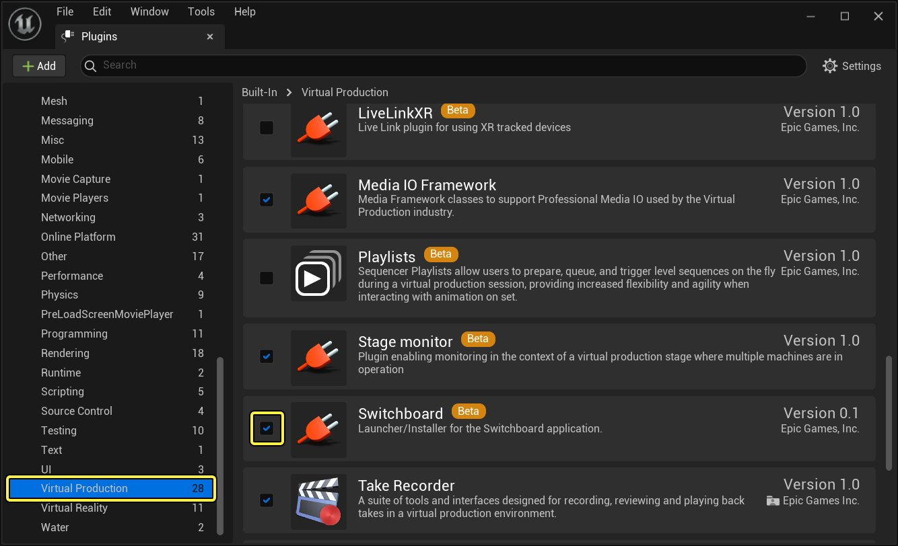
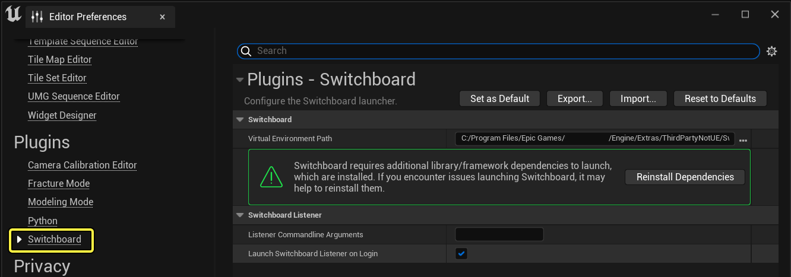
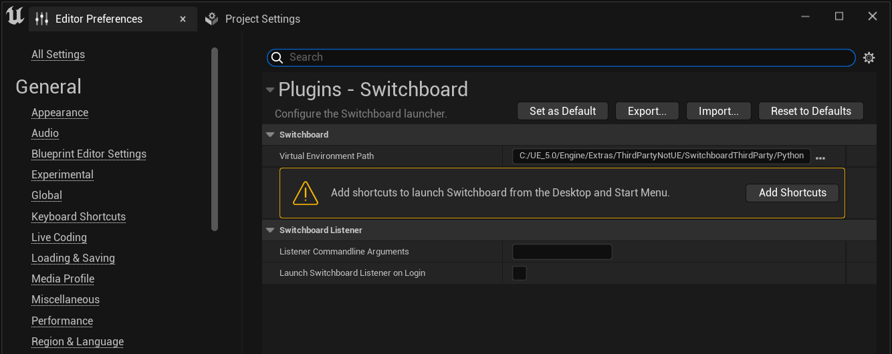
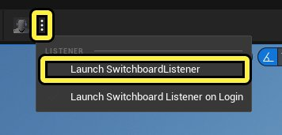
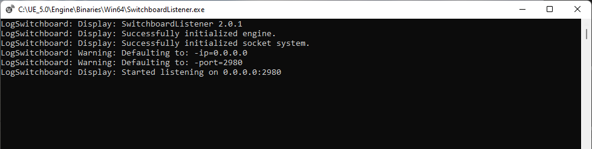
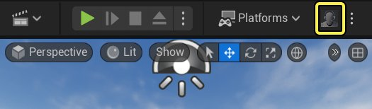
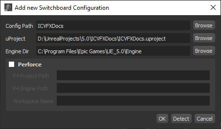
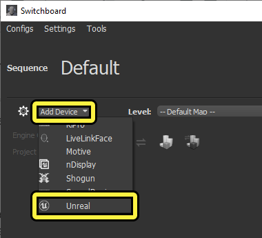

# Switchboard快速入门

> 路径：虚幻引擎5.7文档 / 使用媒体 / 与媒体组件通信 / Switchboard概述 / Switchboard快速入门

> 原始页面：https://dev.epicgames.com/documentation/unreal-engine/switchboard-quick-start-for-unreal-engine

本页面上的说明提供了Switchboard入门的分步指南。在本教程结束时，你将了解如何设置Switchboard以连接到多个设备。

## 先决条件

你必须先设置好以下事项，然后再完成后续步骤：

- 启用 **Switchboard** 插件。添加插件并重新启动引擎后，工具栏中将显示Switchboard和SwitchboardListener选项。

  

  点击查看大图
- 安装依赖性在主菜单中，选择 **编辑（Edit）> 编辑器偏好设置（Editor Preferences）> 插件（Plugins）> Switchboard** ，然后点击 **安装依赖性（Install Dependencies）** 。

  

  点击查看大图
- （可选）如果你使用的操作系统是Windows，可以选择为Switchboard安装桌面快捷方式。在主菜单中，选择 **编辑（Edit）> 项目设置（Project Settings）> 插件（Plugins）> Switchboard** ，然后点击 **添加快捷方式（Add Shortcut）** 。

  

  点击查看大图
- 如果你根据源编译了引擎，将需要单独编译 **SwitchboardListener** 。你可以在Visual Studio中构建项目，或在引擎源代码的根目录中运行以下命令： `Engine\Binaries\DotNET\UnrealBuildTool.exe Win64 Development SwitchboardListener` 。

## 第1步 - 启动Switchboard Listener

每个要连接到Switchboard的设备上都需要启动SwitchboardListener。在工具栏中，选择 **Switchboard选项（Switchboard Options）> 启动Switchboard Listener（Launch Switchboard Listener）** ，这会使用默认地址0.0.0.0:2980或你在 **编辑器偏好设置（Editor Preferences）** 中为 **侦听程序命令行参数（Listener Commandline Arguments）** 指定的地址，在本地机器上启动侦听程序。

侦听程序会在启动时自动最小化其窗口，避免nDisplay设备发生问题。可以在操作系统的任务栏中找到该应用程序。

你还可以选择 **登录时启动Switchboard Listener（Launch Switchboard Listener on Login）** ，这会在你每次登录到计算机时在本地机器上启动侦听程序。

## 第2步 - 启动Switchboard

有多种方法可启动Switchboard：

1. 在虚幻编辑器中打开项目，并从工具栏选择 **启动Switchboard（Launch Switchboard）** 。

   
2. 使用桌面快捷方式（如果已安装在计算机上）。请参阅Switchboard先决条件，了解安装此快捷方式的步骤。
3. 运行 **Engine\Plugins\VirtualProduction\Switchboard\Source\Switchboard\Switchboard.bat** 。

首次启动Switchboard时，将显示 **添加新Switchboard配置（Add New Switchboard Configuration）** 窗口。你可以填写字段并选择 **确定（OK）** ，或选择 **取消（Cancel）** 并在以后在Switchboard设置中进行更新。两个选项都会在一个窗口中打开Switchboard。

Switchboard配置参数：

| 参数 | 说明 |
| --- | --- |
| Name | 你要用于标识Switchboard项目的名称。 |
| uProject | 你要通过Switchboard控制的uProject的本地路径。 |
| Engine Dir | 你要使用的引擎的引擎目录的本地路径。可以指定你根据源编译的引擎的路径，或者安装的引擎版本的路径。示例："C:\\Program Files\\Epic Games\\UE_5.00\\Engine" |
| Perforce | 选中此复选框即可使用Perforce作为你的源元库。 |
| P4 Project Path | 包含上面指定的uProject文件的目录的库路径。 |
| P4 Engine Path | 包含上面指定的引擎目录的库路径。如果你不打算根据源编译引擎，则可以省略。 |
| Workspace Name | 映射了uProject目录的本地可用Perforce工作区的名称。 |

## 第3步 - 在Switchboard中添加设备

Switchboard支持多种类型的设备。这些设备作为Switchboard的插件进行实施。请参阅[Switchboard设置](../switchboard-settings-reference/index.md)，了解默认可用的设备插件列表以及关于如何创建你自己的设备插件的步骤。

以下例子显示了如何添加虚幻设备：

1. 在Switchboard中，选择 **添加设备（Add Device）> 虚幻（Unreal）** 以打开 **添加虚幻设备（Add Unreal Device）** 窗口。

   
2. 在"添加虚幻设备（Add Unreal Device）"窗口中，将名称分配给运行虚幻引擎的机器和计算机的IP地址。选择 **确定（OK）** 。设备已添加到Switchboard中的虚幻设备列表。

你还可以在添加设备后更改其IP地址和名称。

1. 点击 **连接到侦听程序（Connect to listener）** 以连接到远程机器上运行的SwitchboardListener应用程序。设备连接时，状态图标会变成蓝色。

   > 图片已省略：连接到Switchboard Listener
2. 点击 **启动虚幻（Start Unreal）** 以在远程机器上启动虚幻编辑器的实例。

   > 图片已省略：远程启动虚幻实例
3. 虚幻实例启动之后，左侧的状态图标会变成橙色或绿色。

   - 绿色状态表示虚幻实例是通过OSC连接的，因此可以从Switchboard使用镜头试拍录制器。
   - 橙色状态表示不是通过OSC连接的。

   > 图片已省略：橙色状态示例
4. 点击 **停止虚幻（Stop Unreal）** 以在远程机器上关闭虚幻编辑器。

   > 图片已省略：远程停止虚幻实例

## 第4步 - 自行尝试

此快速入门介绍如何启动Switchboard和SwitchboardListener，连接到远程设备，以及从Switchboard控制它们。请参阅[Switchboard设置参考](../switchboard-settings-reference/index.md)，了解你可以在Switchboard中修改的选项完整列表。了解以下需要在你的项目中使用的功能：

- 远程同步和编译你的项目和引擎。
- 从Switchboard中远程录制镜头试拍。
- 启动和监控你的nDisplay群集。
