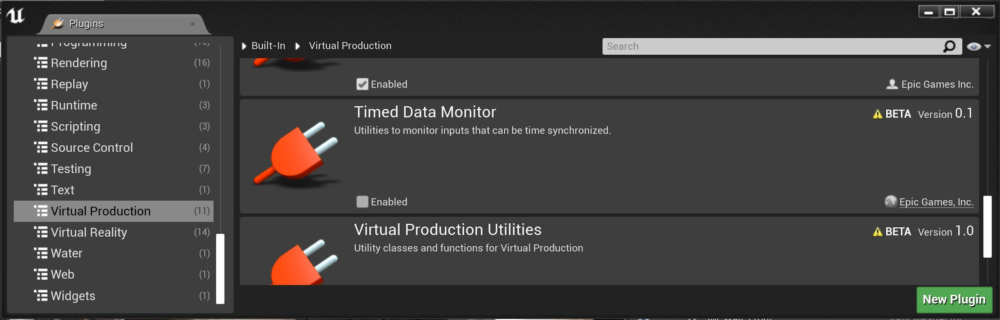
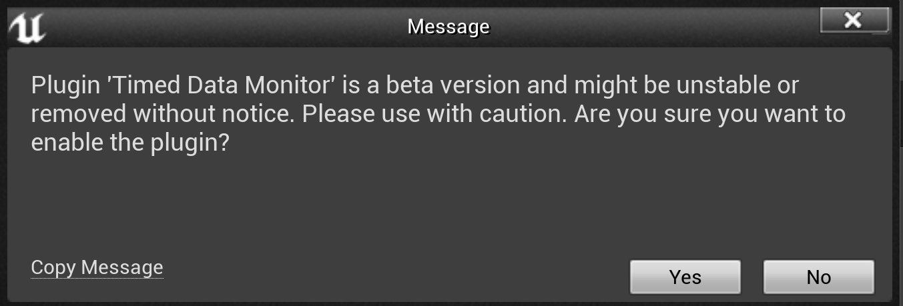
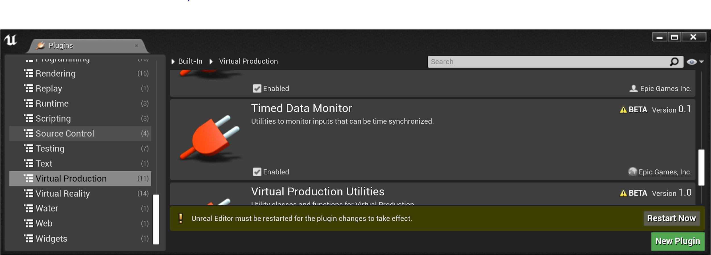
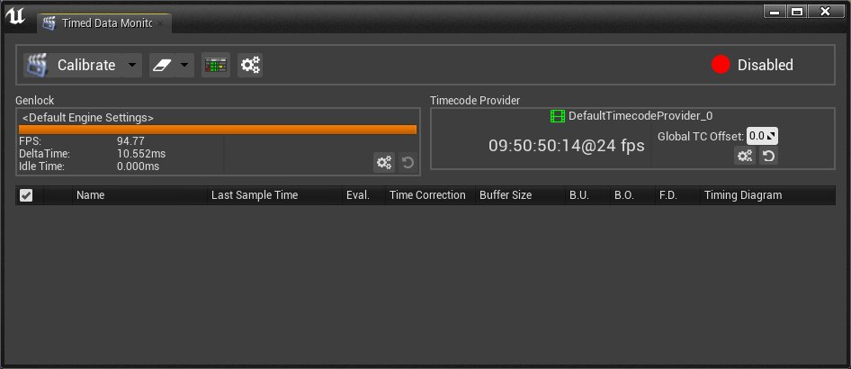
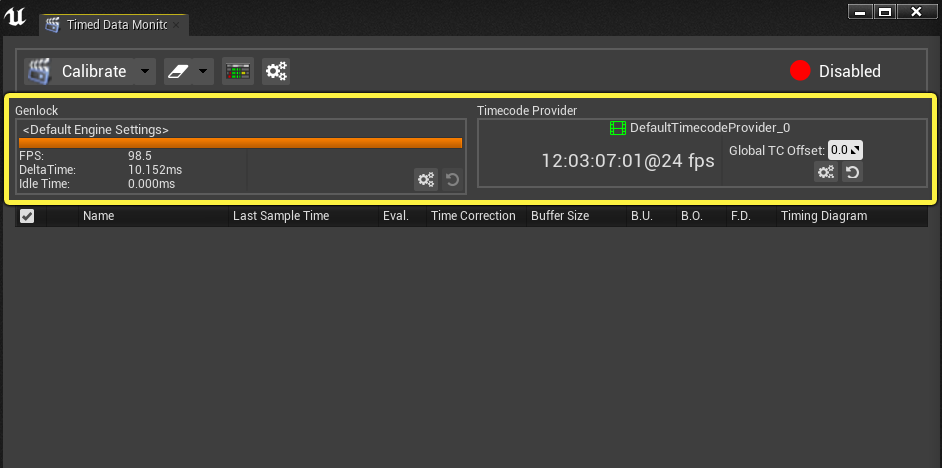
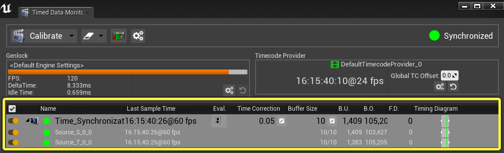
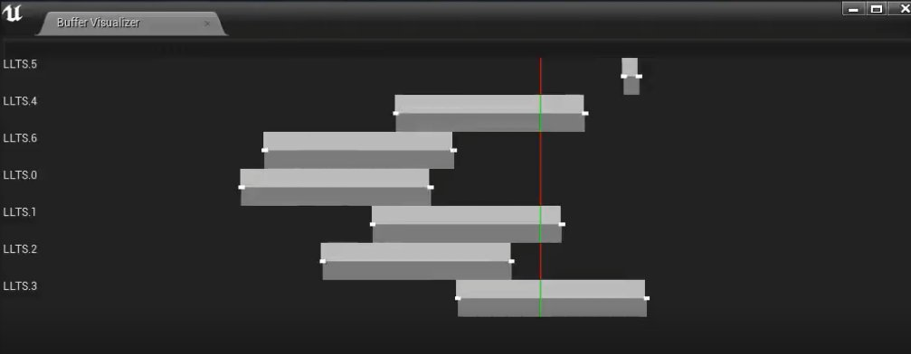
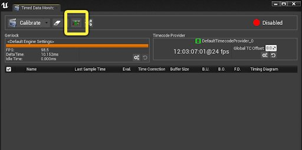

# 计时数据监控

> 路径：虚幻引擎5.7文档 / 使用媒体 / 与媒体组件通信 / 计时数据监控

> 原始页面：https://dev.epicgames.com/documentation/unreal-engine/timed-data-monitor-in-unreal-engine

虚幻引擎可以同时从多个源获取各种数据类型。例如，在虚拟制作中，引擎可以从摄像机或SDI接收捕获帧，并通过Live Link从追踪系统接收摄像机的位置和方向。**计时数据监控** 是一种解决方案，用于配置和可视化所有这些传入的计时数据彼此间的关联方式以及引擎的时间。

计时数据监控目前支持以下来源：

- [Live Link](../../../animating-characters-and-objects/skeletal-mesh-animation-system/live-link/index.md)
- [SDI](../../integrating-media/professional-video-io/index.md)

> [!TIP]
> 可以扩展计时数据监控的功能，通过代码将其他计时数据源包括在内。使用 **TimedDataSource** 框架将自定义数据源注册到计时数据监控。

下节介绍如何使用计时数据监控以及可为项目修改的设置。

## 计时数据监控使用入门

按以下步骤使用计时数据监控处理你的项目。

1. 在编辑器的主菜单中，选择 **编辑（Edit） > 插件（Plugins）** 以打开 **插件（Plugins）** 窗口。
2. 在 **插件（Plugins）** 窗口中，找到 **虚拟制作** 部分中的 **计时数据监控** 插件。

   
3. 勾选 **启用（Enabled）** 框。
4. 在弹出窗口中，选择 **是（Yes）**。

   
5. 出现提示时，重新启动编辑器。

   
6. 在编辑器的主菜单中，选择 **Window > 开发人员工具（Developer Tools）> 计时数据监控（Timed Data Monitor）** 以打开 **计时数据监控（Timed Data Monitor）** 窗口。

   

## 时间码和集中同步

在计时数据监控顶部，可以查看项目中使用的[CustomTimestep](../../integrating-media/professional-video-io/timecode-and-genlock/index.md)和[TimecodeProvider](../../integrating-media/professional-video-io/timecode-and-genlock/index.md)。无需切换到另一个窗口便可配置TimecodeProvider的偏移量。

> [!TIP]
> 对于SDI输入，这些设置会更改已打开流的设置。它不会更改打开输入时使用的实际 **MediaSource** 资产。如果你找到一组有用的选项，考虑更改相关资产。

## 源和信道

在虚幻引擎中启用计时数据监控后，任何在项目中使用 **TimedDataSource** 框架的Live Link、SDI或自定义源都会自动显示在工具中。每个源都可以包含多个信道，点击源名称前面的箭头即可查看这些信道。下表显示UI中各个源的信息。

| 列 | 说明 |
| --- | --- |
| 启用/禁用切换（Enable / Disable Toggle） | 启用时，校准期间将包括此信道，并会影响监控器中报告的全局状态。 |
| 源名称 | 源名称左侧是以下UI项目： 用于展开源的信道列表的箭头。 源类型图标。目前源类型可以是Live Link或SDI。 彩色圆圈代表源的连接状态： **绿色（Green）：**输入已连接。 **黄色（Yellow）：**输入已连接，但无可用数据。 **红色（Red）：**输入未连接。 |
| 最后样本时间（Last Sample Time） | 最新样本的时间码。 |
| Eval. | 指定输入的评估方式。评估类型包括： **时间码（Timecode）：**评估源时使用时间码。 **平台时间（Platform Time）：**评估源时使用引擎的时间。 **无（None）：**无特殊同步。使用最近的样本时间。 |
| 时间校正（Time Correction） | 可以对特定源的时间进行额外的微调。当校准过程寻找源的对准点时，此设置很有用，但它们可能没有同时去除。 |
| 缓冲区大小（Buffer Size） | 配置此源的缓冲区大小。如果两个源之间的偏移量太大，可以使用此设置让一个源缓冲更多数据以达成一致 |
| B.U. | 检测到的缓冲区下溢数。 |
| B.O. | 检测到的缓冲区溢出数。 |
| F.D. | 检测到的掉帧数。 |
| 计时图（Timing Diagram） | 竖线表示评估时间。在缓冲区内时，竖线显示为绿色，在可用样本之外时，则显示为红色。 |

## 缓冲区查看器

**缓冲器查看器（Buffer Visualizer）** 是一个单独的窗口，显示所有信道的可视化。这是一个更大更复杂的视图，显示 **计时图（Timing Diagram）** 列中各个通道的相关内容。

缓冲区用以下UI元素表示：

- **竖线：**表示评估时间。在缓冲区内时，竖线显示为绿色，在可用样本之外时，则显示为红色。
- **浅灰色矩形：**表示信道中可用的当前计时样本。
- **深灰色矩形：**表示信道中可用的计时样本的平均值。
- **白色矩形：**表示最旧计时样本与可用的最新计时样本之间的标准偏差。

> [!TIP]
> 白色矩形越大，样本缓冲区内的变化或抖动越多。如果看到较大的变化，可能需要在评估时间和最新可用样本之间留出更多缓冲区，以确保总是能够在需要时评估样本。

要在计时数据监控中打开 **缓冲区查看器**，请进行以下操作：

- 在计时数据监控窗口顶部选择 **打开缓冲区查看器（Open a buffer visualizer）** 按钮。

  

## 校准

> 图片已省略：校准前

> 图片已省略：校准后

校准前

校准后

计时数据监控包括校准所有已启用源以查找对准点的功能。校准可以从计时数据监控UI或通过[蓝图](https://docs.unrealengine.com/BlueprintAPI/TimedDataMonitor)发起。

校准期间，计时数据监控将修改TimecodeProvider的全局偏移量以及源的缓冲区大小，使所有信道在评估时间范围内都有样本。默认情况下，将使用时间差的标准偏差找到一个更具统计意义的点，并始终保持与该点对齐。可从项目设置中修改此算法。

### 校准示例

视频中连接了多个LiveLink源，但并未对齐。在视口中，actor并未同步。在 **缓冲区可视化（Buffer Visualization）** 窗口中可以看到未对齐之处：有些源过早就有了样本；有些包含评估时间；有些则太晚才有样本。一个LLTS.5源的缓冲容量比其他源小。

校准流程开始时，算法将：

- 增大LLTS.5缓冲区大小，使其能够与其他样本保持一致。
- 修改TimecodeProvider上的全局偏移量，使所有源保持一致。选择的偏移量是将LLTS.0与其他样本对齐所需的最小偏移量，因为它离评估点最远。

校准完成后，缓冲区都处于评估时间范围内，且所有actor都已同步。

## 计时数据监控状态

计时数据监控的右上角显示传入数据的全局状态以及它与引擎时间的关系。可能的状态包括：

| 状态 | 说明 |
| --- | --- |
| 禁用（Disabled） | 不存在输入，或所有输入都已禁用。 |
| 同步（Synchronized） | 所有已启用的输入都有一个与评估时间匹配的样本。 |
| 超出范围（Outside Range） | 一个或多个输入没有与评估时间匹配的样本。 |
| 无样本（No Samples） | 输入目前没有可用样本。 |

下例显示源如何影响监控器的全局状态。此例中有两个Live Link源：

- 第一个源的 **时间校正（Time Correction）** 设为-0.1。这使得源与引擎时间不同步，如 **计时图** 中的红色竖线所示。
- 第二个源的 **时间校正（Time Correction）** 设为0.1。这使得源与引擎时间同步，如 **计时图** 中的绿色竖线所示。

当两个源都启用时，全局状态设为 **超出范围（Outside Range）**，因为第一个源与引擎时间不同步。禁用第一个源，状态会切换到 **同步（Synchronized）**，因为仅有第二个源与引擎时间同步。

> 图片已省略：图像替换文本

> 图片已省略：图像替换文本

## 插件设置引用

在插件设置中，通常有很多种方法可以自定义校准流程和计时数据监控的功能。下表介绍所有设置以及它们对工具中功能的影响。

> 图片已省略：图像替换文本

### 校准

| 参数 | 说明 |
| --- | --- |
| 校准设置 |  |
| 重试次数（Number of Retries） | 指定校准算法将运行多少次以尝试对齐所有输入。 |
| 允许调整缓冲区大小（Buffer Resize Allowed） | 启用后，校准算法可以增大一个或多个输入的缓冲区大小。 |
| 允许缩小缓冲区大小（Buffer Shrink Allowed） | 启用后，校准算法可以减小一个或多个输入的缓冲区大小。 |
| 如可以调整缓冲器大小则失败（Failed if Buffer Cant be Resize） | 启用后，如果不可调整缓冲区大小，则校准流程将失败。例如，如果缓冲器变得太大，则可能无法调整大小。 |
| 使用标准偏差（Use Standard Deviation） | 当考虑输入是否有样本在评估时间范围内时，使用标准偏差统计。 |
| 标准偏差数（Number of Standard Deviation） | 指定考虑范围内的样本时应考虑多少标准偏差。 |
| 使用标准偏差之前重置统计数据（Reset Statistics Before Using Standard Deviation） | 允许在校准之前重置统计数据。 |
| 统计数据重置之后要等待的秒数（Amount Of Seconds to Wait After Statistic Reset） | 重置之后等待统计数据就绪的时间。 |
| 时间校正设置 |  |
| 允许调整缓冲区大小（Buffer Resize Allowed） | 如果发现缓冲区太大，时间校正算法可以更改一个或多个输入的缓冲区大小。 |
| 允许缩小缓冲区大小（Buffer Shrink Allowed） | 如果发现缓冲区太大，时间校正算法可以缩小一个或多个输入的缓冲区大小。 |
| 如可以调整缓冲器大小则失败（Failed if Buffer Cant be Resize） | 如果缓冲区无法调整大小（例如会变得太大），则时间校正流程将失败。 |
| 标准偏差数（Number of Standard Deviation） | 指定应有多少标准偏差。 |

### UI

| 参数 | 说明 |
| --- | --- |
| 刷新率（Refresh Rate） | UI刷新间隔。 |
| 重置 |  |
| 启用重置缓冲区统计数据（Reset Buffer Stat Enabled） | 点击UI中的重置按钮时，默认重置缓冲区统计数据。 |
| 启用清除消息（Clear Message Enabled） | 点击UI中的重置按钮时，默认清除记录的消息。 |
| 启用重置评估时间（Reset Evaluation Time Enabled） | 点击UI中的重置按钮时，默认重置各个输入的时间校正。 |
