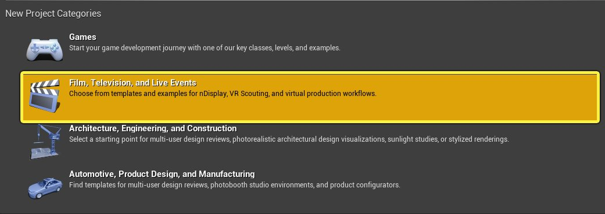
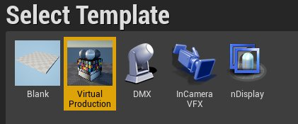
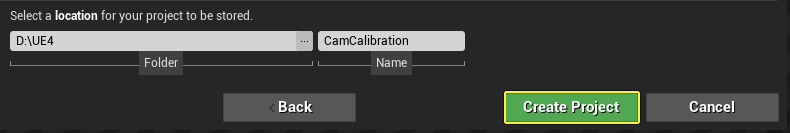
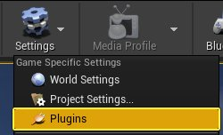
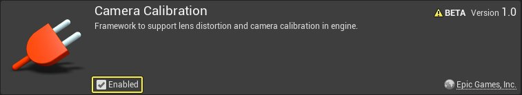
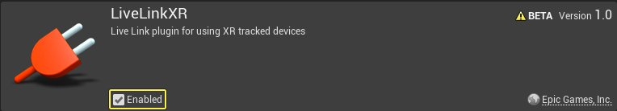
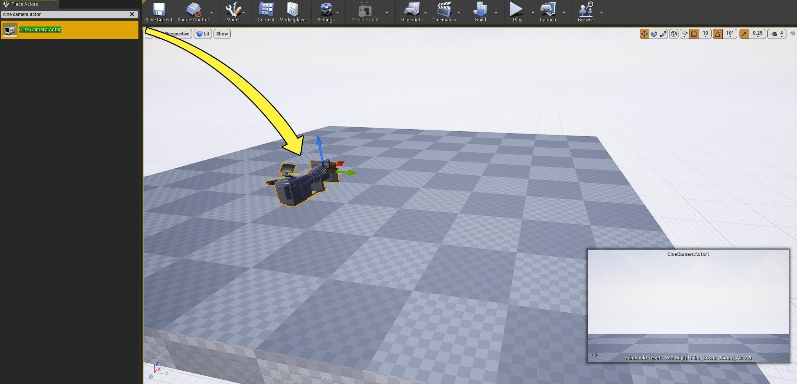

# 摄像机镜头校准快速入门指南

> 路径：虚幻引擎5.7文档 / 使用媒体 / 媒体集成 / 摄像机镜头校对 / 摄像机镜头校准快速入门指南

> 原始页面：https://dev.epicgames.com/documentation/unreal-engine/camera-lens-calibration-quick-start-for-unreal-engine

## 目标

在本快速入门指南中，你将使用"摄像机校准"插件，一步步视频内容的连接和校准。

## 目的

- 将摄像机连接到虚幻引擎，以便提供实时内容。
- 使用"摄像机校准"插件校准摄像机。

## 1 - 必要设置

> [!NOTE]
> 在本指南中，我们将使用Blackmagic Ultra HD摄像机、Panasonic Lumix镜头和HTC Vive Tracker 3来控制场景中的电影摄像机Actor。

> [!WARNING]
> 虚幻引擎目前仅支持有限的超级广角摄像机镜头。

1. 创建新的虚幻引擎项目。选择 **电影、电视和现场活动（Film, Television, and Lived Events）** 类别，然后点击 **下一步（Next）** 按钮。

   
2. 选择 **虚拟制片（Virtual Production）** 模板，然后点击 **下一步（Next）** 按钮。

   
3. 输入文件位置和项目名称，然后点击 **创建项目（Create Project）** 按钮。

   
4. 编辑器加载之后，点击 **设置（Settings）> 插件（Plugins）**，打开 **插件菜单（Plugins Menu）**。

   
5. 选择 **虚拟制片（Virtual Production）** 类别，然后 **启用** **摄像机校准（Camera Calibration）** 和 **LiveLinkXR** 插件。在弹出框上选择 **是（Yes）**，然后点击 **立即重启（Restart Now）** 按钮，以重启编辑器。

   

   

   

#### 阶段成果

你启用了"摄像机校准"和LiveLinkXR插件，并重启了编辑器。现在你已准备好校准摄像机。

## 2 - 设置场景

1. 转到 **放置Actor（Place Actors）** 面板，然后搜索 **电影摄像机（CineCamera）** **Actor**。将Actor拖入关卡中。

   
2. 在 **放置Actor（Place Actors）** 面板中，搜索 **摄像机校准棋盘格（Camera Calibration Checkerboard）**。将Actor拖入关卡中。

   > 图片已省略：将摄像机校准棋盘格Actor放入关卡中
3. 在 **内容浏览器（Content Browser）** 中，点击 **查看选项（View Options）** 按钮，然后选择 **显示引擎内容（Show Engine Content）** 和 **显示插件内容（Show Plugin Content）** 选项。

   > 图片已省略：显示插件内容
4. 在 **内容浏览器（Content Browser）** 中，找到 **摄像机校准内容（CameraCalibration Content）> 设备（Devices）> 追踪器（Tracker）**。将 **BP_UE_Tracker3** 蓝图拖入关卡中。

   > 图片已省略：找到追踪器
5. 选择关卡中的 **电影摄像机Actor（CineCamera Actor）**，然后找到 **细节（Details）** 面板。向下滚动到 **成像区域尺寸（Filmback）** 分段，然后为你的物理摄像机输入匹配的 **传感器宽度（Sensor Width）** 和 **传感器高度（Sensor Height）** 值。

   > 图片已省略：输入传感器宽度和高度
6. 选择 **电影摄像机Actor（CineCamera Actor）** 后，转到 **细节（Details）** 面板，然后点击 **添加组件（Add Component）** 按钮。搜索并选择 **Live Link控制器（Live Link Controller）**。

   > 图片已省略：添加Live Link控制器组件
7. 转至 **窗口（Window） > Live Link** 以打开 **Live Link** 窗口。

   > 图片已省略：打开Live Link窗口
8. 转到 **源（Source）> LiveLinkXR源（LiveLinkXR Source）**，然后点击 **添加（Add）** 按钮以添加连接的Vive追踪器。现在你应该会看到正在使用Live Link连接的追踪器。

   > [!NOTE]
   > 你可以阅读[SteamVR开发文档](https://dev.epicgames.com/documentation/404)，了解如何针对HTC Vive和SteamVR设备进行开发。

   > 图片已省略：将追踪器添加为源

   > 图片已省略：接收追踪信息
9. 由于我们不会使用实际的FIZ源，因此需要使用 **LiveLink蓝图虚拟主题（LiveLink Blueprint Virtual Subjects）** 创建虚拟源。右键点击 **内容浏览器（Content Browser）**，然后选择 **LiveLink > 蓝图虚拟主题（Blueprint Virtual Subject）**。点击下拉菜单，选择 **LiveLinkCameraRole**，然后点击 **确定（OK）** 按钮。将蓝图命名为 **VirtualPrestonFIZ**。

   > 图片已省略：创建新的虚拟主题

   > 图片已省略：选择LikeLink摄像机角色
10. 双击打开 **VirtualPrestonFIZ** 蓝图。点击 **+ 变量（+ Variable）** 按钮以添加新变量。将变量命名为 **Focus**。转到 **细节（Details）** 面板，将 **变量类型（Variable Type）** 设置为 **浮点（Float）**。**启用** **实例可编辑（Instance Editable）** 复选框。

    > 图片已省略：添加新变量

    > 图片已省略：将其命名为Focus并设置为浮点
11. 重复上述步骤，创建名为 **Zoom** 和 **Iris** 的两个额外的浮点变量。

    > 图片已省略：创建Zoom和Iris
12. 右键点击 **事件图表（Event Graph）**，然后搜索并选择 **Update Virtual Subject Static Data**。将 **Update Virtual Subject Static Data** 节点连接到 **Event On Initialize** 节点。右键点击 **Update Virtual Subject Static Data** 节点中的 **静态数据（Static Data）** 引脚，然后选择 **分割结构体引脚（Split Struct Pin）**。

    > 图片已省略：添加

    > 图片已省略：右键点击
13. **启用** **焦距（Focal Length）**、**光圈（Aperture）** 和 **对焦距离（Focus Distance）** 复选框**，**如下所示。

    > 图片已省略：启用焦距、光圈和对焦距离
14. 右键点击 **事件图表（Event Graph）**，然后搜索并选择 **更新虚拟主题帧数据（Update Virtual Subject Frame Data）**。将 **Update Virtual Subject Frame Data** 节点连接到 **Event On Update** 节点。右键点击 **Update Virtual Subject Frame Data** 节点中的 **帧数据（Frame Data）** 引脚，然后选择 **分割结构体引脚（Split Struct Pin）**。此事件将在每个更新函数上触发，并且将用于更新可用于每个帧的FIZ数据。

    > 图片已省略：添加

    > 图片已省略：右键点击
15. 将 **Zoom** 变量连接到 **焦距（Focal Length）** 引脚。将 **Iris** 变量连接到 **光圈（Aperture）** 引脚。将 **Focus** 变量连接到 **对焦距离（Focus Distance）** 引脚。**编译（Compile）** 并 **保存（Save）** 蓝图。

    > 图片已省略：添加
16. 转到 **源（Source）> 添加虚拟主题（Add Virtual Subject）**，以打开 **虚拟主题（Virtual Subject）** 窗口。选择 **VirtualPrestonFIZ** 主题，然后点击 **添加（Add）** 按钮。

    > 图片已省略：将追踪器添加为源

    > 图片已省略：选择虚拟Preston FIZ主题

    > 图片已省略：虚拟主题现已设置
17. 右键点击 **内容浏览器（Content Browser）**，然后选择 **杂项（Miscellaneous）> 镜头文件（Lens File）**，以创建"镜头文件"资产。将资产命名为 **LumixLens**。

    > 图片已省略：创建
18. 选择 **电影摄像机Actor（CineCamera Actor）**，然后转到 **细节（Details）** 面板。向下滚动到 **Live Link** 分段，然后点击 **主题表示（Subject Representation）** 旁边的 **下拉菜单**。从列表中选择追踪器。

    > 图片已省略：将追踪器添加到电影摄像机
19. 选择 **电影摄像机Actor（CineCamera Actor）** 后，转到 **细节（Details）** 面板，然后点击 **添加组件（Add Component）** 按钮。搜索并选择 **Live Link控制器（Live Link Controller）**，以添加另一个组件。向下滚动到 **Live Link** 分段，然后点击 **主题表示（Subject Representation）** 旁边的 **下拉菜单**。从列表中选择虚拟主题。

    > 图片已省略：将虚拟主题添加到电影摄像机
20. 在 **细节（Details）** 面板中，向下滚动到 **摄像机角色（Camera Role）** 分段，然后点击 **镜头文件（Lens File）** 旁边的下拉菜单。搜索并选择 **LumixLens**。

    > 图片已省略：将镜头文件添加到电影摄像机
21. 选择 **BP_UE_Tracker3** 蓝图，然后转到 **细节（Details）** 面板。选择 **LiveLink组件控制器（LiveLink Component Controller）**，然后向下滚动到 **Live Link** 分段。点击 **主题表示（Subject Representation）** 旁边的下拉菜单，然后选择你的追踪器。

    > 图片已省略：将主题添加到追踪器
22. 选择 **CameraCalibrationCheckerboard** Actor，然后转到 **细节（Details）** 面板。向下滚动到 **校准（Calibration）** 分段，然后输入 **行** 和 **列** 的数量以及 **正方形边长（Square Side Length）**。在本示例中，我们使用下图进行测量。

    > 图片已省略：棋盘格示例

    > 图片已省略：输入校准信息
23. 将材质添加到 **奇数立方体材质（Odd Cube Material）** 和 **偶数立方体材质（Even Cube Material）** 插槽，以提高可视性。

    > 图片已省略：添加材质

    > 图片已省略：添加材质后生成的棋盘格

### 阶段成果

在本分段中，你已将 **电影摄像机（CineCamera）** Actor、**摄像机校准棋盘格（Camera Calibration Checkerboard）** Actor和 **BP_UE_Tracker3** 蓝图添加到关卡中。你使用Live Link连接了追踪器，并正确配置了Actor。现在你已准备好校准镜头。

## 3 - 校准镜头

1. 在 **内容浏览器（Content Browser）** 中，双击打开 **LumixLens** 资产。点击 **校准步骤（Calibration Steps）** 面板，然后选择 **镜头信息（Lens Information）** 选项卡。转到 **镜头信息（Lens Info）** 分段，输入镜头信息，然后点击 **保存镜头信息（Save Lens Information）** 按钮。

   > 图片已省略：选择

   > 图片已省略：输入镜头信息
2. 点击 **镜头文件面板（Lens File Panel）**，然后选择 **聚焦（Focus）**。

   > 图片已省略：选择聚焦
3. 点击 **+** 按钮，然后为 **输入聚焦（Input Focus）** 输入值0。为 **编码器映射（Encoder Mapping）** 输入值100。点击 **添加（Add）** 按钮，将此数据点添加到图表。重复此步骤，为 **编码器映射（Encoder Mapping）** 输入值1000，为 **输入聚焦（Input Focus）** 输入值1。

   > 图片已省略：输入值0的聚焦信息

   > 图片已省略：输入值1的聚焦信息
4. 选择 **Iris** 并为 **编码器映射（Encoder Mapping）** 输入值1.8，为 **输入聚焦（Input Focus）** 输入值0。点击 **添加（Add）** 按钮，将该数据点添加到图表。重复此步骤，为 **编码器映射（Encoder Mapping）** 输入值4.5，为 **输入光圈（Input Iris）** 输入值1。

   > 图片已省略：输入值0的光圈信息

   > 图片已省略：输入值1的光圈信息
5. 返回 **校准步骤（Calibration Steps）** 面板，然后选择 **镜头失真（Lens Distortion）** 选项卡。全屏打开棋盘格图像，并将摄像机对准该图像。在看得到棋盘格整体的情况下，点击视口以捕获图像。重复此步骤多次以捕获多个图像。

   > [!NOTE]
   > 在多个变焦级别和聚焦值重复此过程，尽可能实现最佳校准。

   > 图片已省略：将摄像机对准棋盘格
6. 从不同的角度拍摄多个图像后，点击 **添加到镜头失真校准（Add To Lens Distortion Calibration）** 按钮。点击弹出窗口上的 **确定（OK）**，以接受校准数据。

   > 图片已省略：添加图像进行校准
7. 选择 **节点偏移（Nodal Offset）** 选项卡，然后在 **节点偏移（Nodal Offset）** 分段下点击 **节点偏移算法（Nodal Offset Algo）** 下拉菜单。选择 **节点偏移棋盘格（Nodal Offset Checkerboard）**。

   > 图片已省略：选择
8. 将摄像机再次对准屏幕上的棋盘格，然后点击视口。这将检测到图像的各个边角。点击 **应用于校准器（Apply to Calibrator）** 按钮，将 **摄像机校准棋盘格（Camera Calibration Checkerboard）** Actor与屏幕上的棋盘格对齐：

   > 图片已省略：点击

   > 动图已省略：棋盘格现已在屏幕上对齐
9. 现在你可以校准虚拟摄像机的节点偏移。将 **节点偏移算法（Nodal Offset Algo）** 设置为 **节点偏移点方法（Nodal Offset Points Method）*，并将**校准器（Calibrator）**设置为你的追踪器。将**校准点（Calibration Point）**设置为**PointLed**。

   > 图片已省略：输入节点偏移信息
10. 使追踪器的光源朝向摄像机，然后在视口中点击该光源。重复此步骤多次以创建多个数据点。点击 **添加到节点偏移校准（Add To Nodal Offset Calibration）** 按钮。

    > 图片已省略：点击光源多次以创建点。

    > [!NOTE]
    > 如果追踪不如预期那么准确，你可以使用更多的点重复此过程。

    > 动图已省略：追踪器现已对齐
11. 关闭"镜头文件（Lens File）"窗口，并验证电影摄像机Actor现在是否在你移动追踪器时正确地移动。 追踪器已正确设置

#### 阶段成果

在本章节中，你通过镜头文件输入了镜头信息，校准了镜头畸变，并添加了正确的网络偏移。现在你的电影摄像机Actor能够模拟现实摄像机的位置、旋转和镜头畸变效果。
