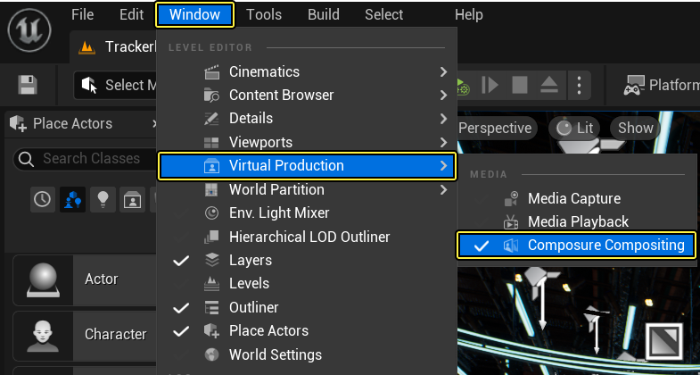
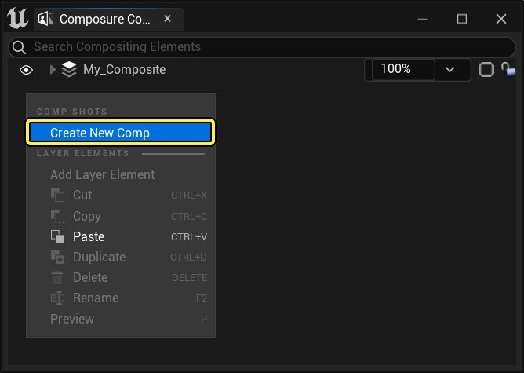
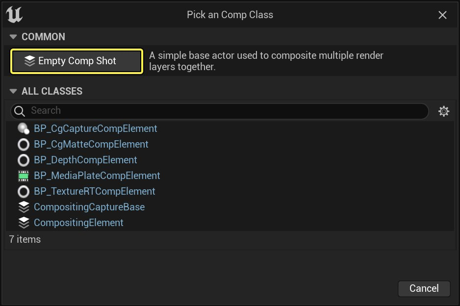
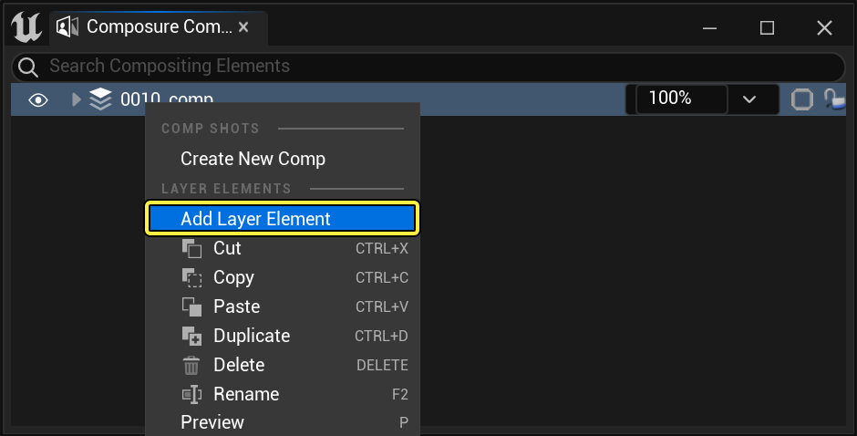
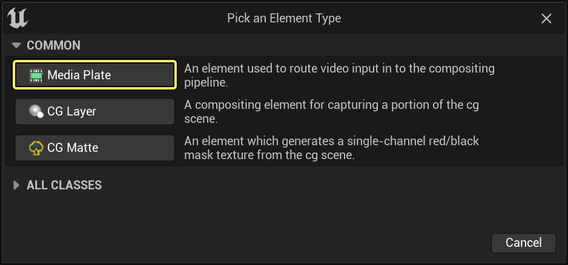
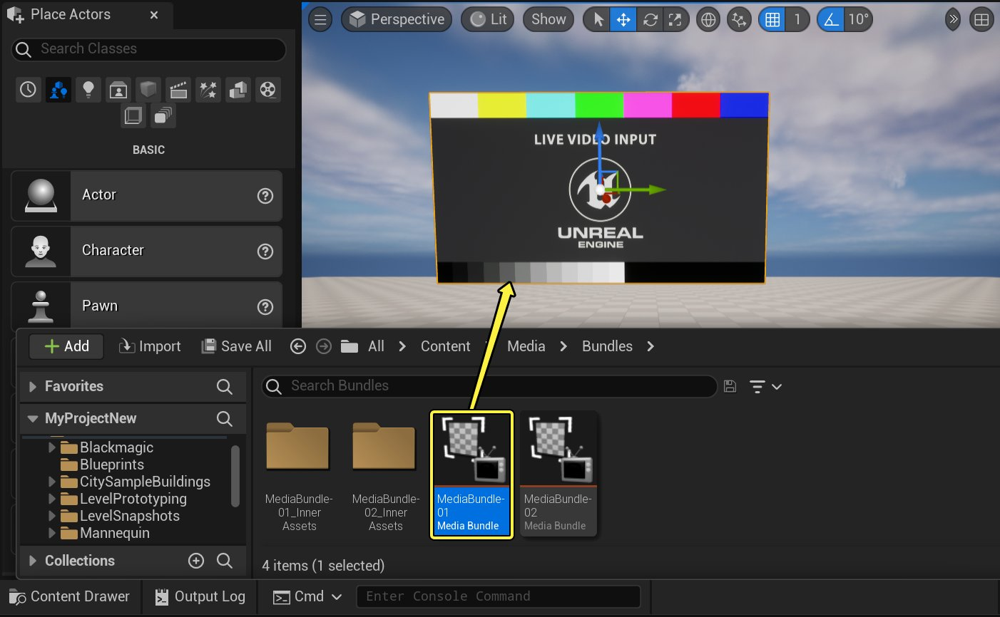
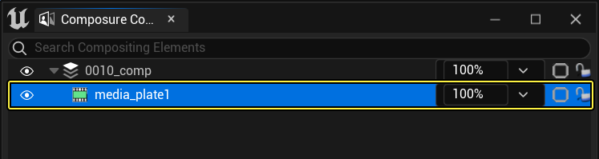
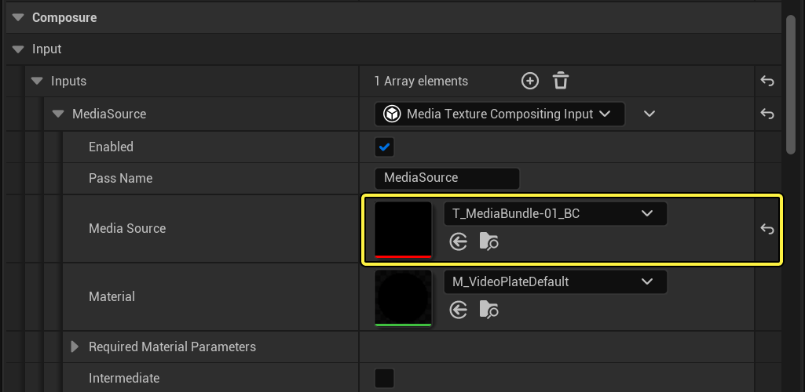

# 将Composure与摄像机校准配合使用

> 路径：虚幻引擎5.7文档 / 使用媒体 / 媒体集成 / 摄像机镜头校对 / 将Composure与摄像机校准配合使用

> 原始页面：https://dev.epicgames.com/documentation/unreal-engine/using-composure-with-camera-lens-calibration-in-unreal-engine

1. 转至 **窗口（Window）> 虚拟制片（Virtual Production）> Composure合成（Composure Compositing）** ，打开 **Composure** 窗口。

   
2. 在 **Composure** 窗口中右键点击，并从菜单选择 **新建组合（Create New Comp）** 。点击 **空组合镜头（Empty Comp Shot）** 按钮，新建空组合。

   

   
3. 右键点击Composure并选择 **添加层元素（Add Layer Element）** 。点击 **媒体板（Media Plate）** 按钮。此媒体板将使用你的摄像机中的实时视频内容。

   

   
4. 找到 **内容浏览器（Content Browser）> 你针对MediaIO的项目文件夹（Your project folder for MediaIO）>** 并将 **MediaBundle-01** 拖入你的关卡中。

   

   点击查看大图。
5. 选择 **Composure** 窗口中的 **媒体板** ，并转至 **细节（Details）** 面板。向下滚动到 **Composure** 分段并展开 **输入（Input）** 类别。点击 **媒体源（Media Source）** 下拉菜单并从列表选择 **T_MediaBundle-01_BC** 。现在你应该会看到媒体板上流送的实时视频内容。

   

   

   点击查看大图。
6. 右键点击Composure并选择 **添加层元素（Add Layer Element）** 。点击 **CG层（CG Layer）** 按钮。

   > 图片已省略：添加CG层
7. 转至 **窗口（Window）> 层（Layers）** ，打开 **层（Layers）** 窗口。

   > 图片已省略：打开层窗口
8. 从 **大纲视图（Outliner）** 选择 **BP_UE_Tracker3** 和 **CameraCalibrationCheckerboard** 蓝图。转至 **层（Layers）** 窗口，然后右键点击并从菜单选择 **将所选Actor添加到新层（Add Selected Actors to New Layer）** 。将层命名为 **cglayer** 。

   > 图片已省略：Add Selected Actors to New Layer

   点击查看大图。

   > [!TIP]
   > 你还可以在内容浏览器中的引擎内容文件夹下找到 **BP_UE_Tracker3** 。
   >
   > > 图片已省略：BP UE Tracker3
   >
   > 点击查看大图。
9. 选择 **Composure** 窗口中的 **cg元素** ，并转至 **细节（Details）** 面板。向下滚动到 **Composure** 分段并点击 **+** 按钮展开 **捕获Actor（Capture Actors）** 选项。点击 **ActorSet** 下拉菜单并从列表选择 **cglayer** 。

   > 图片已省略：Add a New Layer

   点击查看大图。
10. 选择 **cg元素** 层后，向下滚动到 **LensDistortion** 分段，并选择 **失真源（Distortion Source）** 作为 **LumixLens** 文件。

    > 图片已省略：将失真应用于CG层
11. 右键点击 **内容浏览器（Content Browser）** 并从 **创建基本资产（Create Basic Asset）** 分段选择 **材质（Material）** 。将材质命名为 **M_SimpleComp** 。

    > 图片已省略：新建材质
12. 双击打开 **M_SimpleComp** 。选择材质节点并转至 **细节（Details）** 面板。将 **着色（Shading Model）** 设为 **无光照（Unlit）** 。

    > 图片已省略：将材质设为无光照
13. 右键点击图表，然后搜索并选择 **TextureSample** 。右键点击 **Texture Sample** 节点并选择 **转换为参数（Convert to Parameter）** 。将其命名为 **CGLayer** 。转至 **细节（Details）** 面板并将纹理添加到 **CG层（CG Layer）** 下拉菜单。

    > 图片已省略：添加纹理取样

    > 图片已省略：将纹理转换为参数

    > 图片已省略：添加纹理
14. 重复上一步，添加另一个 **纹理取样（Texture Sample）** 。将参数命名为 **MediaPlate** 。

    > 图片已省略：Add Another Texture Sample

    点击查看大图。
15. 右键点击图表，然后搜索并选择 **Over** 。将两个节点的 **RGBA** 引脚连接到 **Over** 节点的 **A** 和 **B引脚** 。最后，将 **Over** 节点的 **RGBA** 引脚连接到材质节点的 **自发光颜色（Emissive Color）** 引脚。

    > 图片已省略：添加Over节点

    > 图片已省略：New Material Graph

    点击查看大图。
16. 选择 **Composure** 窗口中的组合，并转至 **细节（Details）** 面板。向下滚动到 **变换/合成通道（Transform / Compositing Passes）** 分段并展开 **变换通道（Transform Passes）** 。 将 **M_SimpleComp** 材质添加到 **材质（Material）** 插槽。

    > 图片已省略：Add your Material to the Composition

    点击查看大图。
17. 展开 **输入元素（Input Elements）** 并将媒体板和CG元素层添加到其对应的插槽。现在你应该已将视频内容流送到媒体板，并CG元素层中显示了所选Actor。

    > 图片已省略：Add your Material to the Composition

    点击查看大图。

## 分段结果

在本指南中，你学习了如何将Composure与摄像机校准插件配合使用。
