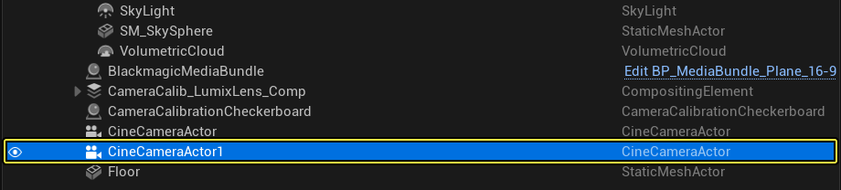
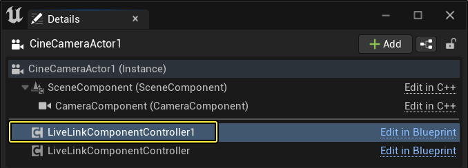
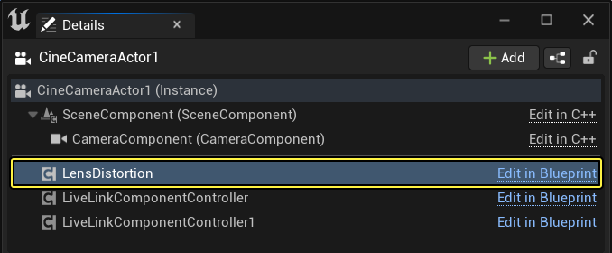
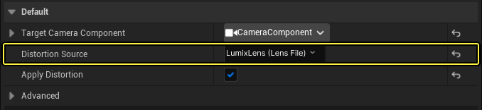

# 在过场动画摄像机Actor中使用镜头失真

> 路径：虚幻引擎5.7文档 / 使用媒体 / 媒体集成 / 摄像机镜头校对 / 在过场动画摄像机Actor中使用镜头失真

> 原始页面：https://dev.epicgames.com/documentation/unreal-engine/using-lens-distortion-in-a-cine-camera-actor-in-unreal-engine

1. 在 **大纲视图（Outliner）** 中选择 **过场动画摄像机Actor（CineCamera Actor）** ，并转至 **细节（Details）** 面板。

   
2. 选择 **LiveLink组件控制器组件（LiveLink Component Controller component）** 并向下滚动到 **摄像机角色（Camera Role）** 类别。验证是否已将正确的 **镜头文件（Lens File）** 分配给 **镜头文件（Lens File）** 插槽。在此示例中，使用了[快速入门指南](../camera-lens-calibration-quick-start/index.md)中的 **LumixLens** 文件。

   
3. 点击 **添加组件（Add Component）** 按钮，然后搜索并选择 **镜头失真（Lens Distortion）** 以添加组件。

   
4. 向下滚动到 **默认（Default）** 分段并点击 **失真源（Distortion Source）** 旁边的下拉菜单。选择 **LumixLens** 文件并 **启用** **应用失真（Apply Distortion）** 复选框。

   
5. 现在你应该会在视口中看到应用于过场动画摄像机Actor的镜头失真。

## 阶段成果

在本指南中，你学习了如何从摄像机校准插件将镜头失真效果应用于过场动画摄像机Actor。
