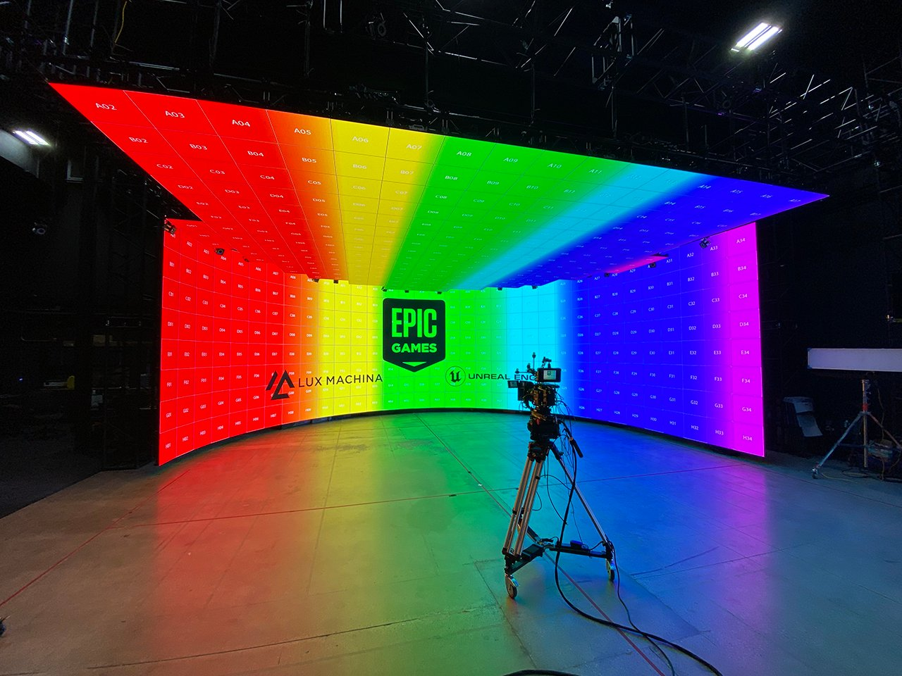
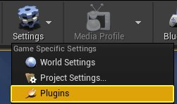
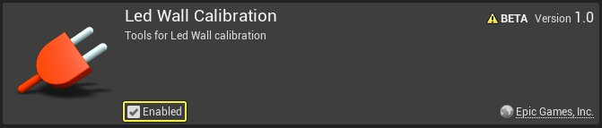
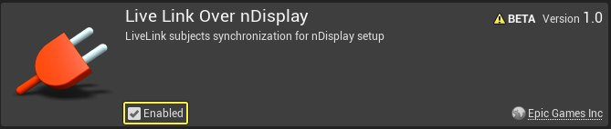
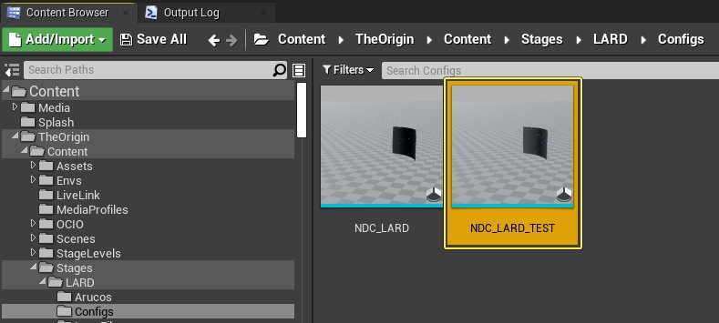
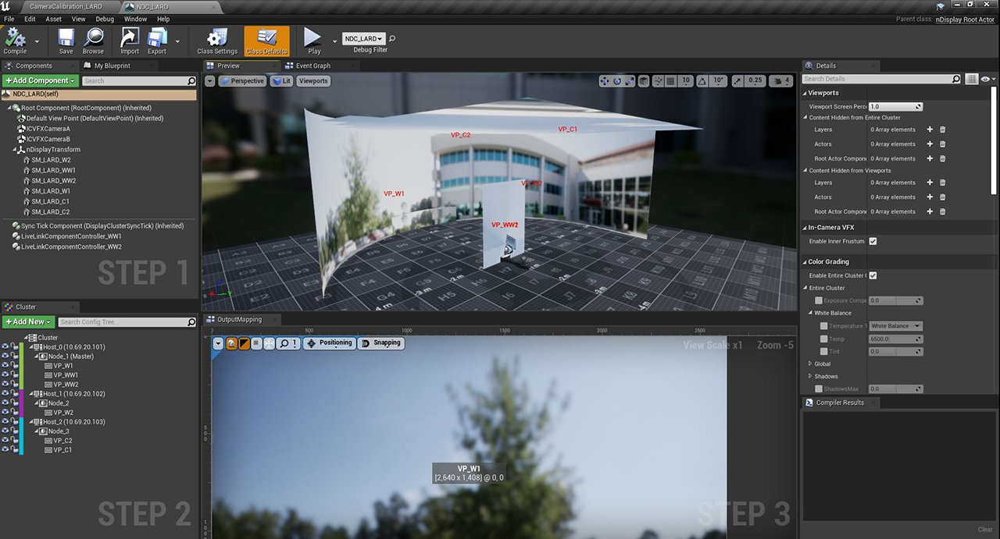
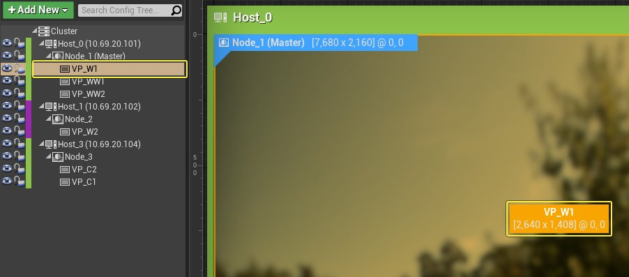
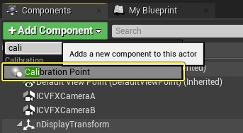

# 使用Aruco将LED墙对齐到摄像机追踪

> 路径：虚幻引擎5.7文档 / 使用媒体 / 媒体集成 / ICVFX / 使用Aruco将LED墙对齐到摄像机追踪

> 原始页面：https://dev.epicgames.com/documentation/unreal-engine/aligning-the-led-wall-to-camera-tracking-using-arucos-in-unreal-engine

## 目标

在本快速入门指南中，你会遍历使用Aruco标识将LED墙对齐到摄像机追踪的步骤。

## 目的

- 为你的LED墙生成Aruco标识。
- 在编辑器视口和舞台LED屏幕中预览Aruco标识。
- 使用Aruco标识校准你的LED墙。

## 1 - 必要设置

对于本指南，你将使用制片摄像机、光学摄像机追踪系统和AJA Kona 5作为源视频输入。此外，你将需要现有LED墙配置以及与你的舞台LED墙配置匹配的nDisplay蓝图。按照[利用nDisplay渲染到多个显示器](../../rendering-to-multiple-displays-with-ndisplay/index.md)文档操作，了解如何创建你的nDisplay蓝图。

继续之前，请按照[针对制片的摄像机校准](../../camera-lens-calibration/camera-lens-calibration-quick-start/index.md)指南操作，确保你的摄像机的镜头失真和节点偏移得到校准。这将创建"镜头文件资产"，以在LED墙与摄像机追踪对齐时使用。

本指南中的示例基于Epic LA RnD舞台LED墙设置。

点击查看大图。

## 2 - 生成Aruco标识

1. 点击 **设置（Settings）> 插件（Plugins）**，打开 **插件菜单（Plugins Menu）**。

   
2. 搜索 **LED墙校准（LED Wall Calibration）** 和 **Live Link Over nDisplay** 插件并启用。重启编辑器。

   

   
3. 在 **内容浏览器（Content Browser）** 中，搜索并双击打开你的 **nDisplay舞台（nDisplay stage）**Actor蓝图。

   

   

   点击查看大图。
4. 从 **组件（Components）** 面板选择你的第一个 **墙壁网格体**，并从 **群集（Cluster）** 面板双击对应的 **群集**。这样你将获得所选显示器的分辨率。

   
5. 选择墙壁网格体后，点击 **+ 添加组件（+ Add Component）**，然后搜索并选择 **校准点（Calibration Point）**。这会将"校准点"组件添加为你的墙壁网格体的子项。

   
6. 将校准点重命名为 **ArucoW1**。

   > 图片已省略：将校准点重命名为ArucoW1
7. 选择校准点后，转到 **细节（Details）** 面板，然后向下滚动到 **校准（Calibration）** 分段。点击 **创建Aruco（Create Arucos）**。

   > 图片已省略：添加
8. 系统将打开 **Aruco生成选项（Aruco Generation Options）** 窗口。

   1. 根据Arucos所应用的墙壁视口，输入对应的 **纹理宽度（Texture Width）** 和 **纹理高度（Texture Height）** 值。
   2. 从列表中选择合适的 **Aruco字典（Aruco Dictionary）**。在本示例中，将选择 **DICT_6x6_1000** 字典，其中有1000个唯一的Aruco符号。
   3. 输入 **标识ID（Marker ID）** 以用作将生成的Aruco标识的起始ID。
   4. 输入 **放置模数（Place Modulus）** 值。此值表示在放置Aruco标识时将跳过的LED面板数量。这很适合大型LED墙，如果每个LED面板上都要放置，那么你会使用超过1000个唯一的Aruco符号。默认值为2。若LED墙较小，每个面板上可以显示一个Aruco，请将其更改为1。若使用默认值2，将每隔一个LED面板放置一个Aruco符号。
   5. 点击 **确定（OK）**，生成Aruco标识。

      > 图片已省略：输入Aruco生成选项
9. 选择保存纹理的位置，然后点击 **确定（OK）**。系统将显示确认窗口，告诉你下一个视口从哪个 **标识ID** 开始。此设置将被UE记住，但可以调整，以防需要更改顺序。点击 **确定（OK）** 以确认。

   > 图片已省略：选择纹理的保存目的地

   > 图片已省略：保存纹理后的确认消息
10. 在 **群集（Cluster）** 选项卡中选择要应用此校准点的 **视口（Viewport）**。

    > 图片已省略：在
11. 转到右侧的 **细节（Details）** 面板。向下滚动到 **纹理替换（Texture Replacement）** 分段，并将生成的纹理选作 **源纹理（Source Texture）**。启用 **启用视口纹理替换（Enable Viewport Texture Replacement）** 复选框。

    > 图片已省略：将生成的纹理添加为源纹理
12. 重复步骤5到10，将Aruco标识添加到剩余的LED视口。
13. 在 **内容浏览器（Content Browser）** 中，双击打开 **nDisplay蓝图（nDisplay Blueprint）**。

    > 图片已省略：双击nDisplay舞台Actor蓝图
14. 点击 **+ 变量（+ Variable）** 以创建新的 **布尔** 变量，将其命名为 **Replace_Viewport_Textures**。转到 **细节（Details）** 面板，启用 **实例可编辑（Instance Editable）** 复选框。

    > 图片已省略：创建新变量并命名为Replace_Viewport_Textures

    > 图片已省略：启用
15. 将 **Replace_Viewport_Textures** 拖到 **事件图表（Event Graph）**，并选择 **获取Replace_Viewport_Textures（Get Replace_Viewport_Textures）** 以创建节点。
16. 右键点击 **事件图表（Event Graph）**，然后搜索并选择 **为所有视口设置替换纹理标记（Set Replace Texture Flag for All Viewports）**。
17. 将 **Event Tick** 节点连接到 **Set Replace Texture Flag for All Viewports** 节点。将 **Replace Viewport Textures** 节点连接到 **Set Replace Texture Flag for All Viewports** 节点的 **替换（Replace）** 引脚。

    > 图片已省略：将
18. **编译（Compile）** 并 **保存（Save）** 蓝图。
19. 要在nDisplay蓝图的 **预览窗格（Preview Pane）** 中看到更改，请选择nDisplay蓝图并转到 **细节（Details）** 面板。 向下滚动到 **编辑器预览（Editor Preview）** 分段并启用 **替换视口纹理（Replace Viewport Textures）** 和 **启用编辑器预览（Enable Editor Preview）** 复选框。这将显示Aruco标识。

    > 图片已省略：选择nDisplay蓝图

    > 图片已省略：启用

    > 图片已省略：undefined

    点击查看大图。
20. 如果你要使用多个渲染节点，请立即将项目同步到其他计算机。
21. 在 **世界大纲视图（World Outliner）** 中，选择 **nDisplay蓝图（nDisplay Blueprint）** 并转到 **细节（Details）** 面板。向下滚动到 **默认（Default）** 选项卡并启用 **替换视口纹理（Replace Viewport Textures）** 复选框。Aruco标识将立即显示在LED墙上。

    > 图片已省略：undefined

    点击查看大图。
22. 要在编辑器视口中查看Aruco标识，请向下滚动到 **编辑器预览（Editor Preview）** 分段并启用 **启用编辑器预览（Enable Editor Preview）** 复选框。

    > 图片已省略：undefined

    点击查看大图。
23. 要检查LED墙的对齐效果，查看Aruco标识边角处的各个点会很有用。

    1.选择在添加Aruco时创建的 **校准点（Calibration Point）**。

    1.转到 **细节（Details）** 面板，然后向下滚动到 **校准（Calibration）** 分段。启用 **可视化编辑器中的点（Visualize Points in Editor）** 复选框。

    1.**点可视化比例（Point Visualization Scale）** 调整网格体上标识的比例。**可视化形状（Visualization Shape）** 下拉菜单可将标识形状改为 **立方体（Cubes）** 或 **棱锥体（Pyramids）**。请酌情调整这些值。
24. **编译（Compile）** 并 **保存（Save）** 蓝图。
25. 在 **世界大纲视图（World Outliner）** 窗口中，选择 **nDisplay蓝图（nDisplay Blueprint）** 并转到 **细节（Details）** 面板。向下滚动到 **编辑器预览（Editor Preview）** 分段并启用 **启用编辑器预览（Enable Editor Preview）** 复选框。

    这将允许CG Arucos显示在镜头文件中的视口网格体上。应用LED校准之后，CG Aruco将覆盖在摄像机中的实时视频内容上，以在LED墙上显示Aruco。
26. 将追踪的制片摄像机和所有其他追踪的对象放在 **追踪节点（Tracking Node）** 下。使 **追踪节点（Tracking Node）** 成为 **nDisplay蓝图（nDisplay Blueprint）** 的子项。

### 阶段成果

你生成了Aruco标识，现在可以开始将其用作镜头文件的一部分来校准LED墙。

## 3 - 使用Aruco标识校准你的LED墙

1. 在 **内容浏览器（Content Browser）** 中，双击打开[针对制片的摄像机校准](../../camera-lens-calibration/camera-lens-calibration-quick-start/index.md)指南中创建的 **镜头文件（Lens File）**。镜头文件应附加到流送FIZ数据的LiveLinkController下的摄像机。

   1. 点击 **节点偏移（Nodal Offset）** 选项卡。

      > 图片已省略：undefined

      点击查看大图。
   2. 转到 **视口设置（Viewport Settings）**，将 **透明度（Transparency）** 设置为 **0**。这将关闭编辑器中显示的Aruco标识的CG覆层。
   3. 转到 **节点偏移（Nodal Offset）** 分段并将 **节点偏移算法（Nodal Offset Algo）** 设置为 **节点偏移Aruco标识（Nodal Offset Aruco markers）**
   4. 将 **校准器（Calibrator）** 设置为 **nDisplay蓝图（nDisplay Blueprint）**。在本示例中，它称为 **NDC_LARD_2**。
   5. 启用 **显示检测（Show Detection）** 复选框**。**这样一来，每次点击 **视口（Viewport）** 时都会捕获一个图像，并用于收集Aruco标识的校准点。
2. 将制片摄像机指向正在显示Aruco标识的LED墙。你现在将收集整个LED墙上的Aruco标识的图像。在视口内点击鼠标以捕获图像。系统将显示已捕获图像的预览效果。点击 **确定（OK）** 按钮。

   > 图片已省略：undefined

   点击查看大图。
3. 重复上一步多次，捕获整个LED墙上的多个图像。你将看到捕获的图像显示在 *节点偏移（Nodal Offset）** 分段下。
4. 捕获整个LED墙上足够的示例后，点击 **应用于摄像机父项（Apply to Camera Parent）** 按钮。这将对之前创建的追踪原点和它下面的追踪制片摄像机进行偏移。
5. 要检查LED墙的对齐效果，请将 **透明度（Transparency）** 设置为 **0.5**。这会将显示应用于LED墙网格体的CG Aruco，覆盖物理LED墙上的Aruco。两组Aruco标识现在应该彼此完全重叠。如果不是，虚拟LED网格体与物理LED网格体将不匹配。

### 阶段成果

你使用Aruco标识校准了舞台LED墙。
