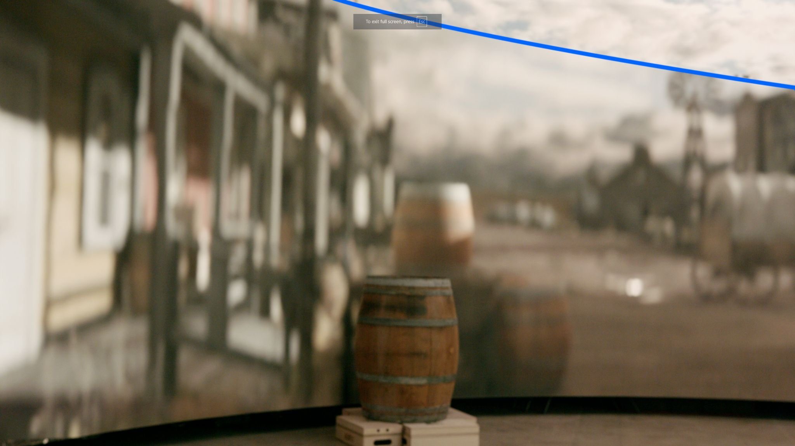
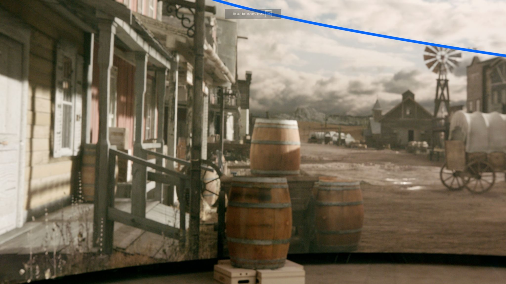
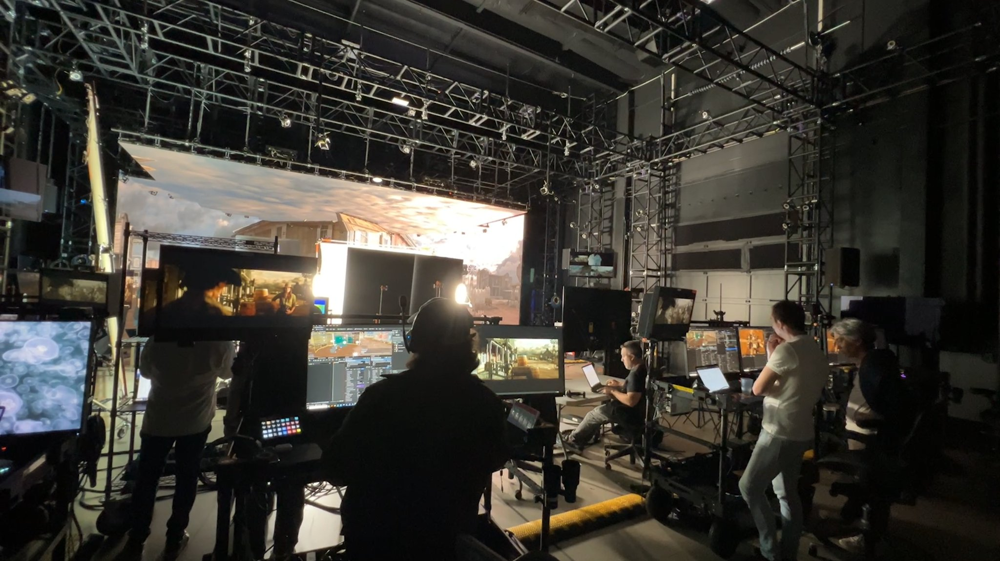
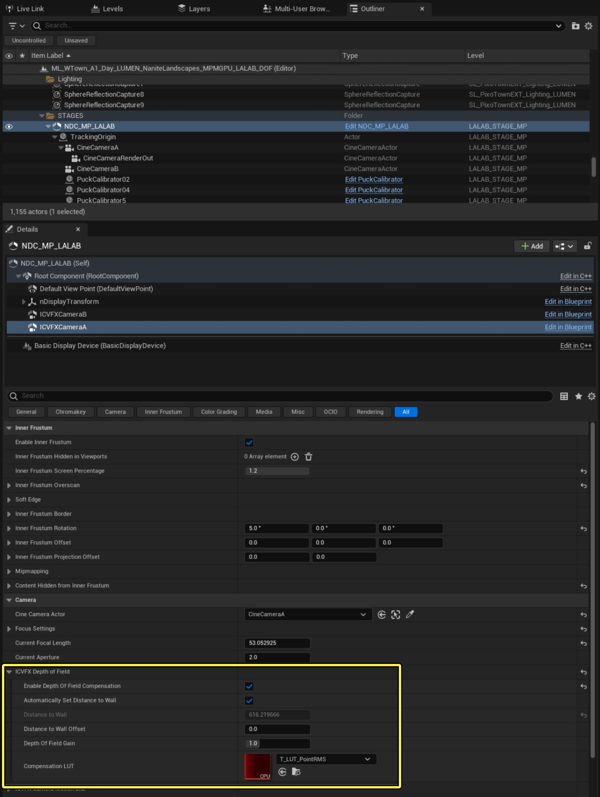
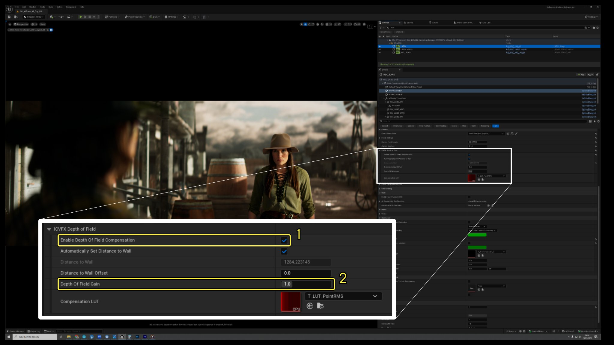
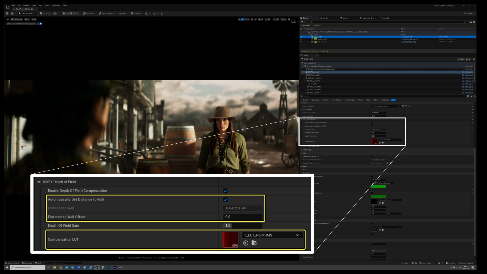
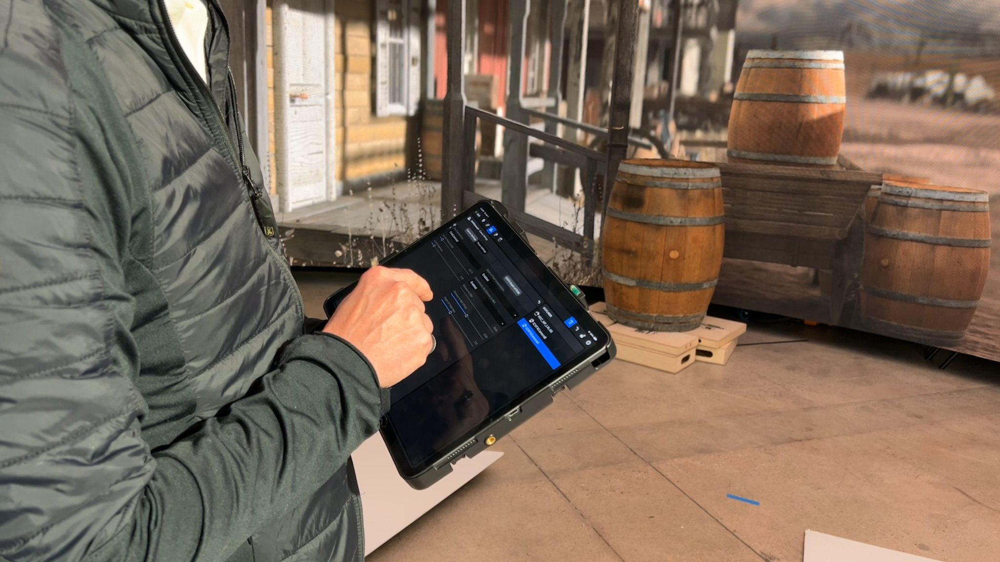
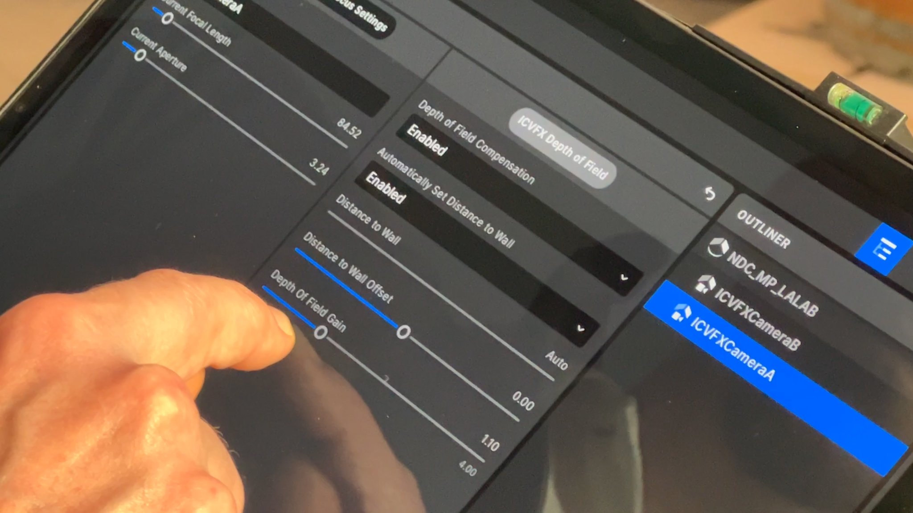

# 摄像机内特效景深补偿

> 路径：虚幻引擎5.7文档 / 使用媒体 / 媒体集成 / ICVFX / 摄像机内特效景深补偿

> 原始页面：https://dev.epicgames.com/documentation/unreal-engine/in-camera-vfx-depth-of-field-compensation-for-unreal-engine

## 简介

### LED墙上的景深挑战

在LED墙上为摄像机内特效（ICVFX）进行景深（DOF）管理是一项长期存在的难题。这在一定程度上是因为存在两个景深值，一个来自虚拟摄像机使用nDisplay在LED墙上进行渲染所产生的景深，另一个来自实体摄像机所产生的景深。对于这两台摄像机，如果要匹配聚焦、光圈和变焦，最终生成的图像就会不准确且模糊程度超出预期，并且实体道具和布景装饰之间的连续性也会因此中断。

在其他情况下，为了缓解过分模糊的效果，有时会禁用景深，从而导致虚拟背景缺乏深度，或是会随意调整焦点距离和光圈，试图达到期望的准确或创意效果。这些方法可能会导致景深衰减不准确，并将混乱的镜头数据向下传递到后期制作环节。

### ICVFX景深补偿

ICVFX景深补偿功能提供了一种简单有效的方法，可以为使用LED墙的虚拟制片工作提供准确的DOF，以及全面的创意掌控能力，同时在实体和虚拟布景间保持连贯的DOF衰减。

这是一项实验性的新功能，它已经经过了虚拟制作团队的严格测试和视觉验证，其达到的精确程度已被证明在拍摄现场具有极大的价值。它支持球形镜头和变形镜头，补偿机制是通过根据摄像机与LED墙的距离以及场景中像素的深度来调整每个像素的"模糊圆环"（CoC，即模糊程度）来实现的。补偿机制会根据真实世界的摄像机的对焦距离、光圈和焦距进行动态调整。

## ICVFX景深补偿：使用方法

### 先决条件

#### 摄像机追踪和LED墙网格体

DOF补偿功能依赖的主要菜蔬是摄像机与LED墙间的距离，因此需要进行摄像机追踪，以及与现实世界LED墙匹配的nDisplay墙网格体。

#### 匹配摄像机参数

同样重要的是，ICVFX摄像机组件或其对应的电影摄像机Actor必须与真实世界的摄像机和镜头具有相同的焦距距离、光圈和焦距参数（有时被称为焦点/光圈/变焦或"FIZ"）。电影摄像机Actor还必须具有相同的传感器尺寸，同时对于变形镜头还需要想通的压缩系数。这最好通过镜头编码系统和经过良好校准的镜头文件来实现，从而为你提供完全动态的实时补偿，能够通过环形聚焦进行补偿！

但如果没有这样的系统，也可以手动输入所有参数，但一定要确保在摄像团队调整每次镜头FIZ值时，及时更新这些参数。光圈叶片的数量对于实现互补的虚化效果也很重要。

#### 引擎设置

最后，请确保将后期处理（Post Processing）最低引擎伸缩性设置设为超高（Epic），否则渲染会使用物理不精确的旧版DOF。

先决条件总结：

- 摄像机追踪
- 相当精准的LED墙网格体
- 镜头编码（推荐，但可选）
- 镜头文件（推荐，但可选）
- 所有电影摄像机Actor的设置必须与现实世界的摄像机一致：

  - 焦距距离
  - 光圈
  - 焦距（变焦）
  - 传感器尺寸
  - 压缩系数
  - 光圈叶片数
- 最低引擎伸缩性设置：超高（Epic）

### 位置

ICVFX景深补偿功能位于nDisplay Config Actor的ICVFX摄像机组件上。

### 控制功能

该功能有两项主要控制功能：

1. 启用功能
2. 景深增益

启用该功能后，可以立即为使用nDisplay渲染的LED墙补偿景深。你也可以在nDisplay Config Actor的渲染预览中观察到这种补偿。

**景深增益（Depth of Field Gain）** 属性是主要的创意控制功能。它定义了景深的浅度。其默认值为1，表示与现实世界镜头一致。超过1的增益值（最高为4）会使DOF衰减更浅。例如，如果你希望DOF的浅度是实际镜头的两倍，就将此值设为2。低于1的增益值会降低DOF的浅度，即增益值越低，景深越深。例如，要让DOF浅度减半，就将DOF增益设置为0.5。增益值一直可以低至0，此时渲染的LED墙内容中就没有景深了

其他控制功能还包括 **自动设置与LED墙的距离（Automatically Set Distance to Wall）** 以及 **与LED墙距离偏移（Distance to Wall Offset）** 属性。由于此功能还在实验阶段，开发团队希望提供一些控制项，以便用户能够进行调整和试验，但常规使用时并不一定需要修改这些项。"自动设置与LED墙的距离"属性默认开启，负责根据摄像机的位置动态更新补偿值。。

"与LED墙距离偏移"属性只负责对"与LED墙的距离"参数进行加减。它主要从艺术角度控制靠近墙的物体的模糊程度，而不会改变衰减效果。请记住，在LED墙深度处对虚拟对象进行虚化处理，可能会导致双重模糊，并破坏从实体场景到虚拟场景的过渡，**但最终如果通过监视器看到的镜头效果看起来正确，那就足够了！**

最后则是 **补偿LUT（Compensation LUT）** （查找表）属性。请不要将其与任何色彩校正混淆。此LUT是定义了基于非线性深度对DOF补偿所需的圆形失真进行调整的方式。这个属性可以保持默认值，添加它是为了在用户感觉有必要时允许进一步的实验探索。

### 工作流程改进

电影摄像机Actor和ICVFX摄像机组件的交互方式得到了改进，比如，在Actor或组件上都可以进行调整焦距距离、光圈、焦距和其他镜头参数的操作，且此类结果会被立即反馈到另一方。这意味着这些常用设置现在可以通过nDisplay Config Actor的细节面板访问了。

ICVFX Stage应用程序同样包含了UIICVFX景深补偿的控制功能。这为拍摄现场提供了远程控制手段，用于启用和禁用补偿、调整与LED墙的距离偏移并控制DOF增益。在没有镜头编码系统的前提下，通过该应用程序可以控制所有电影摄像机Actor的镜头参数，包括焦距、光圈、对焦距离及其相关设置。

## ICVFX景深补偿：注意事项

### 虚化

与镜头产生的虚化（Bokeh）效果相比，LED墙上呈现的虚化效果会稍显柔和一些。因此，在对焦距离较近且光圈较大从而导致景深非常浅的场景中，将景深增益设置为较低值（包括 0）可能更有益。在我们的测试中，在这种受限的场景下，当景深增益设置为0时，与参考图像相比，虚化效果更为准确。

### 将T值转换为F值

虚幻引擎的电影摄像机Actor希望输入的是光圈值（F值），因此如果你的镜头是T值镜头，需要将其转换为F值以获得最准确的结果。不过，你可能会发现不进行转换，直接使用T值也能获得相当不错的效果，所以不必为此烦恼。

### 非对称型视锥过扫描

此外，还值得一提的是，在某些极端情况下，非对称型视锥过扫描设可能会对景深产生影响，因此应相应地调整景深增益。

### 虚拟前景对象

由于LED墙上渲染的、位于电影摄像机Actor和nDisplay ConfigActor之间的虚拟对象无法得到补偿，你可能希望禁用这些对象以获得最佳效果，并依靠实体布景道具来提供前景元素。

### 变形视锥解决方案

最后，镜头压缩系数参数会提高视锥的水平分辨率，因此在优化内容时务必要考虑到这一点。如果无法做到这一点，一个不错的解决办法是降低视锥分辨率乘数或者根据压缩系数降低视锥分辨率的高度（例如，压缩系数为1.8时，你需要将垂直分辨率除以1.8）。
