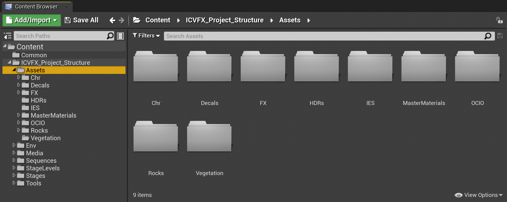
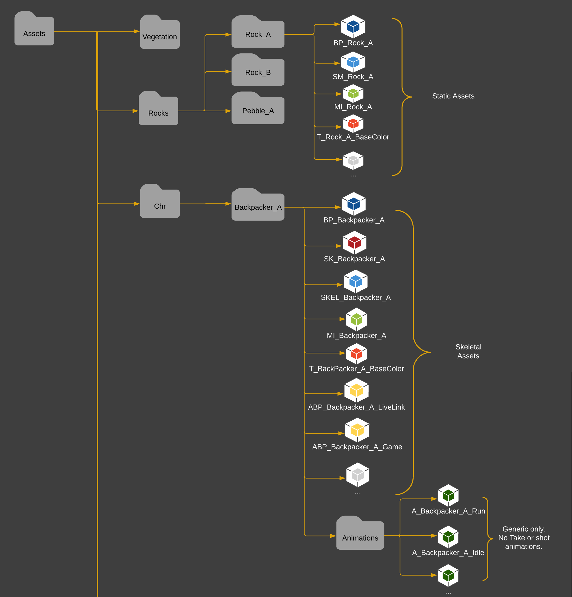
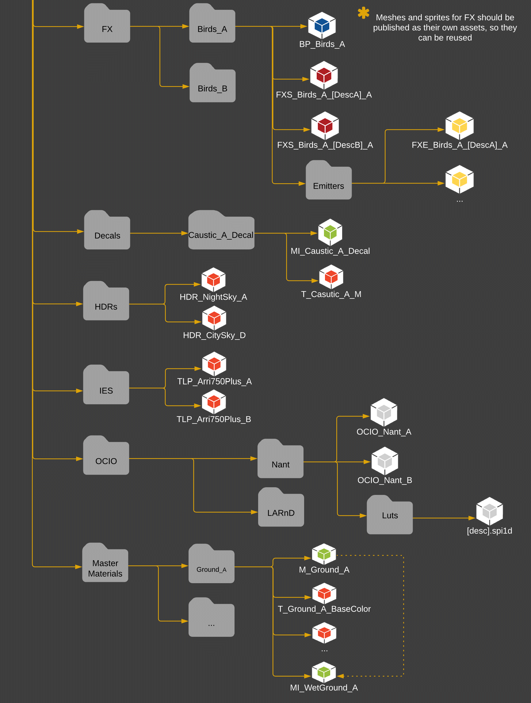

# 资产文件夹结构

> 路径：虚幻引擎5.7文档 / 使用媒体 / 媒体集成 / ICVFX / ICVFX项目结构示例 / 资产文件夹结构

> 原始页面：https://dev.epicgames.com/documentation/unreal-engine/assets-folder-structure-in-unreal-engine

**资产** 文件夹通常包含用于创建角色、环境和特效 - 网格体的所有资产，例如材质、纹理、蓝图和其他源文件。此处不包含关卡资产。

每个子文件夹都包含该资产的相应源文件。例如，Chr文件夹包含Character Asset子文件夹，每个使用的角色都有一个。每个子文件夹都包含该角色的源资产，即蓝图、骨骼网格体、骨架、动画、材质等。

以下列表是[摄像机内视觉特效处理制片测试](../../../../../samples-and-tutorials/engine-feature-examples/incamera-vfx-production-test-sample-project/index.md)项目的资产分类方式，扩展为包括该项目中未使用的一些资产类型。任一给定的项目都不太可能使用所有可能的资产类型。

- 植被

  - Tree_A

    - SM_Tree_A
    - MI_Tree_A
    - T_Tree_A_BaseColor
- 岩石

  - Rock_A

    - BP_Rock_A
    - SM_Rock_A
    - MI_Rock_A
    - T_Rock_A_BaseColor
  - Rock_B
  - Pebble_A
- Chr

  - Backpacker_A

    - BP_Backpacker_A
    - SK_Backpacker_A
    - SKEL_Backpacker_A
    - MI_Backpacker_A
    - T_Backpacker_A_BaseColor
    - ABP_Backpacker_A_Livelink
    - ABP_Backpacker_A_Game
    - 动画

      - A_Backpacker_A_Run
      - A_Backpacker_A_Idle

该图在内容浏览器中显示项目的推荐资产文件夹结构的第一部分。

- FX

  - Birds_A

    - BP_Birds_A
    - FXS_Birds_A_(DescA)_A
    - FXS_Birds_A_(DescB)_A
    - 发射器

      - FXE_Birds_A_(DescA)_A
- 贴花

  - MI_Caustic_A_Decal
  - T_Caustic_A_M
- HDR

  - HDR_NightSky_A
  - HDR_CitySky_D
- IES

  - TLP_Arri750Plus_A
  - TLP_Arri750Plus_B
- OCIO

  - （舞台名称）

    - OCIO_(Stage)_A
    - OCIO_(Stage)_B
    - LUTS

      - (Description).spi1d（仅限文件浏览器）

      > [!NOTE]
      > OpenColorIO `.spi1d` 文件不会显示在内容浏览器中，而是只显示在文件浏览器中。请参阅[OpenColorIO](../../../../managing-color/color-management-with-opencolorio/index.md)文档，了解更多信息。
- MasterMaterials

  - Ground_A

    - M_Ground_A
    - T_Ground_A_BaseColor
    - MI_WetGround_A
  - 纹理
- 道具*
- 地形*
- 载具*
- 其他*

* 不用于摄像内视觉特效处理制片测试。

该图在内容浏览器中显示项目的推荐资产文件夹结构的其余部分。它链接回顶部的第一部分。
