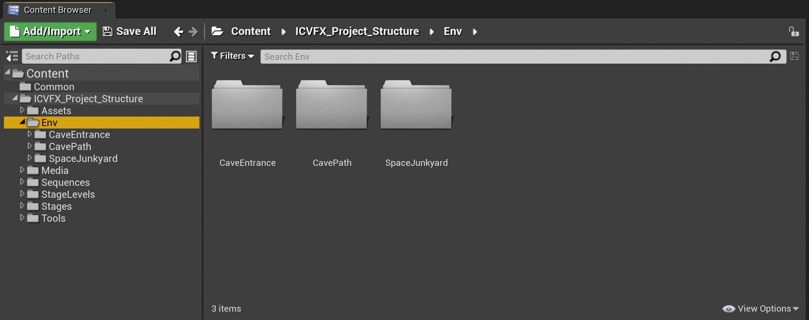
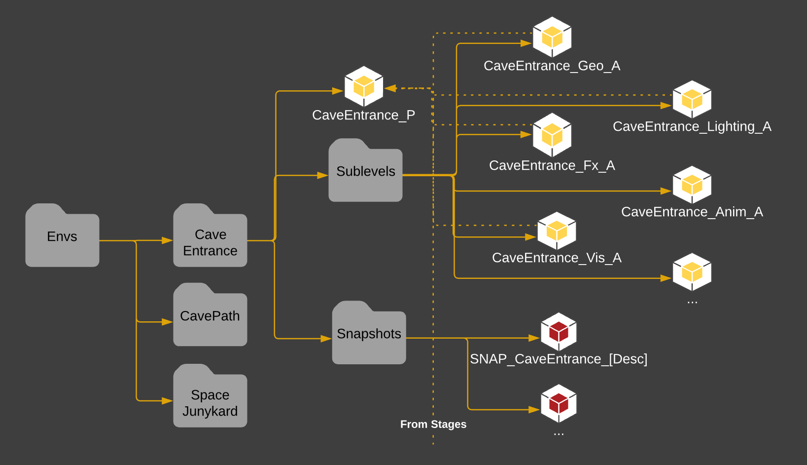

# 场景文件夹结构

> 路径：虚幻引擎5.7文档 / 使用媒体 / 媒体集成 / ICVFX / ICVFX项目结构示例 / 场景文件夹结构

> 原始页面：https://dev.epicgames.com/documentation/unreal-engine/envs-folder-structure-in-unreal-engine

**场景（Envs）** 文件夹包括用于你的场景（envs）的所有资产。

由于源控制只能让你取出二进制资产，比如 `.umap` 文件，每个在同一个场景中工作的人都必须在他们自己的关卡中工作。要解决该问题，可以将一个场景根据每个Actor的类型分为多个[子关卡](../../../../../understanding-the-basics/levels/managing-multiple-levels/index.md)。

举个例子，一个光线美术师可以在光照子关卡中工作，FX美术师可以在FX子关卡中工作。通常还可以有多个GEO关卡来将场景划分为不同的区域，分给各个美术师进行工作。要使用的子关卡的数量和种类取决于生产的需求。

该分区中的文件链接至 **Stages** 文件夹的文件，因为它们会在最终摄像机内持续关卡被合并。

以下是在示例项目中对于每个场景使用的各种文件夹类型：

- **关卡资产（Level Asset）**：关卡资产遵循 (关卡名)_(描述) 结构。_P 后缀用于持续关卡，作为子关卡的容器。打开该关卡资产可以查看由所有子关卡构成的整个场景。
- **子关卡（SubLevels）**：在该项目中，每个关卡都分为焦散（Caustics）、FX、Geo和光照子关卡。
- **快照（Snapshots）**：与关卡关联的关卡快照资产。

示例：

- CaveEntrance

  - CaveEntrance_P — Main persistent level
  - SubLevels

    - CaveEntrance_Geo_A
    - CaveEntrance_Lighting_A
    - CaveEntrance_FX_A
    - CaveEntrance_Anim_A
    - CaveEntrance_Vis_A
  - Snapshots

    - SNAP_CaveEntrance_(Description)
- CavePath
- SpaceJunkyard

推荐的内容浏览器中项目场景文件夹结构示意图。
