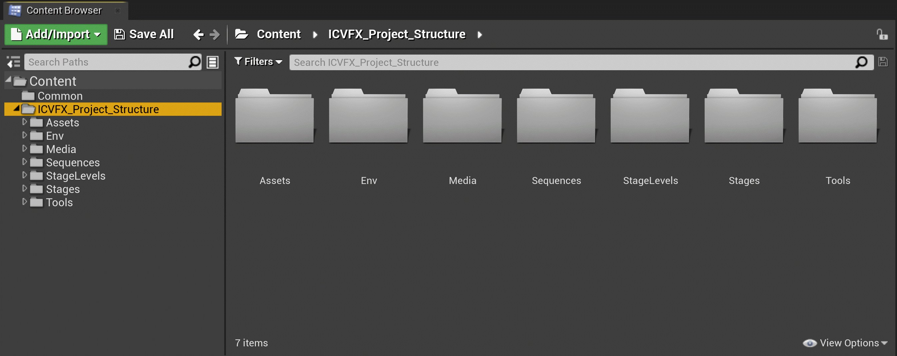
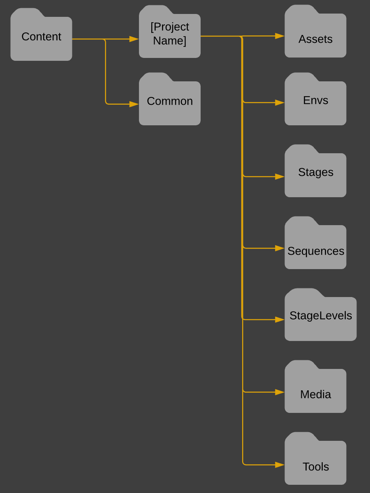

# ICVFX项目结构示例

> 路径：虚幻引擎5.7文档 / 使用媒体 / 媒体集成 / ICVFX / ICVFX项目结构示例

> 原始页面：https://dev.epicgames.com/documentation/unreal-engine/in-camera-vfx-project-structure-example-in-unreal-engine

**摄像机视觉特效处理制片结构示例（In-Camera VFX Production Structure Example）** 旨在为虚拟制片项目提供干净的示例组织结构。你可以复制该结构，并根据你的项目要求酌情修改。所述结构基于[摄像机视觉特效处理制片测试](../../../../samples-and-tutorials/engine-feature-examples/incamera-vfx-production-test-sample-project/index.md)的结构，进行了扩展，以涵盖更多常见用例。

### 内容浏览器文件夹

在 **内容浏览器（Content Browser）** 的 **内容（Content）** 文件夹中，创建以项目名称命名的文件夹，用于专门保存项目的内容。根据需要创建名为Common的文件夹，它将包含与其他项目共享的内容。

> [!WARNING]
> 不要将创建项目时由UE创建的项目（Project）文件夹（整个项目的根文件夹）与你在内容浏览器中使用项目名称创建的文件夹相混淆。我们建议改动一下名称，以免混淆。

**Content/(Project Name)/[Assets](assets-folder-structure/index.md)**

用于创建角色、环境和视觉效果的所有资产。此处不包含关卡资产。

**Content/(Project Name)/[Envs](envs-folder-structure/index.md)**

包含所有关卡、快照和子关卡。不包含舞台Actor。

**Content/(Project Name)/[Media](media-folder-structure/index.md)**

媒体框架内容，例如EXR和电影渲染队列输出及配置文件。

**Content/(Project Name)/[Sequences](sequences-folder-structure/index.md)**

所有序列、编辑、动画和相关快照。

**Content/(Project Name)/[Stages](stages-folder-structure/index.md)**

特定于舞台的文件，如动作捕获布局、绿色屏幕舞台和LED舞台，例如描述LED体积拓扑的nDisplay配置。

**Content/(Project Name)/[StageLevels](stage-levels-folder-structure/index.md)**

拥有环境和舞台Actor的所有关卡资产。

**Content/(Project Name)/[Tools](tools-folder-structure/index.md)**

自定义蓝图，包括工具和控件、功能按钮、关卡快照筛选器和预设以及远程控制预设。还包括相关的蓝图Actor，如结构、枚举等。

> [!NOTE]
> 我们推荐为你的资产使用井然有序的命名规范，以便在内容浏览器中轻松查找。请参阅[推荐的资产命名规范](../../../../production-pipeline/recommended-asset-naming-conventions-in-unreal-89ae65f2/index.md)，了解最佳实践示例。

请参阅各个页面，详细了解每个文件夹中推荐的项目结构。

该图在内容浏览器中显示项目的推荐顶级文件夹结构。
