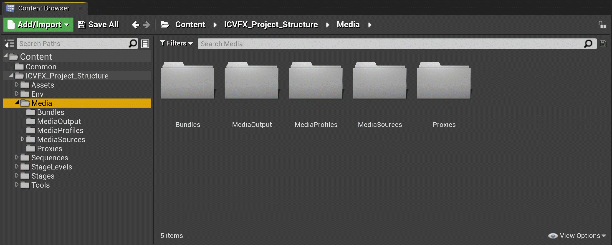
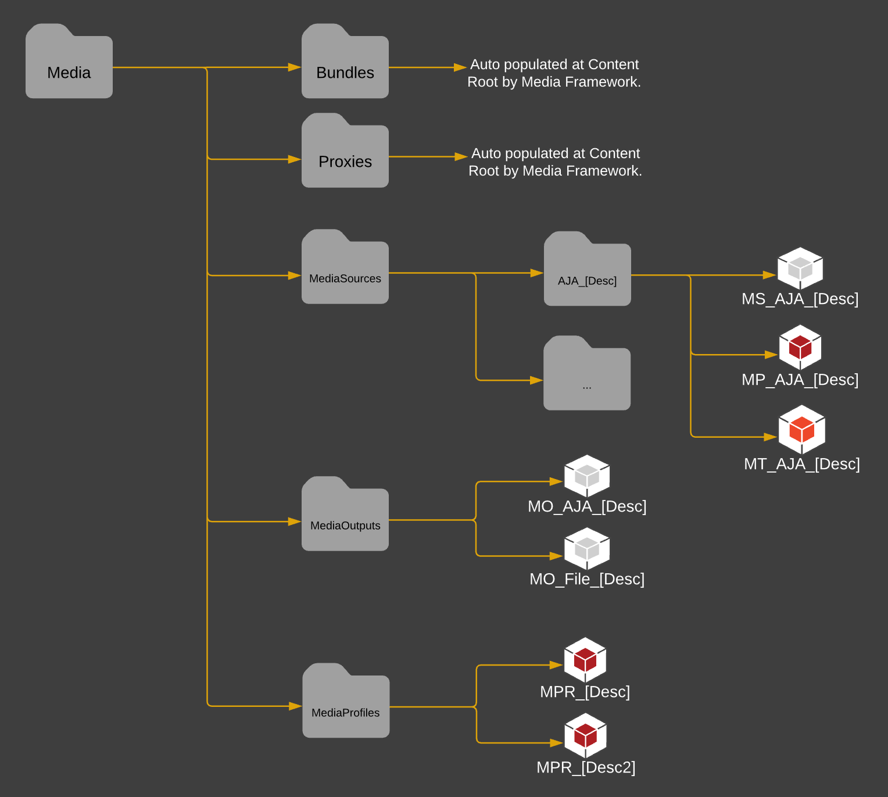

# 媒体文件夹结构

> 路径：虚幻引擎5.7文档 / 使用媒体 / 媒体集成 / ICVFX / ICVFX项目结构示例 / 媒体文件夹结构

> 原始页面：https://dev.epicgames.com/documentation/unreal-engine/media-folder-structure-in-unreal-engine

**媒体（Media）** 文件夹包括与在制片中使用媒体相关的所有文件。本分段中的某些文件将由[媒体框架](../../../media-framework/index.md)插件在内容浏览器的根级别自动填充。这里的文件夹由媒体配置文件在后台使用，但你在几乎所有情况下都不应该直接使用这些文件夹。

- Bundles - 由媒体框架插件在内容根级别自动填充。
- Proxies - 由媒体框架插件在内容根级别自动填充。
- MediaOutputs
- MediaProfiles

  - MPR_(Description1)
  - MPR_(Description2)
- MediaSources - 与媒体内容相关的所有Actor，每个媒体源有单独的文件夹。

该图显示了内容浏览器中推荐使用的媒体目录结构。
