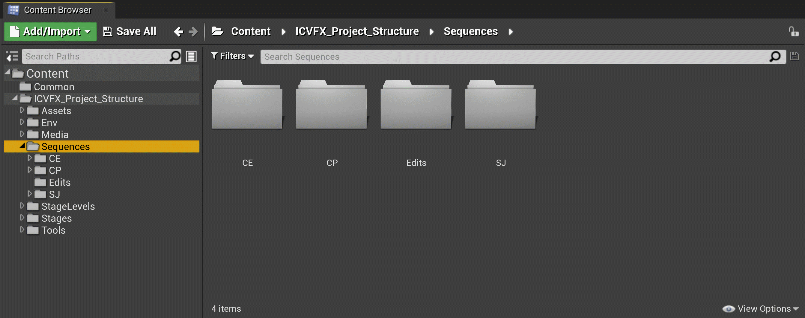
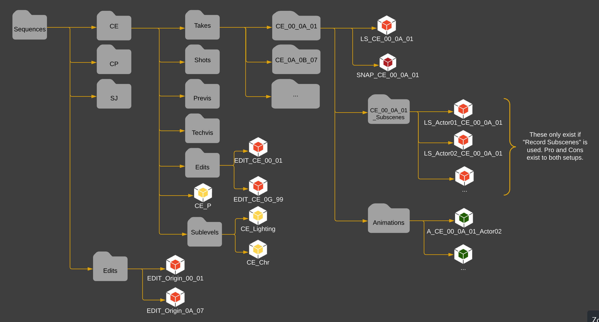

# 序列目录结构

> 路径：虚幻引擎5.7文档 / 使用媒体 / 媒体集成 / ICVFX / ICVFX项目结构示例 / 序列目录结构

> 原始页面：https://dev.epicgames.com/documentation/unreal-engine/sequences-folder-structure-in-unreal-engine

**序列（Sequences）** 文件夹包含所有 **关卡序列（Level Sequences）** 和 **动画（Animations）**，按序列缩写（所显示的示例中的CE、CP和SJ）分组。

**编辑（Edits）** 子文件夹包含应用于整个项目的一起拍摄的序列的编辑。每个单独的序列文件夹还包含一个 **编辑（Edits）** 子文件夹，它专用于该序列。

> [!NOTE]
> 该示例使用格式 `(Sequence Code)_(Setup)_(Camera or Anim Pass)_(Take)`。但是，这仅仅是示例镜头试拍命名规范。你可将对于你的项目有意义的命名体系用于你的镜头试拍。重要的是让命名体系保持一致。

- Edits

  - EDIT_Origin_00_01
  - EDIT_Origin_0A_07
- CE（序列缩写）

  - Takes - 按镜头名称和镜头试拍编号排序

    - CE_00_0A_01

      - LS_CE_00_0A_01
      - SNAP_CE_00_0A_01
      - CE_00_0A_01_Subscenes

        - LS_Actor01_CE_00_0A_01
        - LS_Actor02_CE_00_0A_01
      - Animations

        - A_CE_00_0A-01_Actor02
  - Shots
  - Previs
  - Techvis
  - Edits

    - EDIT_CE_00_01
    - EDIT_CE_0G_99
  - Sublevels

    - CE_Lighting
    - CE_Chr

该图在内容浏览器中显示项目的推荐序列文件夹结构。
