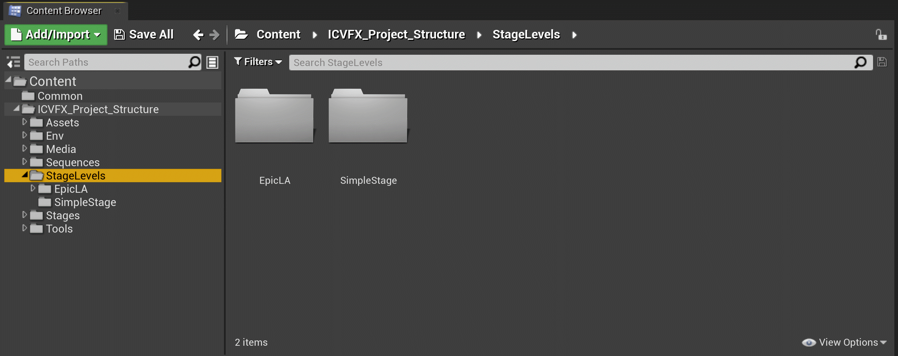
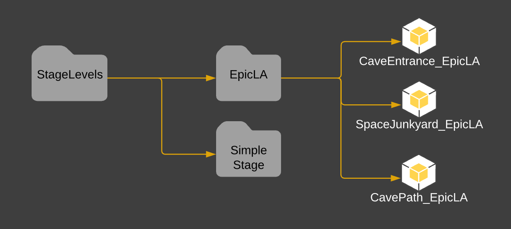

# 舞台关卡文件夹结构

> 路径：虚幻引擎5.7文档 / 使用媒体 / 媒体集成 / ICVFX / ICVFX项目结构示例 / 舞台关卡文件夹结构

> 原始页面：https://dev.epicgames.com/documentation/unreal-engine/stage-levels-folder-structure-in-unreal-engine

**舞台关卡（Stage Levels）** 文件夹包含 *同时* 拥有环境 *和* 舞台 **Actor** 的所有 **关卡资产**。需要使用nDisplay进行渲染时，可打开这些资产。舞台关卡按关卡资产中使用的舞台进行分类。

- EpicLA

  - CaveEntrance_Epic_LA - 持久关卡，带有所有子关卡和舞台拓扑
  - SpaceJunkyard_Epic_LA
  - CavePath_EpicLA

该图在内容浏览器中显示项目的推荐舞台关卡文件夹结构。
