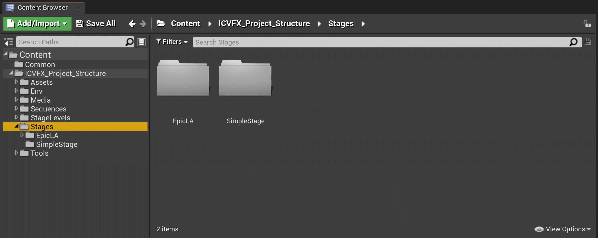
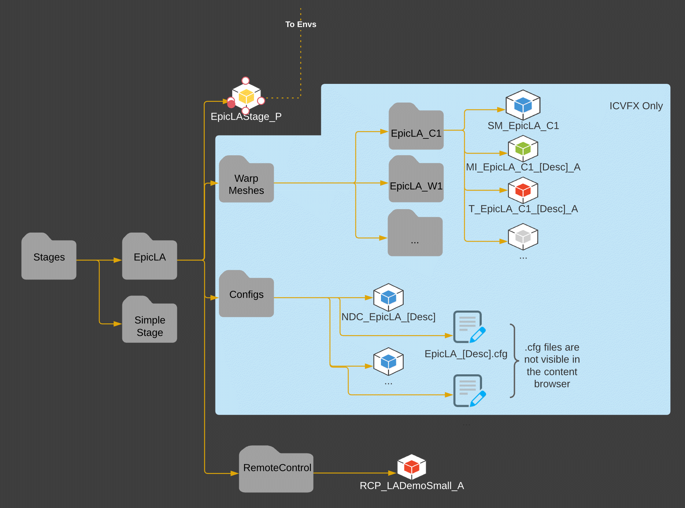

# 舞台文件夹结构

> 路径：虚幻引擎5.7文档 / 使用媒体 / 媒体集成 / ICVFX / ICVFX项目结构示例 / 舞台文件夹结构

> 原始页面：https://dev.epicgames.com/documentation/unreal-engine/stages-folder-structure

**舞台（Stages）** 文件夹包含 **nDisplay配置（nDisplay Configurations）**，这些配置描述了使用的LED体积和所有相关文件的拓扑。

本小节中的文件都与 **环境（Envs）** 文件夹文件相关联，因为它们会全部组合起来，用于最终的摄像机视觉特效处理持久关卡。

- EpicLA

  - EpicLAStage_P - 主要舞台持久关卡
  - WarpMeshes - 构成体积的网格体

    - EpicLA_C1

      - SM_EpicLA_C1
      - MI_EpicLA_C1_(Description)_A
      - T_EpicLA_C1_(Description)_A
  - Configs

    - NPC_EpicLA_(Description)
    - EpicLA_(Description).cfg - `.cfg` 文件在内容浏览器中不可见

该图在内容浏览器中显示项目的推荐舞台文件夹结构。
