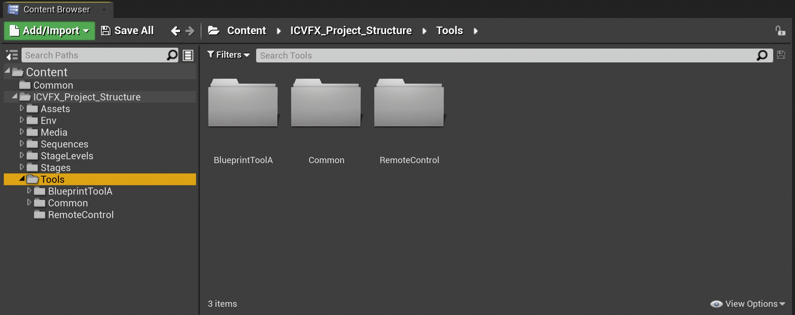
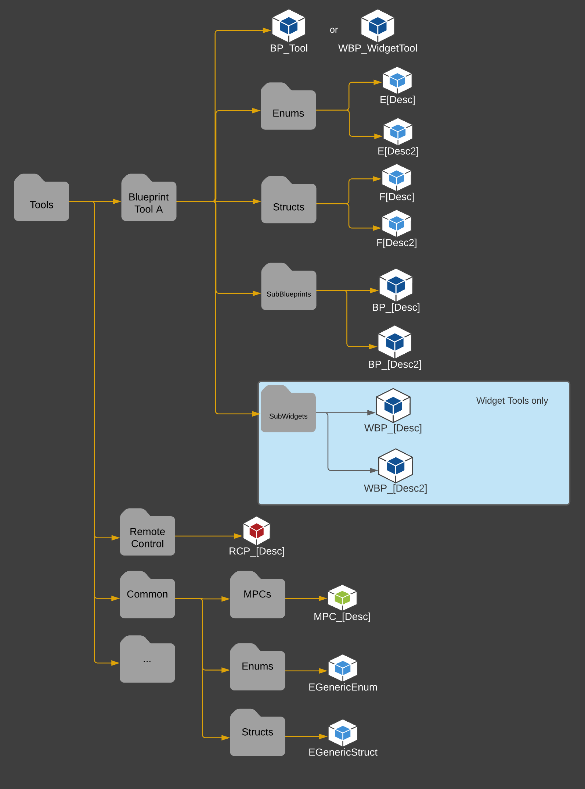

# 工具文件夹结构

> 路径：虚幻引擎5.7文档 / 使用媒体 / 媒体集成 / ICVFX / ICVFX项目结构示例 / 工具文件夹结构

> 原始页面：https://dev.epicgames.com/documentation/unreal-engine/tools-folder-structure-in-unreal-engine

**工具（Tools）** 文件夹包含自定义[蓝图](../../../../../blueprints-visual-scripting/index.md)和控件、[关卡快照](../../../../../production-pipeline/collaboration-and-version-control/level-snapshots/index.md)筛选器和预设以及[远程控制](../../../../../production-pipeline/scripting-and-automating-the-unreal-editor/remote-control/index.md)预设。以下列表描述各个工具。

- 蓝图工具A：每个使用的舞台蓝图有单独的文件夹，包含其源：

  - BP_Tool *或* WBP_WidgetTool - 主蓝图。
  - Enums - 蓝图中使用的相关枚举。

    - E_(Description)
  - Structs - 蓝图中使用的相关结构体。

    - F_(Description)
  - SubBlueprints - 仅当使用子蓝图时存在。

    - BP_(Description)
  - SubWidgets - 仅当使用子控件蓝图时存在。

    - WBP_(Description)
- Remote Control：使用的远程控制预设

  - RCP_(Description)
- Common

该图在内容浏览器中显示项目的推荐工具文件夹结构。
