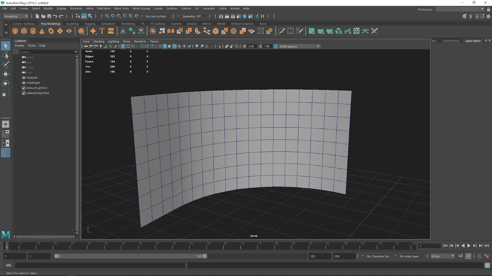
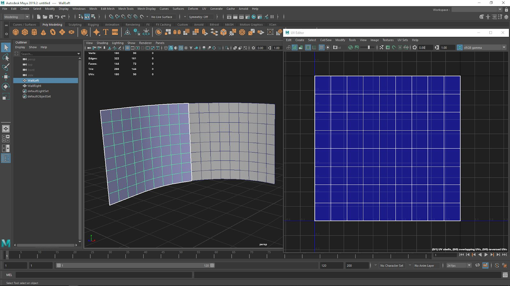
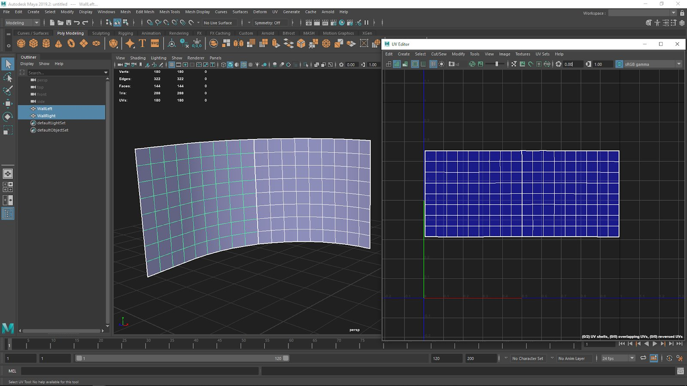
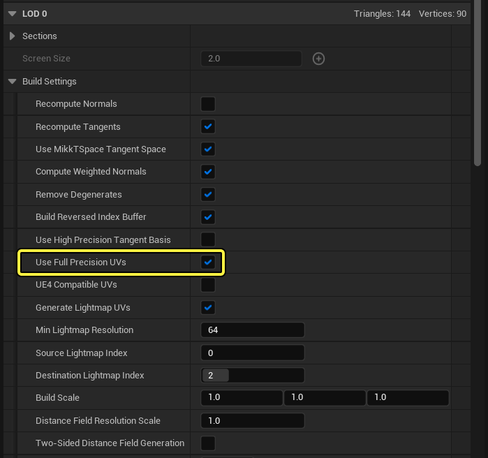
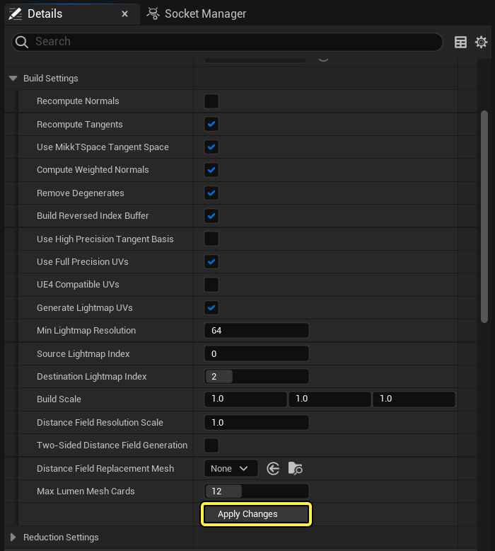
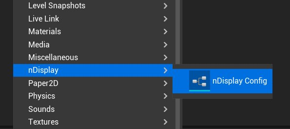
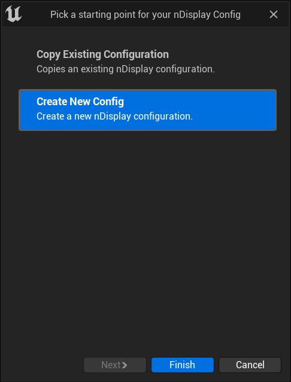
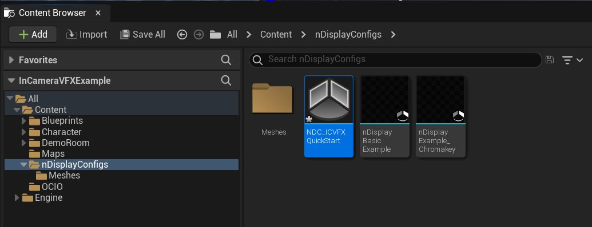

# ICVFX快速入门

> 路径：虚幻引擎5.7文档 / 使用媒体 / 媒体集成 / ICVFX / ICVFX快速入门

> 原始页面：https://dev.epicgames.com/documentation/unreal-engine/in-camera-vfx-quick-start-for-unreal-engine

此快速入门页面将介绍在虚幻引擎中设置项目的流程，以便配合摄像机内视觉特效处理使用。在本指南的最后，你将：

- 获得nDisplay节点的同步群集。
- 获得摄像机内视觉特效处理的内外视锥体。
- 获得通过Live Link整合的实时摄像机追踪系统。
- 获得一个带有可开启色键标识功能的绿幕内视锥体。
- 可以启动所有集群节点并当场测试。

## 第1步 - 为摄像机内视觉特效处理设置项目

设置摄像机内视觉特效处理项目最简单的方法是，使用摄像机内视觉特效处理示例项目。

1. 打开 **Epic Games启动程序（Epic Games Launcher）** 。
2. 在 **示例（Samples）** 选项卡中，找到[摄像机内VFX示例](https://www.fab.com/listings/1ccaf0a1-acce-4a3b-831e-a9cf4af35f6d)项目。
3. 在该项目页面上，单击 **免费（Free）** 。
4. 点击 **创建工程（Create Project）** 。
5. 在你的设备上指定位置，以保存该项目并选择 **创建（Create）** 。
6. 启动 **虚幻引擎（Unreal Engine）** 并打开 **摄像机内VFX示例（In-Camera VFX Example）** 项目。

在示例项目中的 **内容（Content）> 贴图（Maps）** 中，你可以看到 **主（Main）** 关卡。想通过虚幻引擎了解关于摄像机内视觉特效处理的内容，请打开 **主（Main）** 关卡。示例项目和关卡会自动启用必要的插件，提供辅助用的蓝图，配置其他设置，并将示例配置文件包含在内。

### 插件

- **Aja或Blackmagic Media Player：**为SDI采集卡提供支持。
- **摄像机校准（Camera Calibration）** 用于创建镜头失真配置文件和节点偏移的工具。
- **颜色校正区域（Color Correct Regions）：**颜色校正和阴影限制在体积内。
- **ICVFX：**一款插件，可启用一套基础的摄像机内视觉特效处理插件。
- **关卡快照（Level Snapshots）：**为具有筛选功能的当前关卡存储替代布局，以便提供方便、非破坏性的变体。
- **Live Link：**采集实时数据（如动作捕捉和相机追踪）的虚幻引擎API。
- **Live Link Over nDisplay：**主节点接收Live Link数据，并以一种高效且同步的方式重新分发追踪数据。
- **Live Link XR：**从XR设备（如Vive Tracker）采集实时数据的虚幻引擎API。
- **Multi-User Editing：**可在共享会话中使用多个编辑器。
- **媒体框架实用工具（Media Framework Utilities）：**与实时视频、时间代码和SDI采集卡上同步锁定相关的实用插件。
- **nDisplay：**用于实现多屏渲染的虚幻引擎技术。
- **关卡快照的nDisplay支持（nDisplay Support for Level Snapshots）：**支持使用关卡快照保存和恢复nDisplay根Actor属性。
- **OpenColorIO (OCIO)：**提供OpenColorIO支持。
- **OSC：**提供在远程客户端或应用程序之间发送和接收OSC消息的功能。
- **远程控制API（Remote Control API）：**一套通过REST API、WebSocket和C++远程控制引擎的工具。
- **远程控制Web界面（Remote Control Web Interface）：**提供远程Web界面和UI构建器，用于远程控制编辑器。
- **Switchboard：**一款用于在多用户会话中启动虚幻引擎、nDisplay节点和其他虚拟制片设备实例的应用程序。
- **计时数据监视器（Timed Data Monitor）：**用于监视可以进行时间同步的输入的实用工具。
- **虚拟制片实用工具（Virtual Production Utilities）：**用于虚拟制片的实用插件。

### nDisplay根Actor

[nDisplay配置资产](../../rendering-to-multiple-displays-with-ndisplay/ndisplay-3d-config-editor/index.md)定义了nDisplay群集中的计算机与LED体积拓扑之间的关系。nDisplay根Actor是关卡中nDisplay配置资产的的实例，通过将nDisplay配置资产拖入关卡来创建。

示例项目中包含示例nDisplay配置资产。你可以在内容浏览器（Content Browser）的nDisplayConfigs下面找到。如需详细了解nDisplay根Actor中公开的设置，请参阅[nDisplay根Actor参考](../../rendering-to-multiple-displays-with-ndisplay/ndisplay-root-actor-reference/index.md)。

## 第2步 - 创建LED面板几何体

> [!NOTE]
> 本小节提供了如何创建曲面LED墙表示的示例。各LED体积可能不同，因此请修改这些步骤，以便匹配你的显示器的尺寸和布局。

这些步骤展示了如何创建几何体，以代表真实世界的LED面板。

在此示例中，曲面墙由两个网格体组成。每个网格体映射到nDisplay视口。有几个因素决定了如何将LED舞台分成网格体：

1. **角度：**每个网格体的最大理想曲率角应为90度。每网格体大于90度的曲线会导致视觉效果降级。此外，没有单个视口（以及网格体）可以覆盖179度以上。
2. **分辨率：**UHD（3840 x 2160）是在单个GPU nDisplay视口上渲染的合理上限。对于有多个GPU的机器，你可以有多个视口，跨越更大的显示分辨率。 无论哪种方式，根据LED面板的分辨率，以你希望每台机器和视口渲染的最大分辨率为增量，分离你的舞台网格体。有关逐面板分辨率的详细信息，请咨询你的LED制造商。
3. **控制点：**如果你仅将天花板面板用于光照和反射，并且它们从不出现在摄像机中，则你可能要将天花板和侧壁之间的控制点分开。如果LED面板的型号不同，并且需要不同的颜色管理，则尤其如此。 颜色管理为逐视口控制，因此你必须将这些不同的面板分解为各自的网格体。

这些是关于如何将拓扑分离为网格体（以及视口）的考虑因素。单台机器渲染多个视口很常见，比如天花板和墙壁。重要的是，它们是单个节点上的单独视口。

每个网格体应有两个按特定顺序排列的UV集。第一个UV集用于计算nDisplay的PICP_Mesh投影策略投影。第二个UV集用于确保色键追踪标识跨两个视口之间的接缝正确移动。

此示例网格体上的每个方块代表500毫米 x 500毫米的LED面板，像素间距为2.6毫米。

曲面LED墙的网格体表现形式。点击查看大图。

网格体的建模位置和方向应与真实世界的LED面板匹配。在此示例中，它们以直立的方式建模。几何体应该以厘米为单位缩放。

创建具有下列规格的UV集：

- 首个UV集应缩放以覆盖范围0-1内的整个UV空间。此UV集应尽量均匀展开，避免拉伸。缩放可以不具统一性。确保UV边缘周围没有填充，且该UV不得超过0-1的范围。

  
- 第二个UV集应该让UV对齐，使其在相同的接缝处作为实际硬件配置匹配。它们的长宽比也应该与网格体一致。

  

创建网格体后，将几何体从3D建模软件中导出，然后将其导入至虚幻项目。[下载此示例网格体](https://d1iv7db44yhgxn.cloudfront.net/documentation/attachments/669b7dbf-d8a5-495b-b5f2-002e75aeb605/examplecurvedwallmesh_ndisplay.fbx)，并将文件拖到 **内容浏览器（Content Browser）** 的 **Content/nDisplayConfigs/Meshes** 文件夹中，按照下一小节中的步骤操作。

将网格体导入虚幻项目后，在每个网格体上启用 **使用全精度UV（Use Full Precision Uvs）** ，防止出现UV瑕疵。对导入的每个网格体执行以下操作步骤：

1. 双击导入的网格体，在静态网格体编辑器中打开。
2. 在 **细节（Details）** 面板的 **LOD 0** 下，展开 **构建设置（Build Settings）** ，并启用 **使用全精度UV（Use Full Precision UVs）** 。

   
3. 点击 **应用更改（Apply Changes）** 按钮。

   
4. 点击

   保存（Save）

   。
5. 关闭静态网格体编辑器。

## 第3步 - 定义你的项目中的LED屏幕

你需要自定义项目中屏幕的页面布局和几何体，反映你当前场景所含的内容。这些网格体应该与真实世界中与你的追踪系统相关联LED墙的实体位置和尺寸保持一致。场景所用的追踪系统有零点。这些网格体应该置于相同的真实世界坐标中，因为其与追踪系统相关联。配合你的追踪设备找到零点位置，并相对于此零点测量偏移情况。

> [!NOTE]
> 这些示例不使用回环地址127.0.0.1，因为它不能与其他非回环地址（例如属于其他机器的地址）在同一Switchboard配置中结合使用。你可以使用回环，但只能在简单的配置中使用，其中它是唯一使用的地址，并且每台设备对于运行Switchboard的机器而言都是本地设备。若在多机器设置中混合回环和非回环地址，会导致连接错误。

执行以下步骤，修改和自定义引擎中的页面布局和几何体：

1. 在 **内容浏览器（Content Browser）** 中，找到 **nDisplayConfigs** 文件夹。
2. 在文件夹中右键点击，打开创建资产（Create Asset）菜单，并选择 **nDisplay>nDisplay配置（nDisplay Config）** 。

   
3. 在出现的 **为nDisplay配置选择起始点（Pick a starting point for your nDisplay Config）** 的窗口中，选择 **新建配置（Create New Config）** ，并点击 **完成（Finish）** 。

   
4. 将新nDisplay配置资产命名为 **NDC_ICVFXQuickStart** 。

   
5. 双击 **NDC_ICVFXQuickStart** 资产，在 **nDisplay3D配置编辑器（nDisplay 3D Config Editor）** 中打开。

   > 图片已省略：在nDisplay 3D配置编辑器中打开新资产
6. 在 **组件（Components）** 面板中，右键点击 **nDisplayScreen** 组件并选择 **删除（Delete）** ，从列表选择该组件。

   > 图片已省略：删除nDisplay屏幕组件
7. 点击 **添加组件（Add Component）** ，并将两个 **静态网格体（Static Mesh）** 组件添加到组件（Components）面板。

   > 图片已省略：添加两个静态网格体组件
8. 将其中一个静态网格体命名为 **CurvedWall_Left** ，并在其 **细节（Details）** 面板中，将 **ExampleCurvedWallMesh_nDisplay_WallLeft** 指定为其 **静态网格体（Static Mesh）** 参数。将另一个命名为 **CurvedWall_Right** ，并将 **ExampleCurvedWallMesh_nDisplay_WallRight** 指定为其 **静态网格体（Static Mesh）** 参数。

   > 图片已省略：命名静态网格体
9. 选择两个 **静态网格体* 组件并旋转，使其向视图原点组件（View Origin Component）弯曲。在后续步骤中设置投影策略之前，你不会在网格体上看到投影预览。

   > 图片已省略：放置并旋转静态网格体组件
10. 在 **群集（Cluster）** 面板中，点击 **新增（Add New）** 按钮并选择 **添加新群集节点（Add New Cluster Node）** 。

    > 图片已省略：添加新群集节点

    > [!TIP]
    > 如果你要将NVIDIA Quadro Sync II与NVIDIA Quadro GPU配合使用，请选择 **群集（Cluster）** 面板中的 **群集（Cluster）** 项目，然后将 **类型（Type）** 设置为 **Nvidia (2)** 。
    >
    > > 图片已省略：将群集类型设置为Nvidia 2
11. **群集节点（Cluster Node）** 表示主机计算机。在出现的 **新增群集节点（Add New Cluster Node）** 窗口中：

    1. 将

       主机IP地址（Host IP Address）

       设置为你的计算机的外部IP地址。如果后续要向nDisplay群集添加更多计算机，你必须使用计算机的外部IP地址，而不是默认的本地主机IP地址127.0.0.1，因为在多机设置中，你无法同时使用回环和非回环地址。这些步骤以IP地址192.0.2.0为例。
    2. 启用

       全屏（Fullscreen）

       ，实现同步和同步锁定。
    3. 点击 **添加（Add）** 。

       > 图片已省略：设置主机IP地址
12. 创建 **群集节点** ，并为该节点分配新视口。在 **群集（Cluster）** 面板中选择该视口，打开其 **细节（Details）** 面板。

    > 图片已省略：在群集面板中选择视口
13. 在 **细节（Details）** 面板中，将 **视图原点（View Origin）** 设置为 **DefaultViewPoint** 。这样一来，关联的组件就可以控制外视锥的投影点。

    > 图片已省略：将视图原点设置为默认视点
14. 在视口 **细节（Details）** 面板的 **投影策略（Projection Policy）** 分段下，将 **类型（Type）** 设置为 **网格体（Mesh）** ，并从列表中选择你的 **CurvedWall_Left** 网格体。仅添加到组件（Components）面板的静态网格体组件才会显示在网格体列表中。

    > 图片已省略：将投影策略类型设置为网格体并选择网格体
15. 在视口和 **输出映射（Output Mapping）** 面板中查看出现在网格体上的测试场景。

    > 图片已省略：设置测试场景
16. 为另一个墙网格体创建视口。右键点击 **群集节点（Cluster Node）** ，然后选择 **新增视口（Add New Viewport）** 。

    > 图片已省略：新增视口
17. 在出现的

    新增视口（Add New Viewport）

    窗口中：

    1. 将

       视图原点（View Origin）

       设置为

       DefaultViewPoint

       。
    2. 在

       投影策略（Projection Policy）

       下，将

       类型（Type）

       设置为

       网格体（Mesh）

       。
    3. 在

       投影策略（Projection Policy）

       下，将

       网格体（Mesh）

       设置为

       CurvedWall_Right

       。
    4. 点击

       添加（Add）

       。

    > 图片已省略：设置另一个墙壁网格体视口
18. 创建第二个视口，测试场景出现在视口和输出映射（Output Mapping）面板中的墙壁网格体上。

    > 图片已省略：第二个视口
19. 在 **组件（Components）** 面板中，添加 **ICVFXCamera** 组件。该组件将为你提供内视锥体功能按钮和功能。

    > 图片已省略：添加摄像机内视觉特效处理摄像机组件
20. 选择创建的 **ICVFXCamera** 组件，并在 **预览视口（Preview Viewport）** 中操作它。你将在投影网格体上看到内视锥体投影预览。

    > 图片已省略：内视锥体投影预览
21. 编译（Compile）

    并

    保存（Save）

    资产。
22. 将 **NDC_ICVFXQuickStart** 资产拖入关卡中，创建[nDisplay根Actor](../../rendering-to-multiple-displays-with-ndisplay/ndisplay-root-actor-reference/index.md)，并在群集中预览关卡。
23. 保存（Save）

    项目。

> [!TIP]
> 本小节介绍了如何创建你自己的nDisplay配置资产，并使用此前创建的网格体设置它。示例nDisplay配置资产已经包含在具有四边形网格体布局的项目中。你可以在 **内容浏览器（Content Browser）** 的 **nDisplayConfigs/nDisplayBasicExample** 中找到此资产。

## 第4步 - 使用Switchboard启动你的项目

> 图片已省略：undefined

图表中说明了nDisplay如何与用于摄像机内视觉特效处理的网络和显示设备配合使用。点击查看大图。

在nDisplay设置中，有 *主* 计算机和其他计算机的 *群集*。主计算机是管理和调度输入信息的集中位置。主计算机还确保了该群集内的所有计算机均处于同步状态，且同时接收输入和数据。有关nDisplay设置的更多信息，请参阅[nDisplay概述](../../rendering-to-multiple-displays-with-ndisplay/ndisplay-overview/index.md)。

[Switchboard](../../../communicating-with-media-components-from/switchboard/index.md)是外部应用程序，允许单个操作员控制nDisplay群集。Switchboard具有高级日志记录、系统监控和与外部软件集成等附加功能，可同时触发第三方动作捕获软件使用[镜头试拍录制器](../../../../animating-characters-and-objects/cinematics-and-movie-making/cinematic-workflow-guides-and-examples/record-gameplay/index.md)进行录制。

按照以下步骤使用Switchboard启动nDisplay群集：

1. 在工具栏上，点击 **Switchboard** 按钮。如果这是你第一次启动Switchboard，则会出现命令提示符，并安装所需的依赖项。

   > 图片已省略：启动Switchboard
2. 在工具栏中，点击 **Switchboard** 按钮旁边的三个点，然后在下拉菜单中，选择 **启动SwitchboardListener（Launch SwitchboardListener）** 。该配套应用程序必须在群集中的每台机器上运行才能连接到Switchboard。

   > 图片已省略：启动Switchboard监听器
3. 为项目新建

   Switchboard配置（Switchboard Configuration）

   。

   1. 如果你是首次运行Switchboard，启动Switchboard时会显示

      新增Switchboard配置（Add New Switchboard Configuration）

      窗口。
   2. 如果不是首次运行，点击该窗口左上角的

      配置 > 新配置（Configs > New Config）

      ，打开

      新增Switchboard配置（Add New Switchboard Configuration）

      窗口。
4. 在

   新增Switchboard配置（Add New Switchboard Configuration）

   窗口中：

   1. 将

      配置路径（Config Path）

      设置为

      ICVFXQuickStart

      。
   2. 将

      uProject

      设置为计算机上摄像机内视觉特效处理示例项目的位置。
   3. 将

      引擎Dir（Engine Dir）

      设置为虚幻引擎5的位置。
   4. 点击

      确定（OK）

      。

   > 图片已省略：新增Switchboard配置
5. 在Switchboard中，将 **关卡（Level）** 设置为 **主（Main）** 。

   > 图片已省略：将Switchboard关卡设置为主
6. 点击 **添加设备（Add Device）> nDisplay** ，打开 **添加nDisplay设备（Add nDisplay Device）** 窗口。

   > 图片已省略：添加nDisplay设备
7. 在 **添加nDisplay设备（Add nDisplay Device）** 窗口中，点击 **填充（Populate）** 按钮，查看项目中的可用nDisplay配置资产列表。选择在之前分段中创建的nDisplay资产 **NDC_InCameraVFXQuickStart** ，然后点击 **确定（OK）** 。

   > 图片已省略：添加QuickStart资产
8. 群集节点将出现在

   nDisplay设备（nDisplay Devices）

   下。

   1. 点击其 **连接到监听器（Connect to listener）** 按钮，连接到Switchboard监听器（Switchboard Listener）。

      > 图片已省略：在新节点上点击
   2. 点击其 **启动虚幻（Start Unreal）** 按钮，使用nDisplay渲染器启动虚幻。

      > 图片已省略：Start Unreal button
9. nDisplay启动时，计算机上的所有窗口都会最小化，并且显示nDisplay视图。

## 第5步 - 加入多用户会话

多用户编辑系统实现了可靠的协作，支持所有类型的更改。同一多用户会话中的多台运算符设备可以执行不同的任务，并实时修改场景。在nDisplay设置中，多用户负责在群集节点上同步虚幻引擎各种实例之间的更改，确保在拍摄期间对场景的创意更新立即同时出现在LED墙上。

按照以下步骤，通过多用户功能将你的虚幻编辑器连接到nDisplay渲染器。

1. 在Switchboard中，点击nDisplay节点上的 **停止虚幻（Stop Unreal）** 按钮。

   > 图片已省略：Stop Unreal button
2. 点击

   设置（Settings）

   按钮，打开

   Switchboard设置（Switchboard Settings）

   窗口。
3. 在

   多用户服务器（Multi User Server）

   分段下：

   1. 将

      服务器名称（Server Name）

      设置为

      ICVFXQuickStart_MU_Server

      。
   2. 启用

      自动加入（Auto Join）

      ，以便所有虚幻实例或nDisplay节点自动尝试连接。
   3. 启用 **自动启动（Auto Launch）** 。此项未启用时， **多用户服务器可执行文件（Multi User Server Executable）** 将不会启动。

      > 图片已省略：多用户服务器设置
4. 关闭

   设置（Settings）

   窗口。
5. 将 **多用户会话（Multiuser Session）** 设置为 **ICFVXQuickStart_Session_001** 。

   > 图片已省略：设置多用户会话
6. 点击nDisplay节点旁边的 **启动虚幻（Start Unreal）** 按钮重新启动它。

   > 图片已省略：Start Unreal button
7. 等待nDisplay节点完成启动，然后再进行下一步。
8. 在编辑器的 **工具栏（Toolbar）** 中，点击 **浏览（Browse）** 按钮，打开 **多用户浏览器（Multi-User Browser）** 。

   > 图片已省略：工具栏中的
9. 在 **多用户浏览器（Multi-User Browser）** 中，双击 **ICVFXQuickStart_Session_001** ，将虚幻编辑器连接到使用nDisplay启动的多用户会话。

   > [!NOTE]
   > 如果虚幻编辑器显示有关内存更改的消息，并阻止你加入多用户会话，则意味着编辑器中的某些内容可能已更改但未保存，并且你的项目与正在运行nDisplay的项目的当前状态不匹配。加入多用户会话的所有项目都应处于完全相同的状态。要解决此问题，务必要先保存项目，然后再启动nDisplay。
10. 多用户浏览器（Multi-User Browser）现在更改为向你展示你当前连接的会话，以及每个用户的激活关卡。客户端（Clients）类别将向你展示连接了哪些节点和编辑器实例。历史记录将列出通过多用户会话进行的操作。细节（Details）将展示有关历史记录（History）类别中当前选定操作的更多信息。
11. 你在编辑器中所做的更改现在会传输到nDisplay节点。移动

    NDC_ICVFXQuickStart

    的

    默认视点（Default View Point）

    组件，查看nDisplay视图随编辑器中的更改如何更新。

## 第6步 - 将Live Link用于摄像机追踪

Live Link是虚幻引擎内摄取实时数据的框架，这些实时数据包括摄像机、光源、变换和基本属性。对于摄像机内视觉特效处理，Live Link在分发被追踪的摄像机信息方面至关重要，并可将其启用，配合nDisplay将追踪信息送至每个群集节点。虚幻引擎通过Live Link实现了对多种摄像机追踪合作伙伴的支持，其中包括Vicon、Stype、Mo-Sys和Ncam，以及多种其他专业追踪解决方案。Live Link还支持XR设备，例如作为Live Link源的Vive追踪器和控制器。

> [!NOTE]
> 这一步的关键是，你要有一个可用的Live Link源。本指南将介绍如何在你的项目中设置Live Link XR，以便你可以使用VR头戴设备和控制器进行跟踪。你可以使用类似的步骤启用其他Live Link源。请参阅[Live Link XR](../../../../animating-characters-and-objects/skeletal-mesh-animation-system/live-link/livelinkxr/index.md)，了解更多详情。

要使用nDisplay通过Live Link XR追踪摄像机内视锥，请执行以下操作：

1. 在虚幻编辑器的 **主菜单** 中，选择 **窗口（Window）> 虚拟制片（Virtual Production）> Live Link** ，打开Live Link面板。

   > 图片已省略：在窗口下拉菜单中高亮显示了Live Link的编辑器
2. 在Live Link面板中，点击 **添加源（Add Source）** 按钮。在下拉菜单中，选择 **Live Link XR源（Live Link XR Source）** 。
3. 在显示的 **连接设置（Connection Settings）** 面板中，启用 **追踪控制器（Track Controllers）** 和 **追踪HMD（Track HMDs）** 并点击 **添加（Add）** 。

   > 图片已省略：连接设置
4. 添加Live Link XR源后，连接的XR设备会出现在主题（Subject）面板的XR分段下。

   > 图片已省略：连接的XR设备
5. 在主题面板中，选择你要用于追踪的XR设备，打开其细节面板。在细节面板中，启用 **转播主题（Rebroadcast Subject）** ，与多用户会话中的其他计算机共享追踪数据。
6. 点击 **预设（Presets）** ，然后选择 **另存为预设（Save As Preset）** 。
7. 在主菜单中，选择 **编辑（Edit）>项目设置（Project Settings）** 。
8. 在 **项目设置（Project Settings）** 中的 **插件（Plugins）** 下，选择 **Live Link** 。
9. 将Live Link预设添加至 **默认LiveLink预设（Default Live Link Preset）** ，以在项目运行时自动应用预设。

   > 图片已省略：设置Live Link预设
10. 在 **大纲视图（Outliner）** 中，选择 **DemoDisplay3_innerFrustum** ，打开其 **细节（Details）** 面板。
11. 点击 **添加组件（Add Component）** 并选择 **Live Link控制器（Live Link Controller）** ，将 **Live Link组件控制器（Live Link Component Controller）** 添加到过场动画摄像机Actor。
12. 在 **DemoDisplay3_innerFrustum** 的 **组件（Component）** 分段中，选择 **LiveLinkComponentController** 查看其设置。
13. 在 **Live Link** 下，将 **主题表示（Subject Representation）** 参数设置为你的Live Link主题。在本例中，Live Link主题是SteamVR控制器（SteamVR Controller）。

    > 图片已省略：设置Live Link主题表示
14. 选择NDC_ICVFXQuickStart Actor的ICVFX摄像机组件，打开其细节面板。将过场动画摄像机Actor设置为DemoDisplay3_innerFrustum。

    > 图片已省略：设置过场动画摄像机Actor
15. 移动XR设备时，编辑器中的摄像机会模仿移动。摄像机面向网格体时，内视锥还会显示在nDisplay预览中。
16. 保存项目。
17. 重启nDisplay群集，在nDisplay渲染器中查看更改。

## 第7步 - 启用绿幕和色键

你可以将在虚拟世界的LED面板上显示内视锥体中的内容，变更为在带有色键标识的绿幕上显示。

执行以下步骤让绿幕变得可见，并修改色键标识：

1. 在 **大纲视图（Outliner）** 中，选择 **NDC_ICVFXQuickStart** 。
2. 在 **细节（Details）** 面板中，选择 **ICVFXCamera** 组件查看其设置。
3. 在 **细节（Details）** 面板中的 **色键（Chromakey）** 下，启用 **启用内视锥色键（Enable Inner Frustum Chromakey）** 。

   > 图片已省略：启用内视锥色键
4. 内视锥体变为绿色，追踪标识在顶部渲染。

   > 图片已省略：Inner frustum showing tracking markers

   点击查看大图。
5. 更改 **色键（Chromakey）** 分段中的参数，从而修改颜色、标识位置和自定义标识Alpha纹理。如需详细了解设置，请参阅[nDisplay根Actor参考](../../rendering-to-multiple-displays-with-ndisplay/ndisplay-root-actor-reference/index.md)。

> [!TIP]
> 本小节介绍了如何为内视锥体启用色键。启用了色键的示例nDisplay配置资产已经包含在具有四边形网格体布局的项目中。你可以在 **内容浏览器（Content Browser）** 的 **nDisplayConfigs/nDisplayExample_Chromakey** 中找到此资产。

## 第8步 - 添加发光板

你可以在nDisplay插件内容中找到发光板。发光板Actor应该生成到单独的层，以便利用nDisplay的发光板控制功能，并作为配置Actor外视锥体视点的父级，以获得最佳效果。

按照下面的步骤将发光板添加到你的项目。

1. 在 **内容浏览器（Content Browser）** 中，点击 **设置（Settings）** ，然后同时启用 **显示引擎内容（Show Engine Content）** 和 **显示插件内容（Show Plugin Content）** 。

   > 图片已省略：内容浏览器的视图选项
2. 在 **源（Sources）** 面板中，打开 **nDisplay Content/LightCard** 文件夹。

   > 图片已省略：打开nDisplay Content Lightcard文件夹
3. 将蓝图 **LightCard** 拖入你的关卡中。在 **大纲视图（World Outliner）** 中，将 **LightCard** Actor设为 **NDC_ICVFXQuickStart** 的子项。

   > 图片已省略：将发光板拖入关卡中

   > [!TIP]
   > 样条线能直观地显示发光板的经纬度位置。为了更好地投影到外视锥体，将 **发光板** Actor放置在与nDisplay根Actor中的视图原点组件（View Origin Component）相同的位置。
4. 在主菜单中，选择 **窗口（Window）>图层（Layers）** ，打开 **图层（Layers）** 面板。

   > 图片已省略：图层面板
5. 在 **图层（Layers）** 面板中，右键点击并从下拉列表中选择 **创建空图层（Create Empty Layer）** 。将图层命名为 **ICVFXQuickStart_LightCards** 。

   > 图片已省略：创建并命名图层
6. 在 **大纲视图（Outliner）** 中，选择 **发光板（Light Card）** 。右键点击 **ICVFXQuickStart_LightCards** 图层，并选择 **将选定的Actor添加到选定的图层（Add Selected Actors to Selected Layers）** 。

   > 图片已省略：将发光板Actor添加到图层
7. 在

   大纲视图（Outliner）

   中，选择

   NDC_ICVFXQuickStart

   ，打开其

   细节（Details）

   面板。
8. 在 **细节（Details）** 面板的 **发光板（Light Cards）** 下，将 **数组元素（Array element）** 添加到 **图层（Layers）** 参数。

   > 图片已省略：将数组元素添加到图层
9. 将 **图层数组元素（Layer Array element）** 设置为 **ICVFXQuickStart_LightCards** 。

   > 图片已省略：将图层数组元素设置为你的发光板

如需详细了解发光板设置，请参阅[nDisplay根Actor参考](../../rendering-to-multiple-displays-with-ndisplay/ndisplay-root-actor-reference/index.md)。

## 第9步 - 多视锥体拍摄

nDisplay配置资产中可以出现多个内视锥体。在这一步中，我们将第二个 **ICVFXCamera** 组件添加到NDC_ICVFXQuickStart nDisplay配置资产，并就多视锥体拍摄设置它。

按照以下步骤将另一个ICVFX摄像机组件添加到nDisplay配置资产。

1. 停止所有nDisplay节点，然后再执行下一步。
2. 在 **内容浏览器（Content Browser）** 中，双击 **NDC_ICVFXQuickStart** 资产。当前， **组件（Components）** 面板中已经有 **ICVFXCamera** 组件。

   > 图片已省略：打开摄像机组件
3. 点击

   添加组件（Add Component）

   并添加另一个

   ICVFXCamera

   组件。确保两者都是组件（Component）层级中

   根组件（Root Component）

   的子级。按如下所示命名这两个

   ICVFXCamera

   组件：

   1. ICVFXCamera_ACam
   2. ICVFXCamera_BCam

   > 图片已省略：命名摄像机
4. 选择新的 **ICVFXCamera** 组件，并在视口中操作它，查看多个视锥体投影。
5. 编译（Compile）

   并

   保存（Save）

   nDisplay配置资产。
6. 从此资产创建的nDisplay根Actor会随关卡中的第二个摄像机自动更新。
7. 在 **大纲视图（Outliner）** 中，选择 **NDC_ICVFXQuickStart** ，打开其 **细节（Details）** 面板。在 **细节（Details）** 面板的 **摄像机内视觉特效处理** 下，展开 **内视锥体优先级（Inner Frustum Priority）** ，并更改摄像机的顺序。摄像机重叠时，首先列出的摄像机会在另一个摄像机之上渲染。
8. 将新的

   过场动画摄像机Actor（CineCamera Actor）

   添加到你的关卡，从

   ICVFXCamera

   组件引用它。将

   LiveLinkComponentController

   添加到新的

   过场动画摄像机Actor（CineCamera Actor）

   ，并将

   Live Link主题（Live Link Subject）

   连接到该组件。

> [!TIP]
> 本小节介绍了如何向nDisplay配置资产添加另一个自带内视锥体的摄像机。带有两个摄像机的示例nDisplay配置资产已经包含在具有四边形网格体布局的项目中。你可以在 **内容浏览器（Content Browser）** 的 **nDisplayConfigs/nDisplayExample_multiFrustum** 中找到此资产。

## 第10步 - 应用OpenColorIO配置

本小节将介绍如何从插件内容OCIO配置文件创建 **OCIO配置资产（OCIO Configuration Asset）** ，并将其指定给 **nDisplay根Actor** 视口。

按以下步骤在项目中使用OCIO配置：

1. 在

   大纲视图（Outliner）

   中，选择

   NDC_ICVFXQuickStart

   ，打开其细节面板。
2. 在

   细节（Details）

   面板的

   OCIO

   中，选中

   启用视口OCIO（Enable Viewport OCIO）

   。
3. 展开

   所有视口颜色配置（All Viewports Color Configuration）

   。

   1. 将

      配置源（Configuration Source）

      设置为

      ExampleOCIO

      。
   2. 将

      源颜色空间（Source Color Space）

      设置为

      实用程序 - 原始（Utility - Raw）

      。
   3. 将

      目标颜色空间（Destination Color Space）

      设置为

      输出 - sRGB监视器（Output -sRGB Monitor）

      。

> 图片已省略：设置目标颜色空间设置

这些步骤介绍了如何将OCIO配置添加到项目。也可逐视口在内视锥体上单独进行OCIO配置。如需详细了解如何操作，请参阅[nDisplay中的颜色管理](../../rendering-to-multiple-displays-with-ndisplay/color-management-in-ndisplay/index.md)。

## 第11步 - 远程控制场景

**远程控制Web界面（Remote Control Web Interface）** 是使用 **远程控制API（Remote Control API）** 的可定制Web应用程序。本小节将介绍如何创建 **远程控制预设（Remote Control Preset）** ，并从Web浏览器界面更改关卡。

按照以下步骤创建自己的远程控制预设和远程控制Web应用程序。

1. 在 **内容浏览器（Content Browser）** 中，右键点击并选择 **远程控制（Remote Control）> 远程控制预设（Remote Control Preset）** ，新建 **远程控制预设（Remote Control Preset）** 资产。

   > 图片已省略：创建新的远程控制预设
2. 双击 **远程控制预设（Remote Control Preset）** 资产，打开 **远程控制面板（Remote Control Panel）** 。

   > 图片已省略：远程控制面板
3. 在

   大纲视图（Outliner）

   中，选择Actor

   CR_Mannequin_Body

   ，打开其

   细节（Details）

   面板。
4. 在 **细节（Details）** 面板中的 **变换（Transform）** 分段下，点击 **公开（Expose）** 按钮，向远程控制API公开 **位置（Location）** 和 **旋转（Rotation）** 属性。
5. 在 **远程控制面板（Remote Control Panel）** 中，点击 **启动Web应用（Launch Web App）** 按钮，启动将连接到 **远程控制Web应用程序（Remote Control Web Application）** 的Web浏览器。在你的本地计算机上，Web应用可通过 **127.0.0.1:7000** 访问。

   > 图片已省略：启动Web浏览器以连接到远程控制Web应用程序
6. 在 **远程控制Web应用程序（Remote Control Web Application）** 中，将 **控制（Control）** 切换到 **设计（Design）** 模式。
7. 选择

   属性（Properties）

   选项卡。
8. 点击 **相对位置（Relative Location）** ，并将其拖到空画布上。将属性添加到界面后，在 **属性（Properties）** 选项卡中，属性旁边会出现蓝色圆圈。
9. 点击

   相对旋转（Relative Rotation）

   ，并将其拖到相同画布上。
10. 在画布中选择

    相对位置控件（Relative Location Widget）

    ，打开其设置。
11. 在 **相对位置（Relative Location）** 的控件设置中，将 **控件（Widget）** 设置为 **摇杆（Joystick）** ，可以更改控件的外观。

    > 图片已省略：将控件设置为摇杆
12. 选择

    相对旋转控件（Relative Rotation Widget）

    ，打开其设置。
13. 在

    相对旋转（Relative Rotation）

    的控件设置中，将

    控件（Widget）

    设置为

    滑块（Sliders）

    。
14. 从

    设计（Design）

    模式切换到

    控制（Control）

    模式，锁定界面。
15. 在你的编辑器视口可见的情况下，与UI功能按钮交互，可以查看它如何影响你的关卡。

## 第12步 - 自行尝试

本指南涵盖了在LED屏幕上设置显示，在多台计算机上启动你的项目，以及将摄像机追踪整合到项目中。其他示例nDisplay配置资产包含在项目的nDisplayConfigs文件夹中，显示如何在其他配置中设置群集，包括多节点和mGPU。

多显示设置要求实现软件和硬件层面的同步。使用相同的模拟时间信息，不仅生成的内容要在所有PC上同时准备就绪，而且还需要在正确的时间进行显示交换（将当前图像换成视频卡缓冲区中的下一个图像），以免显示中出现类似撕裂的瑕疵效果。关于在设备上设置显示同步和同步锁定，以便在多个显示器之间创建无缝视图的信息，请参阅[nDisplay中的同步](../../rendering-to-multiple-displays-with-ndisplay/synchronization-in-ndisplay/index.md#%E8%AE%A9%E5%90%8C%E6%AD%A5%E5%BC%80%E5%A7%8B%E5%B7%A5%E4%BD%9C)。

除了同步显示外，引擎的时间码和帧生成需要匹配来自摄像机的输入。如何在所有设备之间同步时间码以及同步锁定引擎的步骤，请参阅[时间码和同步锁定](../../professional-video-io/timecode-and-genlock/index.md)。

要在拍摄影片时控制场景和显示，你可以尝试数种摄像机内视觉特效处理方法：

- 通过

  多用户编辑

  实时修改现场场景
- 通过

  Composure

  实时复合
- 使用

  颜色校正区域

  匹配现实世界场景与LED墙上显示的环境之间的光照和阴影。
- 使用

  关卡快照

  保存和恢复每个镜头试拍的Actor状态。
- 使用

  摄像机内视觉特效处理摄像机校准

  指南，为你的摄像机校准LED墙上的内容显示。
- 使用

  舞台监视器

  从你网络中的每台机器接收和监视事件。 使用

  定时数据监视器

  监视、校准和查看传入的定时数据。 使用

  nDisplay中的摄像机运动模糊

  在过程拍摄中有效地运用运动模糊。 使用

  nDisplay中的颜色管理

  仅对显示器和内视锥体进行颜色校正。

本指南介绍了摄像机内视觉特效处理项目的基础知识。有关真实制片项目的示例，请参阅[摄像机内视觉特效处理制片测试](../../../../samples-and-tutorials/engine-feature-examples/incamera-vfx-production-test-sample-project/index.md)。
