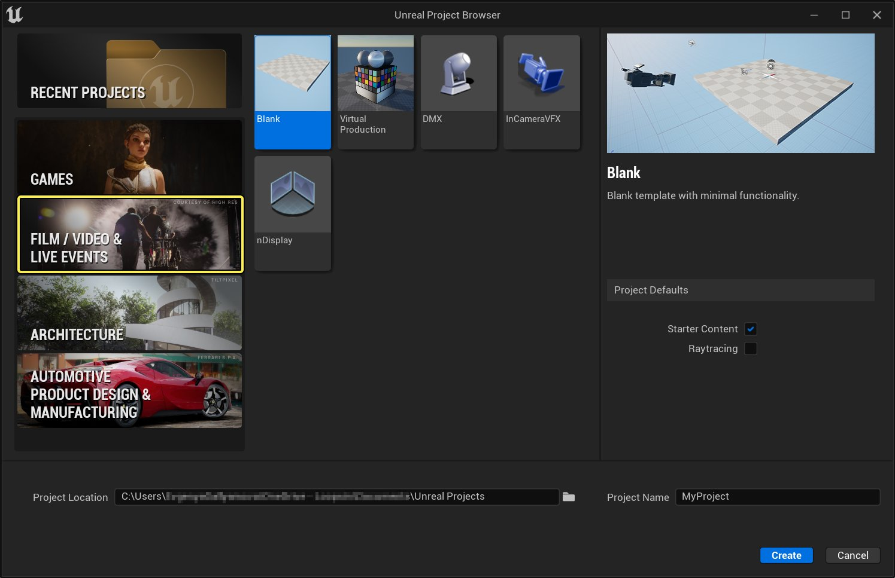
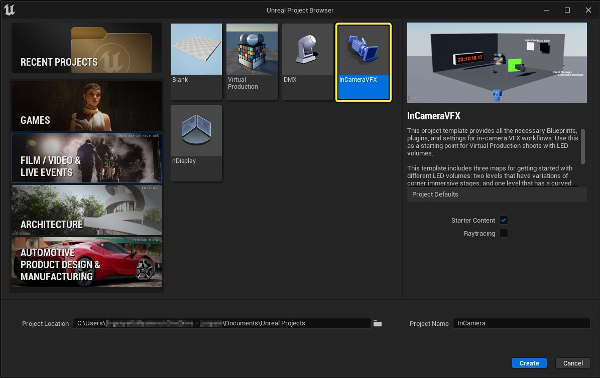
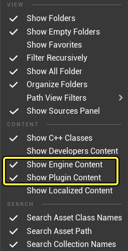
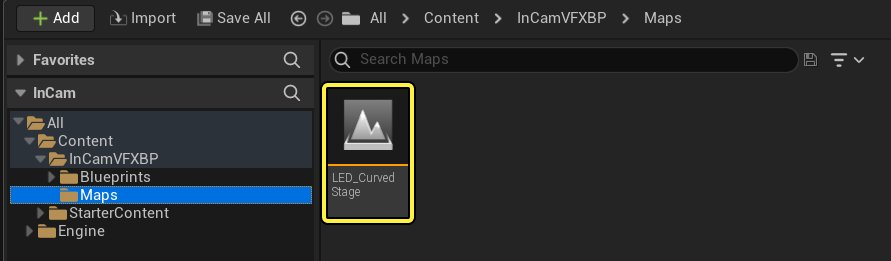
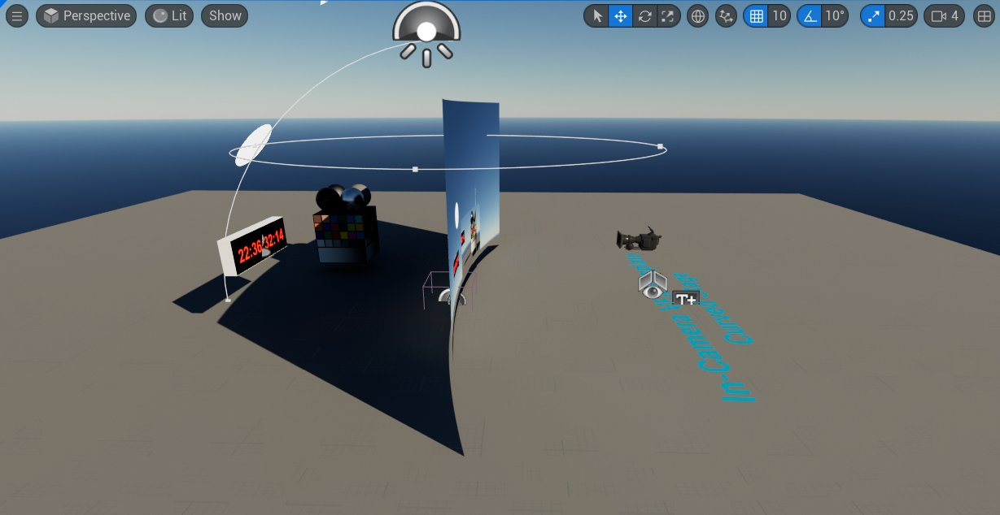
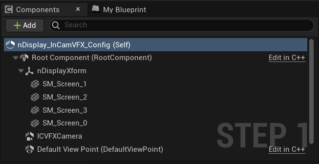
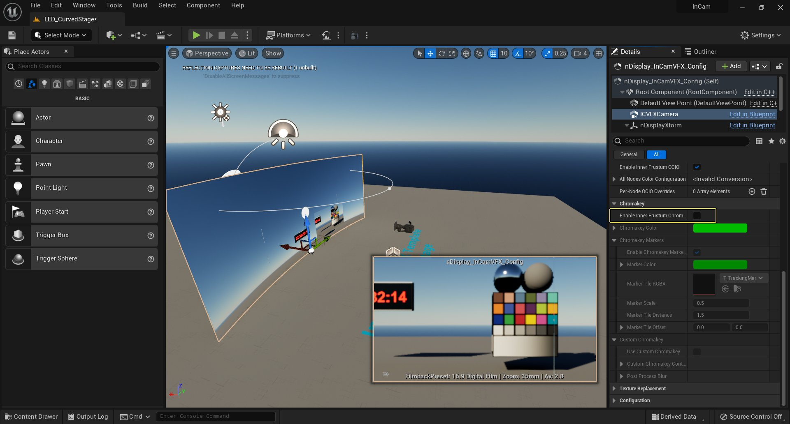

# ICVFX模板

> 路径：虚幻引擎5.7文档 / 使用媒体 / 媒体集成 / ICVFX / ICVFX模板

> 原始页面：https://dev.epicgames.com/documentation/unreal-engine/in-camera-vfx-template-in-unreal-engine

**ICVFX模板** 是创建LED实景舞台复杂配置的起点。它提供了一个基本地图和多种功能，可帮助你开始进行ICVFX项目。

## 从模板创建项目

1. 启动 **虚幻引擎**。
2. 选择 **影视活动（Film, Television, and Live Events）** 模板类别。

   

   点击查看大图。
3. 点击 **InCamera VFX**。

   

   点击查看大图。
4. 选择是否包含起始内容和是否启用回溯功能，并为项目选择路径和名称。
5. 点击 **创建**。

## 模板功能

- 用于ICVFX的nDisplay配置和蓝图设置
- 可设置的内凹面和外凹面
- 实时链接
- 色键和追踪标记
- 颜色校正区域
- 网络遥控
- OSC

有关如何使用这些功能的信息，请参阅[ICVFX概述](../in-camera-vfx-overview/index.md)和[ICVFX快速入门](../in-camera-vfx-quick-start/index.md)。

> [!NOTE]
> 要访问模板中描述的 **蓝图（Blueprint）** 和其他资产，请确保在 **内容浏览器（Content Browser）** 的 **查看选项（View Options）** 菜单中启用 **显示引擎内容（Show Engine Content）** 和 **显示插件内容（Show Plugin Content）**。
>
> 

## 地图

点击查看大图。

主地图为 **LED_CurvedStage**。它适用于一些常见的ICVFX设置和配置。

### LED曲面舞台

该地图提供了另一种设置方案，即使用曲面网格体作为LED墙。LED墙由四个子部分组成，左右两边各两个，因此在根组件下的 **nDisplay_InCamVFX_Config** 中有四个屏幕。你可以自定义这些子部分，以此为基础来描述任何类型的曲面LED显示器，使其与你的硬件配置相匹配。

#### 色键

在曲面舞台地图内 **nDisplay_InCamVFX_Config** 的详细信息（Detail）中，有一个控制设置可以启用色键，从而控制该层的可见性。

点击查看大图。
