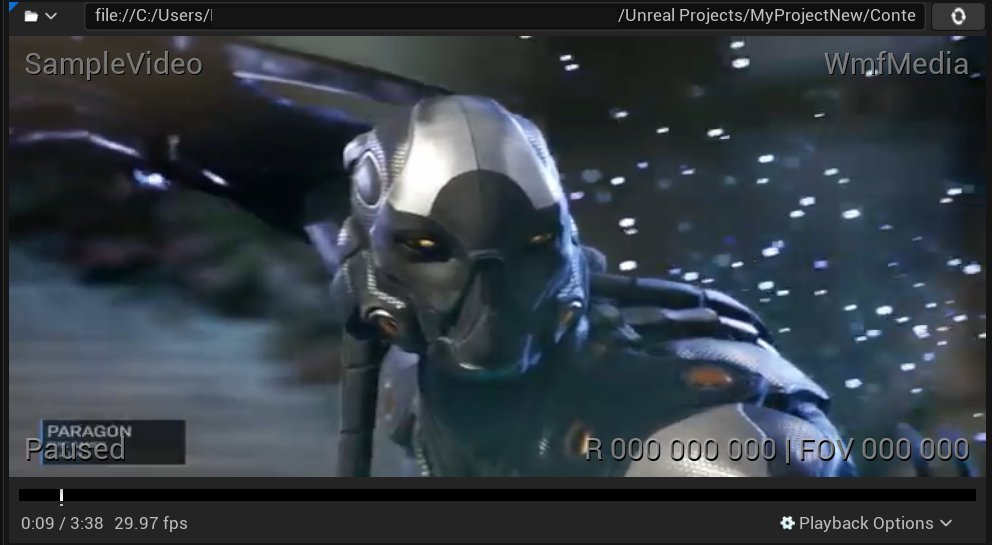
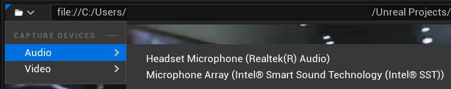
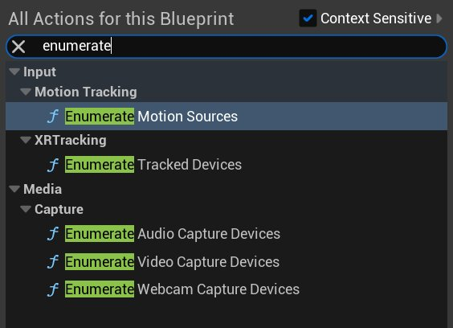
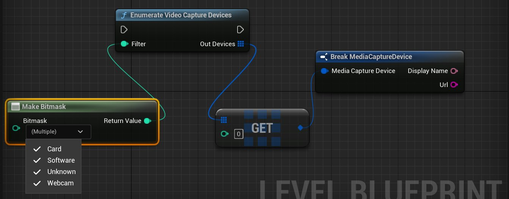
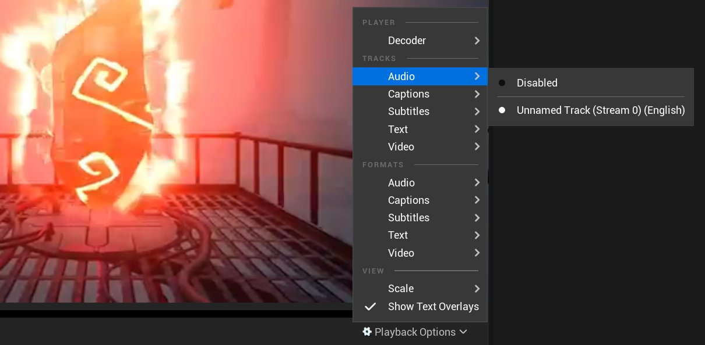
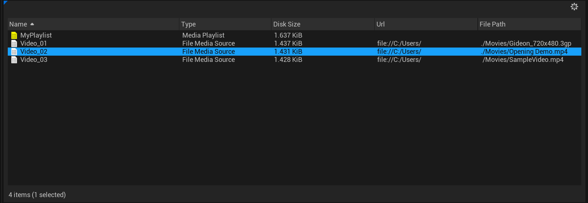
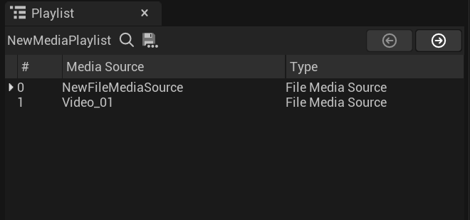

# 媒体编辑器参考文档

> 路径：虚幻引擎5.7文档 / 使用媒体 / 媒体集成 / 媒体框架 / 媒体编辑器参考文档

> 原始页面：https://dev.epicgames.com/documentation/unreal-engine/media-editor-reference-for-unreal-engine

打开 **媒体播放器（Media Player）** 资源时，**媒体编辑器（Media Editor）** 窗口将打开，它提供播放和控制 **媒体源** 资源的不同方面的选项。 在"媒体编辑器（Media Editor）"中，你可以定义用于媒体源的播放器插件，在不同的音频/视频轨迹（如果适用）之间进行选择，以及定义媒体播放器自身的设置。 该编辑器中的 **信息（Info）** 选项卡也会显示与正在使用的媒体类型相关的信息，可以使用该信息来对任何可能出现的播放问题进行调试。 请参阅以下各个部分来获取更多信息以及详细了解可用的选项。

## 工具栏

媒体编辑器的 **工具栏（Toolbar）** 部分使你能够控制媒体播放。

> [!NOTE]
> 要使播放选项变为可用状态，必须先从 **媒体库（Media Library）** 窗口中选择要播放的有效媒体源。

| 选项 | 说明 |
| --- | --- |
|  | 保存该媒体播放器（Media Player）资源（**Ctrl+S**）。 |
|  | 在内容浏览器中浏览至媒体播放器（Media Player）资源（**Ctrl+B**）。 |
|  | 跳转到播放列表中的前一项。 |
|  | 将媒体源倒回至开头。 |
|  | 使所选媒体的播放倒退（多次单击会增大搜寻速度）。 |
|  | 开始/继续媒体播放。 |
|  | 暂停媒体播放。 |
|  | 快进媒体播放（多次单击会增大搜寻速度）。 |
|  | 跳转到播放列表中的后一项。 |
|  | 关闭当前打开的媒体。 |

## "播放器（Player）"窗口

**"播放器（Player）"窗口** 使你能够查看媒体播放以及定义 **播放选项（Playback Options）**。 打开媒体源并将鼠标悬停在该窗口上时，你将看到显示文件名称（左上角）、当前使用的播放器插件（右上角）、媒体的状态（左下角）和用于360视频的当前水平、垂直视野及视图旋转（右下角）的文本覆层。

在"播放器（Player）"窗口的顶部，具有显示URL路径（你可以使用 **打开URL（Open URL）** 蓝图节点在蓝图中直接打开）的文本字段。在URL字段的右侧，具有可用于重新加载当前媒体的重新加载按钮（与大部分Web浏览器中的重新加载按钮的作用相似，可用于重新加载链接到互联网的外部URL）。 在URL字段的左侧，具有 **捕捉设备（Capture Devices）** 选项（可通过单击下拉菜单让其显示）。

### 捕捉设备（Capture Devices）

**捕捉设备（Capture Devices）** 菜单和选项变为可用状态的前提是有已连接且[受支持的设备](../media-framework-technical-reference/index.md)连接到计算机。 这些选项使你能够测试不同的音频和捕捉设备，URL会随所选择的设备而更新。捕捉设备与其他媒体源的细微差异之处在于可以连接多个设备。 可以使用蓝图或C++代码来枚举和过滤特定设备。

如上图中所示，可通过在蓝图中搜索"enumerate"或"capture devices"来查看可选枚举器的列表。

下面的示例中展示了使用 **枚举视频捕捉设备（Enumerate Video Capture Devices）** 节点的样本设置，它过滤可用于获取要打开的URL的指定设备。

> [!NOTE]
> 请参阅 [播放实时视频采集画面](../media-framework-unreal-engine-tutorials/playing-live-video-captures/index.md) 页面来获取更多信息。

### 播放选项（Playback Options）

"播放器（Player）"窗口中还包括 **播放选项（Playback Options）** 菜单，该菜单中包含可用于定义媒体播放方式的多个不同选项。

**播放器**

| 选项 | 说明 |
| --- | --- |
| **解码器（Decoder）** | 此部分使你能够定义用于媒体的播放器插件。默认设置是"自动（Automatic）"，它将基于媒体类型自动选择相应的播放器插件。 |

**轨迹（Tracks）**

| 选项 | 说明 |
| --- | --- |
| **音频（Audio）** | 使你能够设置与媒体源关联的默认音频轨迹（如果媒体中嵌入了多个音频轨迹）或禁用音频轨迹。 |
| **说明（Captions）** | 使你能够为所选的媒体源定义默认说明轨迹（如果媒体中嵌入了轨迹）。 |
| **字幕（Subtitles）** | 使你能够为所选的媒体源定义默认字幕轨迹（如果媒体中嵌入了轨迹）。 |
| **文本（Text）** | 使你能够为所选的媒体源定义默认文本轨迹（如果媒体中嵌入了轨迹）。 |
| **视频（Video）** | 使你能够设置与媒体源关联的默认视频轨迹（如果媒体中嵌入了多个视频轨迹）或禁用视频轨迹。 |

**格式（Formats）**

| 选项 | 说明 |
| --- | --- |
| **音频（Audio）** | 显示可以选择的可用音频格式轨迹（如果适用）。 |
| **说明（Captions）** | 显示可以选择的可用说明格式轨迹（如果适用）。 |
| **字幕（Subtitles）** | 显示可以选择的可用字幕格式轨迹（如果适用）。 |
| **文本（Text）** | 显示可以选择的可用文本格式轨迹（如果适用）。 |
| **视频（Video）** | 显示可以选择的可用视频格式轨迹（如果适用）。 |

**视图（View）**

| 选项 | 说明 |
| --- | --- |
| **缩放（Scale）** | 将视频大小更改为"适应（Fit）"（使视频适应"播放器（Player）"窗口）、"填充（Fill）"（使视频填满"播放器（Player）"窗口）或"原始大小（Original Size）"（使用视频的原始大小）。 |
| **显示文本覆层（Show Text Overlays）** | 将与所选媒体关联的覆层资源切换为显示。 |

## 媒体库（Media Library）

**媒体库（Media Library）** 显示可以在"媒体编辑器（Media Editor）"中打开的项目中的所有媒体源资源。 可以在此窗口中右键单击源来打开情境菜单，它可用于编辑资源，在"媒体编辑器（Media Editor）"中打开，在内容浏览器中浏览至资源或显示媒体文件在计算机上的位置。 此窗口也将显示每个媒体源的类型及其关联的URL字符串。

## 播放列表（Playlist）

"媒体编辑器（Media Editor）"的 **播放列表（Playlist）** 部分不仅可以显示媒体播放列表中包含的所有文件，也使你能够在项目中创建/保存新的媒体播放列表资源。 "播放列表（Playlist）"窗口右上角的箭头的作用与工具栏中的 **上一个（Prev）** 和 **下一个（Next）** 按钮的作用相似，它们使你能够在播放列表中的媒体源间进行循环。

> 图片已省略：Playlist section

如上图中所示，处于激活状态的媒体播放列表会显示它包含的每个媒体源，而且会有箭头标记指向当前正在播放的源。

当媒体源处于激活状态时，引擎会在"媒体编辑器（Media Editor）"中为每个媒体源创建本地媒体播放列表。通过单击 **保存（Save）** 图标可将本地媒体播放列表保存为新的媒体播放列表。

> 图片已省略：Unsave Playlist

## 细节（Details） / 信息（Info）

> 图片已省略：Details

**细节（Details）** 面板提供用于控制"媒体播放器（Media Player）"自身的播放的选项。

**播放（Playback）**

| 选项 | 说明 |
| --- | --- |
| **打开时播放（Play on Open）** | 如启用，将在通过蓝图或C++打开源时自动开始播放媒体源。 |
| **随机（Shuffle）** | 如果启用此选项，打开播放列表时，播放器将随机选择播放列表中的源而不是按顺序播放。 |
| **循环（Loop）** | 如启用，将循环单个媒体源或整个媒体播放列表（不支持循环视频捕捉设备）。 |

**视图设置（View Settings）**

| 选项 | 说明 |
| --- | --- |
| **水平视野（Horizontal Field of View）** | 使你能够手动为360视频设置水平FOV值。 |
| **垂直视野（Vertical Field of View）** | 使你能够手动为360视频设置垂直FOV值。 |
| **视图旋转（View Rotation）** | 使你能够手动为360视频设置视图旋转。 |

**编辑器**

| 选项 | 介绍 |
| --- | --- |
| **受PIE影响（Affected by PIEHandling）** | 播放器在进入或退出PIE模式时是否受影响。 |

### "信息（Info）"面板

> 图片已省略：Info Panel

**"信息（Info）"** 面板提供与所选媒体源相关的信息，可将该信息用于调试目的。 此窗口显示与文件关联的播放器插件、视频和音频流的数量和所使用的编码解码器、取样速率和大小等与视频和音频轨迹相关的信息。

尝试播放视频时发生的错误将在此处显示，例如，如果尝试加载不受支持的格式，在该窗口中该错误将列示为 **不受支持（Not supported）**。 另外，可以使用 **复制到剪贴板（Copy to Clipboard）** 按钮来复制此信息，然后可以将该信息发布到我们的官方论坛或[Answer Hub](https://answers.unrealengine.com/)页面来获取帮助以及对任何播放问题进行故障排除。
