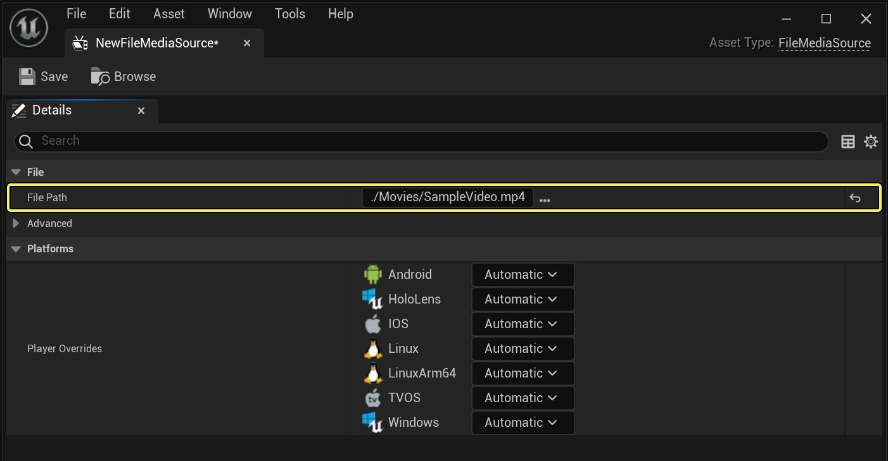
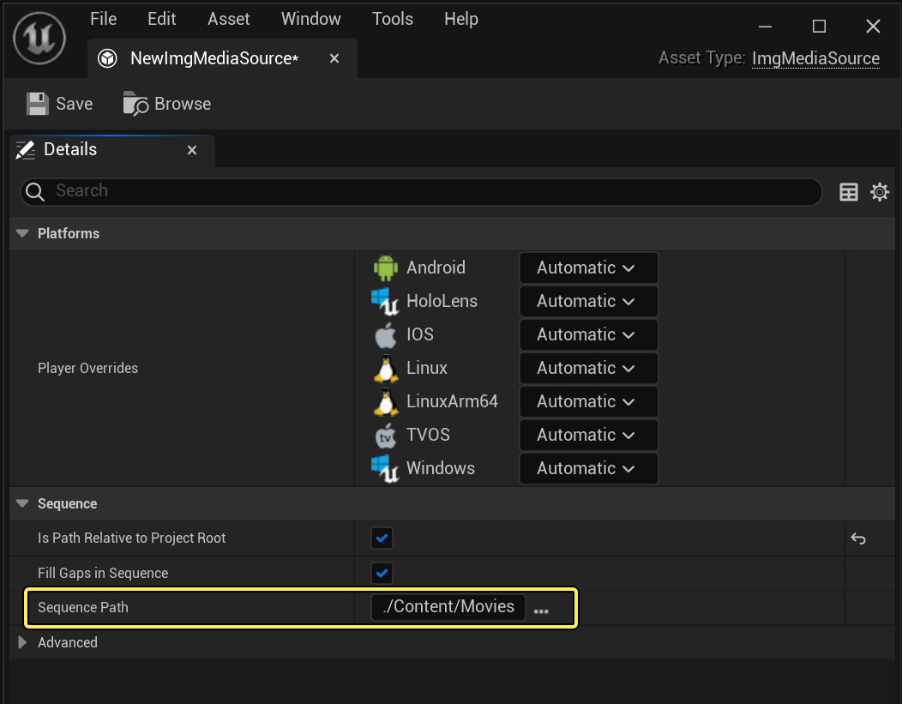
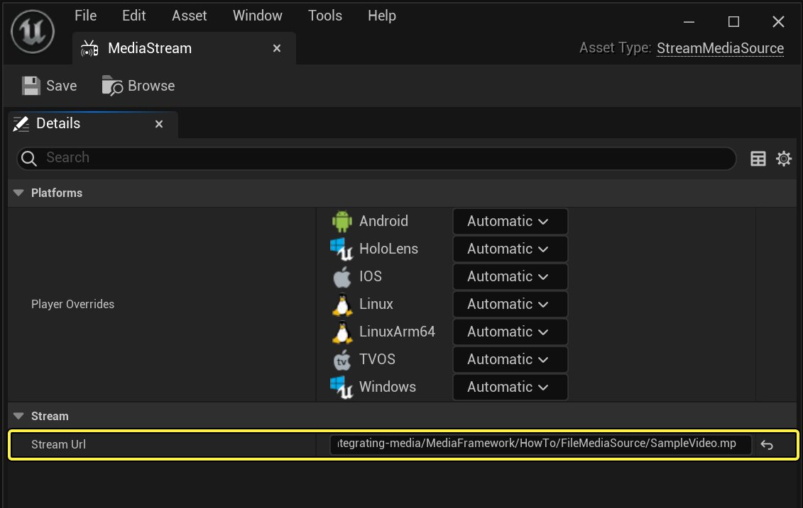
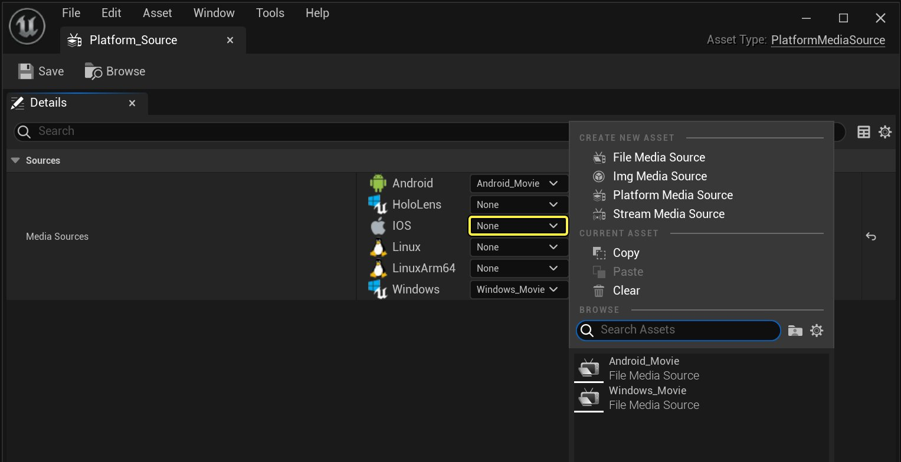
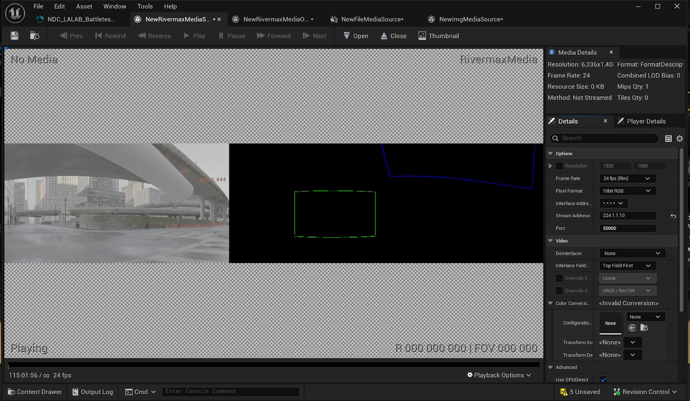
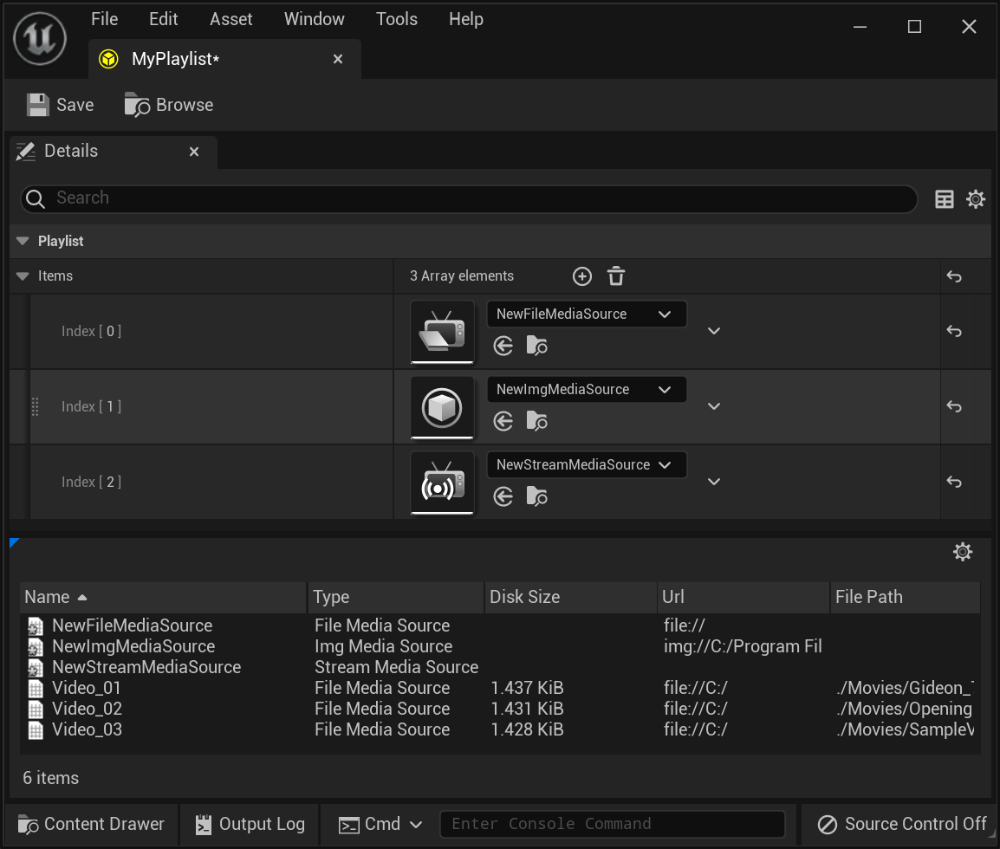
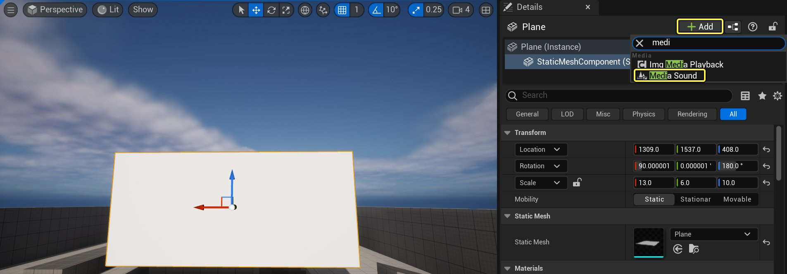
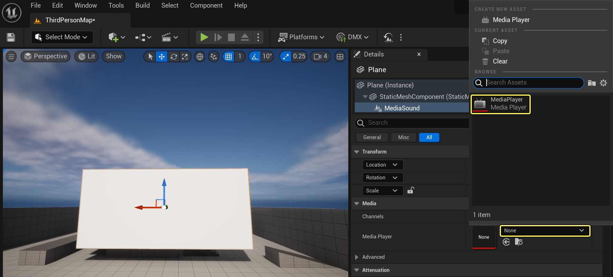

# 媒体框架概述

> 路径：虚幻引擎5.7文档 / 使用媒体 / 媒体集成 / 媒体框架 / 媒体框架概述

> 原始页面：https://dev.epicgames.com/documentation/unreal-engine/media-framework-overview-for-unreal-engine

**媒体框架（Media Framework）** 利用数个资源在虚幻引擎4中播放视频。在 **媒体播放器** 资源中可对视频进行拖动、暂停或倒回，并通过[C++](../../../../gameplay-systems/programming-with-cpp/index.md)或[蓝图可视化脚本](../../../../blueprints-visual-scripting/index.md)进行控制。 无论是需要在关卡中的一块表面上播放视频，还是创建一个带[UMG](../../../../user-interfaces/umg-editor-reference/index.md)的UI元素让玩家控制视频播放，首先需要指定 **媒体源**，以便引擎找到媒体资源。

## 媒体源类型

可使用数个不同媒体源资源来定义媒体来源。 无论文件是项目的一部分，还是从网页上进行流送，或者是平台特定的媒体，在播放视频前都需要定义源。 点击 **新增（Add New）** 按钮，然后在 **媒体（Media）** 部分指定要使用的源类型，在 **内容浏览器** 中添加一个媒体源。

### 文件媒体源

点击查看大图。

**文件媒体源** 资源用于保存在设备或共享本地网络文件中的媒体文件。可在 **文件路径** 部分指定媒体文件存放路径。

> [!TIP]
> 媒体文件可保存在任意路径下，但建议将其保存在项目的 **Content/Movies** 文件夹中，然后指向此文件。 此操作可确保媒体文件随项目正常打包。指向此路径外的文件时将出现黄色感叹号警告（如上所示）。

此类源资源可将整个媒体文件载入内存，然后启用 **预缓存文件（Precache File）** 选项（在 **高级选项** 部分下）进行播放。 基于文件大小的不同，缓存时间将存在差异，因此选择此项时需将其纳入考量。 每个文件媒体源资源能够以逐平台基础（如下所示）覆盖其本地媒体播放器插件（用于播放媒体的插件），也可以自动选择播放器插件。

> [!NOTE]
> 并非所有播放器均支持预缓存。当前只有 **MfMedia**、**PS4Media** 和 **WmfMedia** 播放器插件支持。

> [!NOTE]
> 请查阅[播放视频文件](../media-framework-unreal-engine-tutorials/play-a-video-file/index.md)指南，了解如何使用文件媒体源资源。

### 图像(Img)媒体源

点击查看大图。

**图像媒体源** 资源可用于播放保存在设备上的图像序列，或从共享本地网络中进行播放，其中 **序列路径** 域将指向序列中的首个图像。 图像必须为支持的格式，并按顺序命名（例如：*MyImage01.png* or *MyImage_01.png*），以便引擎找到并填充序列中剩余的图像。

在高级选项中可定义序列图像的 **每秒帧率覆盖（Frames Per Second Override）** 和任意 **代理覆盖（Proxy Overrides）**。和其他源资源一样，可使用 **播放器覆盖（Player Overrides）** 基于媒体播放的平台类型来定义播放器插件。

> [!NOTE]
> 请查阅[播放图像序列](../media-framework-unreal-engine-tutorials/play-an-image-sequence/index.md)指南，了解如何使用图像媒体源资源。

### 流送媒体源

点击查看大图。

**流送媒体源** 资源使用URL作为媒体的源，并从互联网上进行获取。当前版本不支持链接到YouTube或DailyMotion式的URL，需要直接链接到托管文件。 和文件媒体源资源一样，可以逐平台为基础覆盖流送媒体源的播放器插件，或自动选择播放器插件。

> [!NOTE]
> 请查阅[播放视频流](../media-framework-unreal-engine-tutorials/play-a-video-stream/index.md)指南，了解如何使用流送媒体源资源。

### 平台媒体源

点击查看大图。

**平台媒体源** 资源支持以逐平台为基础覆盖媒体源。举例而言，您希望只在Android设备或只在PS4上播放特定视频。在 **媒体源** 部分可指定哪些视频在哪些平台上播放。使用平台媒体源时，必须为每个平台选择媒体源。

> [!NOTE]
> 请查阅[在平台上播放媒体](../media-framework-unreal-engine-tutorials/playing-platform-specific-media/index.md)指南，了解如何使用平台媒体源资源。

### 采集卡媒体源（AJA、Blackmagic、Rivermax）

点击查看大图。

有几种不同的媒体源资产可供不同类型的采集卡使用，其中包括AJA、Blackmagic和Rivermax。要使用这些媒体源资产，需要启用特定的插件，具体取决于你所用的采集卡。通常，这些资产为你提供了一种方法，可以播放直接从采集卡流送到关卡中的内容。关于使用采集卡媒体源资产的更多详情，请参阅[专业视频I/O](../../professional-video-io/index.md)（适用于AJA和Blackmagic），以及[将SMPTE 2110用于nDisplay](../../rendering-to-multiple-displays-with-ndisplay/using-smpte-2110-with-ndisplay/index.md)（适用于Rivermax）文档。

## 媒体播放列表

媒体源资源可进行单个播放，使用 **媒体播放列表** 资源可按顺序播放多个媒体源。 创建数个媒体源资源后可将它们添加到媒体播放列表，在此将自动循环，按定义的顺序播放每个资源。 通过**内容浏览器** 中 **媒体（Media）** 部分下的 **新增（Add New）** 按钮即可创建媒体播放列表。

创建并打开媒体播放列表后，媒体播放列表编辑器将打开：

点击查看大图。

可在媒体播放列表编辑器中定义需要添加的源资源，并指定播放顺序。 创建的所有媒体源资源将显示在下方的 **媒体库（Media Library）** 窗口中，双击资源即可将其添加到播放列表末尾（或使用"项目"部分下的 **+** 按钮进行添加）。 除非经蓝图脚本指定，媒体播放列表可混合每种媒体源类型并按顺序播放。

> [!NOTE]
> 请查阅[使用媒体播放列表](../media-framework-unreal-engine-tutorials/using-media-playlists/index.md)指南，了解如何使用媒体播放列表资源。

## 媒体音效组件

要使音效随视频播放，需要创建一个 **媒体音效** 组件并将其添加到关卡中播放媒体的蓝图或Actor。

以下关卡中有一个静态网格体，**细节** 面板中也已添加一个媒体音效组件。

点击查看大图。

将媒体音效组件添加到actor或蓝图后，需要将媒体音效组件指向一个 **媒体播放器** 资源。

点击查看大图。

媒体音效组件在 **细节** 面板中提供了 **通道**、**衰减**、**并发性** 和其他[音频](../../../../working-with-audio/index.md)相关的设置，可用于定义音效的感知方式。 连接到媒体播放器资源时，附加到视频源的音频将随视频自动播放。 通常而言，可沿用媒体音效组件的默认设置。然而，如果需要对音效进行更多控制，可对并发性、衰减和其他设置进行调整。

## 媒体纹理

**媒体纹理** 资源用于从媒体播放器资源渲染视频轨迹。

媒体音效组件提供音频，而媒体纹理提供媒体源资源的视觉效果。 媒体纹理资源可包含在[材质](../../../../designing-visuals-rendering-and-graphics/unreal-engine-materials/index.md)中，然后再应用到关卡中的网格体（如公告板、电视或显示器）进行显示，使视频在游戏世界中的物体上播放。 创建媒体纹理资源时，需要在 **媒体播放器（Media Player）** 下的 **细节（Details）** 面板中定义要引用的媒体播放器。

> 图片已省略：undefined

点击查看大图。

下方含媒体纹理资源的材质已被创建并应用到关卡中的静态网格体上。 在[纹理编辑器](https://dev.epicgames.com/documentation/404)中，媒体纹理显示的播放位置与其在关卡中材质所处的位置相同。 除标准外，媒体纹理接受X和Y轴 **寻址（Addressing）** 值为 **锁定（Clamped）**、**镜像（Mirror）** 或 **场景（World）**。

> 图片已省略：undefined

点击查看大图。

材质使用一个 **Texture Sample** 节点，其将引用媒体纹理资源。 在纹理取样节点上，**取样器类型（Sampler Type）** 属性应该设置为**外部（External）**，除非你使用 **Electra媒体播放器**，否则你必须将取样器类型属性设置为 **颜色（Color）**。

> 图片已省略：undefined

点击查看大图。 默认取样器类型属性设置

> 图片已省略：undefined

点击查看大图。 Electra媒体播放器取样器类型属性设置

## 媒体播放器资源

拥有媒体源或媒体播放列表后，即可使用 **媒体播放器** 资源来播放资源。 媒体播放器资源需要使用媒体纹理来生成视频播放；使用媒体音效组件来生成视频关联的音频。 通过 **内容浏览器** 中 **媒体（Media）** 部分下的 **新增（Add New）** 按钮即可创建媒体播放器资源。

创建媒体播放器资源时将出现 **创建媒体播放器（Create Media Player）** 窗口（如下图所示），询问是否需要创建并链接资源到媒体播放器。 这将自动创建并指定与正在创建的媒体播放器资源相关联的媒体纹理文件。

双击媒体播放器资源将打开 **媒体播放编辑器**：

> 图片已省略：undefined

点击查看大图。

在媒体播放编辑器中可以预览项目中的所有媒体源资源，可以播放、暂停、倒回或快进（如支持）媒体。 也可以定义媒体播放器资源的播放设置：打开时媒体从何处开始自动播放、媒体是否循环播放（如支持），或是否从播放列表随机选择源进行播放（如使用播放列表）。

> [!NOTE]
> 欲知媒体编辑器和选项详解，请参阅[媒体编辑器参考](../media-editor-reference/index.md)文档页面。

## 媒体资产和脚本编写

媒体播放器资源设置完成并链接媒体纹理和媒体音效组件（如视频含音频）后，即可在游戏会话中进行播放。 如需在游戏中播放媒体，首先需要通过蓝图或C++创建一个对媒体播放器资源的引用。 执行此操作的方法是在任意蓝图中创建一个 **媒体播放器** 变量类型的[变量](../../../../blueprints-visual-scripting/specialized-blueprint-visual-scripting-node-groups/blueprint-variables/index.md)，并设置变量的 **默认值** 引用所需的媒体播放器。

> 图片已省略：undefined

点击查看大图。

对定义的媒体播放器进行引用后，即可基于媒体源类型调用一个 **Open** 函数。

> 图片已省略：undefined

点击查看大图。

| 选项 | 描述 |
| --- | --- |
| **打开文件（Open File）** | 打开电脑上指定路径中的一个媒体文件。 |
| **打开播放列表（Open Playlist）** | 打开指定播放列表中的第一个媒体源。 |
| **打开播放列表索引（Open Playlist Index）** | 打开指定播放列表中的指定媒体源。 |
| **打开源（Open Source）** | 打开指定的媒体源（文件媒体、流送媒体或平台媒体）。 |
| **打开源（延迟）（Open Source Latent）** | 使用选项和延迟操作打开指定的媒体源。 |
| **使用选项打开源Open Source with Options** | 使用指定的选项打开媒体源。 |
| **打开URL（Open URL）** | 打开指定的媒体URL。 |
| **重新打开（Reopen）** | 重新打开当前打开的媒体或播放列表。 |

新创建媒体播放器资源的 **打开时播放（Play on Open）** 选项为默认开启，意味着打开媒体源时将自动开始播放视频。 可在媒体播放器资源中取消勾选此选项，使源在打开时不进行播放，只在通过蓝图或C++进行显式调用时才开始播放。

如不希望媒体在成功打开后自动播放，可挂钩到 **Play** 蓝图事件。

> 图片已省略：undefined

点击查看大图。 上图中我们在 Event BeginPlay 节点上打开了媒体播放列表，只在 鼠标右键（Right Mouse Button） 为 按下（Pressed） 状态下时播放 媒体播放器（Media Player）。

> [!NOTE]
> 如未在媒体源打开时自动播放，而是使用Play函数进行播放，建议不要在Open Source或Open Playlist调用后直接连接Play调用。 这是因为媒体源需要一定时间打开，未打开前Play命令将返回false，视频将无法播放。在这些实例中，可能需要使用绑定到 **On Media Opened** 调用的[绑定事件](../../../../blueprints-visual-scripting/specialized-blueprint-visual-scripting-node-groups/event-dispatchers/binding-and-unbinding-events/index.md)。

> 图片已省略：undefined

点击查看大图。 上图中我们打开了一个流送媒体源并将媒体播放器绑定到On Media Opened，其将发射一个事件，在完全打开后播放媒体。

可将带媒体播放器引用的其他函数绑定到播放的多个状态（举例而言：如视频播放暂停或视频播放结束）。 还可在媒体播放器引用后调用多个不同函数，如检查视频能否被暂停、检查视频是否正在播放、视频是否设为循环，以及访问播放速度信息等。 如需查看这些选项，从媒体播放器引用连出引线，然后在蓝图快捷菜单的 **媒体播放器（Media Player）** 部分下查看。

> 图片已省略：undefined

点击查看大图。

## Sequencer集成

使用Media Framework播放的视频能够与 **Sequencer** 中的时间线实现精确到帧的同步，并且与媒体播放器的实时行为无关。Sequencer内部会处理与媒体播放器的通信和设置，以便实现同步。

目前，只有 **ImageMediaPlayer** 支持这种新的同步方式。如果你使用的是不支持此功能的媒体播放器，播放的开始位置或停止位置会十分接近Sequencer时间线的指示位置；然而，每一帧的排列可能是随机的。
