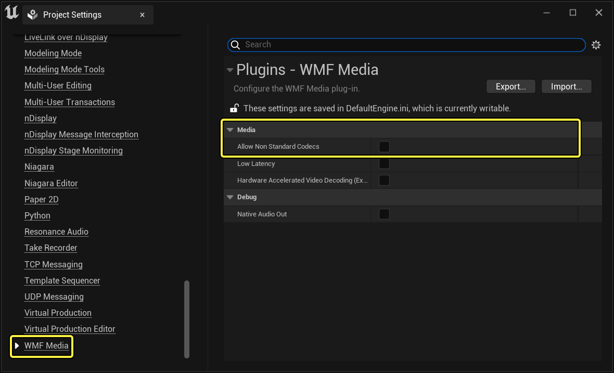
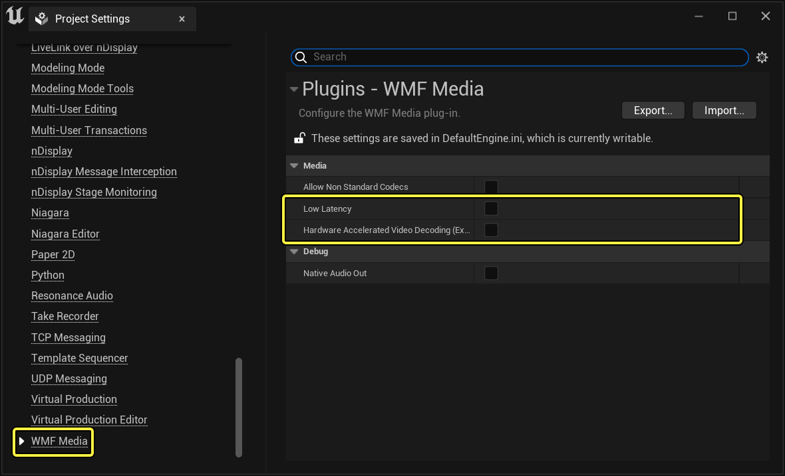

# 媒体框架技术参考

> 路径：虚幻引擎5.7文档 / 使用媒体 / 媒体集成 / 媒体框架 / 媒体框架技术参考

> 原始页面：https://dev.epicgames.com/documentation/unreal-engine/media-framework-technical-reference-for-unreal-engine

本页概述当前支持的文件扩展名、URL和采集设备，以及指出一些有关如何在不同平台上启用媒体框架的故障排除技巧。 我们目前正在调查并试图解决一些已知的，特定于平台的问题和限制，其中每个问题和限制都已在"故障排除"和"已知问题"部分中进行确认。

## 支持的文件、URL和采集设备

下表显示了基于每个媒体播放器平台支持的文件扩展名。

*单击下图下载"支持的文件和URL"数据表的.xlsx版本。*

下表显示了基于媒体播放器平台支持的URL。

上述支持的文件格式列表持续存在，对其他文件扩展名的支持将在未来的引擎更新中上线。它们已经针对 **Electra媒体播放器** 更新过。

> [!TIP]
> 为了获得最佳的兼容性和性能，建议使用 **H.264** 编码的 **MP4 (.mp4)** 容器文件。

### 采集设备

从4.18版开始，媒体框架支持Windows(WmfMedia)和Android(AndroidCamera)上的音频/视频采集硬件（不过还不支持控制台）。

> [!NOTE]
> 有关使用采集设备的示例指南，请参阅[播放实时视频采集](../media-framework-unreal-engine-tutorials/playing-live-video-captures/index.md)页面。

## WMF媒体配置

下面几个部分介绍可以在项目设置（Project Settings）中为WMF媒体插件设置的配置选项。

### 自定义编码解码器

Windows Media Foundation (WMF)在Windows平台上处理标准的音频/视频播放和录制，但WMF也是可扩展的。 默认情况下，WMF支持许多不同的格式、编码和文件容器，但也可以使用可选的编码解码器包进行扩展，这些包可以从Internet下载并安装。 然而，这意味着某些用户可能没有解码和播放媒体文件所需的特定编码解码器。

过去，虚幻引擎只支持随WMF提供的默认编码解码器，以确保每个人都能以相同的方式处理媒体。 有时，您可能想要使用一种不同的方法来编码您的媒体，或者使用您想要随游戏一起发布的您自己的专有媒体编码器（例如，您发布游戏时发布一个提供所需编码器的安装程序）。

您现在可以在 **项目设置（Project Settings）** 的 **插件（Plugins）** 中为 **WMF 媒体（WMF Media）** 启用和允许非标准编码解码器。



默认情况下，播放器插件将尝试检测操作系统(OS)不支持的音频和视频编码解码器，要求用户安装额外的编码解码器包。 如果播放器插件在访问媒体时检测到不支持的格式，则在 **输出日志（Output Log）** 中提供一条警告消息。

此外，您还可以在 **信息（Info）** 面板中的一个 **媒体播放器** 资源内看到媒体资源信息。

当启用 **允许不支持的编码解码器（Allow non-supported codecs）** 时，插件播放器将跳过检查，允许使用非标准编码解码器。

### 播放优化

WMF媒体插件提供了一些选项，您可以使用这些选项来自定义其解码和播放媒体的方式。如果插件不能以您需要的响应度、流畅性或性能播放您的媒体，您可以尝试启用这些选项。



| 设置 | 说明 |
| --- | --- |
| **低延迟（Low Latency）** | 该设置将媒体播放中的延迟降到最低。如果您的视频播放有延迟的趋势，该设置可以帮助您从WMF媒体插件中获得更快的响应。但是，启用该设置可能会对视频和/或音频的质量产生负面影响。 仅适用于Windows 8或更高版本。 |
| **硬件加速的视频解码（实验性）（Hardware Accelerated Video Decoding (Experimental)）** | 使用GPU而不是CPU来解码视频流送。如果您的CPU是视频性能方面的一个瓶颈，该设置可以提高视频播放的流畅性。它还允许您在更高分辨率的情况下同时使用更多媒体。 仅适用于Windows平台，使用DirectX 11渲染。 该选项被认为是[实验性](../../../../whats-new/experimental-features/index.md)的。**我们不推荐发布包含实验性功能的项目。** |

## HAP编码解码器播放支持

利用HAP编码解码器播放功能，可以以处理能力的CPU/GPU来制作高质量的媒体文件。

在UE4中可播放 **1x 4K 60 FPS** 影片或 **2x 4K 30 FPS** 影片，还可拉伸到 **2x 4K 60 FPS** 影片。

| 规格 | 支持的设置 |
| --- | --- |
| **格式** | HAP、HAP Alpha、HAP Q、HAP Q Alpha |
| **帧率** | 10、15、23.976、24、25、29.97、30、50、59.94、60 |
| **分辨率** | 最高4K 3840x2160 |
| **色彩深度** | 8位（4:4:4:） |
| **像素宽高比** | 宽高比独立 |

> [!NOTE]
> 从4.23版起，HAP播放功能不支持嵌入式音频或时间码。

### 基准测试案例

以下是UE4团队用于确定这些设置的基准测试案例。可使用此测试案例与自己的项目对比。

当前基准测试过程旨在提供对系统性能的粗略认识。我们测试了同一个影片文件在三种不同软件中的播放：虚幻引擎、Ventuz和VLC。 每次测试中，我们使用Windows任务管理器监视并记录CPU、GPU和磁盘使用率。

该影片文件是一个 **11秒的4K 60 FPS短片**，来自8K 60 FPS的源，我们使用HAP将其重新压缩为4K、8K和16K。我们发现WMF格式的问题，此问题导致任何高于 **4K 60 FPS** 的影片在这三种软件上都播放失败。 我们还发现使用两个SSD明显快于使用一个SSD。

以下是一些附加说明：

- 我们无法正确评估虚幻和Ventuz应用程序的磁盘使用率。
- 请注意，解码一个60 FPS视频剪辑相当于解码两个30 FPS视频剪辑。
- 目前这还不是PRO视频播放解决方案，因此不能保证不同文件或机器的播放同步。

#### 测试系统说明

- 至强3.39 Ghz
- 96 GB
- 三星MZVKW512HMJP-000L7（C:）
- ATA三星SSD 860 SCSI硬盘（D:）

## 故障排除

从引擎4.18开始，大多数播放器插件都添加了大量日志记录，将提供潜在问题的详细日志记录。

要启用日志记录，请将以下内容添加到项目的 **Engine.ini** 文件：

```
	[Core.Log]	LogMedia=VeryVerbose	LogMediaAssets=VeryVerbose	LogAndroidMedia=VeryVerbose	LogAvfMedia=VeryVerbose	LogMfMedia=VeryVerbose	LogPS4Media=VeryVerbose	LogWmfMedia=VeryVerbose 
```

如果媒体源无法打开或播放，请检查[开发者工具](https://dev.epicgames.com/documentation/404)下的 **输出日志（Output Log）** 以获得更多详细信息。

您还可以在媒体播放器资源和 **信息（Info）** 选项卡内查看有关媒体源的信息。

这将显示媒体源可用的选项，不同的音频和视频流送，以及有关每个流送的信息。

### Windows

Windows Media Foundation (WMF)的播放器插件WmfMedia对MP4容器有许多的限制。

> [!NOTE]
> 更多信息，请参阅Microsoft的[MPEG-4文件来源](https://msdn.microsoft.com/en-us/library/windows/desktop/dd757766%28v=vs.85%29.aspx)。

## 已知问题和限制

**媒体框架（Media Framework）** 仍在开发中，存在一些已知的问题和限制，现概述如下。

- **Android**

  - 音频目前通过操作系统播放，不能通过UE4的声音系统传输。
- **编辑器**

  - 媒体播放器中的播放列表UI总是在内部创建一个播放列表。
  - 播放列表可以从媒体播放器中保存；但是，目前无法在媒体播放器中编辑播放列表。

    变通方案：从媒体播放器中保存一个播放列表，然后打开并编辑该媒体播放列表资源。
- **Sequencer**

  - 当从Sequencer录制电影时，媒体播放将无法正确呈现。

    - 我们计划在不久的将来发布新的版本，因为我们知道这一点很重要。
  - ImgMedia插件将与Sequencer同步。
- **Windows**

  - QuickTime电影(.mov)对Windows 7及更高版本的支持目前是不可靠的。

    变通方案：目前不推荐使用这种格式。
- **Linux**

  - 目前，WebM媒体播放器是Linux上唯一可用的媒体播放器。
