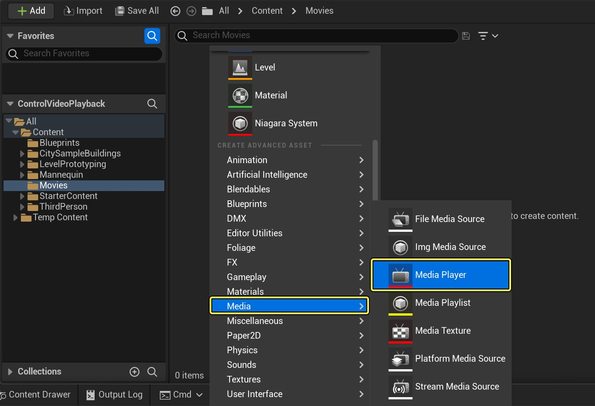
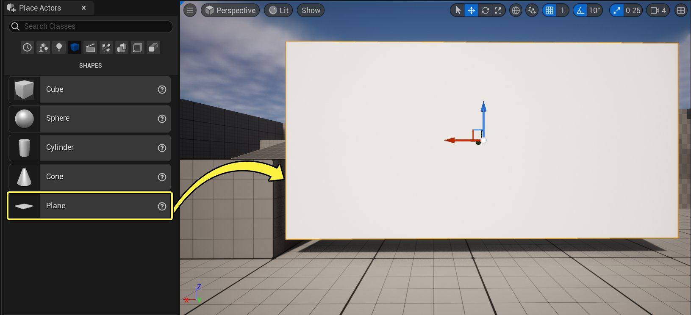
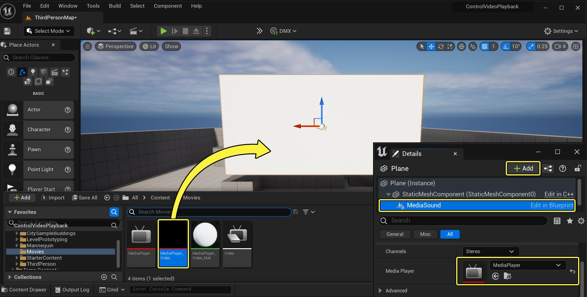
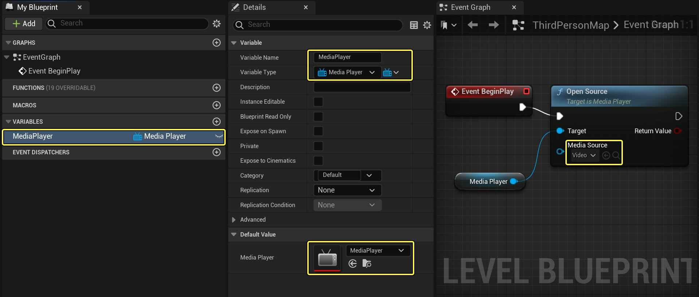
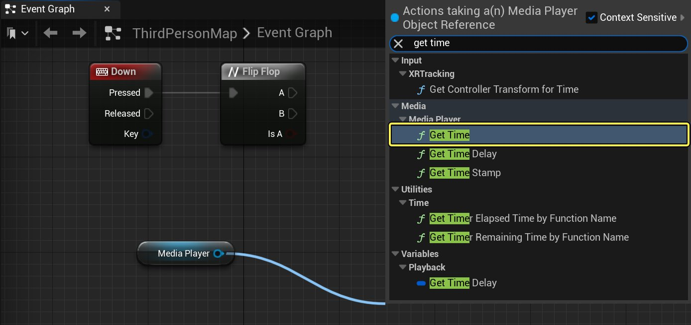
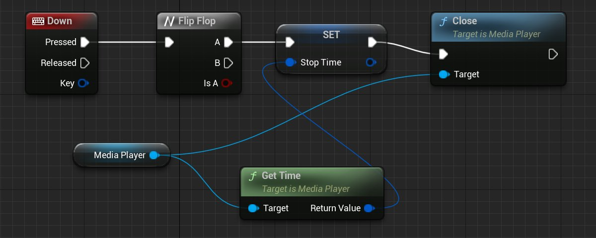
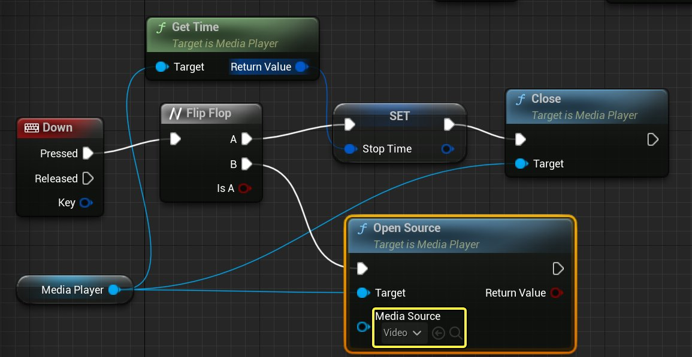
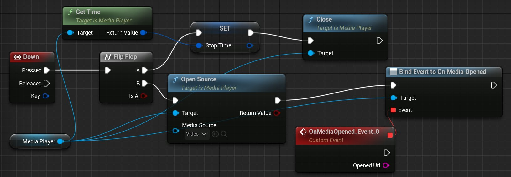

# 使用蓝图控制视频播放

> 路径：虚幻引擎5.7文档 / 使用媒体 / 媒体集成 / 媒体框架 / 媒体框架教程 / 使用蓝图控制视频播放

> 原始页面：https://dev.epicgames.com/documentation/unreal-engine/control-video-playback-with-blueprints-in-unreal-engine

除了在基于虚幻引擎5的项目中播放视频，你还可以让播放器通过一系列的[蓝图](../../../../../blueprints-visual-scripting/index.md)节点来控制视频的播放。

在本教程中，我们提供了一种方法，通过创建暂停、倒回、快进和恢复播放未播放完的视频的功能，让播放器控制视频的播放。

> [!NOTE]
> 并非所有的播放器插件都支持快进和/或反向播放。请参阅[媒体框架技术参考](../../media-framework-technical-reference/index.md)页面了解更多信息。

## 初始设置

首先，我们需要定位我们的媒体文件，然后在内容浏览器中设置一个文件夹。这能为我们之后构建蓝图做好准备。

> [!NOTE]
> 对于本教程，我们使用的是已启用 **初学者内容包（Starter Content）** 的 **蓝图第三人称模板（Blueprint Third Person Template）** 项目。 你还需要一个视频进行播放，你可以使用自己的视频或右键单击并下载此[示例视频](https://dev.epicgames.com/documentation/404)。

1. 在 **内容浏览器（Content Browser）** 中，展开 **源（Sources）** 面板并创建一个名为 **电影（Movies）** 的文件夹，然后右键单击新建的文件夹，选择 **在资源管理器中显示（Show in Explorer）**。
2. 将示例视频（或你支持的视频）拖动到你计算机上项目的 **内容/电影（Content/Movies）** 文件夹中。

   > [!WARNING]
   > 为了确保视频内容与项目一起打包和部署，内容必须位于项目的 **内容>电影（Content>Movies）** 文件夹中。
3. 在你的项目中，创建一个 **媒体播放器（Media Player）** 和相关的 **媒体纹理（Media Texture）** 资源，分别命名为 **MediaPlayer** 和 **MediaPlayer_Video**。

   

   点击放大图片。
4. 创建一个名为 **视频（Video）** 的 **文件媒体源（File Media Source）** 资源，并在其中将 **文件路径（File Path）** 指向在 **步骤2（Step 2）** 中添加的视频。
5. 打开你的 **媒体播放器（Media Player）** 资源，并禁用 **打开即播放（Play on Open）** 选项。

   在本例中，我们将向播放器提供播放控制，而不是在打开媒体源后让其自动开始播放。
6. 在 **基本（Basic）** 下的 **放置Actor（Place Actors）** 面板中的主编辑器内，将一个 **平面（Plane）** 拖动到关卡中并根据需要调整其大小（"放置Actor"若未开启，则可以在窗口菜单中找到）。

   

   点击放大图片。
7. 将 **MediaPlayer_Video** 纹理拖动到该 **平面（Plane）** 上，然后在该平面的 **详细信息（Details）** 面板中，添加 **媒体声音组件（Media Sound Component）** 并将其设置为使用你的 **媒体播放器（Media Player）** 资源。

   

   点击放大图片。

## 蓝图设置

接着，我们要设置我们的第一个蓝图，以便之后在其中添加函数。

1. 从"主工具栏"中，单击 **蓝图（Blueprints）** 按钮，然后选择 **打开关卡蓝图（Open Level Blueprint）**。
2. 在 **关卡蓝图（Level Blueprint）** 中，创建一个名为 **MediaPlayer**，类型为 **媒体播放器对象引用（Media Player Object Reference）** 的变量，并将其设置为指向你的 **媒体播放器（MediaPlayer）** 资源。
3. 按住 **Ctrl** 并将 **MediaPlayer** 变量拖动到图表中，并使用 **打开源（Open Source）** 和 **事件开始播放（Event Begin Play）** 以打开你的 **视频（Video）** 文件媒体源资源。

   

   点击放大图片。

   > [!NOTE]
   > 相反，你可以使用"打开源延迟"（Open Source Latent）节点（而非"打开源"（Open Source）节点），用选项打开指定的媒体源，这样会延迟执行"完成"（Completed）输出引脚，直至源文件打开。
   >
   > 如果你希望设置源文件的播放速度，你可以用这个方法。

## 播放/暂停 - 向上

1. 添加一个连接到 **触发器（Flip Flop）** 的 **向上（Up）** 键盘事件，并关闭你的 **Media Player** 变量，使用 **播放（Play）** 和 **暂停（Pause）**，如下所示。

   当播放器按下 **向上（Up）** 箭头键盘键时，媒体源将开始播放，而再按一次则会暂停视频。

   > [!NOTE]
   > 暂停对应于将播放速率（Play Rate）设置为0.0，但并非所有媒体源都支持暂停（例如网络摄像头和其他视频捕捉硬件源）。 你可以使用 **可以暂停（Can Pause）** 蓝图节点来确定媒体源是否支持暂停。

## 倒回/快进 - 左/右

1. 添加 **向左（Left）** 和 **向右（Right）** 键盘事件，然后关闭你的 **Media Player** 变量，使左键在 **-2** 处，右键在 **2** 处。

   这将使播放器能够按下左箭头键盘键把视频播放速率（Play Rate）设置为-2（以两倍的速度反向播放视频，值为1.0是正常的正向播放）。

   当你按下右箭头键后，视频将以两倍正常播放速率快进。

   你可以添加额外的蓝图逻辑来确定播放器按下倒回或快进键的次数，并将播放速率（Play Rate）从2倍增加或减少到4倍、6倍或更高。

   > [!NOTE]
   > 即使播放器插件支持1.0之外的播放速率，可以选择的实际播放速率也将取决于正在使用的媒体源。你可以使用 **获取支持速率（Get Supported Rate）** 函数确定是否支持该速率。
   >
   > 注意，**稀疏化（Thinned）** 和 **非稀疏化（Unthinned）** 速率之间存在区别。"稀疏化"意味着使用此速率时某些帧将被略过，而"非稀疏化"意味着使用此速率时所有帧都将被解码。

## 结束/恢复播放 - 向下

1. 添加一个连接到 **触发器（Flip Flop）** 的 **向下（Down）** 键盘事件，然后关闭 **媒体播放器（Media Player）** 引用，使用 **获取时间（Get Time）** 函数调用。

   

   点击放大图片。

   **获取时间（Get Time）** 函数调用将返回当前播放时间，当我们想要重新打开视频和恢复视频播放时，将存储和使用该当前播放时间。
2. 右键单击 **获取时间（Get Time）** 节点的 **返回值（Return Value）**，并将其提升至名为 **停止时间（Stop Time）** 的变量，然后将所有节点连接到 **关闭（Close）** 函数调用，如图所示。

   

   点击放大图片。

   这样将在按下向下箭头键盘键时关闭媒体播放器，但存储媒体播放器被停止于某个变量时的当前时间。
3. 关闭 **触发器（Flip Flop）** 的 **B** 引脚，使用 **打开源（Open Source）** 节点并将 **媒体源（Media Source）** 设置为你的 **视频（Video）** 媒体源。

   

   点击放大图片。

   这样将重新打开你的视频，但会从头开始播放视频，我们将在接下来的几个步骤中解决这个问题。
4. 拖走 **媒体播放器（Media Player）** 引用，使用 **在打开的媒体上指定（Assign On Media Opened）** 事件调度器，并进行连接，如图所示。

   

   点击放大图片。

   这样将创建一个[事件调度器](../../../../../blueprints-visual-scripting/specialized-blueprint-visual-scripting-node-groups/event-dispatchers/index.md)，该调度器仅在媒体源完全打开时才会调用连接的事件。 在向媒体播放器发出命令时，以这种方式操作是一种好办法，因为它可以确保在试图告诉媒体播放器做某事之前已经打开媒体源。 如果我们在打开媒体播放器后直接向它发出命令，则不能保证该媒体源已经完全打开并能够接收命令，而这可能会导致命令失败。
5. 关闭你的 **媒体播放器（Media Player）** 引用，调用 **Seek** 函数，然后调用 **Play** 函数。
6. 将 **Stop Time** 变量连接到 **寻找（Seek）** 节点的 **时间（Time）** 引脚。然后将 **寻找（Seek）** 和 **播放（Play）** 节点连接到 **OnMediaOpened** 事件，如图所示。

   > 图片已省略：undefined

   点击放大图片。

   现在，当播放器按向下箭头键时，当前时间将在关闭媒体播放器之前存储。 再次按下时，**视频（Video）** 媒体源将打开，而且当其完全打开后，在播放视频之前，该视频会移动到指定的 **停止时间（Stop Time）**（恢复播放）。
7. 关闭 **关卡蓝图（Level Blueprint）** 并从主工具栏单击 **播放（Play）** 按钮以在编辑器中播放。

## 最终结果

你现在可以使用 **向上（Up）**、**向下（Down）**、**向左（Left）** 和 **向右（Right）** 方向键来控制视频的播放。

按下 **向上（Up）** 方向键将播放/暂停视频，按下 **向下（Down）** 方向键将关闭/重新播放视频，按下 **向左（Left）** 方向键将倒回视频，按下 **向右（Right）** 方向键将快进视频。
