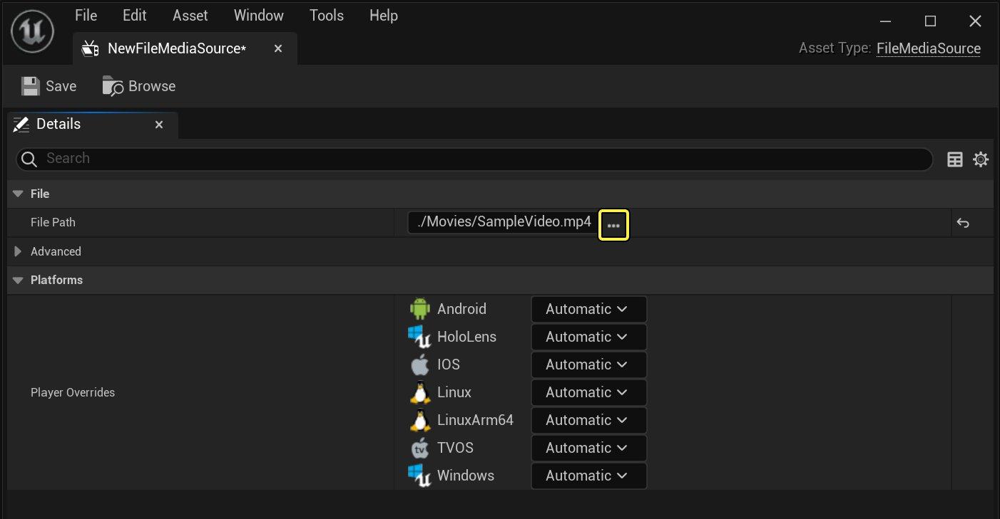
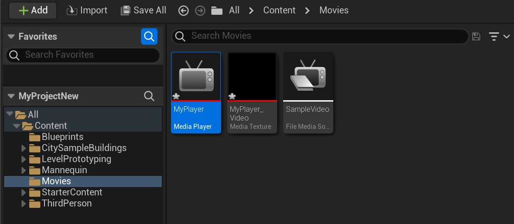
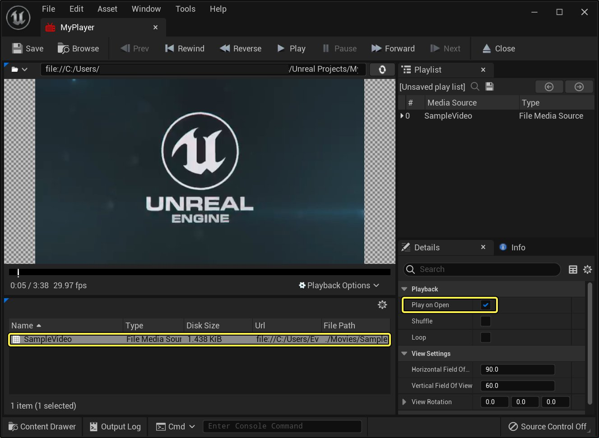
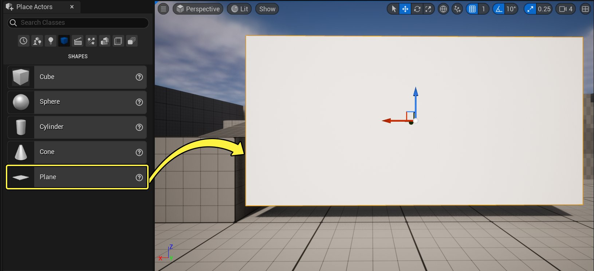
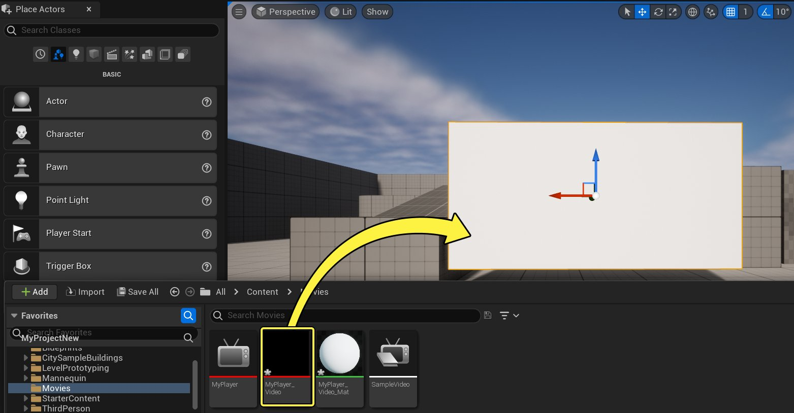
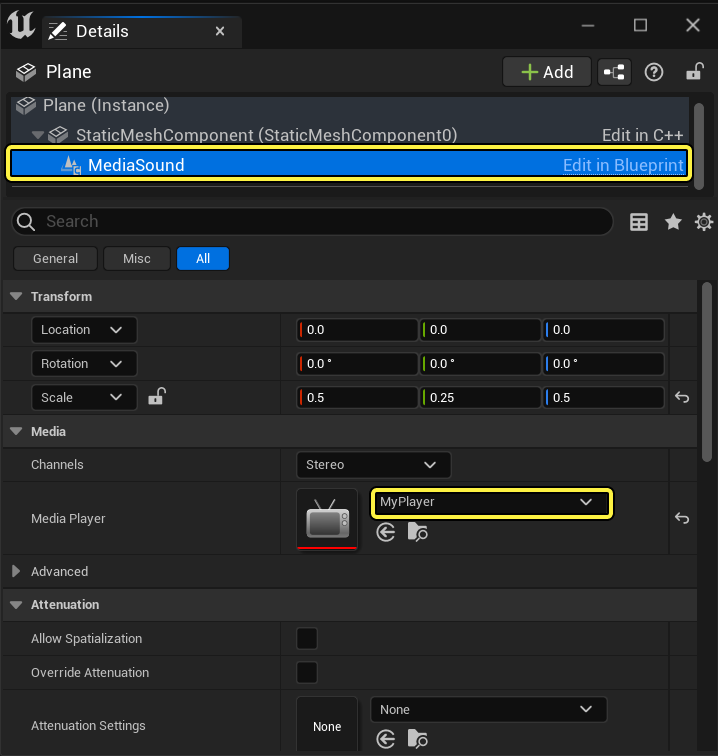
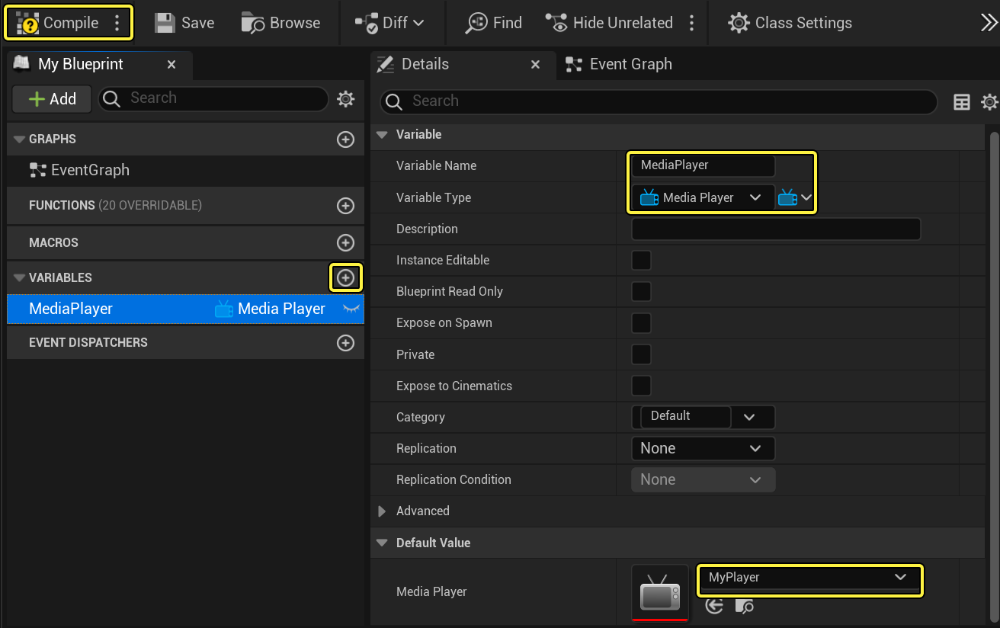
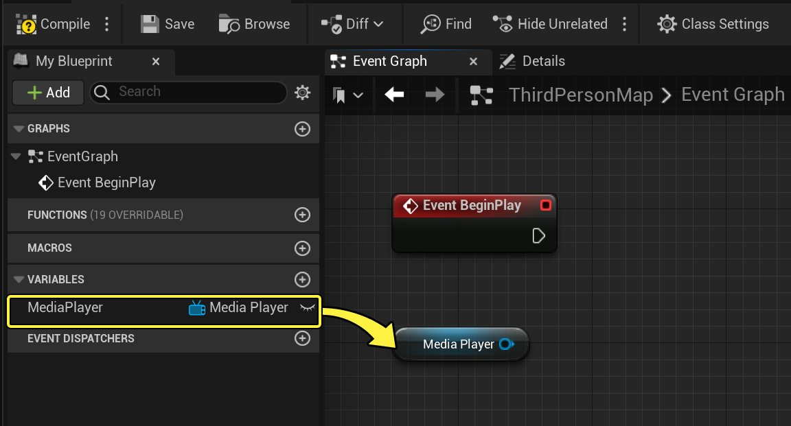

# 播放视频文件

> 路径：虚幻引擎5.7文档 / 使用媒体 / 媒体集成 / 媒体框架 / 媒体框架教程 / 播放视频文件

> 原始页面：https://dev.epicgames.com/documentation/unreal-engine/play-a-video-file-in-unreal-engine

如果你正在寻求一种在关卡内播放视频的方式，无论是在关卡内在电视上播放，还是作为UI的一部分在后台播放，甚至是全屏播放，你都需要使用 **媒体框架（Media Framework）** 工具和媒体源（Media Source）资源。 虽然有不同的媒体源资源类型，但当你希望在虚幻引擎5(UE5)中播放一个存储在设备（例如计算机、电话或主机平台）上的视频文件时，使用的将是 **文件媒体源（File Media Source）** 资源。

在本教程中，我们使用文件媒体源资源在关卡内的静态网格体上播放视频。

## 步骤

> [!NOTE]
> 对于本教程，我们使用的是已启用 **初学者内容包（Starter Content）** 的 **蓝图第三人称模板（Blueprint Third Person Template）** 项目。 你还需要一个保存在计算机上的希望播放的[支持的视频文件](../../media-framework-technical-reference/index.md)。你可以使用自己的视频，或者如果你没有视频，你可以右键单击并下载本教程的此[示例视频](https://d1iv7db44yhgxn.cloudfront.net/documentation/attachments/d8f5b997-1854-4ae0-b01c-a9f7410d4972/samplevideo.mp4)。

1. 在 **内容浏览器（Content Browser）** 中，展开 **源面板（Sources Panel）**，然后在 **内容（Content）** 下创建一个名为 **电影（Movies）** 的文件夹。

   > [!TIP]
   > 把媒体文件放置在项目的 **内容/电影（Content/Movies）** 文件夹中将确保媒体与项目一起正确打包。
2. 右键单击 **电影（Movies）** 文件夹并选择 **在资源管理器中显示（Show in Explorer）**。
3. 将所需的示例视频拖至项目的 **内容/电影（Content/Movies）** 文件夹中。

   > [!WARNING]
   > 为了将内容与项目一起打包和部署，媒体必须位于项目的 **内容/电影（Content/Movies）** 文件夹中。
4. 在项目中，右键单击 **电影（Movies）** 文件夹，在 **媒体（Media）** 下选择 **文件媒体源（File Media Source）**，并调用资源 **SampleVideo**。
5. 在文件媒体源资源中，在 **文件路径（File Path）** 下单击 **...** 按钮并指向计算机上的示例视频。

   

   Click image to expand.
6. 在 **电影（Movies）** 文件夹中再次单击右键，并在 **媒体（Media）** 下选择 **媒体播放器（Media Player）**。
7. 在 **创建媒体播放器（Create Media Player）** 窗口中，启用 **视频输出媒体纹理资源（Video out Media Texture asset）** 选项，然后单击 **确定（OK）**。

   这样将创建一个 **媒体纹理（Media Texture）** 资源，并自动将其指定给我们正在创建的媒体播放器。此媒体纹理负责播放媒体内容，我们可以使用它来创建一个 **材质**，在本指南的稍后部分，该材质将应用于关卡中的静态网格体。
8. 将媒体播放器和媒体纹理资源分别命名为 **MyPlayer** 和 **MyPlayer_Video**，然后打开 **MyPlayer** 媒体播放器资源。

   

   Click image to expand.
9. 双击 **媒体库（Media Library）** 部分中的 **SampleVideo**。

   

   Click image to expand.

   当双击媒体库（Media Library）部分中的文件媒体源资源时，视频将开始播放。这是因为在 **详细信息（Details）** 面板的 **播放（Playback）** 部分中启用了 ***打开即播放（Play on Open）** 选项。 选中此选项后，每当打开媒体源资源时，它将自动开始播放，而无需明确地指示它开始播放。

   虽然我们的视频在媒体编辑器中播放，但在本指南的稍后部分，我们需要通过[蓝图可视化脚本](../../../../../blueprints-visual-scripting/index.md)指示媒体播放器在游戏进程中打开我们的文件媒体源资源，从而使此文件将在我们玩游戏时开始播放。
10. 在 **放置Actor（Place Actors）** 面板的 **基础（Basic）** 选项卡中，将一个 **平面** 拖至关卡中，并使用 **变换（Transform）** 工具根据需要移动/缩放网格体。

    

    Click image to expand.

    在关卡中选择此 **平面** 后，使用 [变换工具](../../../../../understanding-the-basics/actors-and-geometry/transforming-actors/index.md) 并 **平移(W)（Translate (W)）**、**旋转(E)（Rotate (E)）** 和 **缩放(R)（Scale (R)）** 网格体以获得所需外观。
11. 将 **MyPlayer_Video** 媒体纹理资源拖至关卡中的此 **平面** 内，以自动创建并指定一个新的 **材质**。

    

    Click image to expand.

    当你将媒体纹理拖至关卡中的静态网格体上后，它会自动在 **内容浏览器（Content Browser）** 中创建一个新材质，并将其应用于关卡中的此网格体。
12. 在关卡中选择此 **平面** 后，在 **详细信息（Details）** 面板中单击 **添加组件（Add Component）** 按钮，搜索并添加 **媒体声音（Media Sound）**。

    **媒体声音（Media Sound）** 组件用于定义将与视频一起播放的音频。
13. 在 **详细信息（Details）** 面板中，选择新的 **媒体声音（Media Sound）** 组件，然后在 **媒体（Media）** 部分下，设置 **媒体播放器（Media Player）** 以使用 **MyPlayer**。

    

    Click image to expand.

    此处，我们将媒体声音组件与媒体播放器资源相关联，这样它就知道从何处提取音频。
14. 在主工具栏（Main Toolbar）中，单击 **蓝图（Blueprints）** 按钮并选择 **打开关卡蓝图（Open Level Blueprint）**。

    我们将使用 **关卡蓝图（Level Blueprint）**，并告诉我们的媒体播放器在游戏进程开始时打开我们的文件媒体源资源，这样它就会在关卡中开始播放。
15. 添加一个名为 **MediaPlayer**，类型为 **媒体播放器引用（Media Player Reference）** 的 **变量**，并将 **默认值（Default Value）** 设置为 **MyPlayer**。

    

    Click image to expand.

    > [!NOTE]
    > 你可能需要创建此变量，然后单击 **编译（Compile）** 按钮以定义 **默认值（Default Value）**。
16. 按住 **Ctrl** 键并将 **MediaPlayer** 拖至图中，然后在图中单击右键，搜索并添加一个 **事件开始播放（Event Begin Play）** 节点。

Click image to expand.

现在我们有一个节点来表示游戏进程的开始以及对媒体播放器资源的引用。最后，我们需要告知我们的播放器打开一个媒体源。

1. 单击左键并拖动 **媒体播放器（Media Player）** 节点，使用 **打开源（Open Source）** 函数，将 **媒体源（Media Source）** 设置为 **SampleVideo**，并连接到 **事件开始播放（Event Begin Play）**。

   > 图片已省略：undefined

   Click image to expand.
2. 关闭 **关卡蓝图（Level Blueprint）**，然后单击 **在编辑器中运行（Play in Editor）** 按钮。

## 最终结果

当你在编辑器中播放视频时，视频将在静态网格体上开始播放。

**媒体播放器（Media Player）** 资源在默认情况下设置为 **打开即播放（Play on Open）**，这就是在调用 **开放源（Open Source）** 函数时视频会自动开始播放的原因。 当视频开始播放后，你还可以向媒体播放器资源发出其他命令，例如暂停、倒回或停止视频，这些命令可以在拖动媒体播放器引用（Media Player Reference）时在 **媒体播放器（Media Player）** 部分下找到。

在本例中，我们选择将媒体内容放入项目的 **内容/电影（Content/Movies）** 文件夹中。虽然这不是必需的，但如果你希望打包项目，则建议你如此操作，因为该文件夹是唯一会自动将内容视作打包/部署过程的一部分而将其包含在内的文件夹。 你可以将文件媒体源资源指向此位置之外的文件夹，媒体会进行播放，但如果你要将其部署到移动设备，内容将不会作为部署的一部分包括在其中。
