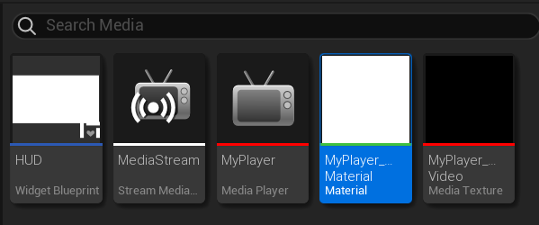
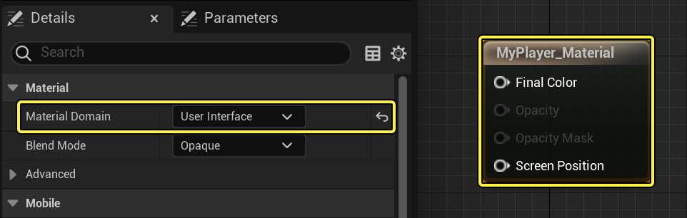
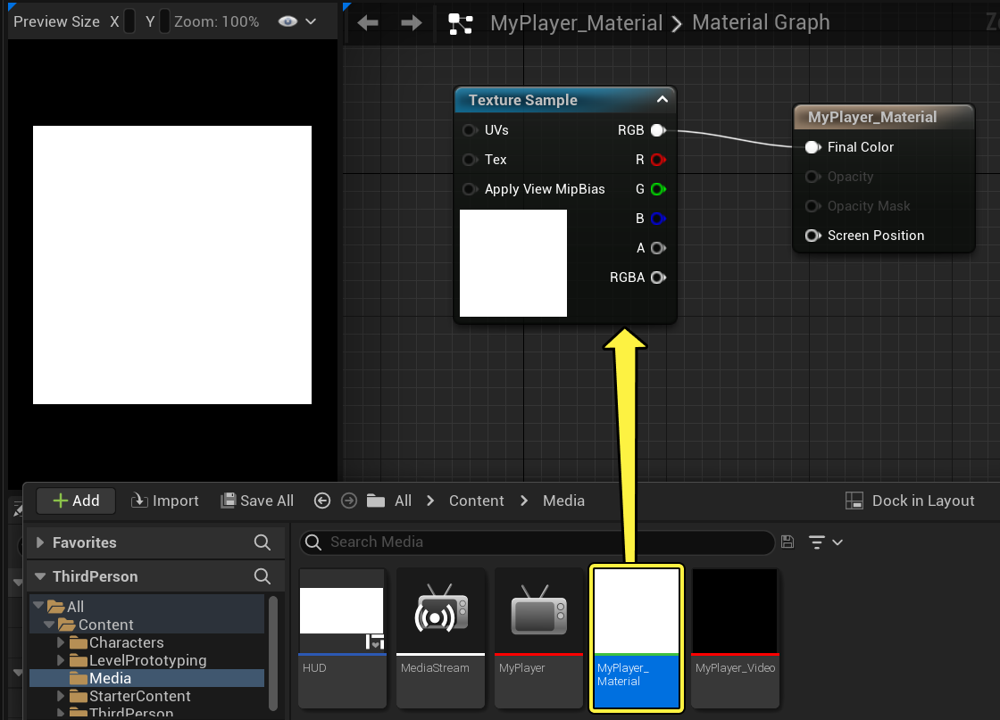
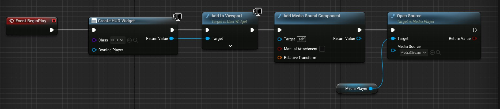

# 播放视频流

> 路径：虚幻引擎5.7文档 / 使用媒体 / 媒体集成 / 媒体框架 / 媒体框架教程 / 播放视频流

> 原始页面：https://dev.epicgames.com/documentation/unreal-engine/play-a-video-stream-in-unreal-engine

**流媒体源（Stream Media Source）** 是一种资源，允许你在虚幻引擎5（UE5）中流送[支持的 URL](../../media-framework-technical-reference/index.md)格式视频。 定义流后，你可以将其加载并使用 **媒体播放器** 资源在UE4中播放，并可（通过关联的 **媒体纹理**）将其分配给关卡的各个方面。

流可以作为UI元素的一部分加载和播放，并且可以全屏播放，甚至在静态网格体（例如电视）中播放，在关卡中播放。

在本操作指南中，我们将使用[虚幻示意图形](../../../../../user-interfaces/umg-editor-reference/index.md)（UMG）创建一个全屏播放流式视频的UI元素。

> [!NOTE]
> 本入门指南中无需编写C++代码。

## 推荐步骤

在本操作指南中，我们使用启用了 **初学者内容包** 的 **蓝图第三人称模板（Blueprint Third Person Template）** 项目。

## 1. 创建流送媒体源和纹理

1. 在 **内容浏览器** 中展开 **源面板（Sources Panel）**，然后在 **内容（Content）** 文件夹下创建名为 **媒体（Media）** 的新文件夹。
2. 在空的"媒体"文件夹中右键单击，然后在 **媒体（Media）** 下选择 **流媒体源（Stream Media Source）** 并将资源命名为 **MediaStream**。
3. 打开 **MediaStream**，然后输入想用的 **流URL（Stream URL）**。

   如果你没有要链接的URL文件，右键单击此[示例视频](https://d1iv7db44yhgxn.cloudfront.net/documentation/attachments/c08cf0c4-f2c6-4da3-8770-e87bdef17cf1/samplevideo.mp4)，复制链接地址，然后将其粘贴到"流URL"字段中。

   > [!NOTE]
   > 流URL必须直接链接到支持的格式才能播放视频。 例如，PS4Media（PS4）在最新版引擎中仅支持基于HLS的MP4，而WmfMedia（Windows）可支持许多不同的流源。 有关平台/播放器插件所支持格式的更多信息，请参阅[媒体框架技术参考](../../media-framework-technical-reference/index.md)页面。
4. 在"媒体（Media）"文件夹中右键单击，然后选择 **媒体（Media）** 下的 **媒体播放器（Media Player）** 资源。
5. 在 **创建媒体播放器（Create Media Player）** 窗口中，启用 **视频输出媒体纹理资源（Video output Media Texture asset）**，然后单击 **确定（Ok）**。

   这将自动创建并关联链接到此 **媒体播放器** 资源的媒体纹理资源以进行播放。
6. 将新的媒体播放器资源命名为 **MyPlayer**，它将自动应用于创建的 **媒体纹理** 资源。

   > [!NOTE]
   > 假如你在使用 **Electra媒体播放器**，请在编辑器中打开你新建的媒体纹理资产。在细节面板中：
   >
   > - 启用
   >
   >   启用新样式输出（Enable new style output）
   >
   >   。
   > - 将
   >
   >   输出格式（新样式）（Output format (new style)）
   >
   >   设置成
   >
   >   默认（sRGB）（Default (sRGB)）
   >
   >   .

## 2. 将媒体源与材质关联

1. 在媒体文件夹中，新建一个 **材质（Material）**，然后命名为 **MyPlayer_Material**。

   
2. 打开 **MyPlayer_Material** 并将其 **材质域（Material Domain）** 改为 **用户界面（User Interface）**。这会更改结果节点，使其能够使用用户界面输出。

   
3. 点击并将内容浏览器中的 **MyPlayer_Video** 拖进 **MyPlayer_Material** 的图表。这样会创建一个 **纹理取样（Texture Sample）** 节点，并将MyPlayer_Video设置为源。
4. 将 **RGB** 引脚连到材质的 **最终颜色（Final Color）** 输入。

   

   > [!NOTE]
   > 如果你在使用Electra媒体播放器使用纹理取样或纹理对象，你需要将 **取样器类型（Sampler Type）** 设置为 **颜色（Color）**。

## 3. 将媒体源添加给用户界面控件

1. 在"媒体"文件夹中右键单击，然后在 **用户界面（User Interface）** 下选择 **小部件蓝图（Widget Blueprint）** 并将其命名为 **HUD**。

   **小部件蓝图** 是与([UMG](../../../../../user-interfaces/umg-editor-reference/index.md))一起使用的资源，用于在虚幻引擎中创建将应用流式视频的UI元素。
2. 在 **HUD** 小部件蓝图中，从 **选用板（Palette）** 窗口将 **图像** 拖到图中，并将其拉伸以适合网格的宽高比。

   将媒体纹理应用于此图像。在玩游戏时，图像将在玩家的视口上最大化（创建全屏播放视频）。

   我们将把媒体纹理应用到这张图片上。玩家运行游戏时，该图片将填充玩家的视口（即创建一个能全屏播放的动画视频）。
3. 在 **图像** 的 **细节（Details）** 面板中，展开 **外观（Appearance）** 下的 **笔刷（Brush）**，并将 **图像** 设置为 **MyPlayer_Material**。
4. 在 **图像** 的 **细节（Details）** 面板中，单击 **插槽（Slot）** 下的 **锚点（Anchors）** 下拉列表，然后选择"固定在中心（anchor middle）"选项。

   这将保证无论视口大小如何，图像都固定在视口的中心。

## 4. 播放媒体源

1. 关闭 **HUD** 小部件蓝图，然后在关卡编辑器工具栏中选择 **蓝图（Blueprints）** 和 **打开关卡蓝图（Open Level Blueprint）**。
2. 创建一个名为 **MediaPlayer** 的变量，类型为 **媒体播放器参考（Media Player Reference）**，并将 **默认值（Default Value）** 设置为 **MyPlayer** 媒体播放器资源。

   你可能需要单击 **编译（Compile）** 才能查看 **MediaPlayer** 变量的默认值。
3. 按住 **Ctrl** 键并将 **MediaPlayer** 变量拖到图上，创建此变量的 **获取（Get）** 节点，然后右键单击并添加 **事件开始播放（Event Begin Play）** 节点。

   当游戏开始时，我们将创建和显示 **HUD**，为流设置声音，然后打开流并播放。
4. 右键单击并添加 **创建小部件（Create Widget）** 节点，将 **类（Class）** 设置为 **HUD**，然后在 **返回值（Return Value）** 中，使用 **添加到视口（Add to Viewport）** 并按图所示进行连接。
5. 在 **添加到视口（Add to Viewport）** 节点后，右键单击并使用 **添加媒体声音组件（Add Media Sound Component）**，然后在 **细节（Details）** 面板中将 **媒体播放器（Media Player）** 设置为 **MyPlayer**。

   要随同视频一起收听音频，你需要使用指向媒体播放器资源的媒体声音组件。 在这里，我们是在运行时动态创建和添加的。但是，你也可以在 **组件（Components）** 面板中将此组件添加到关卡中存在的Actor或添加为蓝图的一部分。
6. 在 **添加媒体声音组件（Add Media Sound Component）** 节点后，使用 **媒体播放器（Media Player）** 参考节点中的 **开源（Open Source）**，将 **媒体源（Media Source）** 设置为 **MediaStream** 资源。

   

   点击查看大图。

   节点网络完成后，将在游戏开始时创建并显示 **HUD**，并在打开和播放媒体流时播放声音。
7. 关闭关卡蓝图，然后单击 **播放（Play）** 以在关卡中播放。

## 最终结果

在编辑器中播放后，视频将作为 **HUD** 小部件蓝图的一部分再次全屏播放。

与使用[文件媒体源](../play-a-video-file/index.md)从磁盘播放视频文件相同，如果默认情况下启用的关联 **媒体播放器** 资源设置为 **打开时播放（Play on Open）**，在调用 **开源** 时将自动播放媒体源。 视频播放开始后，你可以向媒体播放器资源发出其他命令，例如暂停、快退、停止等。在拖出媒体播放器参考（Media Player Reference）时，这些命令将显示在 **媒体播放器（Media Player）** 部分中。
